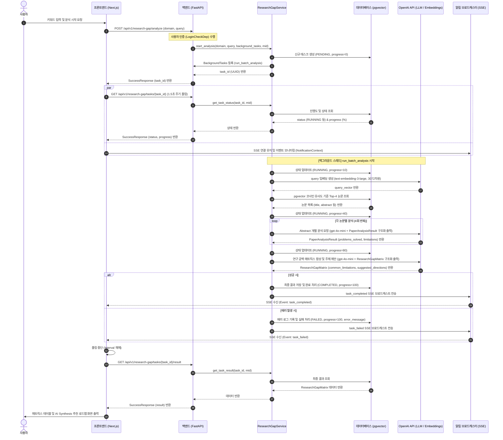

# 🔍 Research Gap Analyzer (대규모 문헌 비교 분석기)

본 모듈은 학계의 기존 연구 논문들을 다차원으로 비교 분석하여, 특정 키워드/기술 분야의 **연구 공백(Research Gap)**을 식별하고 새로운 **연구 로드맵 및 구체적인 연구 주제**를 제안하는 백그라운드 배치 분석 서비스입니다.

처음 접하는 개발자도 쉽게 이해할 수 있도록 핵심 로직과 상세한 아키텍처를 안내합니다.

---

## 💡 서비스 핵심 개념
연구자가 새로운 연구를 시작할 때 가장 먼저 수행하는 것은 **"기존 연구의 한계점 찾기"**와 **"내 연구만의 차별점 도출"**입니다. 이 서비스를 통해:
1. 사용자가 관심 있는 **주제 키워드**를 입력합니다.
2. 시스템이 학술 논문 데이터베이스에서 **가장 유사한 기존 논문들을 RAG(검색 증강 생성) 기법으로 탐색**합니다.
3. AI가 각 논문이 **해결한 핵심 문제**와 **남겨진 한계점**을 명확히 추출합니다.
4. 추출된 정보를 조합해 **연구 공백 매트릭스**를 구성하고, 이를 보완할 **3가지 혁신적인 AI 추천 연구 로드맵**을 제안합니다.

---

## 📂 파일 구조 및 역할

- [endpoints.py](file:///Users/pileuszu/Repos/bist-mini-2/backend/api/v1/research_gap/endpoints.py): API 엔드포인트 정의. 사용자 인증(`LoginCheckDep`) 및 비동기 배치 작업 접수, 결과 조회, 번역, 작업 관리(삭제 등) 라우터를 제공합니다.
- [services.py](file:///Users/pileuszu/Repos/bist-mini-2/backend/api/v1/research_gap/services.py): 핵심 비즈니스 로직. 백그라운드 태스크 실행, RAG 파이프라인 연계, LLM(ChatOpenAI) 연동(구조화 정보 추출, 공백 합성 및 한국어 번역), 실시간 알림 상태 저장을 처리합니다.
- [dao.py](file:///Users/pileuszu/Repos/bist-mini-2/backend/api/v1/research_gap/dao.py): 데이터베이스 데이터 접근 객체. `research_gap_task` 테이블에 대한 CRUD 작업 및 상태(Progress) 업데이트를 담당합니다.
- [entity.py](file:///Users/pileuszu/Repos/bist-mini-2/backend/api/v1/research_gap/entity.py): SQLAlchemy ORM 엔티티 정의. `research_gap_task` 테이블의 스키마를 표현합니다.
- [models.py](file:///Users/pileuszu/Repos/bist-mini-2/backend/api/v1/research_gap/models.py): Pydantic DTO 정의. API 요청/응답 모델과 LLM의 엄격한 구조화 데이터 검증용 스키마(`PaperAnalysisResult`, `ResearchGapMatrix`)를 명시합니다.
- [embedding.py](file:///Users/pileuszu/Repos/bist-mini-2/backend/api/v1/research_gap/embedding.py): OpenAI `text-embedding-3-large` 모델을 활용하여 텍스트 질의를 3072차원의 쿼리 벡터로 변환하는 도구입니다.

---

## 🔄 전체 시스템 흐름도 (Sequence Diagram)

---

## ⚙️ 상세 핵심 로직 설명 (Core Mechanics)

### 1. 비동기 백그라운드 태스크 설계 (`POST /research-gap/analyze`)
- **HTTP Timeout 방지**: RAG 검색 및 여러 차례의 LLM API 연산(논문 분석, 매트릭스 합성 등)은 약 15~25초 이상 소요될 수 있으므로 HTTP 요청 상태로 연결을 유지하는 것은 부적절합니다.
- **FastAPI의 `BackgroundTasks` 활용**: 요청이 유효하면 즉시 DB에 상태를 `PENDING`으로 저장하고 `task_id` (UUID)를 선반환합니다. 실제 분석 연산은 백그라운드 스레드로 위임되어 실행됩니다.

### 2. pgvector 기반 RAG 문헌 검색
- **벡터 변환**: 입력된 키워드/주제를 `text-embedding-3-large` API로 인코딩하여 3072차원 벡터를 얻습니다.
- **도메인 격리**: 현재는 컴퓨터 과학(`cs`) 도메인만 엄격히 검증하여 검색을 처리하며, 내부적으로 pgvector의 `cosine_distance` 연산자를 활용하여 데이터베이스의 `cs_embeddings` 컬렉션에서 유사 논문 청크 25개를 빠르게 검색합니다.
- **중복 제거 및 청크 병합**: 하나의 논문에서 다수의 세그먼트 청크가 검색될 경우, `arxiv_id` 기준으로 중복을 걸러내고 의미적 유사도가 가장 높은 **상위 고유 논문 4개**를 도출한 후, 각 논문의 세그먼트 텍스트 청크들을 `\n\n`로 합산 병합하여 최종 Context를 구성합니다.

### 3. 다단계 LLM 연산 및 구조화 정보 추출 (Structured Output)
- **1단계: 개별 논문 분석 (Problems & Limitations Extraction)**:
  - 4개의 논문 각각의 제목과 병합된 콘텐츠를 `gpt-4o-mini` 모델에 보냅니다.
  - LLM의 `with_structured_output` API를 사용하여 [models.py](file:///Users/pileuszu/Repos/bist-mini-2/backend/api/v1/research_gap/models.py)에 정의된 `PaperAnalysisResult` 모델 형태로 가공합니다.
  - 논문당 핵심 해결책(`problems_solved`)과 한계점(`limitations`)을 각각 **최대 2개씩**으로 정밀 제한하여 불필요한 텍스트 범람을 막습니다.
- **2단계: 공통 공백 매트릭스 합성 (Synthesis)**:
  - 1단계에서 완성된 4개 논문의 요약본 리스트를 합쳐 하나의 종합 프롬프트로 전송합니다.
  - 분석 대상군 전체를 아우르는 **공통 한계점(`common_limitations`)**과 이를 구체적/혁신적으로 극복할 수 있는 **3가지 AI 추천 연구 주제(`suggested_directions`)**를 도출해 최종 `ResearchGapMatrix` 객체로 합성합니다.

### 4. 전문 번역 프롬프트 엔진 및 품질 가이드라인
- 기본적으로 LLM은 학술 정보의 왜곡을 방지하기 위해 영문(`English`)으로 분석 및 합성을 마칩니다. 사용자가 UI에서 번역 요청 시, 저장된 결과 데이터를 바탕으로 한글 번역 체인(`translate_matrix`)을 가동합니다.
- **학계 표준 용어 보존 룰**: 
  - `Transformer` 단어를 '변환기'와 같이 의미가 오인될 수 있는 단어로 직역하지 않고 **'트랜스포머'**로 번역을 강제합니다.
  - RAG, LLM, MLP, ICL, attention, contextual bandit 등 널리 쓰이는 AI/ML 학술 약어와 개념은 영어 약어를 명시하거나 **'어텐션 메커니즘'**, **'인컨텍스트 학습(ICL)'** 등 정밀 번역 지침을 따르게 합니다.
- **어조 제어**: 보고서의 가치를 높이기 위해 종결어미를 서술형 대신 명사구형 또는 격식체(예: `~을 해결함`, `~ 설계`, `~ 조사함`)로 제정하여 정돈된 학술 톤을 확보합니다.

### 5. SSE(Server-Sent Events) 기반 실시간 알림 연동
- 백그라운드 연산 도중 progress 수치(10% $\rightarrow$ 40% $\rightarrow$ 80% $\rightarrow$ 100%)와 상태가 업데이트될 때마다 백엔드의 `NotificationBroadcaster`를 통해 전역에 실시간 완료 알림 이벤트(`task_completed` 또는 `task_failed`)를 브로드캐스트합니다.
- 프론트엔드는 이 알림 피드를 감시하다가 작업이 완료되면 즉시 분석 화면을 렌더링하고 상태 폴링을 안전하게 종료합니다.

---

## ⚡ 핫리로드 교착상태(Hang) 해결을 위한 시그널 핸들러 훅

개발 환경(`settings.DEBUG=True`)에서 백엔드 코드 수정 시 Uvicorn이 재부팅되는 과정에서 셧다운 행(Hang) 현상이 일어나던 문제를 해결했습니다.

### ⚠️ 문제 현상
- Uvicorn이 리로드를 위해 프로세스를 내리려고 할 때, 프론트엔드가 연결해 둔 SSE 실시간 알림 스트림(`StreamingResponse`) 소켓이 끊어지지 않고 계속 열려 있었습니다.
- Uvicorn의 셧다운은 모든 연결이 정리될 때까지 애플리케이션 lifespan 종료 단계를 무한히 기다리므로, SSE 스트림 제너레이터가 풀리지 않아 개발 모드 리로드가 멈추게 되었습니다.

### 🔧 해결 구조
- [main.py](file:///Users/pileuszu/Repos/bist-mini-2/backend/main.py#L40-L69)의 `lifespan` 초기화 블록에서 시스템 시그널(`SIGINT`, `SIGTERM`) 핸들러를 가로챕니다.
- Uvicorn이 리로드를 개시하며 자식 프로세스에 시그널을 보내는 즉시 `notification_broadcaster.close()`를 가동하여 활성 스트림 대기 상태(`queue.get()`)를 깨우고 모든 스트림을 강제로 조기 탈출(break)시킵니다.
- 소켓 연결이 즉각 릴리즈되므로 Uvicorn 셧다운 프로세스는 딜레이 없이 즉시 완료되고 재부팅에 성공합니다.
