# 📊 린 캔버스 (Lean Canvas) - 논문 AI 에이전트 채팅 플랫폼

본 문서는 **'논문 AI 에이전트 채팅 플랫폼 (Paper Agent Chat Platform)'** 비즈니스 모델 및 핵심 가치를 한 페이지로 요약한 린 캔버스입니다.

---

## 🎨 린 캔버스 요약 판

> [!IMPORTANT]
> **현재 단계 핵심 집중 검증 영역 (Problem-Solution Fit Phase)**
> 프로젝트 초기 기획 및 MVP 검증 단계에서는 비즈니스의 실효성 검증을 위해 **1. 문제**, **2. 고객 세그먼트**, **3. 고유 가치 제안**, **4. 솔루션**의 4대 핵심 블록을 최우선 중요 항목으로 지정하여 집중 검증합니다. (Mermaid 다이어그램 내 ⭐ 및 굵은 선 표시)

```mermaid
flowchart TD
    subgraph Row1 [Lean Canvas 상단 격자]
        direction LR
        P["⭐ <b>1. 문제 (Problem) [중요]</b><br>• 방대한 논문 정보 탐색 피로<br>• LLM 답변 환각 & 출처 검증 번거로움<br>• 단발성 검색 UI 한계<br><br><b>[기존 대안]</b><br>• Google Scholar<br>• Perplexity (일반 웹)<br>• 단순 RAG 문서 요약기"]
        
        S["⭐ <b>4. 솔루션 (Solution) [중요]</b><br>• 3대 도메인 특화 RAG (유사도 검색)<br>• 문장 단위 인라인 인용 & 출처 카드<br>• Tavily & BeautifulSoup 외부 탐색 툴<br>• 다중 에이전트 피어 리뷰 워크숍<br><br><b>8. 핵심 지표 (Key Metrics)</b><br>• 세션당 평균 대화 수 (Chat Depth)<br>• 인용 출처 카드 클릭률<br>• 피어 리뷰 워크숍 이용률"]
        
        U["⭐ <b>3. 고유 가치 제안 (UVP) [중요]</b><br>• 3대 도메인 특화 벡터 DB 검색과 투명한 인라인 출처 매핑 및 다학제 가상 동료 평가(Peer Review)를 제공하는 연구자 전용 협업 에이전트<br><br><b>[단일 상위 개념 피치]</b><br>• 연구 논문용 Perplexity"]
        
        A["<b>9. 경쟁 우위 (Unfair Advantage)</b><br>• pgvector 고속 검색 & 비용 절감형 SummarizationMiddleware 아키텍처<br>• 도메인 특화 CoT/Step-back 프롬프트 셋<br><br><b>5. 채널 (Channels)</b><br>• 대학원생 연구 커뮤니티 및 학회<br>• IT/학술 기술 블로그 포스팅<br>• Next.js 기반 반응형 대시보드 웹"]
        
        C["⭐ <b>2. 고객 세그먼트 (Customer Segments) [중요]</b><br>• 대학원생, 교수, 학술 연구원<br>• R&D 부서 기술 분석가<br><br><b>[얼리 어답터]</b><br>• 최신 기술을 빠르게 분석하고 논문을 신속히 써야 하는 신진 연구자"]
    end
    
    subgraph Row2 [Lean Canvas 하단 격자]
        direction LR
        Cost["<b>7. 비용 구조 (Cost Structure)</b><br>• LLM API 사용 요금 (에이전트 다중 호출)<br>• pgvector 및 백엔드 클라우드 인프라 호스팅 비용<br>• Tavily API 등 외부 서비스 사용료"]
        
        Rev["<b>6. 수익원 (Revenue Streams)</b><br>• Freemium 모델 (무료 기본 쿼리 + 유료 구독)<br>• B2B 폐쇄형 보안 RAG 구축 라이선스<br>• 대학교/연구소 단체 할인 라이선스"]
    end
    
    Row1 ===> Row2
    
    style Row1 fill:#f8f9fa,stroke:#ccc,stroke-width:1px;
    style Row2 fill:#f8f9fa,stroke:#ccc,stroke-width:1px;
    
    style P fill:#fff,stroke:#e67e22,stroke-width:4px;
    style S fill:#fff,stroke:#3498db,stroke-width:4px;
    style U fill:#fff,stroke:#2ecc71,stroke-width:4px;
    style C fill:#fff,stroke:#1abc9c,stroke-width:4px;
    
    style A fill:#fff,stroke:#e74c3c,stroke-width:1px;
    style Cost fill:#fff,stroke:#7f8c8d,stroke-width:1px;
    style Rev fill:#fff,stroke:#2c3e50,stroke-width:1px;
```

---

## 🔍 상세 블록별 정의

### 1. 문제 (Problem) ⭐ [현재 단계 핵심 집중 검증]
*   **정보 과부하 및 탐색 피로**: 수십만 건의 논문 자료 중 내 연구 주제와 밀접한 신뢰성 높은 논문을 찾아내고 분석하는 데 막대한 시간 소요.
*   **LLM 환각으로 인한 신뢰성 부족**: 기존 생성형 AI 답변은 출처가 불분명하거나 거짓 정보를 그럴듯하게 답변하여, 연구자가 원문을 일일이 다시 찾아 검증해야 하는 번거로움 발생.
*   **단발성 검색의 한계**: 검색 결과가 단순 리스트로 나열되거나 단발성 요약에 그쳐, 깊이 있는 학술적 꼬리 질문과 아이디어 확장이 어려움.
*   *기존 대안 (Existing Alternatives)*:
    *   Google Scholar (키워드 기반이라 맥락 파악에 시간 소요)
    *   Perplexity (일반 웹 정보 중심이라 학술 논문의 전문적 검증에 한계)
    *   단순 PDF 업로드 RAG 툴 (개별 문서 요약은 되나 수십만 건의 전문 도메인 DB 교차 탐색 불가)

### 2. 고객 세그먼트 (Customer Segments) ⭐ [현재 단계 핵심 집중 검증]
*   **주요 타겟**:
    *   석·박사 대학원생 및 대학교수 (논문 작성 및 문헌 조사 빈도가 매우 높음)
    *   연구소 및 기업 R&D 부서의 기술 연구원/분석가 (특정 분야의 최신 기술 트렌드를 빠르게 검증해야 함)
*   **얼리 어답터 (Early Adopters)**:
    *   컴퓨터 과학(CS), 의학/바이오, 자연과학 분야의 신진 연구자들 중 작성할 논문의 배경 연구(Literature Survey) 단계를 빠르게 단축하고자 하는 연구자.

### 3. 고유 가치 제안 (Unique Value Proposition - UVP) ⭐ [현재 단계 핵심 집중 검증]
*   **핵심 메시지**: "3대 학술 도메인 특화 벡터 DB 검색과 투명한 인라인 출처 매핑 및 다학제 가상 동료 평가(Peer Review)를 제공하는 연구자 전용 협업 에이전트."
*   **UVP의 강점**:
    *   출처의 투명성: AI가 한 답변의 문장마다 정확히 어떤 논문의 몇 페이지(혹은 어느 섹션)에서 인용되었는지 명확하게 추적 가능.
    *   도메인 특화: 일반 검색이 아닌 의학(NFCorpus), 컴퓨터과학(SCIDOCS), 자연과학(SciFact) 등 3대 학술 도메인별 최적화된 RAG 성능 체감.
*   **단일 상위 개념 피치 (High-Level Concept)**:
    *   *"연구 논문용 Perplexity (Perplexity for Research Papers)"*

### 4. 솔루션 (Solution) ⭐ [현재 단계 핵심 집중 검증]
*   **3대 도메인 RAG 및 유사도 검색**: pgvector DB 기반 코사인/유클리드 유사도 검색 API (`POST /similarity-search/*`)를 활용해 신속하게 도메인별 관련 논문 추출.
*   **문장 단위 인라인 인용 카드**: Pydantic 스키마 기반 구조화된 출력 에이전트를 적용하여 답변 문장과 출처 정보(`[1]`, `[2]`)를 매핑하고 호버 시 소스 프리뷰 팝업 제공.
*   **에이전트 웹 브라우징 연동 (Tavily & BeautifulSoup)**: 로컬 DB 외의 최신 학술 정보가 필요할 시 에이전트가 외부 학술 포털을 실시간으로 검색 및 정제하여 지식 보완.
*   **다중 에이전트 동료 평가 워크숍**: 방법론 검증, 신규성 분석, 영어 및 학술 스타일 교정을 각 전문 에이전트 노드로 구성된 협업 워크플로우(`POST /academic-peer-review`)로 기동하고, 진행 단계를 `GET /graph-structure` 시뮬레이션 상태도로 시각화.

---

### 5. 채널 (Channels)
*   **커뮤니티 바이럴**: 김박사넷, 대학원생 포럼, 학회 커뮤니티 등 타겟 고객이 밀집한 공간에 홍보.
*   **개발자 및 연구자 오픈소스 생태계**: Github 레포지토리 공개 및 LangChain/FastAPI 오픈소스 프로젝트 포럼에 아키텍처 사례 공유.
*   **온라인 포스트**: Medium, 벨로그, 티스토리 등에 "FastAPI+pgvector를 이용한 논문 에이전트 개발기" 기술 블로그 작성 및 확산.

### 6. 수익원 (Revenue Streams)
*   **Freemium 구독 모델 (B2C)**:
    *   *Free*: 일일 질문 개수 제한 및 로컬 DB 검색 기본 제공.
    *   *Pro*: 월 구독료 기반 무제한 질문, 외부 실시간 브라우징 툴(Tavily) 연동 제공, 스레드 기반 원클릭 리포트 다운로드 기능 제공.
*   **기업용 구축형 라이선스 (B2B)**:
    *   미발표 특허초안, 사내 기밀 연구 데이터 등 유출 위험이 있는 보안 문서들을 폐쇄망(Private Cloud) 내 pgvector에 적재하고 대화할 수 있는 보안 에이전트 패키지 판매.

### 7. 비용 구조 (Cost Structure)
*   **LLM API 사용 요금**: 에이전트 워크플로우 루프 실행(CoT, Step-back 프롬프트 등)에 따른 OpenAI/Anthropic API 호출 비용.
*   **호스팅 및 인프라 비용**: PostgreSQL(pgvector 내장) 데이터베이스 및 FastAPI 백엔드 서버를 24시간 가동하기 위한 GPU/CPU 클라우드 비용.
*   **Tavily API 사용료**: 외부 실시간 학술 검색 도구 구동 비용.

### 8. 핵심 지표 (Key Metrics)
*   **세션당 평균 대화 깊이 (Average Chat Depth)**: 사용자가 질문 하나에 머무르지 않고, 꼬리 질문(Related Questions) 등을 통해 대화를 얼마나 깊게 유지하는지 측정.
*   **인용 출처 클릭률 (Citation Click-Through Rate)**: 사용자가 AI 답변의 인라인 인용 부호나 호버 소스 카드를 클릭해 실제 논문 상세 내용을 조회하는 빈도 (신뢰도 관련 지표).
*   **요약 리포트 저장/내보내기 횟수**: 사용자가 대화 세션을 실제 문헌 조사 보고서로 전환하여 유의미한 가치를 느끼는 비율 측정.

### 9. 경쟁 우위 (Unfair Advantage)
*   **비용 효율적 메모리 관리 아키텍처**: `SummarizationMiddleware`와 `PostgresSaver`를 결합하여 비용을 극적으로 낮추면서 대화 맥락을 끊김 없이 보존하는 최적의 백엔드 성능 구조 보유.
*   **도메인 특화 Step-back/CoT 프롬프트 노하우**: 의학, IT 공학, 자연과학 등 성격이 다른 학계 논문들의 초록 분석 및 질의응답에 적합하게 구조화한 학술용 고도화 프롬프트 셋 보유.
