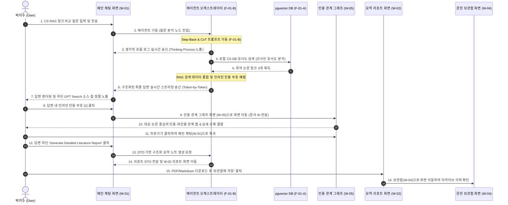
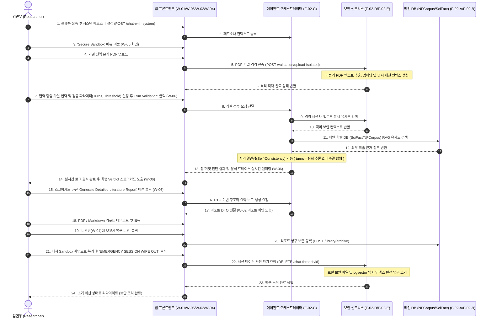

# 👥 사용자 시나리오 및 유즈케이스 명세서 (User Scenarios & Use Cases)

본 문서는 **'논문 AI 에이전트 채팅 플랫폼 (Paper Agent Chat Platform)'**의 타겟 사용자 페르소나 및 핵심 비즈니스 로직에 기반한 유즈케이스 명세서입니다. 
와이어프레임 화면 스케치(HTML 프로토타입 캡처본)와 Mermaid 흐름도를 결합하여 사용자의 여정(User Journey)을 입체적으로 정의합니다.

---

## 📂 목차
1. [UC-1. 대학원생 박지수의 선행 연구 조사 및 출처 검증](#uc-1-대학원생-박지수의-선행-연구-조사-및-출처-검증)
2. [UC-2. 책임연구원 김민우의 신약 가설 검증 및 보안 리포트 추출](#uc-2-책임연구원-김민우의-신약-가설-검증-및-보안-리포트-추출)
3. [UC-3. 논문 작성자의 다중 에이전트 피어 리뷰 워크숍](#uc-3-논문-작성자의-다중-에이전트-피어-리뷰-워크숍)
4. [UC-4. 시스템 개발자의 독립 체크리스트 검증](#uc-4-시스템-개발자의-독립-체크리스트-검증)

---

## UC-1. 대학원생 박지수의 선행 연구 조사 및 출처 검증

### 1.1 개요
*   **액터 (Actor)**: 박지수 (26세, 석사과정 2년차 대학원생)
*   **목표 (Goal)**: 컴퓨터 과학(CS) 분야의 RAG 논문들을 탐색하고, LLM의 답변이 실제 논문의 어떤 페이지 및 맥락에서 인용되었는지 고속으로 교차 검증하여 선행 연구 정리 노트를 가속화합니다.
*   **사전 조건 (Pre-condition)**: 
    *   SCIDOCS 데이터셋의 논문 메타데이터 및 abstracts가 pgvector 벡터 DB에 적재되어 있어야 함.
    *   박지수가 플랫폼에 로그인하여 대화 스레드를 생성한 상태여야 함.

### 1.2 유즈케이스 흐름 (Basic Flow)

### 1.3 관련 화면 스케치 (Wireframe UI)
#### W-01. 유저 메인 채팅 화면 (ChatGPT 스타일 리디자인)

#### W-05. 유저 인용 관계 그래프 및 논문 상세 화면 (추가 구현)

#### W-02. 유저 문헌 요약 리포트 화면 (ChatGPT 스타일 리디자인)

#### W-04. 유저 문헌 보관함 및 리포트 아카이브 화면 (추가 구현)

---

## UC-2. 책임연구원 김민우의 신약 가설 검증 및 보안 리포트 추출

### 2.1 개요
*   **액터 (Actor)**: 김민우 (39세, 바이오 벤처 R&D 책임연구원)
*   **목표 (Goal)**: 면역 작용제 가설의 학술적 타당성(참/거짓)을 신뢰도 높게 팩트체크하고, 기업 기밀 유출 없이 보안 가이드라인에 맞춘 리포트를 다운로드한 후, 세션 데이터를 영구 파기합니다.
*   **사전 조건 (Pre-condition)**:
    *   NFCorpus(의학) 및 SciFact(자연과학 가설) 데이터가 DB에 적재 완료되어야 함.
    *   사내 미발표 연구 데이터(PDF) 파일이 로컬 보안 샌드박스 영역에 접근 가능한 상태여야 함.
    *   **다중 세션 지원**: 독립적인 다수의 신약 프로젝트를 수행하기 위해 고유 세션 ID를 가진 여러 보안 샌드박스를 개별적으로 가동 및 동적 스위칭이 가능한 상태여야 함.

### 2.2 유즈케이스 흐름 (Basic Flow)

### 2.3 관련 화면 스케치 (Wireframe UI)
> [!NOTE]
> 요약 리포트 상세 보기(`W-02`) 및 문헌 보관함(`W-04`) 화면 레이아웃은 [UC-1.3 관련 화면 스케치](#13-관련-화면-스케치-wireframe-ui) 영역을 참고하십시오.

#### W-06. 유저 개인용 보안 샌드박스 설정 화면 (추가 구현)

#### W-08. 유저 보안 마스킹 및 편집 화면 (추가 구현)

---

## UC-3. 논문 작성자의 다중 에이전트 피어 리뷰 워크숍

### 3.1 개요
*   **액터 (Actor)**: 박영지 (31세, 컴퓨터공학 박사과정 연구원)
*   **목표 (Goal)**: 저널 투고 전 자신의 논문 초고(Draft) 및 타겟 저널 정보(Nature, IEEE, ACM 등)를 바탕으로 분야별 에이전트의 합동 평가 보고서와 평점 스코어카드 및 구절별 교정대비표를 획득하고, 이 과정이 멀티 에이전트 오케스트레이션 상에서 실시간으로 라우팅되는 상태 그래프를 모니터링합니다.
*   **사전 조건 (Pre-condition)**:
    *   멀티 에이전트 오케스트레이션 및 그래프 시각화 모듈(F-03-A/F-03-B)이 정상적으로 탑재되어 있어야 함.
    *   공유 상태(state_schema) 및 에이전트별 의사결정 조건부 라우팅 규칙이 정의되어 있어야 함.

### 3.2 유즈케이스 흐름 (Basic Flow)

```mermaid
sequenceDiagram
    autonumber
    actor User as 박영지 (Researcher)
    participant UI_Workshop as 피어 리뷰 워크숍 (W-07)
    participant UI_Debate as 토론 아레나 (W-09)
    participant Orchestrator as 멀티에이전트 오케스트레이터 (F-03-A)
    participant Specialist as 전문 에이전트 노드들 (F-03-A)
    participant Visualizer as 그래프 시각화 모듈 (F-03-B)

    User->>UI_Workshop: 1. 논문 초안 및 타겟 저널 정보 입력
    User->>UI_Workshop: 2. '워크숍 그래프 시각화' 토글 활성화
    UI_Workshop->>Visualizer: 3. 그래프 구조 요청 (GET /graph-structure)
    Visualizer-->>UI_Workshop: 4. LangGraph 에이전트 관계도 출력 (W-07 내 미니 맵)
    User->>UI_Workshop: 5. 'Start Peer Review Workshop' 버튼 클릭 (POST /academic-peer-review)
    UI_Workshop->>UI_Debate: 6. 토론 아레나 화면(W-09)으로 화면 전환
    UI_Debate->>Orchestrator: 7. 초안 데이터 및 Shared State 전달
    Note over Orchestrator: 분석 노드 진입 (학문 도메인 판별 및 가중치 파싱)
    Orchestrator->>UI_Debate: 8. 현재 활성 에이전트 및 대화 상태 실시간 업데이트 (Websocket/SSE)
    
    rect rgb(33, 33, 33)
        Note over Orchestrator, Specialist: 조건부 라우팅 및 에이전트 간 난상 토론 (W-09 실시간 중계)
        Orchestrator->>Specialist: 9. 방법론 검증자 기동 (Methodology Check)
        Specialist-->>Orchestrator: 10. 방법론 피드백 공유 상태에 저장
        Orchestrator->>Specialist: 11. 신규성 분석자 기동 (Novelty Check)
        Specialist-->>Orchestrator: 12. 신규성/차별점 평가 공유 상태에 저장
        Orchestrator->>Specialist: 13. 학술 영어 교정자 기동 (English Style Check)
        Specialist-->>Orchestrator: 14. 문체 개선안 공유 상태에 저장
    end

    Orchestrator->>Orchestrator: 15. 종합 취합 노드 (Gather Node) 가동 및 합의 도출
    Orchestrator-->>UI_Debate: 16. 합의된 최종 피어 리뷰 리포트 DTO 전달
    User->>UI_Debate: 17. 'Finish & Export Report' 버튼 클릭
    UI_Debate->>UI_Workshop: 18. 피어 리뷰 워크숍 화면(W-07)으로 복귀
    UI_Workshop-->>User: 19. 최종 종합 평점 스코어카드 및 구절 교정대비표 보고서 렌더링
```

### 3.3 관련 화면 스케치 (Wireframe UI)
#### W-07. 유저 피어 리뷰 워크숍 화면 (추가 구현)

#### W-09. 유저 에이전트 토론 아레나 화면 (추가 구현)

---

## UC-4. 시스템 개발자의 독립 체크리스트 검증

### 4.1 개요
*   **액터 (Actor)**: 시스템 테스터 / 개발자 (Developer)
*   **목표 (Goal)**: '논문 분석'이라는 도메인 바깥의 이질적인 강의 요구사항(영화/주문 정보 구조화, 알람 및 차량 번호판 도구 연동)을 격리된 환경에서 안전하게 단위 테스트합니다.
*   **사전 조건 (Pre-condition)**:
    *   체크리스트용 격리 테스트 엔드포인트(`POST /validation/*`)가 백엔드 서버에 바인딩되어 동작 중이어야 함.

### 4.2 유즈케이스 흐름 (Basic Flow)
*   **테스트 케이스 A (단순 정보 구조화)**:
    1. 테스터가 와이어프레임(W-03)의 'Structured Output Validation' 영역에 비정형 텍스트(예: 영화 시놉시스, 피자 토핑 토글 정보)를 기입합니다.
    2. 'Extract Schema' 버튼을 클릭하면 `POST /validation/structure` API를 호출합니다.
    3. Pydantic validator를 통과한 정형 JSON 출력 스펙을 반환받아 화면 로그창에 프리뷰 형태로 출력합니다.
*   **테스트 케이스 B (도구 연동 및 direct 반환 검증)**:
    1. 테스터가 'Agent Tools Execution' 영역에서 실행할 도구(Mock 알람 설정 도구, 번호판 이미지 처리 도구)를 선택합니다.
    2. 도구 매개변수를 JSON으로 기입 후 'Trigger Tool' 버튼을 누릅니다 (`POST /validation/tools`).
    3. 백엔드에서 `context_schema`를 통해 보안 값을 전달받고, `return_direct=True` 속성에 의해 요약 에이전트 미들웨어를 거치지 않고 직접 실행 결과를 화면 로그창으로 송출합니다.

### 4.3 관련 화면 스케치 (Wireframe UI)
#### W-03. 관리자/검증용 테스트 화면 (ChatGPT 스타일 리디자인)

