# 🕸️ 화면 연동 관계 정의서 (Wireframe Interface Connections Specification)

본 문서는 **'논문 AI 에이전트 채팅 플랫폼 (Paper Agent Chat Platform)'**의 6대 핵심 와이어프레임(W-01 ~ W-06) 및 추가 보조 화면(W-07 ~ W-10) 간의 화면 이동 경로(Navigation Flow)와 화면 간에 주고받는 데이터 연동 관계(Data Mapping)를 상세하게 정의합니다.

---

## 🗺️ 1. 종합 화면 전환 흐름도 (Overall Navigation Flow)

아래 다이어그램은 사용자가 플랫폼에 진입하여 개별 화면으로 어떻게 전환하고 복귀하는지 전체적인 여정을 도식화한 흐름도입니다.

```mermaid
flowchart TD
    W01["💬 W-01. 유저 메인 채팅 화면 (user-main-chat.html)"]
    W02["📋 W-02. 유저 요약 리포트 화면 (user-report-view.html)"]
    W03["⚙️ W-03. 관리자 검증 화면 (admin-test.html)"]
    W04["📚 W-04. 유저 문헌 보관함 화면 (user-library-archive.html)"]
    W05["🕸️ W-05. 유저 인용 관계 그래프 화면 (user-citation-graph.html)"]
    W06["🛡️ W-06. 유저 보안 샌드박스 화면 (user-sandbox-control.html)"]
    W07["🎓 W-07. 유저 피어 리뷰 워크숍 화면 (user-peer-review.html)"]
    W08["🛡️ W-08. 유저 보안 마스킹 및 편집 화면 (user-sandbox-redaction.html)"]
    W09["💬 W-09. 유저 에이전트 토론 아레나 화면 (user-peer-review-debate.html)"]

    %% W-01 Transitions
    W01 -- "1. AI 답변 하단 Generate Report 클릭" --> W02
    W01 -- "2. 인라인 인용 링크 [1] 클릭" --> W05
    W01 -- "3. 사이드바 'Library' 클릭" --> W04
    W01 -- "4. 사이드바 'Sandbox' 클릭" --> W06
    W01 -- "5. 사이드바 'Settings' 클릭" --> W06
    W01 -- "6. 사이드바 'Peer Review' 클릭" --> W07
    W01 -- "7. 헤더 'Dev Console' 클릭" --> W03

    %% W-02 Transitions
    W02 -- "8. Back to Chat 클릭" --> W01

    %% W-04 Transitions
    W04 -- "9. 사이드바 'Chat Hub' 클릭" --> W01
    W04 -- "10. 저장된 리포트 카드 클릭" --> W02
    W04 -- "11. 즐겨찾기 논문 클릭" --> W05

    %% W-05 Transitions
    W05 -- "12. Back to Chat 클릭" --> W01

    %% W-06 Transitions
    W06 -- "13. 사이드바 'Chat Hub' 클릭" --> W01
    W06 -- "14. Emergency Wipe Out 클릭" --> W01
    W06 -- "15. Masking Rules & Preview 또는 파일 행 클릭" --> W08
    W06 -- "16. Run Validation 완료 후 Generate Report 클릭" --> W02

    %% W-08 Transitions
    W08 -- "17. Apply & Sync 또는 Back to Sandbox 클릭" --> W06

    %% W-07 Transitions
    W07 -- "18. 사이드바 'Chat Hub' 클릭" --> W01
    W07 -- "19. Start Peer Review Workshop 또는 토론장 진입 클릭" --> W09

    %% W-09 Transitions
    W09 -- "20. Finish & Export Report 클릭" --> W07

    %% W-03 (Admin-Isolated)
    W03 -- "Go to App 클릭" --> W01
    
    style W01 fill:#212121,stroke:#10a37f,stroke-width:2px;
    style W02 fill:#1e1e1e,stroke:#3f3f3f,stroke-width:1px;
    style W03 fill:#171717,stroke:#3f3f3f,stroke-width:1px;
    style W04 fill:#212121,stroke:#3f3f3f,stroke-width:1px;
    style W05 fill:#1e1e1e,stroke:#3f3f3f,stroke-width:1px;
    style W06 fill:#171717,stroke:#ef4444,stroke-width:2px;
    style W07 fill:#2c2f44,stroke:#8b5cf6,stroke-width:2px;
    style W08 fill:#171717,stroke:#10a37f,stroke-width:2px;
    style W09 fill:#2c2f44,stroke:#8b5cf6,stroke-width:2px;
```

---

## 📊 2. 화면 간 상세 데이터 및 전환 규격 (Data Mappings)

| 번호 | 출발지 화면 (Source UI) | 대상 버튼/이벤트 (Trigger Event) | 목적지 화면 (Target UI) | 전환 방식 (Transition) | 연동/전달 데이터 (Mapped Data) | 비즈니스 목적 (Business Goal) |
| :---: | :--- | :--- | :--- | :--- | :--- | :--- |
| **01** | **W-01. 메인 채팅** | AI 답변 하단 `Generate Summary Report` 버튼 클릭 | **W-02. 요약 리포트** | 페이지 이동 | • 스레드 ID (`thread_id`) • 누적 대화 내역 (Chat turns) • 추출된 참고 문헌 리스트 | 해당 대화 스레드 내용 및 인용 관계를 요약해 보고서 화면에 바인딩 |
| **02** | **W-01. 메인 채팅** | 인라인 인용 링크 `[1]`, `[2]` 클릭 | **W-05. 인용 그래프** | 페이지 이동 / 모달 팝업 | • 선택한 논문의 서지 ID (`document_id`) | 인라인으로 간략하게 보던 출처의 초록 전문과 논문 간 인용 계보 그래프를 상세 추적 |
| **03** | **W-01. 메인 채팅** | 사이드바 `Library & Reports` 메뉴 클릭 | **W-04. 문헌 보관함** | 페이지 이동 | 없음 (보관함 세션 로드) | 스레드 목록 바깥의 전역 문헌 보관함 및 과거에 저장한 리포트 라이브러리 목록 로드 |
| **04** | **W-01. 메인 채팅** | 사이드바 `Persona & Settings` 메뉴 클릭 | **W-06. 보안 샌드박스** (또는 설정 모달) | 모달 오픈 / 페이지 이동 | • 현재 활성 `thread_id` | 현재 대화 세션의 보안 옵션(마스킹 유무, 타임아웃 시간 등) 수정 및 파일 업로드 관리 |
| **05** | **W-02. 요약 리포트** | `Back to Chat` 버튼 클릭 | **W-01. 메인 채팅** | 이전 페이지 복귀 | • 스레드 ID (`thread_id`) | 보고서 작성 중 기존 채팅방으로 돌아가 추가 질의 및 내용 보완을 계속 진행 |
| **06** | **W-04. 문헌 보관함** | 저장된 리포트 카드 클릭 | **W-02. 요약 리포트** | 페이지 이동 | • 리포트 고유 ID (`report_id`) | 과거에 작업하고 보관함에 영구 저장해 두었던 학술 요약 보고서 조회 및 다운로드 |
| **07** | **W-04. 문헌 보관함** | 즐겨찾기(Star) 논문 클릭 | **W-05. 인용 그래프** | 페이지 이동 / 상세 카드 | • 논문 서지 ID (`document_id`) | 보관함에서 중요 표시해 둔 개별 논문의 초록 열람 및 타 논문 인용 맵 분석 |
| **08** | **W-04. 문헌 보관함** | 사이드바 `Chat Hub` 메뉴 클릭 | **W-01. 메인 채팅** | 페이지 이동 | 없음 (마지막 활성 스레드 복귀) | 보관함 탐색을 멈추고 에이전트 대화 화면으로 복귀 |
| **09** | **W-05. 인용 그래프** | `Back to Chat` 버튼 클릭 | **W-01. 메인 채팅** | 이전 페이지 복귀 | 없음 | 상세 논문 그래프 분석 후 대화형 인터페이스로 복귀 |
| **10** | **W-06. 보안 샌드박스** | `Wipe Out` 레드 버튼 클릭 | **W-01. 메인 채팅** | 데이터 소거 후 초기 리다이렉트 | • 스레드 ID (`thread_id`) | 해당 세션의 로컬 파일 디렉토리 및 pgvector 데이터를 완전 영구 파쇄 후 채팅 초기화 |
| **11** | **W-06. 보안 샌드박스** | 파일 드롭 및 PDF 선택 업로드 | **W-06. 보안 샌드박스** | 자체 상태 갱신 (JS Dynamic Upload) | • 파일 정보 및 샌드박스 세션 ID | 사용자가 올린 기밀 파일이 샌드박스 내부 세션의 벡터 DB 인덱스로 격리 적재됨 |
| **12** | **W-01. 메인 채팅 / 사이드바** | 사이드바 `Peer Review Workshop` 메뉴 클릭 | **W-07. 피어 리뷰 워크숍** | 페이지 이동 | 없음 (전역 워크숍 상태 로드) | 멀티 에이전트 동료 평가 워크숍 페이지로 진입하여 논문 초고 분석 의뢰 |
| **13** | **W-07. 피어 리뷰 워크숍** | 사이드바 `Chat Hub` 메뉴 클릭 | **W-01. 메인 채팅** | 페이지 이동 | 없음 (마지막 활성 스레드 복귀) | 워크숍 활동을 중단하고 논문 에이전트 채팅 메인화면으로 복귀 |
| **14** | **W-01. 메인 채팅** | 헤더 `Dev Console` 버튼 클릭 | **W-03. 관리자 검증** | 페이지 이동 | 없음 | 테스터 및 개발자가 독립 검증 콘솔(W-03)로 이동하여 단위 테스트 수행 |
| **15** | **W-06. 보안 샌드박스** | 파일 리스트 행 또는 `Masking Rules & Preview` 클릭 | **W-08. 보안 마스킹 및 편집** | 페이지 이동 | • 선택한 파일 정보 • 활성 필터 규칙 상태 | 민감 데이터 마스킹 적용 상태를 원본 및 RAG 적재 청크 단위로 미리보고 편집 |
| **16** | **W-08. 보안 마스킹 및 편집** | `Apply & Sync` 또는 `Back to Sandbox` 클릭 | **W-06. 보안 샌드박스** | 페이지 이동 / 상태 업데이트 | • 수정된 임베딩 필터 상태 정보 | 최종 편집 완료한 마스킹 정보를 샌드박스 DB 세션에 반영하여 대시보드로 복귀 |
| **17** | **W-07. 피어 리뷰 워크숍** | 초고 입력 및 가중치 설정 후 `Start Peer Review Workshop` 클릭 | **W-09. 에이전트 토론 아레나** | 페이지 이동 / 실시간 연산 시작 | • 논문 초안 텍스트 및 가중치 파라미터 | 멀티 에이전트들이 실시간으로 의견 교환 및 합의점 도출 과정을 시각화하여 분석 시작 |
| **18** | **W-09. 에이전트 토론 아레나** | `Finish & Export Report` 클릭 | **W-07. 피어 리뷰 워크숍** | 페이지 이동 / 리포트 출력 | • 최종 합의 평가 스코어 및 텍스트 데이터 | 최종적으로 합의된 평가 보고서를 피어 리뷰 메인 리포트 보드에 바인딩하여 출력 |
| **19** | **W-06. 보안 샌드박스** | 가설 검증 결과 하단 `Generate Detailed Literature Report` 클릭 | **W-02. 요약 리포트** | 페이지 이동 | • 스레드 ID (`thread_id`) • 가설 내용 및 스코어카드 데이터 | 보안 환경 내 가설 검증 결과를 기반으로 요약 문헌 보고서 생성 |
| **20** | **W-06. 보안 샌드박스** | 세션 목록의 타 세션 카드 클릭 | **W-06. 보안 샌드박스** | 자체 상태 전환 (JS Dynamic Switch) | • 선택한 세션 ID | 활성화된 보안 샌드박스를 전환하여 해당 세션의 격리 파일 목록 및 마스킹 룰셋을 실시간 로드 |

