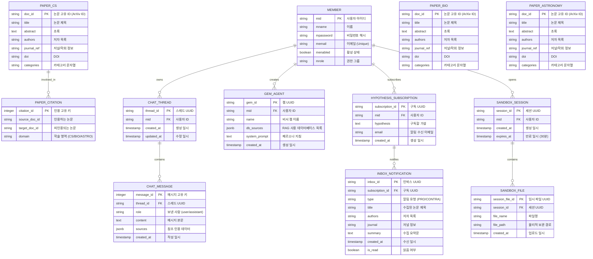

# 📊 ArXiv 데이터셋 EDA 및 PostgreSQL/pgvector 스키마 설계서 (Dataset EDA & DB Schema Design)

본 문서는 **'논문 AI 에이전트 채팅 플랫폼 (Paper Agent Chat Platform)'**에서 RAG 및 검색 엔진의 소스로 활용할 **Kaggle ArXiv 논문 메타데이터셋**의 탐색적 데이터 분석(EDA) 결과와 이를 영구 저장하고 3대 도메인(생명공학, 컴퓨터 과학, 천문학)의 벡터 RAG 연산에 활용하기 위한 PostgreSQL 17 및 pgvector 기반 관계형 데이터베이스 스키마 명세서입니다.

> [!NOTE]
> 본 플랫폼은 MTEB 벤치마크 데이터셋을 활용한 별도의 모델 검증(Evaluation) 파이프라인을 구현하지 않으며, 실서비스 구현 및 RAG 검색 데이터 제공에 집중하기 위해 **Kaggle ArXiv 데이터셋**의 카테고리 필터링 데이터를 원천 데이터셋으로 채택합니다.

---

## 🔍 1. Kaggle ArXiv 데이터셋 탐색적 데이터 분석 (Dataset EDA)

플랫폼은 학술 연구의 도메인 특수성을 다루기 위해 약 200만 편 이상의 학술 논문 메타데이터를 포함하고 있는 Kaggle의 **ArXiv Dataset (`arxiv-metadata-oai-snapshot.json`)**을 기본 원천 데이터로 사용합니다.

### 1.1 데이터셋 필드 명세 및 가공 전략
JSON 라인 포맷의 각 원본 논문 데이터는 다음과 같은 필드로 구성되어 있습니다.

| 원본 필드명 | 데이터 타입 | 설명 | DB 매핑 필드 |
| :--- | :---: | :--- | :--- |
| `id` | `str` | ArXiv 논문 고유 식별자 (예: `0704.0001`, `1910.12345`) | `doc_id` (PK) |
| `title` | `str` | 논문 제목 (텍스트 및 줄바꿈 기호 포함 가능) | `title` |
| `authors` | `str` | 모든 저자의 이름을 나열한 단일 텍스트 | `authors` |
| `categories` | `str` | 공백으로 구분된 ArXiv 학술 카테고리 코드 (예: `cs.AI q-bio.BM`) | `categories` |
| `abstract` | `str` | 논문의 초록 본문 텍스트 (RAG 청킹의 대상) | `abstract` |
| `doi` | `str` | 디지털 객체 식별자 (Digital Object Identifier) | `doi` |
| `journal-ref` | `str` | 논문이 게재된 학술지/저널 또는 학회 정보 | `journal_ref` |

### 1.2 3대 타겟 도메인 카테고리 필터링 규칙
Kaggle ArXiv 전체 데이터셋에서 플랫폼이 지원하는 3대 타겟 영역에 해당하는 데이터를 분류하기 위해, `categories` 문자열의 서브클래스 접두사를 활용하여 데이터를 스트리밍 필터링합니다.

1.  **🧬 생명공학 도메인 (Biotechnology)**:
    *   **카테고리 매핑**: `q-bio.*` (Quantitative Biology) 전체 카테고리 매핑
    *   **주요 서브카테고리**:
        *   `q-bio.BM` (Biomolecules - 분자생물학, 단백질 구조)
        *   `q-bio.GN` (Genomics - 유전체학, 시퀀싱)
        *   `q-bio.MN` (Molecular Networks - 신호전달 경로, 대사망)
        *   `q-bio.TO` (Tissues and Organs - 생체 조직, 이식 생명공학)
    *   **DB 적재 타겟**: `paper_bio` 메타데이터 테이블 및 `bio_embeddings` 벡터 테이블
2.  **📄 컴퓨터 과학 도메인 (Computer Science)**:
    *   **카테고리 매핑**: `cs.*` (Computer Science) 카테고리 매핑
    *   **주요 서브카테고리**:
        *   `cs.AI` (Artificial Intelligence - 인공지능)
        *   `cs.CL` (Computation and Language - 자연어 처리, LLM)
        *   `cs.CV` (Computer Vision - 컴퓨터 비전, 이미지 처리)
        *   `cs.LG` (Machine Learning - 머신러닝, 딥러닝)
    *   **DB 적재 타겟**: `paper_cs` 메타데이터 테이블 및 `cs_embeddings` 벡터 테이블
3.  **🔬 천문학 도메인 (Astronomy)**:
    *   **카테고리 매핑**: `astro-ph.*` (Astrophysics) 카테고리 매핑
    *   **주요 서브카테고리**:
        *   `astro-ph.CO` (Cosmology and Nongalactic Astrophysics - 우주론 및 은하 천문학)
        *   `astro-ph.GA` (Astrophysics of Galaxies - 은하 천체물리)
        *   `astro-ph.HE` (High Energy Astrophysical Phenomena - 고에너지 우주 입자, 블랙홀)
        *   `astro-ph.SR` (Solar and Stellar Astrophysics - 태양 및 항성 물리)
    *   **DB 적재 타겟**: `paper_astronomy` 메타데이터 테이블 및 `astronomy_embeddings` 벡터 테이블

### 1.3 RAG 전처리 및 텍스트 청킹 스키마
*   **텍스트 분할 규칙 (Chunking)**:
    - RAG 파이프라인의 성능과 컨텍스트 유지 비용 최적화를 위해, 각 논문의 `abstract` 텍스트를 **500자(Characters) 단위**의 슬라이딩 윈도우 방식으로 분할합니다.
    - 단락의 문맥 손실을 방지하기 위해 청크 간 **50자의 중첩 영역(Overlap)**을 부여합니다.
*   **임베딩 벡터 생성**:
    - 분할된 각 청크 텍스트에 대해 OpenAI `text-embedding-3-small` API를 통과시켜 **1536차원 조밀 벡터(Dense Vector)**를 추출합니다.
    - 데이터베이스의 각 도메인별 임베딩 스토어 테이블에 외래키(`doc_id`), 청크 텍스트(`chunk_text`), 벡터(`embedding`), 순서 정렬용 인덱스(`chunk_index`)를 구조화하여 벌크 적재합니다.

### 1.4 실제 ArXiv 원천 데이터셋(3,073,376건) 기준 도메인 분포 통계 (EDA 결과)
스트리밍 분석 스크립트(`scripts/sample_analyze.py`)를 통해 총 3,073,376건의 ArXiv 메타데이터를 전수 조사한 결과, 3대 타겟 도메인의 분포는 다음과 같습니다.

| 타겟 도메인 | 매핑 카테고리 패턴 | 필터링 논문 개수 | 전체 대비 비율 | 비고 |
| :--- | :--- | :--- | :--- | :--- |
| **생명공학 (Biotechnology)** | `q-bio.*` | 46,483 개 | 1.51% | 분자생물, 유전체학 등 포함 |
| **컴퓨터 과학 (Computer Science)** | `cs.*` | 950,412 개 | 30.92% | AI, CV, Machine Learning 등 포함 |
| **천문학 (Astronomy)** | `astro-ph.*` | 385,111 개 | 12.53% | 우주론, 은하 천체물리 등 포함 |
| **기타 영역 (Others)** | 그 외 | 1,691,370 개 | 55.03% | 물리, 수학, 통계학 등 비타겟 분야 |
| **합계** | - | **3,073,376 개** | **100.00%** | 전체 ArXiv 메타데이터 |

#### 분석적 가치와 적재 최적화 전략
*   **CS 도메인 연산량 경감의 필요성**: 컴퓨터 과학 분야 논문이 약 95만 건(30.92%)으로 타겟 중 가장 큰 비중을 차지합니다. 따라서 `cs_embeddings` 적재 및 RAG 검색 시 연산 부하를 제어하기 위해, 특정 학회(Venue)나 연도(Year) 필터 및 HNSW 인덱싱 튜닝이 매우 중요합니다.
*   **생명공학 도메인의 상대적 희소성**: 생명공학 논문은 4.6만 건(1.51%)으로 상대적으로 작으므로, 보다 정밀한 시맨틱 매칭을 유도하기 위해 하이브리드(BM25 + Dense Vector) 매칭이 매우 효과적일 것으로 사료됩니다.

---

## 🗄️ 2. 데이터베이스 논리적/물리적 설계 (Database ERD & Schema)

3대 학술 영역의 원본 테이블 구조를 동일하게 정형화(Uniform Structure)함으로써 데이터 로더 스크립트와 백엔드 API RAG 검색 함수가 일관된 쿼리 및 매핑 로직을 재사용할 수 있도록 설계했습니다.

### 2.1 관계형 스키마 ERD 및 테이블 연동 관계



---

## 💾 3. PostgreSQL 17 & pgvector 물리 DDL 스크립트 (schema.sql)

다음은 데이터베이스 인스턴스를 구축하기 위한 표준 SQL DDL입니다. pgvector 인덱스 형식은 코사인 유사도 연산 속도와 정확도를 보장하는 **HNSW (Hierarchical Navigable Small World)** 방식을 기본 설정으로 채택하였습니다.

```sql
-- =========================================================================
-- 1. pgvector 확장 활성화 및 초기 설정
-- =========================================================================
CREATE EXTENSION IF NOT EXISTS vector;

-- =========================================================================
-- 2. 사용자 계정 및 권한 관리 테이블
-- =========================================================================
CREATE TABLE member (
    mid VARCHAR(20) PRIMARY KEY,
    mname VARCHAR(20) NOT NULL,
    mpassword VARCHAR(255) NOT NULL,
    memail VARCHAR(255) UNIQUE NOT NULL,
    menabled BOOLEAN DEFAULT TRUE NOT NULL,
    mrole VARCHAR(20) NOT NULL
);

-- =========================================================================
-- 3. 도메인별 ArXiv 원본 학술 논문 메타데이터 테이블 (균일화된 스펙)
-- =========================================================================
-- 컴퓨터 과학 논문 테이블
CREATE TABLE paper_cs (
    doc_id VARCHAR(50) PRIMARY KEY,
    title TEXT NOT NULL,
    abstract TEXT,
    authors TEXT,
    journal_ref TEXT,
    doi VARCHAR(100),
    categories VARCHAR(100)
);

-- 의학/생명공학 논문 테이블
CREATE TABLE paper_bio (
    doc_id VARCHAR(50) PRIMARY KEY,
    title TEXT NOT NULL,
    abstract TEXT,
    authors TEXT,
    journal_ref TEXT,
    doi VARCHAR(100),
    categories VARCHAR(100)
);

-- 천문학/자연과학 논문 테이블
CREATE TABLE paper_astronomy (
    doc_id VARCHAR(50) PRIMARY KEY,
    title TEXT NOT NULL,
    abstract TEXT,
    authors TEXT,
    journal_ref TEXT,
    doi VARCHAR(100),
    categories VARCHAR(100)
);

-- =========================================================================
-- 4. 도메인별 벡터 임베딩 & 텍스트 청킹 스토어 (pgvector)
-- =========================================================================
-- 컴퓨터 과학 임베딩
CREATE TABLE cs_embeddings (
    chunk_id SERIAL PRIMARY KEY,
    doc_id VARCHAR(50) NOT NULL REFERENCES paper_cs(doc_id) ON DELETE CASCADE,
    chunk_text TEXT NOT NULL,
    embedding vector(1536) NOT NULL,
    chunk_index INTEGER NOT NULL
);

-- 의학 임베딩
CREATE TABLE bio_embeddings (
    chunk_id SERIAL PRIMARY KEY,
    doc_id VARCHAR(50) NOT NULL REFERENCES paper_bio(doc_id) ON DELETE CASCADE,
    chunk_text TEXT NOT NULL,
    embedding vector(1536) NOT NULL,
    chunk_index INTEGER NOT NULL
);

-- 천문학 임베딩
CREATE TABLE astronomy_embeddings (
    chunk_id SERIAL PRIMARY KEY,
    doc_id VARCHAR(50) NOT NULL REFERENCES paper_astronomy(doc_id) ON DELETE CASCADE,
    chunk_text TEXT NOT NULL,
    embedding vector(1536) NOT NULL,
    chunk_index INTEGER NOT NULL
);

-- =========================================================================
-- 5. 서지 관계망 인용 링크 테이블
-- =========================================================================
CREATE TABLE paper_citation (
    citation_id SERIAL PRIMARY KEY,
    source_doc_id VARCHAR(50) NOT NULL,
    target_doc_id VARCHAR(50) NOT NULL,
    domain VARCHAR(20) NOT NULL CHECK (domain IN ('CS', 'BIO', 'ASTRO')),
    CONSTRAINT unique_citation_pair UNIQUE (source_doc_id, target_doc_id)
);

CREATE INDEX idx_citation_source ON paper_citation(source_doc_id);
CREATE INDEX idx_citation_target ON paper_citation(target_doc_id);

-- =========================================================================
-- 6. 채팅 스레드 & 메시지 세션 저장 테이블 (PostgresSaver 스키마 연계)
-- =========================================================================
CREATE TABLE chat_thread (
    thread_id VARCHAR(50) PRIMARY KEY,
    mid VARCHAR(20) NOT NULL REFERENCES member(mid) ON DELETE CASCADE,
    created_at TIMESTAMP DEFAULT CURRENT_TIMESTAMP NOT NULL,
    updated_at TIMESTAMP DEFAULT CURRENT_TIMESTAMP NOT NULL
);

CREATE TABLE chat_message (
    message_id SERIAL PRIMARY KEY,
    thread_id VARCHAR(50) NOT NULL REFERENCES chat_thread(thread_id) ON DELETE CASCADE,
    role VARCHAR(10) NOT NULL CHECK (role IN ('user', 'assistant')),
    content TEXT NOT NULL,
    sources JSONB DEFAULT '[]'::jsonb NOT NULL,
    created_at TIMESTAMP DEFAULT CURRENT_TIMESTAMP NOT NULL
);

-- =========================================================================
-- 7. 맞춤형 AI 비서 젬(Gem) 관리 테이블
-- =========================================================================
CREATE TABLE gem_agent (
    gem_id VARCHAR(50) PRIMARY KEY,
    mid VARCHAR(20) NOT NULL REFERENCES member(mid) ON DELETE CASCADE,
    name VARCHAR(100) NOT NULL,
    db_sources JSONB NOT NULL, -- 예: ["cs_embeddings", "bio_embeddings"]
    system_prompt TEXT NOT NULL,
    created_at TIMESTAMP DEFAULT CURRENT_TIMESTAMP NOT NULL
);

-- =========================================================================
-- 8. 가설 알림 구독 및 수신 인박스 테이블
-- =========================================================================
CREATE TABLE hypothesis_subscription (
    subscription_id VARCHAR(50) PRIMARY KEY,
    mid VARCHAR(20) NOT NULL REFERENCES member(mid) ON DELETE CASCADE,
    hypothesis TEXT NOT NULL,
    email VARCHAR(255) NOT NULL,
    created_at TIMESTAMP DEFAULT CURRENT_TIMESTAMP NOT NULL
);

CREATE TABLE inbox_notification (
    inbox_id VARCHAR(50) PRIMARY KEY,
    subscription_id VARCHAR(50) NOT NULL REFERENCES hypothesis_subscription(subscription_id) ON DELETE CASCADE,
    type VARCHAR(20) NOT NULL CHECK (type IN ('PRO_EVIDENCE', 'CONTRA_EVIDENCE', 'TASK_COMPLETE')),
    title TEXT NOT NULL,
    authors TEXT,
    journal TEXT,
    summary TEXT NOT NULL,
    created_at TIMESTAMP DEFAULT CURRENT_TIMESTAMP NOT NULL,
    is_read BOOLEAN DEFAULT FALSE NOT NULL
);

-- =========================================================================
-- 9. 보안 샌드박스 보관 세션 및 임시 적재 테이블
-- =========================================================================
CREATE TABLE sandbox_session (
    session_id VARCHAR(50) PRIMARY KEY,
    mid VARCHAR(20) NOT NULL REFERENCES member(mid) ON DELETE CASCADE,
    created_at TIMESTAMP DEFAULT CURRENT_TIMESTAMP NOT NULL,
    expires_at TIMESTAMP NOT NULL
);

CREATE TABLE sandbox_file (
    session_file_id VARCHAR(50) PRIMARY KEY,
    session_id VARCHAR(50) NOT NULL REFERENCES sandbox_session(session_id) ON DELETE CASCADE,
    file_name VARCHAR(255) NOT NULL,
    file_path VARCHAR(500) NOT NULL,
    created_at TIMESTAMP DEFAULT CURRENT_TIMESTAMP NOT NULL
);

CREATE TABLE sandbox_embeddings (
    chunk_id SERIAL PRIMARY KEY,
    session_file_id VARCHAR(50) NOT NULL REFERENCES sandbox_file(session_file_id) ON DELETE CASCADE,
    chunk_text TEXT NOT NULL,
    embedding vector(1536) NOT NULL,
    chunk_index INTEGER NOT NULL
);

-- =========================================================================
-- 10. HNSW 성능 최적화 벡터 검색용 인덱스 매핑 설정
-- =========================================================================
-- m개의 최대 연결 커넥션과 ef_construction 매개변수를 제어하여 정확도 성능 보장
CREATE INDEX idx_cs_hnsw ON cs_embeddings USING hnsw (embedding vector_cosine_ops) WITH (m = 16, ef_construction = 64);
CREATE INDEX idx_bio_hnsw ON bio_embeddings USING hnsw (embedding vector_cosine_ops) WITH (m = 16, ef_construction = 64);
CREATE INDEX idx_astro_hnsw ON astronomy_embeddings USING hnsw (embedding vector_cosine_ops) WITH (m = 16, ef_construction = 64);
CREATE INDEX idx_sandbox_hnsw ON sandbox_embeddings USING hnsw (embedding vector_cosine_ops) WITH (m = 16, ef_construction = 64);

-- =========================================================================
-- 11. 보안 파쇄 관리 트리거 함수 (30분 초과 세션 자동 삭제 스케줄 지원)
-- =========================================================================
CREATE OR REPLACE FUNCTION purge_expired_sandboxes()
RETURNS void AS $$
BEGIN
    -- 만료 시간이 도래한 sandbox_session 데이터 삭제
    -- CASCADE 조건에 의해 sandbox_file 및 sandbox_embeddings 도 함께 연쇄 파쇄됩니다.
    DELETE FROM sandbox_session WHERE expires_at <= CURRENT_TIMESTAMP;
END;
$$ LANGUAGE plpgsql;
