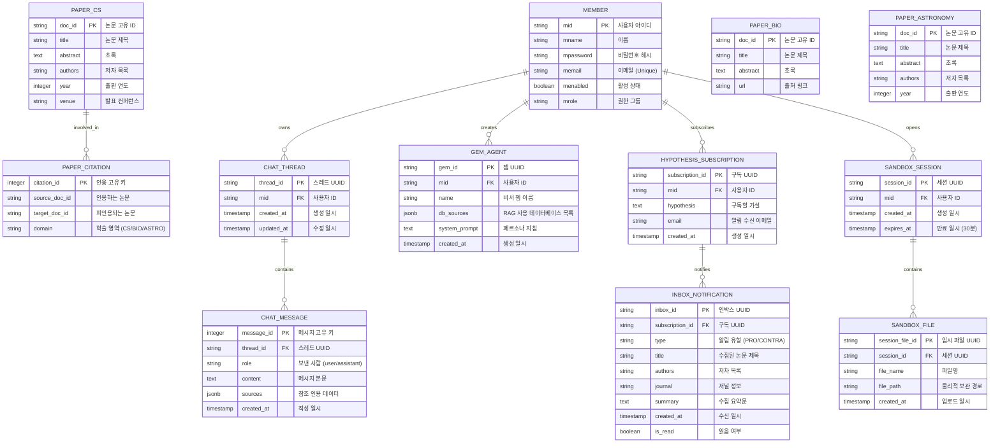

# 📊 MTEB 데이터셋 EDA 및 PostgreSQL/pgvector 스키마 설계서 (Dataset EDA & DB Schema Design)

본 문서는 **'논문 AI 에이전트 채팅 플랫폼 (Paper Agent Chat Platform)'**에서 활용할 MTEB(Massive Text Embedding Benchmark) 3대 데이터셋(의학, 컴퓨터 과학, 자연 과학)의 탐색적 데이터 분석(EDA) 결과와 이를 영구 저장하고 RAG 및 다중 에이전트 작업에 활용하기 위한 PostgreSQL 17 및 pgvector 기반 관계형 데이터베이스 스키마 명세서입니다.

---

## 🔍 1. MTEB 3대 데이터셋 탐색적 데이터 분석 (Dataset EDA)

플랫폼은 학술 연구의 도메인 특수성을 다루기 위해 MTEB(Massive Text Embedding Benchmark)에 포함된 의학, 컴퓨터 과학, 자연 과학 분야의 대표 데이터셋 3종을 학습 및 RAG 검색 소스로 활용합니다.

### 1.1 생명공학 도메인 (Biotechnology): TREC-COVID & NFCorpus
*   **데이터셋 개요 및 목적**:
    - **TREC-COVID**: SARS-CoV-2 및 COVID-19 관련 생명 의학 임상 검색 성능을 평가하기 위한 정보 검색 벤치마크 데이터셋입니다. 임상 질의(Clinical Query)에 부합하는 PubMed 기반의 대규모 문헌(CORD-19)을 효과적으로 검색하는 능력을 테스트합니다.
    - **NFCorpus**: NutritionFacts.org 웹사이트에서 추출한 비전문가 수준의 일반 자연어 의학/영양 질문(Query)과 PubMed 학술 논문 초록(Document) 간의 연관성을 평가하는 전문 검색 벤치마크 데이터셋입니다.
*   **구조 분석**:
    -   `corpus.jsonl` (PubMed & CORD-19 Documents):
        -   `_id` (str): 문헌 고유 식별자 (PubMed ID 또는 CORD-19 UID, 예: `MED-10`, `trec-covid-doc-39`)
        -   `title` (str): 논문 제목
        -   `text` (str): 초록 본문 (Abstract)
        -   `metadata` (json): `{ "url": "...", "pubmed_id": "..." }`
    -   `queries.jsonl` (User/Clinical Queries):
        -   `_id` (str): 질의 고유 식별자 (예: `PLAIN-1`, `trec-covid-q-12`)
        -   `text` (str): 자연어로 작성된 영양/의학/임상 질문
*   **RAG 최적화 및 활용 전략**:
    -   일반 자연어 질문이나 임상 키워드는 비정형적이고 일상 표현이 섞여 있는 반면, 타겟 문헌들은 학술적 용어로 쓰여 있어 **어휘적 장벽(Vocabulary Barrier)**이 있습니다.
    -   이를 극복하기 위해 `text-embedding-3-small` 모델 기반의 1536차원 고밀도 벡터 임베딩 시맨틱 검색 파이프라인을 구축하고, 질병명 및 약물 명칭의 엄격한 키워드 필터링을 조화시킨 하이브리드 RAG 방식을 활용합니다.
    -   파싱된 청크 데이터와 임베딩 정보는 `bio_embeddings` 테이블에 저장되어 `POST /similarity-search/bio`를 통해 사용됩니다.

### 1.2 컴퓨터 과학 도메인 (Computer Science): SCIDOCS
*   **데이터셋 개요 및 목적**:
    - 컴퓨터 과학 분야 논문들의 의미 관계 분석 및 서지 네트워크(Bibliographic Network) 추천 성능을 검증하는 벤치마크 데이터셋입니다. 논문 상호 인용(Citation), 공동 저자(Co-authorship), 게재 학술지(Venue) 정보 등의 유기적 관계 정보를 갖추고 있습니다.
*   **구조 분석**:
    -   `corpus.jsonl` (CS Documents):
        -   `_id` (str): Semantic Scholar 논문 ID
        -   `title` (str): 논문 제목
        -   `abstract` (str): 초록 내용
        -   `authors` (list[str]): 공동 저자 목록
        -   `year` (int): 출판/발표 연도
        -   `venue` (str): 학회 또는 저널명 (예: CVPR, NeurIPS)
        -   `out_citations` (list[str]): 해당 논문이 참조(인용)한 타 논문 ID 배열
        -   `in_citations` (list[str]): 해당 논문을 인용한 타 논문 ID 배열
*   **RAG 최적화 및 활용 전략**:
    -   `F-01-A-5: 인용 관계망 조회 API`에서 D3.js 노드-링크 구조로 계보 시각화 기능을 실시간 제공하기 위해, 인용 네트워크 데이터를 DB 레벨에서 `paper_citation` 테이블로 분리 및 매핑하여 정규화합니다.
    -   컴퓨터 과학 도메인은 최신 학회(Venue) 및 저자 검색 니즈가 크므로, 연도/저자/컨퍼런스 정보를 별도의 관계형 컬럼으로 매핑해 벡터 검색 시 메타데이터 필터링 조건으로 적극 바인딩합니다.
    -   임베딩 및 청크 데이터는 `cs_embeddings` 테이블에 저장되어 `POST /similarity-search/cs`를 통해 서비스됩니다.

### 1.3 천문학 도메인 (Astronomy): SciFact
*   **데이터셋 개요 및 목적**:
    - 다중 물리학 및 천문/우주 과학 분야를 포함한 복잡한 과학적 주장(Claim)을 과학 논문 초록들을 근거로 검증하고, 지지(SUPPORT) 또는 반박(CONTRADICT) 여부를 식별하며 그 세부 증거 문장(Evidence Sentence)을 추출하는 팩트 체크 벤치마크 데이터셋입니다.
*   **구조 분석**:
    -   `corpus.jsonl` (Scientific Documents):
        -   `doc_id` (int): 논문 고유 ID
        -   `title` (str): 논문 제목
        -   `abstract` (list[str]): 문장 단위로 분할된 초록 본문 리스트
    -   `claims.jsonl` (User Hypotheses):
        -   `id` (int): 주장 고유 식별 키
        -   `claim` (str): 우주과학/물리 관련 과학적 주장 텍스트
        -   `citations` (list[json]): 지지/반박 증명 관계 및 논문 초록 상의 정확한 증거 문장 인덱스
*   **RAG 최적화 및 활용 전략**:
    -   보안 샌드박스의 **가설 검증 알림 구독(`F-02-A-6`)** 및 **자기 일관성 검증(Majority Voting)** 수행 시 핵심 백본 데이터로 기능합니다.
    -   본 데이터셋은 논문 초록이 문장별(`list[str]`)로 나누어져 있으므로, 텍스트 청커에서 일반적인 글자 수 슬라이딩 윈도우가 아닌 **문장 단위를 엄격히 보존하는 문장 단위 청커(Sentence-preserving Chunker)**를 적용하고, 각 문장별 고유 임베딩을 `astronomy_embeddings`에 저장하여 정확한 증거 문장 인덱스를 가리키도록 구조화합니다.
    -   임베딩 및 문장 청크 정보는 `astronomy_embeddings` 테이블에 저장되어 `POST /similarity-search/astronomy`를 통해 검색됩니다.

---

## 🗄️ 2. 데이터베이스 논리적/물리적 설계 (Database ERD & Schema)

전체 테이블은 데이터 무결성을 유지하기 위한 관계형 테이블(Member, Citations, Thread, Message)과 고성능 벡터 유사도 연산을 지원하기 위한 pgvector 테이블(Embeddings), 그리고 보안 샌드박스의 30분 소거 로직을 지원하는 격리 임시 테이블로 이원화하여 구성되었습니다.

### 2.1 관계형 스키마 ERD 및 테이블 연동 관계



---

## 💾 3. PostgreSQL 17 & pgvector 물리 DDL 스크립트 (schema.sql)

다음은 데이터베이스 인스턴스를 구축하기 위한 표준 SQL DDL입니다. pgvector 인덱스 형식은 코사인 유사도 연산 속도와 정확도를 보장하는 **HNSW (Hierarchical Navigable Small World)** 방식을 기본 설정으로 채택하였습니다.

```sql
-- =========================================================================
-- 1. pgvector 확장 활성화 및 초기 설정
-- =========================================================================
CREATE EXTENSION IF NOT EXISTS vector;

-- =========================================================================
-- 2. 사용자 계정 및 권한 관리 테이블
-- =========================================================================
CREATE TABLE member (
    mid VARCHAR(20) PRIMARY KEY,
    mname VARCHAR(20) NOT NULL,
    mpassword VARCHAR(255) NOT NULL,
    memail VARCHAR(255) UNIQUE NOT NULL,
    menabled BOOLEAN DEFAULT TRUE NOT NULL,
    mrole VARCHAR(20) NOT NULL
);

-- =========================================================================
-- 3. 도메인별 원본 학술 논문 메타데이터 테이블
-- =========================================================================
-- 컴퓨터 과학 논문
CREATE TABLE paper_cs (
    doc_id VARCHAR(50) PRIMARY KEY,
    title TEXT NOT NULL,
    abstract TEXT,
    authors TEXT,
    year INTEGER,
    venue VARCHAR(100)
);

-- 의학/생명공학 논문
CREATE TABLE paper_bio (
    doc_id VARCHAR(50) PRIMARY KEY,
    title TEXT NOT NULL,
    abstract TEXT,
    url TEXT
);

-- 천문학/자연과학 논문
CREATE TABLE paper_astronomy (
    doc_id VARCHAR(50) PRIMARY KEY,
    title TEXT NOT NULL,
    abstract TEXT,
    authors TEXT,
    year INTEGER
);

-- =========================================================================
-- 4. 도메인별 벡터 임베딩 & 텍스트 청킹 스토어 (pgvector)
-- =========================================================================
-- 컴퓨터 과학 임베딩
CREATE TABLE cs_embeddings (
    chunk_id SERIAL PRIMARY KEY,
    doc_id VARCHAR(50) NOT NULL REFERENCES paper_cs(doc_id) ON DELETE CASCADE,
    chunk_text TEXT NOT NULL,
    embedding vector(1536) NOT NULL,
    chunk_index INTEGER NOT NULL
);

-- 의학 임베딩
CREATE TABLE bio_embeddings (
    chunk_id SERIAL PRIMARY KEY,
    doc_id VARCHAR(50) NOT NULL REFERENCES paper_bio(doc_id) ON DELETE CASCADE,
    chunk_text TEXT NOT NULL,
    embedding vector(1536) NOT NULL,
    chunk_index INTEGER NOT NULL
);

-- 천문학 임베딩
CREATE TABLE astronomy_embeddings (
    chunk_id SERIAL PRIMARY KEY,
    doc_id VARCHAR(50) NOT NULL REFERENCES paper_astronomy(doc_id) ON DELETE CASCADE,
    chunk_text TEXT NOT NULL,
    embedding vector(1536) NOT NULL,
    chunk_index INTEGER NOT NULL
);

-- =========================================================================
-- 5. 서지 관계망 인용 링크 테이블
-- =========================================================================
CREATE TABLE paper_citation (
    citation_id SERIAL PRIMARY KEY,
    source_doc_id VARCHAR(50) NOT NULL,
    target_doc_id VARCHAR(50) NOT NULL,
    domain VARCHAR(20) NOT NULL CHECK (domain IN ('CS', 'BIO', 'ASTRO')),
    CONSTRAINT unique_citation_pair UNIQUE (source_doc_id, target_doc_id)
);

CREATE INDEX idx_citation_source ON paper_citation(source_doc_id);
CREATE INDEX idx_citation_target ON paper_citation(target_doc_id);

-- =========================================================================
-- 6. 채팅 스레드 & 메시지 세션 저장 테이블 (PostgresSaver 스키마 연계)
-- =========================================================================
CREATE TABLE chat_thread (
    thread_id VARCHAR(50) PRIMARY KEY,
    mid VARCHAR(20) NOT NULL REFERENCES member(mid) ON DELETE CASCADE,
    created_at TIMESTAMP DEFAULT CURRENT_TIMESTAMP NOT NULL,
    updated_at TIMESTAMP DEFAULT CURRENT_TIMESTAMP NOT NULL
);

CREATE TABLE chat_message (
    message_id SERIAL PRIMARY KEY,
    thread_id VARCHAR(50) NOT NULL REFERENCES chat_thread(thread_id) ON DELETE CASCADE,
    role VARCHAR(10) NOT NULL CHECK (role IN ('user', 'assistant')),
    content TEXT NOT NULL,
    sources JSONB DEFAULT '[]'::jsonb NOT NULL,
    created_at TIMESTAMP DEFAULT CURRENT_TIMESTAMP NOT NULL
);

-- =========================================================================
-- 7. 맞춤형 AI 비서 젬(Gem) 관리 테이블
-- =========================================================================
CREATE TABLE gem_agent (
    gem_id VARCHAR(50) PRIMARY KEY,
    mid VARCHAR(20) NOT NULL REFERENCES member(mid) ON DELETE CASCADE,
    name VARCHAR(100) NOT NULL,
    db_sources JSONB NOT NULL, -- 예: ["cs_embeddings", "bio_embeddings"]
    system_prompt TEXT NOT NULL,
    created_at TIMESTAMP DEFAULT CURRENT_TIMESTAMP NOT NULL
);

-- =========================================================================
-- 8. 가설 알림 구독 및 수신 인박스 테이블
-- =========================================================================
CREATE TABLE hypothesis_subscription (
    subscription_id VARCHAR(50) PRIMARY KEY,
    mid VARCHAR(20) NOT NULL REFERENCES member(mid) ON DELETE CASCADE,
    hypothesis TEXT NOT NULL,
    email VARCHAR(255) NOT NULL,
    created_at TIMESTAMP DEFAULT CURRENT_TIMESTAMP NOT NULL
);

CREATE TABLE inbox_notification (
    inbox_id VARCHAR(50) PRIMARY KEY,
    subscription_id VARCHAR(50) NOT NULL REFERENCES hypothesis_subscription(subscription_id) ON DELETE CASCADE,
    type VARCHAR(20) NOT NULL CHECK (type IN ('PRO_EVIDENCE', 'CONTRA_EVIDENCE', 'TASK_COMPLETE')),
    title TEXT NOT NULL,
    authors TEXT,
    journal TEXT,
    summary TEXT NOT NULL,
    created_at TIMESTAMP DEFAULT CURRENT_TIMESTAMP NOT NULL,
    is_read BOOLEAN DEFAULT FALSE NOT NULL
);

-- =========================================================================
-- 9. 보안 샌드박스 보관 세션 및 임시 적재 테이블
-- =========================================================================
CREATE TABLE sandbox_session (
    session_id VARCHAR(50) PRIMARY KEY,
    mid VARCHAR(20) NOT NULL REFERENCES member(mid) ON DELETE CASCADE,
    created_at TIMESTAMP DEFAULT CURRENT_TIMESTAMP NOT NULL,
    expires_at TIMESTAMP NOT NULL
);

CREATE TABLE sandbox_file (
    session_file_id VARCHAR(50) PRIMARY KEY,
    session_id VARCHAR(50) NOT NULL REFERENCES sandbox_session(session_id) ON DELETE CASCADE,
    file_name VARCHAR(255) NOT NULL,
    file_path VARCHAR(500) NOT NULL,
    created_at TIMESTAMP DEFAULT CURRENT_TIMESTAMP NOT NULL
);

CREATE TABLE sandbox_embeddings (
    chunk_id SERIAL PRIMARY KEY,
    session_file_id VARCHAR(50) NOT NULL REFERENCES sandbox_file(session_file_id) ON DELETE CASCADE,
    chunk_text TEXT NOT NULL,
    embedding vector(1536) NOT NULL,
    chunk_index INTEGER NOT NULL
);

-- =========================================================================
-- 10. HNSW 성능 최적화 벡터 검색용 인덱스 매핑 설정
-- =========================================================================
-- m개의 최대 연결 커넥션과 ef_construction 매개변수를 제어하여 정확도 성능 보장
CREATE INDEX idx_cs_hnsw ON cs_embeddings USING hnsw (embedding vector_cosine_ops) WITH (m = 16, ef_construction = 64);
CREATE INDEX idx_bio_hnsw ON bio_embeddings USING hnsw (embedding vector_cosine_ops) WITH (m = 16, ef_construction = 64);
CREATE INDEX idx_astro_hnsw ON astronomy_embeddings USING hnsw (embedding vector_cosine_ops) WITH (m = 16, ef_construction = 64);
CREATE INDEX idx_sandbox_hnsw ON sandbox_embeddings USING hnsw (embedding vector_cosine_ops) WITH (m = 16, ef_construction = 64);

-- =========================================================================
-- 11. 보안 파쇄 관리 트리거 함수 (30분 초과 세션 자동 삭제 스케줄 지원)
-- =========================================================================
CREATE OR REPLACE FUNCTION purge_expired_sandboxes()
RETURNS void AS $$
BEGIN
    -- 만료 시간이 도래한 sandbox_session 데이터 삭제
    -- CASCADE 조건에 의해 sandbox_file 및 sandbox_embeddings 도 함께 연쇄 파쇄됩니다.
    DELETE FROM sandbox_session WHERE expires_at <= CURRENT_TIMESTAMP;
END;
$$ LANGUAGE plpgsql;
