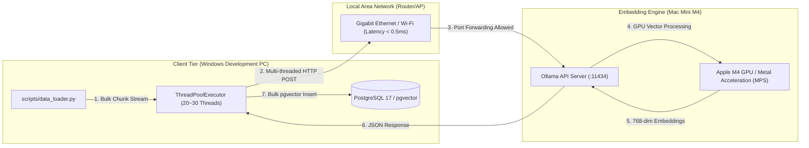

# 🖥️ 로컬 분산 임베딩 인프라 구축 및 세팅 가이드 (Local Distributed Embedding Guide)

본 문서는 OpenAI API 호출 비용(약 $100)을 전면 무료화하고, 대용량 학술 논문 초록 데이터셋(138만 건)을 고속으로 임베딩 적재하기 위해 **맥미니 M4 (Apple Silicon GPU 가속)**와 **윈도우 개발 PC** 간의 동일 네트워크 내부 통신을 활용한 로컬 분산 임베딩 인프라 구축 가이드라인입니다.

---

## 🏛️ 1. 로컬 분산 아키텍처 및 통신 구성 (Network Topology)

외망 터널링 도구(ngrok 등)와 워크플로우 툴(n8n 등)을 걷어내고, 동일 공유기 하위의 **로컬 내부 IP 대역(레이턴시 < 1ms)**에서 직접 기가비트 대역폭으로 통신하는 순수 고성능 분산 파이프라인을 구축합니다.



---

## ⚙️ 2. 1단계: 맥미니 M4 (서버 단) 환경 세팅

맥미니 M4의 통합 메모리 구조와 강력한 Apple Silicon GPU 가속(Metal)을 Ollama 엔진을 통해 활성화합니다.

### 2.1 Ollama 설치 및 백본 모델 다운로드
1.  맥미니 M4에서 공식 웹사이트를 통해 [Ollama for macOS](https://ollama.com/download/mac)를 설치합니다.
2.  터미널을 열고, MTEB 리더보드 최상위권의 고성능/경량 임베딩 백본 모델인 `nomic-embed-text`를 다운로드(Pull)합니다.
    ```bash
    ollama pull nomic-embed-text
    ```

### 2.2 외부 네트워크 접근(0.0.0.0) 바인딩 설정
기본적으로 Ollama는 보안을 위해 로컬(`127.0.0.1`) 접근만 허용합니다. 윈도우 PC의 요청을 수신할 수 있도록 바인딩 주소를 전체 대역으로 설정하여 구동해야 합니다.

*   **터미널에서 Ollama 백그라운드 구동**:
    ```bash
    OLLAMA_HOST=0.0.0.0 ollama serve
    ```
    *(해당 터미널 창을 열어둔 상태로 유지합니다.)*

### 2.3 맥미니 M4 내부 IP 확인 및 방화벽 예외 처리
1.  맥미니 터미널에서 `ifconfig` 명령을 실행하거나, **[시스템 설정 ➡️ Wi-Fi 또는 이더넷 ➡️ 세부 정보]**를 클릭하여 할당된 로컬 내부 IP 주소를 확인합니다.
    *   *내부 IP 예시*: `192.168.0.15`
2.  맥미니의 **[시스템 설정 ➡️ 네트워크 ➡️ 방화벽]**이 켜져 있는 경우, Ollama의 포트인 **`11434`**번 들어오는 연결(Inbound Connection)에 대해 허용 처리를 합니다.

---

## 💻 3. 2단계: 윈도우 개발 PC (클라이언트 단) 통신 검증

윈도우 PC에서 맥미니 M4의 임베딩 서버에 접근이 가능한지 네트워크망 통신을 1차 테스트합니다.

### 3.1 curl 통신 검증
윈도우 PowerShell 창을 열고 맥미니 M4의 Ollama 헬스체크 주소에 테스트 요청을 날려 `200 OK` 혹은 Ollama 실행 상태 메시지가 정상 반환되는지 확인합니다.

```powershell
# curl http://<맥미니_내부_IP>:11434
curl http://192.168.0.15:11434
```

### 3.2 Python 기반 임베딩 추출 단발성 테스트
윈도우 PC 파이썬 환경에서 아래 테스트 코드를 실행하여 임베딩 벡터가 정상적으로 수신되는지 최종 확인합니다.

```python
import requests

MAC_MINI_IP = "192.168.0.15"  # 실제 맥미니 IP로 변경
URL = f"http://{MAC_MINI_IP}:11434/api/embeddings"

payload = {
    "model": "nomic-embed-text",
    "prompt": "로컬 분산 RAG 파이프라인 성능 검증 테스트 문장입니다."
}

response = requests.post(URL, json=payload, timeout=5)
if response.status_code == 200:
    embedding = response.json().get("embedding")
    print(f"✅ 임베딩 수신 성공! (차원 크기: {len(embedding)})")
else:
    print(f"❌ 임베딩 실패 (상태 코드: {response.status_code})")
```

---

## ⚡ 4. 3단계: 멀티스레드 고속 병렬 적재 구현 가이드

내부 기가비트 이더넷의 대역폭을 낭비 없이 100% 활용하기 위해, 단일 루프 동기 처리가 아닌 **`ThreadPoolExecutor`를 활용한 멀티스레드 병렬 임베딩 요청 및 pgvector 벌크 인서트(Bulk Insert)** 파이프라인을 작성합니다.

```python
import os
import requests
import json
from concurrent.futures import ThreadPoolExecutor, as_completed
from sqlalchemy import text
from api.database.config.dbsession import SessionLocal  # 백엔드 DB 세션

MAC_MINI_IP = "192.168.0.15"  # 맥미니 IP
OLLAMA_URL = f"http://{MAC_MINI_IP}:11434/api/embeddings"
MAX_WORKERS = 30  # 기가비트 내부망에 적합한 병렬 스레드 수

def fetch_embedding(chunk_id, chunk_text):
    """맥미니 M4 Ollama 서버에 단일 청크 임베딩 요청을 전송합니다."""
    payload = {
        "model": "nomic-embed-text",
        "prompt": chunk_text
    }
    try:
        response = requests.post(OLLAMA_URL, json=payload, timeout=15)
        if response.status_code == 200:
            return chunk_id, response.json().get("embedding")
    except Exception as e:
        print(f"[에러] 청크 ID {chunk_id} 임베딩 변환 실패: {e}")
    return chunk_id, None

def process_bulk_embedding(chunks_to_embed):
    """
    chunks_to_embed: List of dict -> [{"chunk_id": 1, "chunk_text": "본문내용"}, ...]
    """
    embeddings_map = {}
    
    # 20~30개 스레드로 맥미니 M4에 병렬 연산 요청
    with ThreadPoolExecutor(max_workers=MAX_WORKERS) as executor:
        futures = {
            executor.submit(fetch_embedding, item["chunk_id"], item["chunk_text"]): item 
            for item in chunks_to_embed
        }
        
        for future in as_completed(futures):
            chunk_id, vector = future.result()
            if vector:
                embeddings_map[chunk_id] = vector
                
    # 추출이 완료된 벡터 묶음을 PostgreSQL pgvector에 벌크 인서트 (SQLAlchemy Core 또는 raw SQL)
    db = SessionLocal()
    try:
        # DB 벌크 인서트 처리 구현부
        # UPDATE cs_embeddings SET embedding = :vector WHERE chunk_id = :chunk_id
        db.commit()
    except Exception as e:
        db.rollback()
        print(f"DB 저장 실패: {e}")
    finally:
        db.close()
```

---

## 📈 5. 성능 비교 및 분석 인사이트 (Performance Insights)

| 항목 | OpenAI API (`text-embedding-3-large`) | 맥미니 M4 로컬 분산 (`nomic-embed-text`) |
| :--- | :--- | :--- |
| **비용 (138만 건)** | **약 $45 (한화 약 6만 원)** | **$0 (전면 무료)** |
| **네트워크 레이턴시** | 평균 200ms ~ 500ms (국외 CDN 거침) | **평균 0.5ms 이하** (공유기 내부망) |
| **병렬 처리 안전성** | API Rate Limiting (TPM/RPM)에 제한됨 | **제한 없음** (로컬 GPU 용량 한계까지 병렬 가능) |
| **데이터 프라이버시** | 외부 API 서버로 학술 텍스트 유출 | **외부 유출 없음** (로컬 물리망 내 격리 보존) |
| **인프라 종속성** | 인터넷망 필수 연결 필요 | 오프라인 로컬 환경에서도 구동 가능 |
