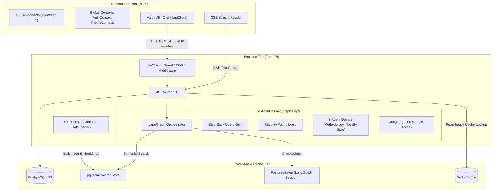

# 🏛️ 시스템 아키텍처 및 API 상세 명세서 (System Architecture & API Spec)

본 문서는 **'논문 AI 에이전트 플랫폼 (Paper Agent Platform)'**의 시스템 구성도와 각 티어(Tier) 간 통신을 규정하는 핵심 API 명세서입니다. 본 명세서는 백엔드(FastAPI)와 프론트엔드(Next.js) 개발 시 규격 데이터 모델 바인딩의 기준이 됩니다.

---

## 🏗️ 1. 시스템 아키텍처 (System Architecture)

플랫폼은 데이터의 기밀성 유지와 실시간 다중 에이전트 연산을 효율적으로 분담하기 위해 **3-Tier 아키텍처** 구조로 설계되었습니다.



### 아키텍처 구성 요소 및 기술 스택
1.  **Frontend Tier (Next.js 16, React 19, JavaScript)**:
    -   `layout.js` 단에서 `AuthContextProvider`와 `ThemeContextProvider`를 마운트해 사용자 세션과 라이트/다크 테마 상태를 전역 공급합니다.
    -   Axios 인터셉터 기반 `apiClient`를 통해 인증 토큰(Bearer JWT)을 헤더에 자동 바인딩하여 백엔드에 요청을 보냅니다.
    -   에이전트 답변 및 CoT 생각의 흐름 과정은 Server-Sent Events(SSE) 리스너를 이용해 스트리밍 렌더링합니다.
2.  **Backend Tier (FastAPI, Python 3.14)**:
    -   FastAPI 라우터를 토대로 REST API 엔드포인트를 노출하고, `typing.Annotated` 패턴의 의존성 주입(`DbSession`, `CurrentUser`)을 활용해 리소스를 제어합니다.
    -   LangGraph를 사용해 질문 유형에 따른 분기(생명공학/CS/천문학 RAG) 및 다중 에이전트 합의 토론 워크플로우를 정의합니다.
3.  **Database & Cache Tier (PostgreSQL 17, pgvector, Redis)**:
    -   **PostgreSQL DB**: 사용자 정보(`member`) 및 에이전트 세션의 스레드 체크포인팅(`PostgresSaver`)을 관리하는 메인 관계형 데이터베이스입니다.
    -   **pgvector Vector Store**: 3대 학술 영역의 벡터 테이블(`bio_embeddings`, `cs_embeddings`, `astronomy_embeddings`)에 1536차원 임베딩 정보를 적재하고 코사인 유사도 연산을 실행합니다.
    -   **Redis Cache (고도화 제언 반영)**: 특정 논문의 고정된 인용 관계망 조회(`GET /papers/{id}/citations`) 및 유사도가 매우 높고 반복되는 동일 RAG 쿼리 벡터 탐색 결과에 대해 Redis 캐시를 도입하여, 비싼 PostgreSQL/pgvector 연산 부하를 획기적으로 낮추고 속도를 보장합니다.

### 💡 아키텍처 및 성능 최적화 고도화 설계 (Performance & Async Push)

*   **Read-heavy 연산에 대한 Redis 캐싱**: 
    - 동적 에이전트 대화 및 보안 세션은 노캐시 정책을 유지하지만, 구조가 고정된 논문 인용망 조회(`GET /papers/{id}/citations`) 및 고도로 중복되는 동일 RAG 벡터 유사도 탐색은 **Redis 인메모리 캐시**를 거치도록 설계하여 데이터베이스 연산 병목을 예방합니다.
*   **비동기 알림 방식 고도화 (Push-based Task Notification)**:
    - 대규모 문헌 분석(`F-01-B-1`)과 같이 처리 시간이 긴 백그라운드 비동기 작업에 대해 클라이언트가 매번 상태를 조회(Polling)하는 트래픽 부담을 해소하기 위해, 작업 완수 시 백엔드에서 **SSE 푸시 이벤트**를 발생시켜 클라이언트 화면(Topbar 알림 또는 Inbox)에 즉각 수신 통보되도록 연동 아키텍처를 고도화합니다.

---

## 🛡️ 2. API 공통 규격 및 헤더 정의 (API Conventions)

### 2.1 공통 HTTP 응답 규격
모든 API 응답은 일관된 JSON 래퍼 구조를 준수합니다.

*   **API 성공 응답 (200 OK / 201 Created)**:
    ```json
    {
      "status": "success",
      "data": {}
    }
    ```
*   **API 실패 응답 (4xx Bad Request/Unauthorized, 5xx Server Error)**:
    ```json
    {
      "status": "error",
      "message": "오류 발생 원인 및 비즈니스 예외 설명"
    }
    ```
*   **예외 사항 (인증 토큰 발급)**:
    Swagger UI의 `Authorize` 자물쇠 인증 도구와의 호환성 및 RFC 6749 OAuth 2.0 규격 준수를 위해, `/auth/login` 엔드포인트에 한해서는 응답 성공 래퍼 없이 루트 레벨에 토큰 스키마를 직접 반환합니다:
    ```json
    {
      "access_token": "eyJhbGciOiJIUzI1NiIsInR5cCI6IkpXVCJ9...",
      "token_type": "bearer"
    }
    ```

### 2.2 공통 HTTP 헤더 스펙
*   **인증 헤더 (Authorization)**: 로그인 이외의 보호 대상 모든 API 요청 시 필수 포함
    -   `Authorization: Bearer <JWT_ACCESS_TOKEN>`
*   **동적 API 캐싱 방지 헤더**: 동적 데이터를 반환하는 모든 컨트롤러 및 정적 라우터 응답 헤더에 강제 주입
    -   `Cache-Control: no-store, no-cache, must-revalidate, max-age=0`
    -   `Pragma: no-cache`
    -   `Expires: 0`

---

## 🔌 3. API 엔드포인트 명세 (14대 핵심 API 명세)

---

### [공통 도메인 RAG 검색 API]

#### 1. F-RAG-01: 생명공학 RAG 검색 API
*   **설명**: 생명공학 논문 벡터 인덱스(`bio_embeddings`)에서 유사 텍스트 청크를 검색합니다.
*   **HTTP Method & Path**: `POST /similarity-search/bio`
*   **Request Body**:
    ```json
    {
      "query": "mRNA 백신의 면역 메커니즘",
      "top_k": 3
    }
    ```
*   **Response Body (200 OK)**:
    ```json
    {
      "status": "success",
      "data": {
        "results": [
          {
            "doc_id": "bio_paper_01",
            "title": "mRNA Vaccine Immunogenicity evaluation",
            "text_chunk": "mRNA-based vaccines induce strong antigen-specific humoral and cellular immunity...",
            "score": 0.8942
          }
        ]
      }
    }
    ```

#### 2. F-RAG-02: 컴퓨터 과학 RAG 검색 API
*   **설명**: 컴퓨터 과학 논문 벡터 인덱스(`cs_embeddings`)에서 유사 텍스트 청크를 검색합니다.
*   **HTTP Method & Path**: `POST /similarity-search/cs`
*   **Request Body**:
    ```json
    {
      "query": "RAG 시스템 성능 최적화를 위한 최적 청크 크기",
      "top_k": 3
    }
    ```
*   **Response Body (200 OK)**:
    ```json
    {
      "status": "success",
      "data": {
        "results": [
          {
            "doc_id": "cs_paper_492",
            "title": "Chunk size analysis in document retrieval systems",
            "text_chunk": "Empirical results suggest that chunks of 500 characters achieve optimal balance...",
            "score": 0.9125
          }
        ]
      }
    }
    ```

#### 3. F-RAG-03: 천문학 RAG 검색 API
*   **설명**: 천문학 논문 벡터 인덱스(`astronomy_embeddings`)에서 유사 텍스트 청크를 검색합니다.
*   **HTTP Method & Path**: `POST /similarity-search/astronomy`
*   **Request Body**:
    ```json
    {
      "query": "블랙홀 사건의 지평선 관측 기술",
      "top_k": 3
    }
    ```
*   **Response Body (200 OK)**:
    ```json
    {
      "status": "success",
      "data": {
        "results": [
          {
            "doc_id": "ast_paper_77",
            "title": "Event Horizon Telescope observation methods",
            "text_chunk": "Very-long-baseline interferometry at submillimeter wavelengths enables imaging of...",
            "score": 0.8752
          }
        ]
      }
    }
    ```

---

### [2.1 일반 챗 허브 도메인 API]

#### 4. F-01-A-4: 구조화 출력 변환 및 답변 호출 API
*   **설명**: 일반 챗 질문에 대해 Step-Back 쿼리 생성, RAG 임베딩 검색을 거쳐 답변과 함께 Pydantic DTO(`CitationSource`) 인용 정보 리스트를 구조화된 단일 JSON으로 반환합니다.
*   **HTTP Method & Path**: `POST /agent-structured-output`
*   **Request Body**:
    ```json
    {
      "thread_id": "session-uuid-1120",
      "message": "비정형 문서 RAG 시스템의 청크 크기 비교 수치 알려줘."
    }
    ```
*   **Response Body (200 OK)**:
    ```json
    {
      "status": "success",
      "data": {
        "answer": "500자 크기의 청킹 구조가 평균 MRR 스코어에서 가장 높은 효율을 달성했습니다[1]. 반면 1000자를 초과하는 경우 차원 압축 과정에서 심각한 정보 소실이 발견되었습니다[2].",
        "sources": [
          {
            "index": 1,
            "doc_id": "cs_paper_492",
            "title": "Chunk size analysis in document retrieval systems",
            "authors": "J. Dev, A. Kumar",
            "year": 2024
          },
          {
            "index": 2,
            "doc_id": "cs_paper_103",
            "title": "Semantic Dilution in Large RAG Vectors",
            "authors": "H. Kim, S. Park",
            "year": 2023
          }
        ]
      }
    }
    ```

#### 5. F-01-A-5: 인용 관계망 조회 API
*   **설명**: 특정 논문의 인용 및 피인용 계보 네트워크를 D3.js 노드-링크 포맷으로 변환 조회합니다.
*   **HTTP Method & Path**: `GET /papers/{id}/citations`
*   **Request Parameters**:
    -   `id` (Path Parameter, str): 타겟 논문 고유 ID
*   **Response Body (200 OK)**:
    ```json
    {
      "status": "success",
      "data": {
        "nodes": [
          { "id": "cs_paper_492", "title": "Chunk size analysis...", "type": "target" },
          { "id": "cs_paper_103", "title": "Semantic Dilution...", "type": "reference" }
        ],
        "links": [
          { "source": "cs_paper_492", "target": "cs_paper_103", "value": 1 }
        ]
      }
    }
    ```

---

### [2.2 대규모 문헌 비교 및 Gap 분석기 API]

#### 6. F-01-B-1: 비동기 대규모 문헌 비교 분석 요청 API
*   **설명**: 다량의 선행 연구 목록에 대한 배치 비교 연산 및 한계점 추출 작업을 요청합니다. 즉시 작업 ID를 반환하며 연산은 백그라운드 큐에서 처리됩니다.
*   **HTTP Method & Path**: `POST /research-gap/analyze`
*   **Request Body**:
    ```json
    {
      "paper_ids": ["cs_paper_492", "cs_paper_103", "cs_paper_11"],
      "focus_area": "비정형 문서 청킹 및 임베딩 최적화"
    }
    ```
*   **Response Body (201 Created)**:
    ```json
    {
      "status": "success",
      "data": {
        "task_id": "gap_task_9210a",
        "status": "PENDING"
      }
    }
    ```

#### 7. F-01-B-2: 비동기 분석 작업 상태 및 결과 조회 API
*   **설명**: 비동기 배치 작업의 상태(`PENDING`, `RUNNING`, `SUCCESS`)를 조회하고 완료 시 요약 매트릭스 및 연구 공백 제안 데이터를 반환합니다.
*   **비동기 알림 고도화 (SSE Push)**: 클라이언트의 주기적인 HTTP 폴링(Polling) 부하를 방지하기 위해, 백그라운드 분석 작업 완료 시 **Server-Sent Events(SSE) 푸시**, **WebSocket** 혹은 **Web Push 알림**을 통해 즉시 클라이언트에 완료 이벤트를 전달하고 알림 인박스(`GET /sandbox/subscriptions/inbox`)에 자동 적재하도록 구성합니다.
*   **HTTP Method & Path**: `GET /research-gap/tasks/{task_id}`
*   **Request Parameters**:
    -   `task_id` (Path Parameter, str): 비동기 작업 고유 ID
*   **Response Body (200 OK - SUCCESS)**:
    ```json
    {
      "status": "success",
      "data": {
        "task_id": "gap_task_9210a",
        "status": "SUCCESS",
        "matrix_data": [
          {
            "doc_id": "cs_paper_492",
            "title": "Chunk size analysis...",
            "methodology": "BGE-M3 Chunking",
            "solved_problems": ["최적 청크 스펙 도출"],
            "limitations": ["수식 및 표 등 멀티모달 객체 유실"]
          }
        ],
        "gap_analysis": "세 편의 연구 대조 결과, 표/수식 구조 인지 청킹 분야가 학술 공백 지점으로 파악됩니다.",
        "recommended_topics": [
          "구조 인지형 하이브리드 청킹 파이프라인 설계 및 검증"
        ]
      }
    }
    ```

---

### [2.3 보안 샌드박스 피어 리뷰 및 디펜스 아레나 API]

#### 8. F-02-A-1: PDF 격리 업로드 및 임시 인덱싱 API
*   **설명**: 보안 샌드박스 내부에 기밀 연구 PDF를 격리 업로드하고, 세션 스코프 전용의 임시 임베딩 벡터 인덱스를 구축합니다.
*   **HTTP Method & Path**: `POST /validation/upload-isolated`
*   **Request Body**:
    -   `file` (Multipart/form-data, UploadFile): 분석할 PDF 파일
    -   `session_id` (Form Data, str): 보안 세션 UUID
*   **Response Body (201 Created)**:
    ```json
    {
      "status": "success",
      "data": {
        "session_file_id": "sandbox-file-8893",
        "chunk_count": 48
      }
    }
    ```

#### 9. F-02-A-3: 다중 에이전트 피어 리뷰 실행 API
*   **설명**: 격리 업로드된 논문 초안에 대해 방법론, 신규성, 학술문체 3대 심사위원 에이전트 간의 LangGraph 토론 프로세스를 거쳐 종합 피어 리뷰 피드백 보고서를 반환합니다.
*   **HTTP Method & Path**: `POST /academic-peer-review`
*   **Request Body**:
    ```json
    {
      "session_file_id": "sandbox-file-8893",
      "target_journal": "IEEE TPAMI"
    }
    ```
*   **Response Body (200 OK)**:
    ```json
    {
      "status": "success",
      "data": {
        "overall_score": 8,
        "review_report": "[방법론 에이전트]: 수식의 정밀성은 우수하나 성능 오버헤드 측정 누락...",
        "diff_table": [
          {
            "original_text": "우리 RAG 청커 알고리즘은 아주 획기적인 속도 향상을 유도한다.",
            "corrected_text": "제안하는 가변 윈도우 보상 수식 기반 청킹 알고리즘은 연산 시간을 약 14.2% 단축한다.",
            "reason": "감정적 서술어를 지양하고 정량적 수치를 제시함"
          }
        ]
      }
    }
    ```

#### 10. F-02-A-5: 심사위원 에이전트 디펜스 아레나 대화 API
*   **설명**: 피어 리뷰 보고서 기반으로 가상의 심사위원이 압박 질문을 던지고, 사용자의 방어 답변에 대한 실시간 수치형 스코어 점수를 책정해 반환합니다.
*   **HTTP Method & Path**: `POST /sandbox/defense/chat`
*   **Request Body**:
    ```json
    {
      "session_id": "sandbox-uuid-88a",
      "user_response": "가변 윈도우 보상 수식을 통해 겹침 토큰의 중복 연산을 우회했기 때문에 오버헤드 없이 Recall 성능을 유지했습니다."
    }
    ```
*   **Response Body (200 OK)**:
    ```json
    {
      "status": "success",
      "data": {
        "refutation_question": "그렇다면 그 우회 알고리즘의 복잡도가 O(N^2)로 상승하는 임계 지점은 어디인가요?",
        "score": 85,
        "feedback": "방어 논리가 수학적으로 정합합니다. 다만 복잡도 임계 데이터 보완 필요."
      }
    }
    ```

#### 11. F-02-A-6: 최신 연구 동향 알림 구독 등록 API
*   **설명**: 검증할 특정 가설을 타겟팅하여 해당 연구 가설을 지지/반박하는 최신 논문 크롤링 시 알림 수신 동향을 등록합니다.
*   **HTTP Method & Path**: `POST /sandbox/subscriptions`
*   **Request Body**:
    ```json
    {
      "hypothesis": "가변 오버랩 청킹 구조는 한국어 형태소 파싱 왜곡률을 15% 이상 줄일 수 있다.",
      "email": "my_researcher@uni.edu"
    }
    ```
*   **Response Body (201 Created)**:
    ```json
    {
      "status": "success",
      "data": {
        "subscription_id": "sub_92109x",
        "hypothesis": "가변 오버랩 청킹 구조는 한국어 형태소 파싱 왜곡률을 15% 이상 줄일 수 있다."
      }
    }
    ```

#### 12. F-02-A-7: 알림 인박스 (Trend Inbox) 조회 API
*   **설명**: 사용자가 구독한 가설 관련 수집된 최신 반박(Contra-evidence)/지지(Pro-evidence) 학술 동향 카드들을 수신 조회합니다.
*   **HTTP Method & Path**: `GET /sandbox/subscriptions/inbox`
*   **Response Body (200 OK)**:
    ```json
    {
      "status": "success",
      "data": {
        "inbox_items": [
          {
            "inbox_id": "inbox_01",
            "type": "CONTRA_EVIDENCE",
            "subscription_id": "sub_92109x",
            "title": "Limitations of Dynamic Overlaps in Aggressive Morphology",
            "authors": "J. Lee, S. Choi",
            "journal": "Empirical SciFact (2026)",
            "summary": "동적 오버랩 적용 시 조사의 탈락 임계치를 극복하지 못해 특정 형태소 매칭 왜곡률이 약 18.3% 상승함을 지적함"
          }
        ]
      }
    }
    ```

---

### [2.4 맞춤형 연구 비서 (Gem) 팩토리 API]

#### 13. F-03-A-1: 맞춤형 비서 젬(Gem) 생성 API
*   **설명**: 특정 RAG 도메인 지식 베이스와 고유 페르소나 지침을 장착한 에이전트(Gem)를 맞춤 설계하여 보관 등록합니다.
*   **HTTP Method & Path**: `POST /gems`
*   **Request Body**:
    ```json
    {
      "name": "컴퓨터그래픽스 냉혹한 평가 젬",
      "db_sources": ["cs_embeddings"],
      "system_prompt": "너는 20년 경력의 컴퓨터 그래픽스 심사위원이야. 수학적 엄밀함을 매섭게 비판해."
    }
    ```
*   **Response Body (201 Created)**:
    ```json
    {
      "status": "success",
      "data": {
        "gem_id": "gem_392a",
        "name": "컴퓨터그래픽스 냉혹한 평가 젬",
        "db_sources": ["cs_embeddings"],
        "system_prompt": "너는 20년 경력의 컴퓨터 그래픽스 심사위원이야. 수학적 엄밀함을 매섭게 비판해."
      }
    }
    ```

#### 14. F-03-A-2: 맞춤 비서 젬(Gem) 목록 조회 API
*   **설명**: 생성 완료되어 사용자가 스토어에 보관 중인 커스텀 비서 젬 리스트를 조회합니다.
*   **HTTP Method & Path**: `GET /gems`
*   **Response Body (200 OK)**:
    ```json
    {
      "status": "success",
      "data": {
        "gems": [
          {
            "gem_id": "gem_392a",
            "name": "컴퓨터그래픽스 냉혹한 평가 젬",
            "db_sources": ["cs_embeddings"],
            "system_prompt": "너는 20년 경력의 컴퓨터 그래픽스 심사위원이야..."
          }
        ]
      }
    }
    ```

#### 15. F-03-A-3: 특정 젬(Gem) 1:1 대화 API (스트리밍)
*   **설명**: 선택된 특화 젬의 페르소나 및 제한된 RAG 도메인 지식만을 적용하여 실시간 대화를 나눕니다. 응답은 Server-Sent Events(SSE) 스트리밍 토큰 형태로 반환됩니다.
*   **HTTP Method & Path**: `POST /gems/{gem_id}/chat`
*   **Request Parameters**:
    -   `gem_id` (Path Parameter, str): 타겟 비서 젬 고유 ID
*   **Request Body**:
    ```json
    {
      "thread_id": "thread-gem-11a",
      "message": "내가 제안하는 래스터화 최적화 수식 검토해줘."
    }
    ```
*   **Response Headers**:
    -   `Content-Type: text/event-stream`
    -   `Cache-Control: no-cache`
    -   `Connection: keep-alive`
*   **Response Stream (SSE Chunk Format)**:
    ```text
    event: thinking
    data: {"step": "CS RAG 데이터베이스 검색을 필터링하여 래스터화 수식 관련 노드 추출 중..."}

    event: message
    data: {"token": "제"}

    event: message
    data: {"token": "안"}

    event: message
    data: {"token": "한"}
    ```

---

## 🚦 4. HTTP 상태 코드 매핑 가이드 (Status Codes)

백엔드 서버는 모든 응답 반환 시 비즈니스 논리 및 프로토콜 규격에 적합한 표준 HTTP 상태 코드를 매핑합니다.

*   `200 OK`: 기존 리소스의 조회가 성공적이거나, 일반 비즈니스 로직 연산이 성공적으로 완수되었을 때 반환.
*   `201 Created`: 회원 가입(`POST /member/join`), 젬 생성(`POST /gems`), 가설 구독 등록(`POST /sandbox/subscriptions`) 등 데이터베이스에 신규 레코드가 정상 적재되었을 때 반환.
*   `400 Bad Request`: 입력 데이터의 포맷 유효성 검증 실패(Pydantic ValidationError) 또는 가설 검증 도중 비즈니스 정합성이 깨지는 에러 발생 시 반환.
*   `401 Unauthorized`: 요청의 Authorization 헤더 내 토큰 서명이 만료되었거나 누락되어 인증이 실패했을 때 반환 (프론트엔드 Response Interceptor에서 감지하여 자동 세션 만료 로그아웃 처리).
*   `403 Forbidden`: 요청 권한 등급이 불충분하여 관리자 테스트 기능 또는 격리 폴더에 접근이 거부되었을 때 반환.
*   `404 Not Found`: 존재하지 않는 논문 ID, 비동기 Task ID, 등록되지 않은 Gem ID 등을 타겟 요청했을 때 반환.
*   `500 Internal Server Error`: 백엔드 소스 코드 내에서 예외 처리가 되지 않아 비정상 종료된 런타임 익셉션 발생 시 반환.
