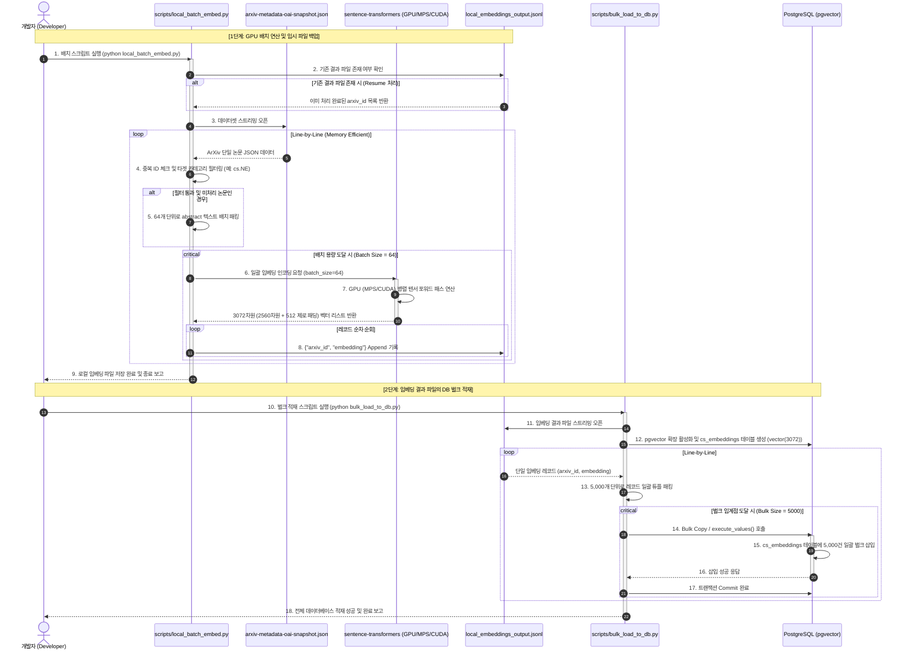
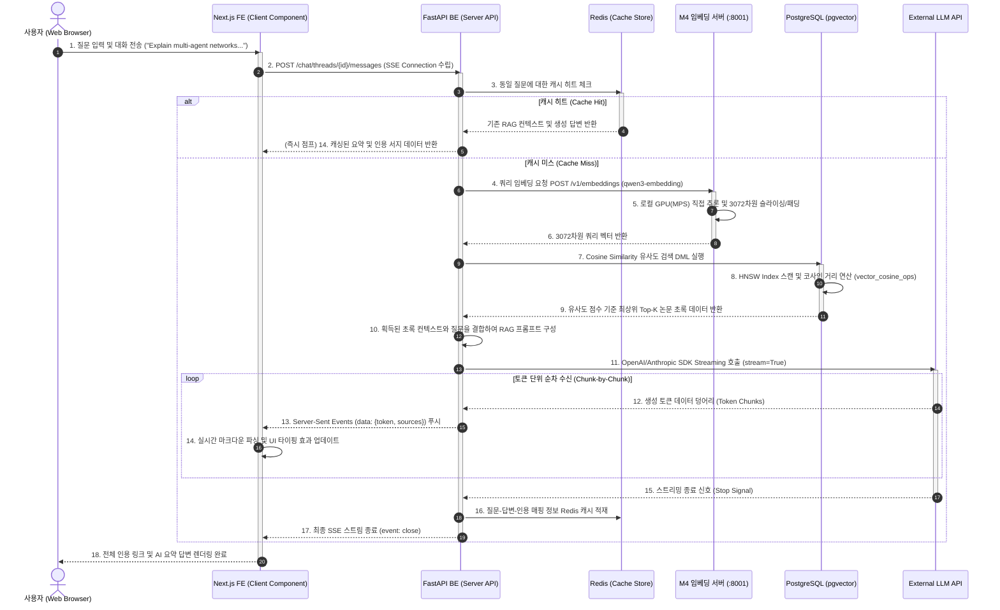
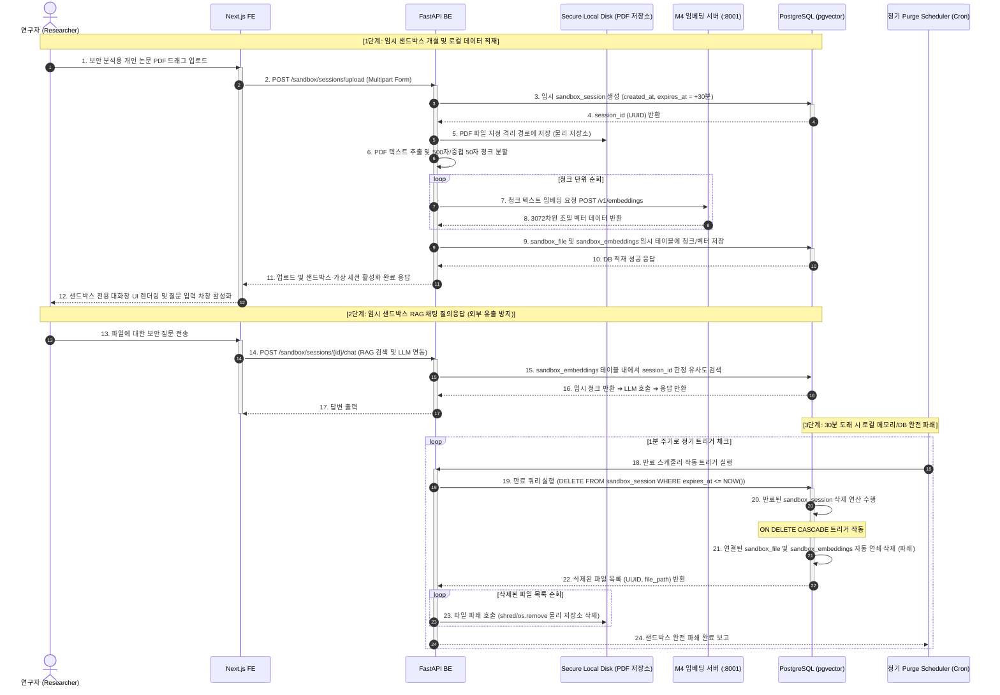
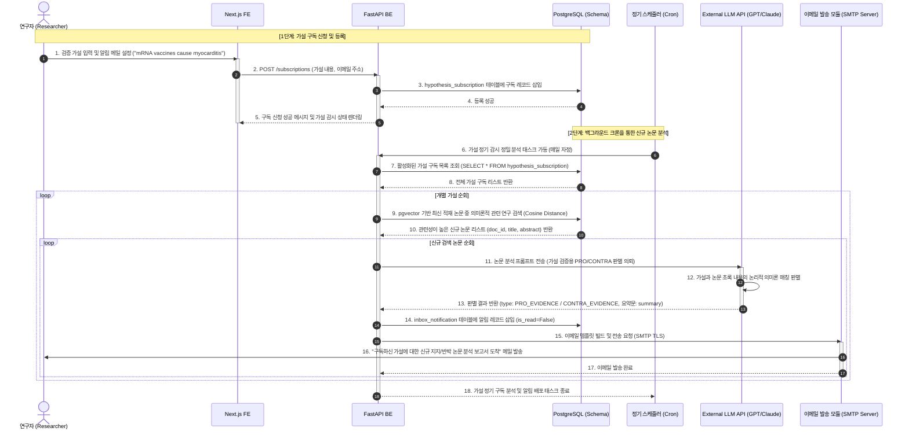

# 📊 시스템 종합 시퀀스 다이어그램 설계서 (System Sequence Diagrams)

본 문서는 **'논문 AI 에이전트 채팅 플랫폼 (Paper Agent Chat Platform)'**의 핵심 서비스 아키텍처와 비즈니스 시나리오를 구현 레벨에서 가시화하기 위한 종합 시퀀스 다이어그램 명세서입니다. 

플랫폼의 4대 주요 비즈니스 흐름에 맞춰 시스템 구성 요소(클라이언트, 백엔드 API, GPU 임베딩 가속 서버, 데이터베이스, 외부 AI 모델) 간의 상호 작용 및 데이터 통신 규격을 정의합니다.

---

## 🏛️ 1. 오프라인 로컬 파일 기반 배치 임베딩 및 DB 적재 파이프라인
*ArXiv 대용량 데이터셋에서 도메인별 5,000건의 경량화 후보군을 추출해 로컬 GPU(MPS/CUDA)로 임베딩을 변환한 후 로컬 PostgreSQL pgvector에 고속 벌크 적재하는 흐름입니다.*

---

## ⚡ 2. 실시간 하이브리드 RAG 에이전트 검색 및 답변 생성 (SSE 스트리밍)
*사용자의 학술 질문에 대해 Redis 캐시 진단 후, M4 GPU 임베딩 및 pgvector HNSW 고속 유사도 검색을 거쳐 LLM의 스트리밍 답변과 인용 서지를 실시간 반환하는 흐름입니다.*

---

## 🔒 3. 보안 연구 샌드박스 가상 세션 수명 주기 및 파쇄
*사용자의 보안 민감 사설 논문 분석을 위한 임시 격리 샌드박스를 개설하고, 30분 초과 만료 시 DB의 외래키 ON DELETE CASCADE와 연계하여 완전 파쇄하는 보안 흐름입니다.*

---

## 📬 4. 가설 검증 및 자동 논문 수집 정기 구독 알림 시스템
*연구 가설을 구독하면 백그라운드 스케줄러가 매일 주기적으로 신규 논문을 탐색하고, LLM을 통해 지지(PRO) 및 반박(CONTRA) 포지션을 판별한 뒤 이메일 알림을 푸시하는 흐름입니다.*

