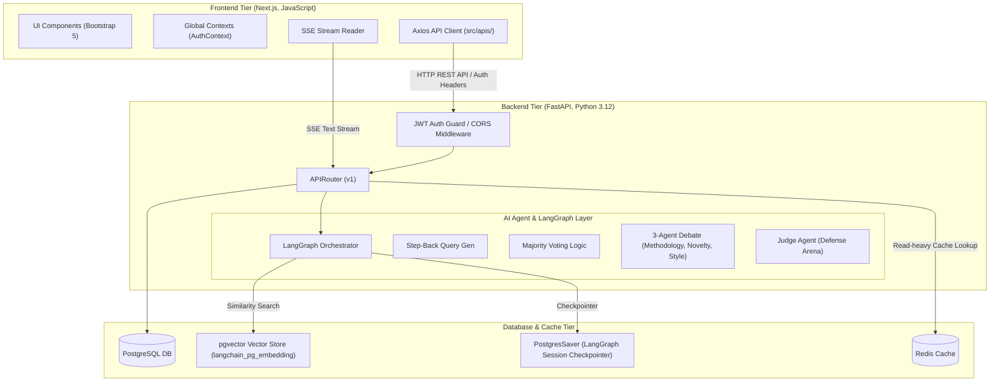

# 🏛️ 시스템 아키텍처 및 API 상세 명세서 (System Architecture & API Spec - 3rd Milestone)

본 문서는 **'논문 AI 에이전트 플랫폼 (Paper Agent Platform)'**의 시스템 구성도와 각 티어(Tier) 간 통신을 규정하는 핵심 API 명세서입니다. 본 명세서는 백엔드(FastAPI)와 프론트엔드(Next.js) 간 실제 작동 및 구현 완료된 규격을 기준으로 기술되었습니다.

---

## 🏗️ 1. 시스템 아키텍처 (System Architecture)

플랫폼은 데이터의 기밀성 유지와 실시간 다중 에이전트 연산을 효율적으로 분담하기 위해 **3-Tier 아키텍처** 구조로 설계되었습니다.



### 아키텍처 구성 요소 및 기술 스택
1.  **Frontend Tier (Next.js, JavaScript)**:
    -   `layout.js` 단에서 `AuthContextProvider` 등을 통해 사용자 세션을 관리합니다.
    -   Axios 인터셉터를 통해 인증 토큰(Bearer JWT)을 헤더에 자동 바인딩하여 백엔드에 요청을 보냅니다.
    -   일반 챗 허브의 CoT 생각의 흐름 과정 및 실시간 스트리밍은 Server-Sent Events(SSE) 리스너를 이용해 스트리밍 렌더링합니다.
2.  **Backend Tier (FastAPI, Python 3.12)**:
    -   FastAPI 라우터를 토대로 REST API 엔드포인트를 노출하고, `typing.Annotated` 패턴의 의존성 주입(`DbSession`, `CurrentUser`)을 활용해 리소스를 제어합니다.
    -   LangGraph를 사용해 질문 유형에 따른 분기(생명공학/CS/천문학 RAG) 및 다중 에이전트 합의 토론 워크플로우를 정의합니다.
3.  **Database & Cache Tier (PostgreSQL 17, pgvector, Redis)**:
    -   **PostgreSQL DB**: 사용자 정보(`member`) 및 에이전트 세션의 스레드 체크포인팅(`PostgresSaver`)을 관리하는 메인 관계형 데이터베이스입니다.
    -   **pgvector Vector Store**: langchain_postgres 기반 컬렉션 벡터 테이블(`langchain_pg_embedding`)에 3072차원 임베딩 정보를 적재하고 코사인 유사도 연산을 실행합니다.
    -   **Redis Cache**: 특정 논문의 고정된 인용 관계망 조회 및 반복되는 동일 RAG 쿼리 벡터 탐색 결과에 대해 Redis 캐시를 도입하여, PostgreSQL/pgvector 연산 부하를 획기적으로 낮추고 속도를 보장합니다.

---

## 🛡️ 2. API 공통 규격 및 헤더 정의 (API Conventions)

### 2.1 공통 HTTP 응답 규격
모든 API 응답은 일관된 JSON 래퍼 구조를 준수합니다.

*   **API 성공 응답 (200 OK / 201 Created)**:
    ```json
    {
      "status": "success",
      "data": {}
    }
    ```
*   **API 실패 응답 (4xx Bad Request/Unauthorized, 5xx Server Error)**:
    ```json
    {
      "status": "error",
      "message": "오류 발생 원인 및 비즈니스 예외 설명"
    }
    ```
*   **예외 사항 (인증 토큰 발급)**:
    Swagger UI의 `Authorize` 자물쇠 인증 도구와의 호환성 및 RFC 6749 OAuth 2.0 규격 준수를 위해, `/auth/login` 엔드포인트에 한해서는 응답 성공 래퍼 없이 루트 레벨에 토큰 스키마를 직접 반환합니다:
    ```json
    {
      "access_token": "eyJhbGciOiJIUzI1NiIsInR5cCI6IkpXVCJ9...",
      "token_type": "bearer"
    }
    ```

### 2.2 공통 HTTP 헤더 스펙
*   **인증 헤더 (Authorization)**: 로그인 이외의 보호 대상 모든 API 요청 시 필수 포함
    -   `Authorization: Bearer <JWT_ACCESS_TOKEN>`
*   **동적 API 캐싱 방지 헤더**: 동적 데이터를 반환하는 모든 컨트롤러 및 정적 라우터 응답 헤더에 강제 주입
    -   `Cache-Control: no-store, no-cache, must-revalidate, max-age=0`

---

## 🔌 3. API 엔드포인트 명세

### [공통 도메인 RAG 검색 API]

#### 1. F-RAG-01/02/03: RAG 유사도 검색 API
*   **설명**: 3대 도메인(cs, bio, astronomy) 논문 벡터 인덱스에서 유사 텍스트 청크를 검색합니다.
*   **HTTP Method & Path**: `POST /similarity-search/{domain}` (domain: cs, bio, astronomy)
*   **Request Body**:
    ```json
    {
      "query": "mRNA 백신의 면역 메커니즘",
      "top_k": 3
    }
    ```
*   **Response Body (200 OK)**:
    ```json
    {
      "status": "success",
      "data": {
        "results": [
          {
            "doc_id": "bio_paper_01",
            "title": "mRNA Vaccine Immunogenicity evaluation",
            "text_chunk": "mRNA-based vaccines induce strong antigen-specific humoral and cellular immunity...",
            "score": 0.8942
          }
        ]
      }
    }
    ```

---

### [일반 챗 허브 도메인 API]

#### 2. 대화방 생성 및 조회 API
*   **HTTP Method & Path**: 
    - `POST /chat/sessions` (대화방 신규 생성)
    - `GET /chat/sessions` (사용자의 대화방 목록 조회)
*   **Request Body (생성)**:
    ```json
    {
      "title": "신규 대화방"
    }
    ```
*   **Response Body (200 OK)**:
    ```json
    {
      "status": "success",
      "data": {
        "session_id": "session-uuid-1120",
        "title": "신규 대화방",
        "created_at": "2026-06-22T10:00:00"
      }
    }
    ```

#### 3. F-01-A-4: 대화 전송 및 답변 호출 API (비스트리밍 완료형)
*   **HTTP Method & Path**: `POST /chat/sessions/{session_id}/messages`
*   **Request Body**:
    ```json
    {
      "message": "비정형 문서 RAG 시스템의 청크 크기 비교 수치 알려줘."
    }
    ```
*   **Response Body (200 OK)**:
    ```json
    {
      "status": "success",
      "data": {
        "answer": "500자 크기의 청킹 구조가 가장 효율적입니다[1].",
        "sources": [
          {
            "arxiv_id": "cs_paper_492",
            "title": "Chunk size analysis in document retrieval systems"
          }
        ]
      }
    }
    ```

#### 4. F-01-A-2: 대화 전송 및 스트리밍 API (스트리밍형)
*   **HTTP Method & Path**: `POST /chat/sessions/{session_id}/messages/stream`
*   **Request Body**:
    ```json
    {
      "message": "비정형 문서 RAG 시스템의 청크 크기 비교 수치 알려줘."
    }
    ```
*   **Response Headers**:
    -   `Content-Type: text/plain; charset=utf-8`
*   **Response Stream (Text Plain)**:
    ```text
    500자 크기의 청킹 구조가 가장 효율적입니다...
    ```

---

### [대규모 문헌 비교 및 Gap 분석기 API]

#### 5. F-01-B-1: 비동기 대규모 문헌 비교 분석 요청 API
*   **HTTP Method & Path**: `POST /research-gap/analyze`
*   **Request Body**:
    ```json
    {
      "domain": "cs",
      "query": "비정형 문서 청킹 및 임베딩 최적화"
    }
    ```
*   **Response Body (201 Created)**:
    ```json
    {
      "status": "success",
      "data": {
        "task_id": "gap_task_9210a"
      }
    }
    ```

#### 6. F-01-B-2: 비동기 분석 작업 상태 조회 API
*   **HTTP Method & Path**: `GET /research-gap/tasks/{task_id}`
*   **Response Body (200 OK)**:
    ```json
    {
      "status": "success",
      "data": {
        "task_id": "gap_task_9210a",
        "status": "RUNNING",
        "progress": 45
      }
    }
    ```

#### 7. F-01-B-3: 비동기 분석 최종 결과 조회 API
*   **HTTP Method & Path**: `GET /research-gap/tasks/{task_id}/result`
*   **Response Body (200 OK)**:
    ```json
    {
      "status": "success",
      "data": {
        "task_id": "gap_task_9210a",
        "status": "COMPLETED",
        "result": {
          "matrix_data": [
            {
              "doc_id": "cs_paper_492",
              "title": "Chunk size analysis...",
              "solved_problems": ["최적 청크 스펙 도출"],
              "limitations": ["수식 및 표 등 멀티모달 객체 유실"]
            }
          ],
          "gap_analysis": "표/수식 구조 인지 청킹 분야가 학술 공백 지점으로 파악됩니다."
        }
      }
    }
    ```

#### 8. F-01-B-4: 결과 번역 API
*   **HTTP Method & Path**: `POST /research-gap/tasks/{task_id}/translate`
*   **Response Body (200 OK)**:
    ```json
    {
      "status": "success",
      "data": {
        "translated_result": {
          "gap_analysis": "표/수식 구조 인지 청킹 분야가 학술 공백 지점으로 파악됩니다. (번역본)"
        }
      }
    }
    ```

---

### [맞춤형 연구 비서 (Gem) 팩토리 API]

#### 9. F-03-A-1: 맞춤형 비서 젬(Gem) 생성 API
*   **HTTP Method & Path**: `POST /gems`
*   **Request Body**:
    ```json
    {
      "name": "컴퓨터그래픽스 냉혹한 평가 젬",
      "db_sources": ["cs"],
      "system_prompt": "너는 20년 경력의 컴퓨터 그래픽스 심사위원이야. 수학적 엄밀함을 매섭게 비판해."
    }
    ```
*   **Response Body (201 Created)**:
    ```json
    {
      "status": "success",
      "data": {
        "gem_id": "gem_392a",
        "name": "컴퓨터그래픽스 냉혹한 평가 젬",
        "db_sources": ["cs"],
        "system_prompt": "너는 20년 경력의 컴퓨터 그래픽스 심사위원이야. 수학적 엄밀함을 매섭게 비판해.",
        "created_at": "2026-06-22T10:00:00"
      }
    }
    ```

#### 10. F-03-A-2: 맞춤 비서 젬(Gem) 목록 조회 API
*   **HTTP Method & Path**: `GET /gems`
*   **Response Body (200 OK)**:
    ```json
    {
      "status": "success",
      "data": [
        {
          "gem_id": "gem_392a",
          "name": "컴퓨터그래픽스 냉혹한 평가 젬",
          "db_sources": ["cs"],
          "system_prompt": "너는 20년 경력의 컴퓨터 그래픽스 심사위원이야..."
        }
      ]
    }
    ```

#### 11. F-03-A-3: 특정 젬(Gem) 1:1 대화 API
*   **HTTP Method & Path**: `POST /gems/{gem_id}/chat`
*   **Request Body**:
    ```json
    {
      "thread_id": "thread-gem-11a",
      "message": "내가 제안하는 래스터화 최적화 수식 검토해줘."
    }
    ```
*   **Response Body (200 OK)**:
    ```json
    {
      "status": "success",
      "data": {
        "answer": "해당 수식은 O(N)의 성능을 보장하나 부동소수점 오차가 발생합니다.",
        "sources": [
          {
            "arxiv_id": "cs_raster_01",
            "title": "Rasterization formula optimization"
          }
        ]
      }
    }
    ```

---

### [보안 피어 리뷰 및 디펜스 아레나 API]

#### 12. F-02-A-1: PDF 격리 업로드 및 임베딩 API
*   **설명**: 기밀 보안 구역에 논문 PDF를 업로드하고 벡터 임베딩을 수행합니다.
*   **HTTP Method & Path**: `POST /defense-arena/upload-isolated`
*   **Request Body (Multipart Form-Data)**:
    - `file`: UploadFile (PDF 파일)
*   **Response Body (201 Created)**:
    ```json
    {
      "status": "success",
      "data": {
        "session_id": "session-uuid-2234",
        "file_name": "draft_paper.pdf",
        "chunk_count": 28
      }
    }
    ```

#### 13. F-02-A-3: 종합 학술 피어리뷰 보고서 생성 API
*   **설명**: 방법론, 신규성, 학술문체의 3대 심사위원 에이전트 토론을 통해 종합 리뷰 보고서를 도출합니다.
*   **HTTP Method & Path**: `POST /defense-arena/peer-review`
*   **Request Body (Form-Data)**:
    - `session_id`: "session-uuid-2234" (str)
    - `target_journal`: "IEEE Transactions" (str)
*   **Response Body (200 OK)**:
    ```json
    {
      "status": "success",
      "data": {
        "overall_score": 85,
        "review_report": "본 논문은 신규성 측면에서 우수하나 방법론 기술이 부족합니다..."
      }
    }
    ```

#### 14. F-02-A-4: 학술 가설 자가일관성 검증 API
*   **설명**: 사용자가 제시한 연구 가설을 임시 문서 및 RAG DB 근거 기반 다수결 투표로 참/거짓 판정합니다.
*   **HTTP Method & Path**: `POST /defense-arena/verify-hypothesis`
*   **Request Body (Form-Data)**:
    - `session_id`: "session-uuid-2234" (str)
    - `hypothesis`: "제안하는 알고리즘은 기존 기법 대비 연산속도가 20% 향상된다." (str)
*   **Response Body (200 OK)**:
    ```json
    {
      "status": "success",
      "data": {
        "verdict": "SUPPORT",
        "rationale": "임베딩 검색 결과 다수결 투표에서 지원하는 근거가 75%로 도출되었습니다..."
      }
    }
    ```

#### 15. F-02-A-5: 심사위원 에이전트 모의 디펜스 API
*   **설명**: 가상의 비판적 저널 심사위원 질문에 답변하며 실시간 대화 및 채점을 진행합니다.
*   **HTTP Method & Path**: `POST /defense-arena/defense/chat`
*   **Request Body (Form-Data)**:
    - `session_id`: "session-uuid-2234" (str)
    - `user_response`: "제시하신 수식의 복잡도가 O(N^2)인 이유는..." (str, optional)
*   **Response Body (200 OK)**:
    ```json
    {
      "status": "success",
      "data": {
        "refutation_question": "제시하신 수식의 복잡도가 O(N^2)인 이유가 무엇인가요?",
        "score": 80,
        "feedback": "이전 답변 대비 구체적인 논증이 보완되었습니다.",
        "is_finished": false
      }
    }
    ```
