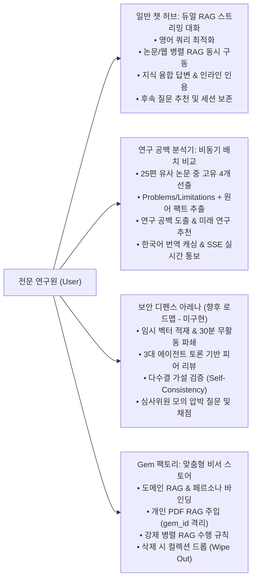
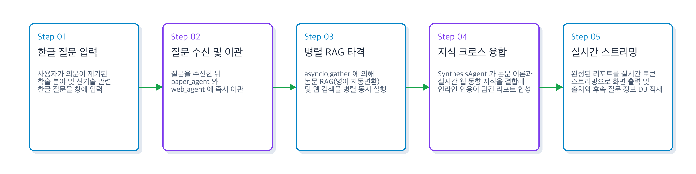
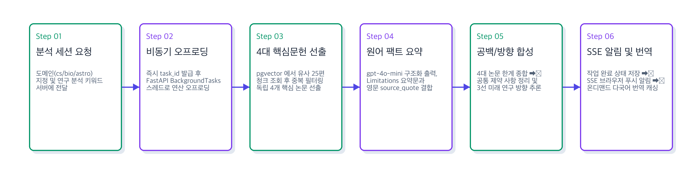
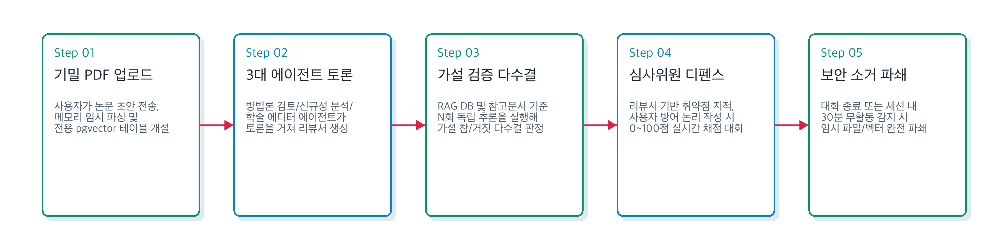
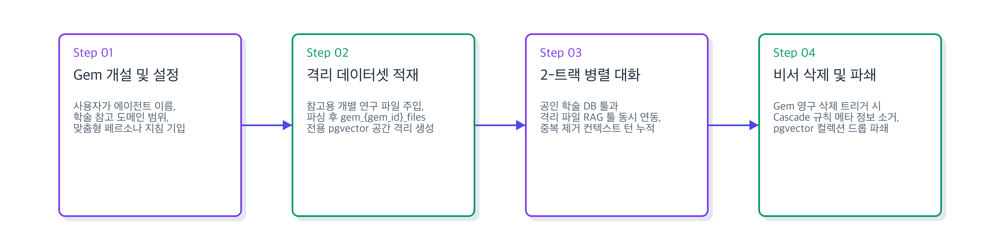

# [4차 산출물] 02. 타겟 사용자 페르소나 및 상세 유스케이스 (Personas & Use Cases)

본 문서는 `bist-mini-2` 플랫폼의 실제 작동 스펙을 기반으로 수립된 **타겟 사용자 페르소나**와 플랫폼이 제공하는 핵심 기능들의 **구체적인 시나리오 기반 상세 유스케이스(Use Cases)**를 정리한 4차 산출물입니다. 구현되지 않고 향후 로드맵으로 연기된 보안 격리 아레나 기능은 `(향후 개발 로드맵)` 표시로 구분하여 기재되었습니다.

---

## 1. 👥 타겟 사용자 페르소나 (Target User Personas)

### 🧑‍🎓 페르소나 1: 박지수 (26세) - "학업 연구 가속이 시급한 석사과정 대학원생"
*   **기본 프로필**: OO대학교 컴퓨터공학과 인공지능 연구실 (석사과정 2년차, 자연어 처리 및 RAG 전공)
*   **행동 패턴**:
    *   매주 학회(ACL, EMNLP 등) 제출을 준비하며, arXiv에서 매일 NLP 및 LLM 멀티 에이전트 신규 논문을 스크리닝함.
    *   주 1회 랩 세미나(Lab Meeting) 발표를 위한 선행 연구 리스트업 및 논문 핵심 방법론 요약 장표를 상시 작성해야 함.
*   **페인 포인트 (Pain Points)**:
    *   **논문 인용 팩트 확인 지연**: 일반 AI 비서가 논문 요약을 그럴듯하게 해주지만, 실제 수치나 특정 실험 조건이 맞는지 확인하기 위해 결국 논문 원본 PDF를 직접 열어 `Ctrl+F`로 대조해야 하는 수고가 빈번함.
    *   **최신 트렌드와 학술 지식의 괴리**: 기존 논문 검색 엔진은 출판된 논문만 찾고, 최근 학계 트위터나 웹에 공개된 최신 LLM 아키처 라이브러리(Triton, vLLM 등)의 상용화 적용 현황은 긁어오지 못함.
*   **주요 사용 기능**:
    *   **일반 챗 허브 (General Chat Hub)**: `paper_node`와 `web_node`가 무조건 병렬로 실행되는 기능을 활용하여, 타겟 신경망 구조의 논문상 원리(Paper RAG)와 깃허브 오픈소스에서의 실시간 최적화 적용기(Web Search)가 결합된 풍부한 마크다운 리포트를 즉시 받아봄.
    *   **인라인 출처 매핑**: 호버 프리뷰 카드로 원본 arXiv 논문 서지 정보와 인용 매칭 비율을 즉각 확인하여 원문 직접 열람 횟수를 1/10로 단축시켰음.

---

### 🧑‍🔬 페르소나 2: 김민우 (39세) - "연구 자산 기밀 관리가 절실한 바이오 테크 책임연구원"
*   **기본 프로필**: 바이오 벤처기업 R&D 센터 (면역 항암제 후보 물질 탐색 프로젝트 리더)
*   **행동 패턴**:
    *   PubMed 및 특허 데이터베이스를 스캔하여 면역 세포 타겟용 후보 물질의 임상 실험 데이터 및 논문들을 정밀 대조.
    *   회사 기밀로 다루어야 하는 신약 유전자 설계 시퀀스 데이터 및 특허 출원 전 단계의 논문 초안(Draft)을 상시 보관 및 검토.
*   **페인 포인트 (Pain Points)**:
    *   **공용 AI 툴 사용 시 데이터 보안 유출**: 사내 기밀 약물 시퀀스를 외부 범용 생성형 AI에 입력하면 정보 노출 우려가 있어, 독립적으로 격리된 전용 RAG 공간 구축이 시급함.
    *   **임상 데이터 팩트체크 결핍**: 생명과학 분야는 미세한 사실 왜곡이 연구 전체를 그르칠 수 있어, 특정 단백질과 유전자 서열에 특화된 개별 연구 문서 관리기가 요구됨.
*   **주요 사용 기능**:
    *   **연구 비서 Gem 팩토리**: 약물 후보군별로 격리된 pgvector 컬렉션을 동적으로 생성해 자사 PDF 연구 노트를 격리 주입함으로써, 사내 기밀 유출 위험 없이 유전자 시퀀스 데이터를 엄밀하게 1:1 RAG 대화로 팩트체크함.
    *   **보안 격리 피어 리뷰 & 디펜스 아레나 - [향후 로드맵 목표 적용]**: 업로드한 기밀 논문 초고에 대한 모의 심사위원 압박 질문을 던지고, 무활동 30분 만료 시 pgvector 임시 컬렉션과 파일을 완전 파쇄(Wipe-Out)하여 유출 위험을 원천 방어하는 보안 기능을 도입할 계획임.

---

### 🧑‍🏫 페르소나 3: 박영지 (31세) - "학회 투고 전 다각도 논리 검증이 필요한 신진 연구원"
*   **기본 프로필**: OO연구원 융합기술센터 박사후연구원 (Post-Doc, 천문물리학 및 우주 탐사 전공)
*   **행동 패턴**:
    *   외계행성 대기 관측 데이터 분석 논문을 작성하여 최상위 저널(Nature Astronomy 등)에 지속적으로 투고.
    *   공동 연구원들과 논문의 신규성과 한계점을 정리하여 매달 새로운 연구 공백(Research Gap)을 찾기 위해 브레인스토밍을 진행함.
*   **페인 포인트 (Pain Points)**:
    *   **연구 공백 수작업 정리 공수**: 특정 외계행성 형성 이론에 관한 수십 편의 논문을 한데 모아 '해결한 문제'와 '한계점'을 일일이 스프레드시트에 기입하고 비어있는 연구 갭을 도출하는 데 며칠이 소요됨.
    *   **다각적 피어 피드백의 부족**: 마감 직전에는 주변 동료 연구원들도 바빠서 방법론적 허점이나 학술적 문체 오류를 꼼꼼하게 검토받기 어려움.
*   **주요 사용 기능**:
    *   **대규모 문헌 비교 및 연구 공백 분석기**: `astro-ph.EP` 카테고리 내 논문 25편을 배치 연산으로 돌려 핵심 4개 문헌의 한계 매트릭스 표를 자동 빌드하고, AI가 도출한 3선 혁신 추천 주제를 받아 새로운 기획서 작성을 즉시 가속화함.
    *   **한글 번역 및 영어 팩트 원본 보존**: 합성 리포트의 한국어 번역 기능을 사용하면서도, 실제 논문 본문의 영문 인용구(`source_quote`)는 변형되지 않은 채 원어로 병기되어 팩트체크의 정확성을 완벽하게 확보함.

---

## 2. 🚦 상세 기능 시나리오 기반 유스케이스 (Use Cases)

---

### [UC-01] 일반 챗 허브: 듀얼 트랙 병렬 RAG 스트리밍 대화

*   **목적**: 사용자가 특정 학술 주제나 기술에 대해 질문했을 때, 신뢰할 수 있는 학술 이론과 최신 시장/오픈소스 동향을 결합한 풍부한 답변을 실시간으로 제공합니다.
*   **주요 행위자**: 전문 연구원 (User)
*   **사전 조건**: 사용자가 인증을 거쳐 대화방(Session)에 입장해 있어야 합니다.
*   **기본 흐름 (Basic Flow)**:
    1. 사용자가 질문(예: "CRISPR-Cas9 기법의 전달 바이러스(AAV) 포장 한계와 최근 동향 알려줘")을 입력합니다.
    2. 질문 수신 시 `paper_agent`와 `web_agent`로 즉시 이관하여 비동기 병렬 검색을 기동하고, `paper_agent` 내부에서 영어 학술 키워드(`"CRISPR-Cas9 AAV packaging limitations"`)로 자율 변환해 pgvector RAG를 타격합니다.
    3. LangGraph 오케스트레이터가 추출된 두 쿼리를 활용하여 `paper_node`와 `web_node`를 무조건적으로 병렬 비동기 가동(`asyncio.gather`)시킵니다.
    4. `paper_node`는 `bio_embeddings` pgvector DB에서 유사 초록 정보를 가져와 `sources`에 누적하고, `web_node`는 Tavily Web Search API를 구동하여 최신 기사 및 웹 내용을 `web_sources`에 누적합니다.
    5. `synthesis_node`가 수집된 두 영역의 지식 풀을 크로스-참조로 정밀 결합하여, 학계의 기본 한계 수치와 최근 연구소들의 새로운 바이러스 포장 돌파구 동향을 융합한 풍부한 마크다운 답변을 토큰 단위로 실시간 방출합니다.
    6. 스트리밍이 완료되면 에이전트는 누적된 논문 출처와 추천 후속 질문을 `chat_sources`, `chat_suggestions` 테이블에 기록하고 세션 커밋을 완료합니다.
*   **예외 흐름 (Alternative Flow)**:
    *   *RAG 데이터셋 내 관련 문헌 미존재 시*: 외부 실시간 웹 검색(`search_web`)에서 얻어온 결과만으로 답변을 합성하고, "관련 논문을 찾지 못했습니다" 문구를 포함하여 정보를 정제해 전달합니다.

### [UC-02] 대규모 문헌 스펙 비교 및 공백(Research Gap) 분석기

*   **목적**: 특정 기술 주제에 대해 수십 편의 논문을 한꺼번에 메타 분석하여, 선행 연구의 Problems/Limitations 비교 표를 도출하고 향후 미개척 연구 영역(Research Gap)에 대응하는 로드맵 제안서를 비동기적으로 완성합니다.
*   **주요 행위자**: 전문 연구원 (User)
*   **사전 조건**: 분석하고자 하는 학술 도메인(`cs`, `bio`, `astronomy`)과 주제 키워드가 정의되어 있어야 합니다.
*   **기본 흐름 (Basic Flow)**:
    1. 사용자가 도메인(예: `"cs"`)과 분석 쿼리(예: `"Retrieval Augmented Generation tuning"`)를 지정하여 분석을 요청합니다.
    2. 서버는 즉시 비동기 분석 세션 고유 키 `task_id`를 발급하고 `PENDING` 상태를 띄운 뒤, FastAPI 백그라운드 큐로 작업을 오프로딩합니다.
    3. 백그라운드 스레드가 가동되면서 진행률을 10%로 업데이트하고 DB에 반영합니다.
    4. pgvector 데이터베이스에서 코사인 유사도가 높은 상위 25개 청크를 긁어오고, arXiv ID 기준 중복을 완벽히 필터링한 뒤 유사도가 가장 우수한 4개의 고유 핵심 논문 본문을 취합합니다. (진행률 40% 업데이트)
    5. OpenAI `gpt-4o-mini` 모델의 구조화 출력(`with_structured_output(PaperAnalysisResult)`) 기능을 연동해 각 논문별로 해결한 과제와 Limitations를 2개씩 추출하고, 요약 근거가 되는 원문의 생생한 영어 문구(`source_quote`)를 토시 하나 변형 없이 1:1 결합해 가져옵니다. (진행률 80% 업데이트)
    6. 수집된 4개 논문의 Limitations 매트릭스 전체를 종합 LLM 프롬프트에 주입하여, 이들이 지니는 공통 한계점(Common Limitations)과 이를 해결할 수 있는 3선 혁신 미래 연구 제안 방향(Suggested Directions)을 합성해 냅니다.
    7. 태스크 상태를 `COMPLETED`로 변경하고 100% 진행률로 결과를 저장하며, 데이터베이스 알림 적재와 동시에 인메모리 SSE 브로드캐스터를 통해 사용자 화면에 실시간 알림 팝업을 푸시 송신합니다.
    8. 사용자가 리포트 조회를 누르면, 영문으로 작성된 리포트를 아카데믹 가이드라인에 입각해 매끄러운 한글로 번역하는 `translate_matrix`가 작동하여 DB에 저장 및 캐싱된 한글 보고서를 보여줍니다. (단, 팩트 확인용 `source_quote` 필드는 영문 그대로 유지)

### [UC-03] 보안 피어 리뷰 및 디펜스 아레나 (향후 개발 로드맵 - 미구현)

*   **목적**: 외부 유출이 절대 안 되는 기밀 연구용 PDF 문서를 임시로 올려 다중 에이전트의 피드백을 받고, 가상의 학회 심사위원 에이전트와 모의 질의응답을 거쳐 논리적 허점을 철저히 자가 디펜스 및 평가합니다.
*   **주요 행위자**: 전문 연구원 (User)
*   **사전 조건**: 사용자가 기밀 논문 PDF 파일을 준비해 두어야 합니다.
*   **기본 흐름 (Basic Flow)**:
    1. 사용자가 PDF 논문을 샌드박스 업로드 API로 전송합니다. 백엔드는 이를 임시 공간에 파싱하고 해당 세션과만 연계된 전용 벡터 인덱스를 pgvector에 일시 생성합니다.
    2. 사용자가 피어 리뷰를 요청하면, LangGraph 기반의 방법론 검토자, 신규성 분석자, 학술 에디터 3대 에이전트가 단체 토론(Debate) 루프를 돌며 가상의 학술지 심사 의견서 형태의 종합 피드백 DTO를 반환합니다.
    3. 사용자가 논문 내 특정 가설(예: "본 알고리즘은 O(N log N)의 메모리 복잡도로 수렴함")을 입력하여 가설 검증을 요청합니다. 에이전트는 RAG DB와 업로드 문서에서 증거를 추출해 N회 독립 추론을 거쳐 다수결 합의(Self-Consistency verdict: SUPPORT or REFUTE)를 내려줍니다.
    4. 사용자가 디펜스 아레나 대화를 켭니다. 심사위원 에이전트는 피어 리뷰 보고서에서 취약했던 방법론이나 한계점을 추적해 "본 논문의 식 (3)에서 학습률 수렴 조건이 불분명한데, 과적합을 막은 증거가 있습니까?"와 같은 압박 질문을 던집니다.
    5. 사용자가 방어 논리를 텍스트로 답하면, 심사위원 에이전트는 방어의 논리성, 수치적 충실도 등을 실시간 채점(0~100점)하고 합격 여부와 피드백을 주며 다음 질문으로 압박 수위를 높여 나갑니다.
    6. 대화 세션이 종료되거나 사용자가 30분 동안 아무런 입력을 주지 않으면, 데몬이 작동하여 PDF 원본 파일 시스템 삭제 및 임시 pgvector 테이블 공간을 흔적 없이 영구 파쇄(Wipe Out)합니다.

### [UC-04] 맞춤형 연구 비서 (Research Gem) 팩토리 & 스토어

*   **목적**: 사용자가 본인이 선호하는 특정 RAG 소스 참조 영역과 전용 페르소나 지침을 조합하여 나만의 독립된 특화 에이전트(Gem)를 만들고, 본인 연구용 PDF를 젬에 영구 주입하여 전용 1:1 RAG 대화를 수행합니다.
*   **주요 행위자**: 전문 연구원 (User)
*   **사전 조건**: 사용자가 지정하려는 에이전트 지침 프롬프트가 있어야 합니다.
*   **기본 흐름 (Basic Flow)**:
    1. 사용자가 에이전트 이름(예: `"천체 대기 분석가"`), 참고할 학술 도메인(예: `["astronomy"]`), 시스템 프롬프트(예: `"당신은 NASA 제트추진연구소 소속 연구원 페르소나로..."`)를 지정하여 Gem 개설을 요청합니다.
    2. 서버는 `gem` 테이블에 신규 UUID 식별자로 젬을 등록합니다.
    3. 사용자가 추가로 참고할 대용량 엑셀/텍스트/PDF 데이터셋 파일들을 주입합니다. 백엔드는 이를 파싱하여 이 Gem만을 위한 격리된 전용 pgvector 컬렉션 `gem_{gem_id}_files`를 동적으로 생성하여 800자 단위 청크로 임베딩을 완벽히 밀어 넣습니다.
    4. 사용자가 Gem 대화방을 열어 대화를 요청하면, 시스템은 RAG 도구(`search_astronomy_papers`)와 이 Gem 고유의 파일 RAG 도구(`search_gem_files` - 클로저로 구현되어 gem_id를 내부 캡처함) 두 개를 에이전트에 탑재합니다.
    5. 에이전트는 시스템 프롬프트에 주입된 강력한 병렬 도구 호출 규칙에 의거하여, 학술 논문 정보와 사용자가 직접 올린 데이터를 병렬로 동시에 매칭 검색해 와서 페르소나에 입각한 답변을 토큰 스트리밍으로 yield 해줍니다.
    6. 사용자가 이 Gem을 삭제하면, 데이터베이스 연쇄 삭제(Cascade)로 인해 관련 메타데이터가 정리되고, 백엔드가 pgvector 컬렉션을 직접 드롭(`adelete_collection()`)하여 임베딩 데이터를 완전 wipe out 처리합니다.
