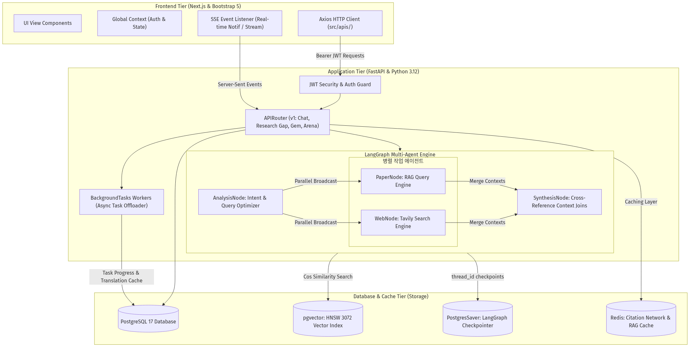
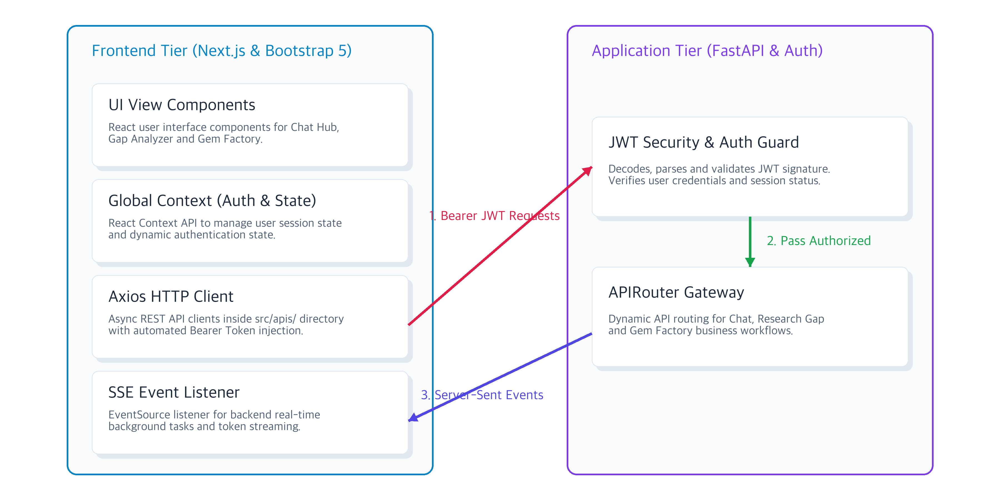
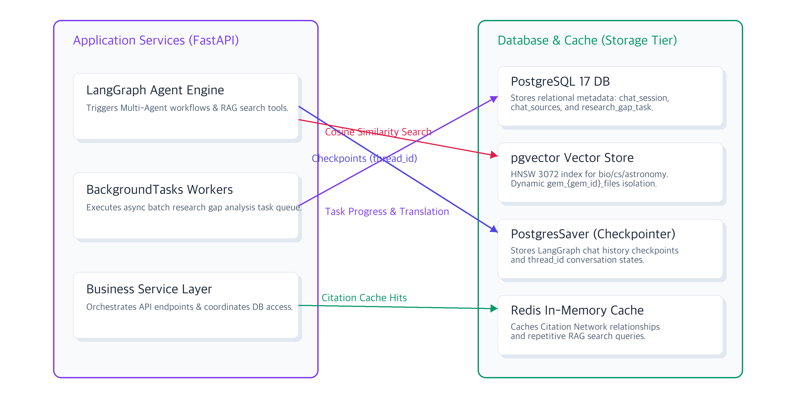
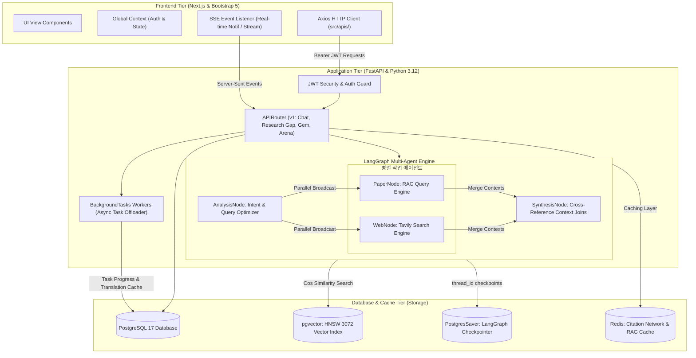

# [4차 산출물] 04. 시스템 아키텍처 및 API 상세 명세서 (System Architecture & API Spec)

본 문서는 `bist-mini-2` 플랫폼의 최종 완성된 **3-Tier 시스템 아키텍처 구성도, 핵심 DB 스키마 설계, LangGraph 병렬 오케스트레이션 흐름, 그리고 실제 REST API 사양**을 정리한 4차 산출물입니다. 구현되지 않고 향후 로드맵으로 남은 디펜스 아레나 및 보안 설계는 `[향후 구축 로드맵 (미구현)]`으로 표시되어 있습니다.

---

## 1. 🏗️ 시스템 아키텍처 (System Architecture)

본 시스템은 기밀 데이터 보호와 대규모 병렬 AI 연산의 과부하를 방지하기 위해 **프론트엔드-애플리케이션-데이터 저장소의 3-Tier 아키텍처**로 완결성 있게 격리 구축되었습니다.

### A. 전체 시스템 아키텍처 구성도


### B. 계층별 상세 아키텍처 다이어그램 (Tiered Deep-Dive)
가독성 개선 및 상세 기능 모니터링을 위해 시스템 아키텍처를 3가지 핵심 계층으로 분할하여 도식화했습니다.

#### 1) Tier 1: Frontend & Authentication
프론트엔드 내의 UI 뷰, 전역 인증 Context 및 Axios API 연동 클라이언트에서부터, 백엔드의 Bearer JWT Security Guard를 통과하는 보안 게이트웨이 흐름을 묘사합니다.


#### 2) Tier 2: LangGraph Multi-Agent Engine
LangGraph 엔진 내부의 인텐트 분석, 듀얼 트랙 병렬 RAG(학술 논문 및 실시간 웹 검색) Concurrent 처리, 그리고 최종 SynthesisNode에서의 크로스오버 조인 융합 워크플로우를 보여줍니다.


#### 3) Tier 3: Database & Cache (Storage Layer)
LangGraph 에이전트의 대화 히스토리 영구 적재(PostgresSaver checkpointer), 유사도 기반 RAG 임베딩(pgvector HNSW), 비동기 배치 작업 상태 보존(PostgreSQL) 및 중복 조회 방지 인메모리 캐싱(Redis)의 데이터 상호작용을 보여줍니다.


### C. 아키텍처 데이터 흐름 제어 (Mermaid 구조)



---

## 2. 🗄️ 데이터베이스 스키마 및 체크포인터 설계

### A. 일반 관계형 테이블 설계

#### 1) `chat_session` (채팅방 세션 마스터)
*   **용도**: 사용자의 채팅방 목록 및 제목 관리
*   **스키마**:
    *   `session_id` (PK, UUID String): 세션 식별자
    *   `member_id` (String 20): 소유 회원
    *   `title` (String 255): 방 제목 (첫 발화 시 에이전트가 요약 자동 생성)
    *   `created_at` (DateTime): 생성 일자

#### 2) `chat_sources` (메시지별 RAG 인용 보존 테이블)
*   **용도**: 채팅 답변 내 인라인 번호(`[1]`, `[2]`)에 맵핑되는 논문 서지 출처를 인덱스 정수와 바인딩하여 복원 및 UI 카드 렌더링에 공급
*   **스키마**:
    *   `source_id` (PK, Serial): 인용 시퀀스
    *   `session_id` (FK): 채팅방 ID
    *   `message_index` (Integer): 메시지 순번 번호 (0-indexed)
    *   `arxiv_id` (String 50): 논문 ID
    *   `title` (String 255): 논문 제목
    *   `summary` (Text): 관련 RAG 청크 요약

#### 3) `research_gap_task` (연구 공백 배치 작업 마스터)
*   **용도**: 비동기 배치 분석 작업 상태 및 최종 보고서 캐싱
*   **스키마**:
    *   `task_id` (PK, UUID String): 배치 세션 ID
    *   `member_id` (String 20): 요청 회원
    *   `domain` (String 50): cs / bio / astronomy 도메인
    *   `query` (Text): 연구 분석 검색어
    *   `status` (String 50): PENDING, RUNNING, COMPLETED, FAILED
    *   `progress` (Integer): $0 \sim 100\%$ 진행률 수치
    *   `result` (JSONB): 최종 완료된 영문 매트릭스 보고서 객체
    *   `translated_result` (JSONB): 한국어로 학술 번역된 보고서 캐시 데이터
    *   `error_message` (Text): 에러 로그 본문

#### 4) `gem` (맞춤형 연구 비서 마스터)
*   **용도**: 사용자 정의 Gem의 메타 지침 및 컬렉션 연동
*   **스키마**:
    *   `gem_id` (PK, UUID String): Gem 고유 키
    *   `member_id` (String 20): 소유 회원
    *   `name` (String 255): 비서 이름
    *   `db_sources` (JSONB): 참조 도메인 배열 (`["cs", "bio"]`)
    *   `system_prompt` (Text): 비서의 고유 페르소나 지침서
    *   `created_at` (DateTime)

#### 5) 보안 디펜스 관련 임시 테이블 설계 - `[향후 구축 로드맵 (미구현)]`
*   `defense_arena_session` (물리 파일 주소 및 세션 상태 매핑)
*   `defense_arena_chunk` (임시 격리 문서용 pgvector 3072차원 청크)
*   `defense_history` (심사위원 질문 및 점수 히스토리 트랙)

### B. pgvector 및 LangGraph Checkpointer 구성
*   **pgvector**: HNSW(Hierarchical Navigable Small World) 인덱스를 탑재하여 코사인 거리 연산 속도를 보장합니다. 생명과학(`bio_embeddings`), CS(`cs_embeddings`), 천문학(`astronomy_embeddings`) 3대 컬렉션과 각 Gem별 개별 파일 임베딩을 격리 보관합니다.
*   **LangGraph Checkpointer**: `AsyncPostgresSaver`를 탑재하여 `checkpoints`, `checkpoint_blobs`, `checkpoint_writes` 테이블을 백엔드 연결 풀에서 자동 관리하며, `thread_id` 이력을 완벽 보존해 세션 유실 없는 다회차 대화를 실시간 복원합니다.

---

## 3. 🔌 API 엔드포인트 상세 명세

### [1. 일반 챗 허브 (General Chat Hub) API]

#### A. 대화방 생성 및 조회
*   **HTTP Method & Path**: `POST /chat/sessions` (생성) / `GET /chat/sessions` (조회)
*   **Request Body (생성)**:
    ```json
    {
      "title": "천체 물리학 궤도 분석"
    }
    ```
*   **Response Body (200 OK - 생성 예시)**:
    ```json
    {
      "status": "success",
      "data": {
        "session_id": "8c7b827e-8c88-4228-94ef-650a256a2bbd",
        "title": "천체 물리학 궤도 분석",
        "created_at": "2026-06-29T11:42:00"
      }
    }
    ```

#### B. 듀얼 트랙 RAG 병렬 스트리밍 전송
*   **HTTP Method & Path**: `POST /chat/sessions/{session_id}/messages/stream`
*   **Request Body**:
    ```json
    {
      "message": "인공신경망 가중치 진화 방식과 최근 웹 동향 알려줘."
    }
    ```
*   **Response Headers**:
    *   `Content-Type: text/event-stream`
    *   `Cache-Control: no-store, no-cache, must-revalidate, max-age=0`
*   **Response Event Stream (JSON Lines)**:
    ```text
    {"type": "status", "data": "paper_search"}
    {"type": "status", "data": "web_search"}
    {"type": "token", "data": "학술적 연구에 따르면, "}
    {"type": "token", "data": "가중치 진화는... [1]."}
    {"type": "route", "data": "parallel_synthesis"}
    ```

#### C. 대화 세션 전체 이력 복원 조회
*   **HTTP Method & Path**: `GET /chat/sessions/{session_id}/messages`
*   **Response Body (200 OK)**:
    ```json
    {
      "status": "success",
      "data": [
        {
          "role": "user",
          "content": "인공신경망 가중치 진화 방식과 최근 웹 동향 알려줘.",
          "sources": [],
          "suggestions": []
        },
        {
          "role": "assistant",
          "content": "학술적 연구에 따르면 가중치 진화는... [1].",
          "sources": [
            {
              "arxiv_id": "cs_2402.123",
              "title": "Evolutionary neural networks overview",
              "summary": "가중치 진화 메커니즘을 규정..."
            }
          ],
          "suggestions": [
            "가중치 진화와 역전파의 결합 모델은 어떤가요?",
            "실시간 가중치 시각화 기법을 알려주세요."
          ]
        }
      ]
    }
    ```

---

### [2. 대규모 문헌 비교 및 Gap 분석기 API]

#### A. 비동기 문헌 분석 배치 요청
*   **HTTP Method & Path**: `POST /research-gap/analyze`
*   **Request Body**:
    ```json
    {
      "domain": "cs",
      "query": "Retrieval Augmented Generation tables parsing"
    }
    ```
*   **Response Body (201 Created)**:
    ```json
    {
      "status": "success",
      "data": {
        "task_id": "gap-task-uuid-4567"
      }
    }
    ```

#### B. 분석 결과 수신 및 온디맨드 한국어 번역 캐시 호출
*   **HTTP Method & Path**: `POST /research-gap/tasks/{task_id}/translate`
*   **Response Body (200 OK)**:
    ```json
    {
      "status": "success",
      "data": {
        "papers": [
          {
            "title": "Tabular RAG optimization",
            "arxiv_id": "2401.9999",
            "problems_solved": [
              {
                "summary": "표 데이터를 마크다운 구조로 선형화하여 정보 가독성 증폭",
                "source_quote": "We linearize nested tables into markdown structures to maximize semantic density."
              }
            ],
            "limitations": [
              {
                "summary": "멀티 페이지에 걸친 대형 테이블 행 단절 시 문맥 조인 누락",
                "source_quote": "However, table row spans across page breaks fail to align with the core metadata."
              }
            ],
            "similarity": 0.7482
          }
        ],
        "common_limitations": [
          "페이지 브레이크 구간에서의 테이블 조인 분실 문제",
          "부모-자식 노드 연계용 포인터 설계 부족"
        ],
        "suggested_directions": [
          "1. 페이지 독립 제어 하이브리드 바인더 설계",
          "2. 동적 형태소 기반 다국어 오버랩 병합 방식 제안"
        ]
      }
    }
    ```

---

### [3. 맞춤형 연구 비서 (Research Gem) 팩토리 API]

#### A. 특화 비서 젬(Gem) 생성 및 마스터 등록
*   **HTTP Method & Path**: `POST /gems`
*   **Request Body**:
    ```json
    {
      "name": "외계행성 기후 시뮬레이터 비서",
      "db_sources": ["astronomy"],
      "system_prompt": "당신은 기후학자 관점에서 외계행성 대기 화학식을 검증하는 차갑고 꼼꼼한 비서입니다."
    }
    ```
*   **Response Body (201 Created)**:
    ```json
    {
      "status": "success",
      "data": {
        "gem_id": "gem-uuid-9999",
        "name": "외계행성 기후 시뮬레이터 비서"
      }
    }
    ```

#### B. 젬 특화 개인 데이터셋 적재
*   **HTTP Method & Path**: `POST /gems/{gem_id}/upload-files`
*   **Request Body**: List of Multipart Files
*   **Response Body (200 OK)**:
    ```json
    {
      "status": "success",
      "data": {
        "gem_id": "gem-uuid-9999",
        "inserted_chunks": 185,
        "status": "SUCCESS"
      }
    }
    ```

---

### [4. 보안 피어 리뷰 및 디펜스 아레나 API] - `[향후 구축 로드맵 (미구현)]`

#### A. 기밀 PDF 업로드 및 격리 인덱싱
*   **HTTP Method & Path**: `POST /defense-arena/upload-isolated`
*   **Request Body**: Multipart Form-data (`file` 파일 객체)
*   **Response Body (201 Created)**:
    ```json
    {
      "status": "success",
      "data": {
        "session_id": "isolated-arena-session-123",
        "file_name": "secured_proposal_draft.pdf",
        "chunk_count": 42
      }
    }
    ```

#### B. 가상 심사위원 디펜스 질의응답
*   **HTTP Method & Path**: `POST /defense-arena/defense/chat`
*   **Request Body**:
    ```json
    {
      "session_id": "isolated-arena-session-123",
      "user_response": "제시하신 수식의 한계는 파라미터 고정으로 인한 것이며, 동적 튜닝 모듈로 극복할 수 있습니다."
    }
    ```
*   **Response Body (200 OK)**:
    ```json
    {
      "status": "success",
      "data": {
        "refutation_question": "동적 튜닝 모듈의 시뮬레이션 복잡도는 실시간 가동이 가능할 정도로 보장됩니까?",
        "score": 87,
        "feedback": "방어 논리가 팩트 지향적이며 이전 수식 보정을 성실히 반영했으나 연산속도 보정이 필요함.",
        "is_finished": false
      }
    }
    ```
