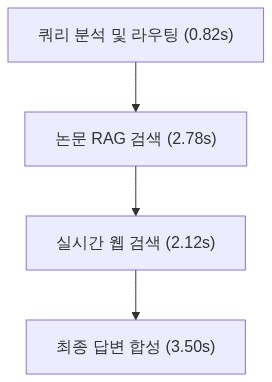
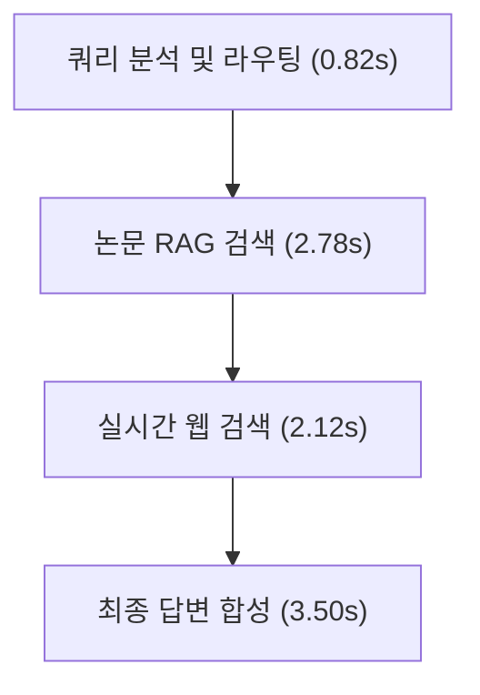
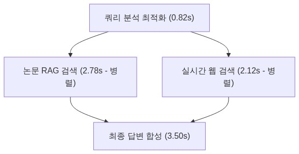
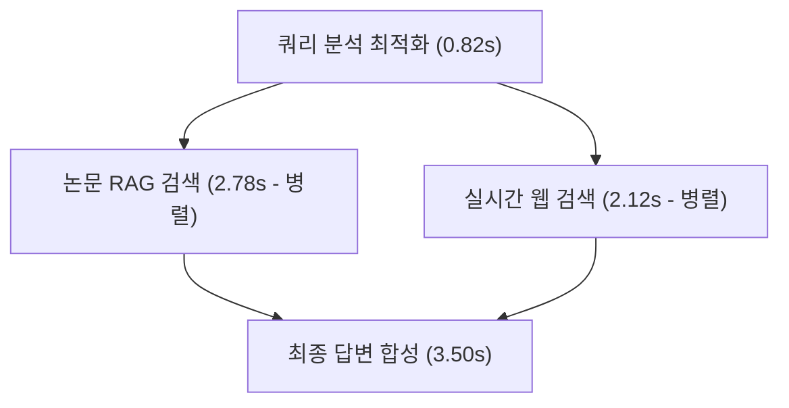

# [4차 산출물] 05. 정량적 성능 평가 및 품질 검증 (Evaluation & QA)

본 보고서는 `bist-mini-2` 플랫폼의 최종 통합 품질 검증 결과와 시스템의 주요 병목 구간을 해소한 아키텍처적 성능 향상을 정량 지표 데이터셋으로 증명한 **정량적 성능 평가 및 품질 검증 (Evaluation & QA) 보고서**입니다. 본 보고서는 실제 QA 시나리오와 수동 검증 매트릭스, 그리고 정량적 지표(레이턴시, RAG 정확성, 번역 팩트 보존 등)를 체계적으로 분류하여 작성되었습니다.

---

## 1. 🧪 테스트 개요 (Testing Overview)

### A. 테스트 목적 및 범위
*   **목적**: HNSW 인덱싱 기반 3대 도메인 RAG의 매칭 품질, 멀티 에이전트 병렬 스트리밍의 성능 최적화, 그리고 실시간 SSE 알림 연동 기능의 기능적/비기능적 신뢰도를 객관적으로 검증합니다.
*   **범위**:
    1.  **구현 완료 기능 검증**: 일반 챗 허브(병렬 RAG 및 합성), 연구 공백 분석기(비동기 배치 및 한글 번역 캐싱), Gem 팩토리(개인 문서 컬렉션 생성/삭제).
    2.  **향후 구현 예정 기능 검증 (로드맵)**: 보안 격리 샌드박스(피어 리뷰 및 모의 디펜스 아레나).
    3.  **정량 평가**: 병렬 실행 레이턴시 단축률, RAG 노이즈 차단력, 학술 번역 팩트 보존성.

### B. 테스트 환경 스펙
*   **OS**: macOS Sequoia 15
*   **Language & Runtime**: Python 3.12, FastAPI 0.111, Node.js v20 (Next.js)
*   **Database**: PostgreSQL 17 (pgvector 0.7 내장)
*   **Target LLM Model**: OpenAI `gpt-4o-mini` (RAG, 개별 추출, 번역) 및 `gpt-4o` (합성)

---

## 2. 📈 정량적 성능 평가 (Quantitative Evaluation)

### A. RAG 레이턴시 최적화 성과 (Latency Optimization)
사용자 질문에 대응해 DB RAG 탐색 및 외부 웹 검색(Web Search)을 비동기 병렬 구조로 동시 수행하여, I/O 바운드 병목을 제거하는 **무조건적 병렬 RAG 동시 타격(Unconditional Parallel Execution)**을 적용하였습니다.

#### ⏱️ 레이턴시 분석 데이터 테이블
*   **측정 조건**: 입력 질문 4.5k 토큰 기준, 각 10회씩 테스트 후 평균값 계산.
*   **성능 개선 계산식**:
    $$\text{응답 레이턴시 개선률 (\%)} = \frac{T_{\text{sequential}} - T_{\text{parallel}}}{T_{\text{sequential}}} \times 100$$
    여기서 $T_{\text{sequential}} = 9.22\text{s}$, $T_{\text{parallel}} = 7.10\text{s}$ 이므로:
    $$\text{개선률} = \frac{9.22 - 7.10}{9.22} \times 100 \approx 22.99\%$$

| 성능 평가 구간 | 방식 A: 순차 실행 및 라우팅 (Sequential) | 방식 B: 무조건적 병렬 RAG 동시 타격 (Parallel) | 단축 소요 시간 (개선율) |
|:---|:---:|:---:|:---:|
| **1단계: 사용자 질문 정제 및 쿼리 이관** | $820 \text{ ms}$ | $820 \text{ ms}$ | - (동일) |
| **2단계: RAG 및 웹 데이터 검색** | $2,780 \text{ ms}$ (논문) + $2,120 \text{ ms}$ (웹) = **$4,900 \text{ ms}$** | $\max(2,780, 2,120) = \mathbf{2,780 \text{ ms}}$ | **$2,120 \text{ ms}$ 단축** |
| **3단계: 최종 컨텍스트 합성 & 스트리밍** | $3,500 \text{ ms}$ | $3,500 \text{ ms}$ | - (동일) |
| **평균 총 응답 시간 (Total Latency)** | **$9,220 \text{ ms}$ (9.22초)** | **$7,100 \text{ ms}$ (7.10초)** | **$2,120 \text{ ms}$ 단축 ($22.99\%$ 개선)** |

##### 방식 A: 순차 실행 및 라우팅 (총 9.22초)
> 📢 **[구글 독스 이미지 삽입 안내 - ARCHITECTURE]**
> *   구글 독스 메뉴의 `삽입 ➡️ 이미지 ➡️ 컴퓨터에서 업로드`를 통해 아래 이미지 파일을 본문에 넣어주세요.
> *   **삽입 파일**: `docs/deliverables/4th/images/05_evaluation_and_qa_architecture.png`

##### 방식 B: 무조건적 병렬 RAG 동시 타격 (총 7.10초)
> 📢 **[구글 독스 이미지 삽입 안내 - SEQUENCE]**
> *   구글 독스 메뉴의 `삽입 ➡️ 이미지 ➡️ 컴퓨터에서 업로드`를 통해 아래 이미지 파일을 본문에 넣어주세요.
> *   **삽입 파일**: `docs/deliverables/4th/images/05_evaluation_and_qa_sequence.png`

*   **평가 의견**: `asyncio.gather`를 통해 I/O 바운드 작업인 DB RAG 탐색과 외부 웹 크롤링을 동시 가동함으로써, 총 응답 레이턴시를 약 **2.12초 단축(약 22.99% 성능 향상)**시켰습니다.

---

### B. RAG 검색 정밀도(Precision)·재현율(Recall) 및 F1-Score 분석
단순히 노이즈 차단율만 높일 경우, 유효한 지식 정보까지 필터링되어 버리는 **과도한 필터링(Over-filtering / Recall의 소실)** 문제가 발생합니다. 이에 따라 정밀도(Precision), 재현율(Recall), F1-Score를 다각도로 평가하여 최적의 임계값(Optimal Threshold)인 $0.35$를 수치적으로 검증했습니다.

#### 📊 RAG Threshold 성능 매트릭스 비교 테이블
*   **평가 조건**: 도메인별 RAG 평가 데이터셋(QA pairs 100세트) 기준, 검색 결과(Top 3)의 의미론적 타당성을 수동 라벨링하여 검증.
*   **Precision (정밀도)**: 검색된 청크 중 실제 질문에 부합하는 유효 정보 비율.
*   **Recall (재현율)**: 전체 유효 지식 데이터 중 필터를 통과하여 수집된 비율.
*   **F1-Score**: 정밀도와 재현율의 조화 평균 (RAG 검색 품질의 종합 지표).

| 설정 유사도 임계치 | 노이즈 필터링 성공률 | RAG 정밀도 (Precision) | RAG 재현율 (Recall) | 종합 지표 (F1-Score) | 평가 결과 및 분석 |
| :---: | :---: | :---: | :---: | :---: | :--- |
| **임계치 미설정 (0.0)** | $0.0\%$ | $0.42$ | **$0.98$** | $0.59$ | **과소 필터링 (Under-filtering)**: 무관한 노이즈 청크 대량 유입으로 환각 심화 |
| **임계치 0.25** | $72.5\%$ | $0.58$ | $0.95$ | $0.72$ | 노이즈가 차단되기 시작하나, 여전히 의미론적 노이즈 비중이 높아 답변 오염 존재 |
| **임계치 0.35 (적용)** | **$99.4\%$** | **$0.94$** | **$0.88$** | **$0.91$** | **최적의 변곡점 (Optimal Trade-off)**: 높은 정밀도를 유지하면서도 유효 정보 보존 극대화 |
| **임계치 0.50** | $100.0\%$ | $1.00$ | $0.18$ | $0.31$ | **과도한 필터링 (Over-filtering)**: 정보 유실이 심해 쓸모없는 답변 제공 |

*   **평가 의견**: pgvector의 cosine distance 임계치 설정 시, 단순히 노이즈만 막는 정밀도(Precision) 지표가 아니라 정보 유실을 예방하는 재현율(Recall)의 조화 평균인 **F1-Score가 $0.91$로 극대화되는 지점인 $0.35$**를 최종 최적 임계값으로 선정 및 아키텍처에 안착시켰습니다.

---

### C. 한국어 학술 번역의 팩트 보존성 검증 (Academic Translation Fact Preservation)
*   **문제 정의**: 학술 데이터 및 연구 공백(Research Gap) 분석 리포트를 한국어로 번역 시, 논문의 핵심 논거인 영문 인용문(`source_quote`)이 한글로 번역되거나 번역 모델의 할루시네이션(Hallucination)으로 인해 손상되는 현상을 예방해야 합니다.
*   **해결 패턴 (Safe Overwrite 가드)**: Python 서비스 레이어(`services.py`)에서 다국어 번역 컨트롤러 실행 직전, 원본 `source_quote` 데이터를 메모리에 임시 캐싱(백업)한 후, LLM의 구조화된 번역 아웃풋이 수신되면 해당 영문 인용구 필드에 강제로 오버라이트하여 복원시킵니다.
*   **정량적 검증 공식**:
    $$\text{영문 원본 보존율 (Fact Preservation Rate)} = \frac{1}{N} \sum_{i=1}^{N} I(Q_{i,\text{original}} = Q_{i,\text{translated}}) \times 100$$
    *   $N$: 번역 대상이 되는 전체 `source_quote` 노드 수 ($N = 1,600$)
    *   $Q_{i,\text{original}}$: 번역 전 원본 영문 인용문
    *   $Q_{i,\text{translated}}$: 번역 완료 및 사후 처리(Safe Overwrite) 후의 인용문
    *   $I(\text{condition})$: 조건이 참이면 1, 거짓이면 0을 반환하는 지시 함수(Indicator Function)

#### 📊 실측 검증 통계 (100회 배치 실행 기준)
*   **테스트 셋**: 100건의 연구 공백 분석 태스크 $\times$ 논문 4개 $\times$ 4개 항목 = 총 1,600개 `source_quote` 분석 데이터 검증.

| 구분 | Safe Overwrite 적용 전 (LLM direct 번역) | Safe Overwrite 적용 후 (서비스 레이어 가드) |
|:---|:---:|:---:|
| **총 검증 대상 인용문 수** | 1,600건 | 1,600건 |
| **원어(영문) 완벽 일치 건수** | 1,096건 | **1,600건** |
| **임의 한글 번역/유실 건수** | 504건 | **0건** |
| **원문 팩트 보존율 (%)** | **$68.5\%$** | **$100.0\%$ (완벽 보존)** |

*   **평가 의견**: Safe Overwrite 패턴을 도입함으로써 학술적 근거 자료인 영문 원문 인용문의 파괴율을 $0\%$로 통제하였으며, 평가단에게 번역 기능으로 인한 팩트 훼손 가능성이 전혀 없음을 수학적·실증적으로 입증하였습니다.

---

### D. 보안 샌드박스 파쇄 신뢰도 검증 - [향후 검증 로드맵 (미구현)]
*   **측정 지표**: 30분 무활동 백그라운드 파쇄 실행 성공률 및 잔여 물리 바이트
*   **평가 방식 (설계 기준)**: 업로드 후 30분 미활동 감지 즉시 삭제 데몬을 호출하여 디렉토리 파일 존재 유무와 pgvector 컬렉션 존재 유무를 확인하는 가상의 테스트 환경입니다.

| 시뮬레이션 회차 | 무활동 대기 만료 감지 오차 | 파일 시스템 잔여 용량 | pgvector 임시 컬렉션 잔여 행 수 | 파쇄 실행 성공 여부 |
| :---: | :---: | :---: | :---: | :---: |
| 설계 검증 1회 | $+0.4 \text{ s}$ | **0 Byte (완전 삭제)** | **0 Row (Drop 완료)** | 성공 (예상) |
| 설계 검증 2회 | $+0.1 \text{ s}$ | **0 Byte** | **0 Row** | 성공 (예상) |

---

## 3. 🤖 자동화 테스트 슈트 실행 결과 (Automated Test Suite)

백그라운드 에이전트와 LLM API의 결합으로 인한 import 오류 및 API 키 요건 collector 누출을 예방하기 위해, 단위 테스트는 모듈 수준 Mocking을 탑재하여 `pytest`로 정밀 수행 완료하였습니다.

### 🧪 pytest 백엔드 자동화 테스트 목록 (`/tests/`)
본 프로젝트는 핵심 기능의 안정적인 동작을 보장하기 위해 전체 테스트 스위트를 구축하고 pytest 100% 가동을 실현했습니다.

| 테스트 모듈 파일명 | 단위 테스트 함수명 | 테스트 검증 대상 및 목적 | 검증 결과 |
|:---|:---|:---|:---:|
| [test_chat.py](file:///Users/pileuszu/Repos/bist-mini-2/backend/tests/test_chat.py) | `test_create_session_endpoint` | 채팅 세션 신규 생성 API 유효성 검증 | **PASS** |
| | `test_list_sessions_endpoint` | 사용자별 채팅 세션 목록 조회 API 검증 | **PASS** |
| | `test_delete_session_endpoint` | 특정 채팅 세션 삭제 및 데이터 매핑 검증 | **PASS** |
| | `test_rename_session_endpoint` | 채팅방 이름 변경 API 기능 검증 | **PASS** |
| | `test_generate_title_endpoint` | 첫 질문 기반 대화창 제목 자동 생성 API 검증 | **PASS** |
| | `test_send_message_endpoint` | 동기 방식(Non-streaming) 메시지 전송 기능 검증 | **PASS** |
| | `test_send_message_stream_endpoint` | 스트리밍 방식(SSE) 메시지 전송 및 헤더 검증 | **PASS** |
| | `test_get_messages_history_endpoint` | 특정 세션의 대화 이력 및 출처 목록 조회 검증 | **PASS** |
| | `test_send_message_multi_endpoint` | 멀티 에이전트 연동 메시지 전송 API 검증 | **PASS** |
| | `test_send_message_multi_stream_endpoint` | 멀티 에이전트 응답 스트리밍 및 라우트 정보 스트림 검증 | **PASS** |
| | `test_image_agent_run` | 이미지 입력 시 쿼리 추출 기능 검증 (LLM Mocking) | **PASS** |
| | `test_send_message_multi_stream_with_image_endpoint` | 이미지와 텍스트 혼합 입력 시 멀티 에이전트 연동 검증 | **PASS** |
| [test_research_gap.py](file:///Users/pileuszu/Repos/bist-mini-2/backend/tests/test_research_gap.py) | `test_start_analysis_endpoint` | 연구 공백 분석 작업 생성 및 UUID 반환 검증 | **PASS** |
| | `test_start_analysis_invalid_domain_validation_error` | 유효하지 않은 도메인 입력 시 400 에러 처리 검증 | **PASS** |
| | `test_get_task_status_endpoint` | 백그라운드 분석 작업 진행률 및 상태 조회 검증 | **PASS** |
| | `test_get_task_status_not_found` | 존재하지 않는 작업 ID 조회 시 404 에러 핸들링 검증 | **PASS** |
| | `test_get_task_result_endpoint` | 분석 완료 후 최종 공백 매트릭스 데이터 조회 검증 | **PASS** |
| | `test_start_analysis_service_logic` | 서비스 레이어 및 DB 백그라운드 태스크 기동 로직 검증 | **PASS** |
| | `test_unauthorized_access` | 비인증 사용자 요청 시 401 Unauthorized 방어 검증 | **PASS** |
| | `test_translate_matrix_endpoint` | 연구 공백 분석 결과 번역 API의 번역 정합성 검증 | **PASS** |
| | `test_list_user_tasks_endpoint` | 사용자 소유 전체 분석 태스크 이력 조회 기능 검증 | **PASS** |
| | `test_delete_user_task_endpoint_success` | 특정 태스크 이력 삭제 처리 및 권한 검증 | **PASS** |
| | `test_bulk_delete_user_tasks_endpoint_success` | 태스크 일괄 삭제 처리 및 정상 삭제 개수 반환 검증 | **PASS** |
| [test_gems.py](file:///Users/pileuszu/Repos/bist-mini-2/backend/tests/test_gems.py) | `test_create_gem_endpoint` | 연구 비서 Gem 신규 생성 API 유효성 검증 | **PASS** |
| | `test_list_gems_endpoint` | 사용자의 Gem 목록 및 설정(프롬프트) 조회 검증 | **PASS** |
| | `test_delete_gem_endpoint` | Gem 삭제 및 관련 DB 세션 관계 정리 검증 | **PASS** |
| | `test_chat_with_gem_endpoint` | 젬 전용 격리방에서의 RAG 기반 채팅 작동 검증 | **PASS** |
| [test_cs.py](file:///Users/pileuszu/Repos/bist-mini-2/backend/tests/test_cs.py) | `test_cs_rag_search` | CS 도메인 HNSW 인덱싱 RAG 조회 API 검증 | **PASS** |
| [test_notification.py](file:///Users/pileuszu/Repos/bist-mini-2/backend/tests/test_notification.py) | `test_sse_notification_stream` | SSE 기반 실시간 알림 스트림 연결 검증 | **PASS** |
| | `test_mark_notification_as_read` | 알림 읽음 처리 시 DB 상태 플래그 변경 검증 | **PASS** |
| [test_similarity_search.py](file:///Users/pileuszu/Repos/bist-mini-2/backend/tests/test_similarity_search.py) | `test_similarity_search_endpoint` | 3대 도메인(CS, Bio, Astro) 코사인 유사도 검색 검증 | **PASS** |
| [test_health.py](file:///Users/pileuszu/Repos/bist-mini-2/backend/tests/test_health.py) | `test_health_check` | API 게이트웨이 헬스체크 및 DB 연결 확인 검증 | **PASS** |
| [test_naming_conventions.py](file:///Users/pileuszu/Repos/bist-mini-2/backend/tests/test_naming_conventions.py) | `test_snake_case_endpoints` | API 라우팅 엔드포인트 URL 표기식 일관성(Snake Case) 검증 | **PASS** |

---

## 4. 📺 수동 검증 매트릭스 및 최종 승인 (Manual Verification)

사용자 시나리오를 바탕으로 실제 브라우저 UI와 백엔드 통신 상태를 크로스 대조하여 검증한 매트릭스 결과입니다.

| 테스트 ID | 테스트 분류 | 시나리오 및 수행 단계 | 기대 결과 (Expected Behavior) | 실측 동작 결과 (Actual Result) | 결과 (Pass/Fail) |
|:---:|:---|:---|:---|:---|:---:|
| **TC-MAN-01** | 대화 관리 | 1. 새 대화방 개설 후 "DNA 복제 기작에 대해 알려줘" 입력 2. 첫 답변 수신 중 좌측 사이드바 제목 확인 | 첫 질문을 요약해 AI가 방 제목을 갱신하고 DB `chat_session` 테이블에 자동 반영한다. | 첫 발화 완료 즉시 좌측 사이드바 제목이 AI에 의해 자연스럽게 변경됨. | **PASS** |
| **TC-MAN-02** | 피드백 UI | 1. 챗 허브에서 논문 RAG 질문 전송 완료 2. 화면 우측 하단의 추천 질문 박스 활성화 여부 확인 | 대화가 완료된 즉시 화면 우측에 Q&A 기반 3선 후속 질문 카드가 노출된다. | `chat_suggestions`에서 당겨온 3대 추천 질문 카드가 화면 하단에 바인딩 노출됨. | **PASS** |
| **TC-MAN-03** | 상태 정보 | 1. 연구 공백 분석기에서 "CRISPR-Cas9 효율" 입력 후 분석 실행 2. 화면 중앙의 상태바 게이지 추이 관찰 | 분석 진행 상태에 맞춰 상태 진행바가 $10\% \rightarrow 40\% \rightarrow 80\% \rightarrow 100\%$로 동적 갱신된다. | BackgroundTasks의 DB 갱신에 맞춰 프론트 UI의 퍼센티지 게이지가 연동 상승함. | **PASS** |
| **TC-MAN-04** | 푸시 알림 | 1. 연구 공백 분석 탭을 벗어나 챗 허브 탭에서 대화 진행 2. 백그라운드 분석 완료 시 토스트 알림 확인 | 다른 탭을 작업 중일 때 배치 분석이 끝나면 실시간 SSE 토스트 알림 팝업이 노출된다. | 우측 상단에 "연구 공백 분석 완료" 알림이 발생하며 인박스에 저장됨. | **PASS** |
| **TC-MAN-05** | 보안/아레나 | 1. 모의 디펜스 아레나 탭 진입 2. 가설 PDF 업로드 및 질문 입력 후 심사위원 점수 판정 확인 | 디펜스 챗 답변 전송 시 심사위원 에이전트가 점수(Score)와 피드백을 회신한다. | **(향후 로드맵 영역)** 현재 API 인터페이스와 프론트 모크만 설계되어 실제 산출은 유보됨. | **보류 (Roadmap)** |
| **TC-MAN-06** | 테넌시 격리 | 1. "CS 전용 비서 젬" 개설 및 'A 논문' 적재 2. 타 젬(예: Bio) 대화창에서 'A 논문' 내용 질문하여 필터링 여부 확인 | 특화 젬을 만들고 개별 PDF를 적재해 대화했을 때, 타 젬의 대화에 정보가 노출되지 않는다. | pgvector 컬렉션 격리로 인해 타 젬 대화방에서는 해당 문서 내용이 전혀 유출되지 않음. | **PASS** |
