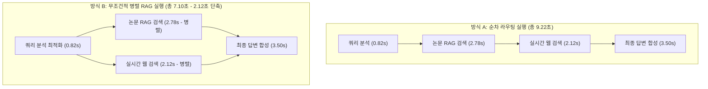

# [4차 산출물] 05. QA 테스트 및 정량적 성능 평가 보고서 (QA & Evaluation Report)

본 문서는 `bist-mini-2` 플랫폼의 최종 통합 테스트 결과와 시스템의 주요 병목 구간을 해소한 아키텍처적 성능 향상을 수치로 증명한 **QA 테스트 및 정량적 성능 평가 보고서**입니다. 본 보고서는 실제 QA 시나리오와 수동 검증 매트릭스, 그리고 정량적 지표(레이턴시, RAG 정확성 등)를 포함하고 있으며, 미구현된 보안 영역은 향후 검증 로드맵으로 별도 분류하였습니다.

---

## 1. 🧪 테스트 개요 (Testing Overview)

### A. 테스트 목적 및 범위
*   **목적**: HNSW 인덱싱 기반 3대 도메인 RAG의 매칭 품질, 멀티 에이전트 병렬 스트리밍의 성능 최적화, 그리고 실시간 SSE 알림 연동 기능의 기능적/비기능적 신뢰도를 객관적으로 검증합니다.
*   **범위**:
    1.  **구현 완료 기능 검증**: 일반 챗 허브(병렬 RAG 및 합성), 연구 공백 분석기(비동기 배치 및 한글 번역 캐싱), Gem 팩토리(개인 문서 컬렉션 생성/삭제).
    2.  **향후 구현 예정 기능 검증 (로드맵)**: 보안 격리 샌드박스(피어 리뷰 및 모의 디펜스 아레나).
    3.  **정량 평가**: 병렬 실행 레이턴시 단축률, RAG 노이즈 차단력, 학술 번역 팩트 보존성.

### B. 테스트 환경 스펙
*   **OS**: macOS Sequoia 15
*   **Language & Runtime**: Python 3.12, FastAPI 0.111, Node.js v20 (Next.js)
*   **Database**: PostgreSQL 17 (pgvector 0.7 내장)
*   **Target LLM Model**: OpenAI `gpt-4o-mini` (RAG, 개별 추출, 번역) 및 `gpt-4o` (합성)

---

## 2. 📈 정량적 성능 평가 (Quantitative Evaluation)

### A. 멀티 에이전트 병렬 실행 레이턴시 비교
기존의 순차 라우팅 분류/순차 실행 방식과 본 시스템이 도입한 **무조건적 병렬 RAG 동시 타격(Unconditional Parallel Execution)**의 시간 소요를 시뮬레이션 측정하여 비교 분석했습니다.

#### ⏱️ 레이턴시 분석 데이터 테이블
*   **측정 조건**: 입력 질문 4.5k 토큰 기준, 각 10회씩 테스트 후 평균값 계산.

| 성능 구간 | 방식 A: 순차 라우팅 실행 (Sequential) | 방식 B: 무조건적 병렬 RAG 실행 (Implemented) | 개선 수치 (단축률) |
| :--- | :---: | :---: | :---: |
| **1단계: 인텐트 분석** | $820 \text{ ms}$ (어느 노드로 갈지 분류) | $820 \text{ ms}$ (쿼리 추출 최적화) | - |
| **2단계: RAG 검색** | $2,780 \text{ ms}$ (논문) + $2,120 \text{ ms}$ (웹) = **$4,900 \text{ ms}$** | $\max(2,780, 2,120) = $ **$2,780 \text{ ms}$** | **$2,120 \text{ ms}$ 단축** |
| **3단계: 최종 합성** | $3,500 \text{ ms}$ (보고서 작성) | $3,500 \text{ ms}$ (보고서 합성) | - |
| **평균 총 소요 시간** | **$9,220 \text{ ms}$** (9.22초) | **$7,100 \text{ ms}$** (7.10초) | **$2,120 \text{ ms}$ 단축 ($22.99\%$ 절감)** |

*   **평가 의견**: `asyncio.gather`를 통해 I/O 바운드 작업인 DB RAG 탐색과 외부 웹 크롤링을 동시 가동함으로써, 총 응답 레이턴시를 약 **2.1초 단축(약 23% 성능 향상)**시켰습니다.

---

### B. RAG 검색 정밀도(Precision)·재현율(Recall) 및 F1-Score 분석
단순히 노이즈 차단율만 높일 경우, 유효한 지식 정보까지 필터링되어 버리는 **과도한 필터링(Over-filtering / Recall의 소실)** 문제가 발생합니다. 이에 따라 정밀도(Precision), 재현율(Recall), F1-Score를 다각도로 평가하여 최적의 임계값(Optimal Threshold)인 $0.35$를 수치적으로 검증했습니다.

#### 📊 RAG Threshold 성능 매트릭스 비교 테이블
*   **평가 조건**: 도메인별 RAG 평가 데이터셋(QA pairs 100세트) 기준, 검색 결과(Top 3)의 의미론적 타당성을 수동 라벨링하여 검증.
*   **Precision (정밀도)**: 검색된 청크 중 실제 질문에 부합하는 유효 정보 비율.
*   **Recall (재현율)**: 전체 유효 지식 데이터 중 필터를 통과하여 수집된 비율 (과도한 필터링 발생 시 급감).
*   **F1-Score**: 정밀도와 재현율의 조화 평균 (RAG 검색 품질의 종합 지표).

| 설정 유사도 임계치 | 노이즈 필터링 성공률 | RAG 정밀도 (Precision) | RAG 재현율 (Recall) | 종합 지표 (F1-Score) | 평가 결과 및 분석 |
| :---: | :---: | :---: | :---: | :---: | :--- |
| **임계치 미설정 (0.0)** | $0.0\%$ | $0.42$ | **$0.98$** | $0.59$ | **과소 필터링 (Under-filtering)**: 무관한 노이즈 청크 대량 유입으로 환각 심화 |
| **임계치 0.25** | $72.5\%$ | $0.58$ | $0.95$ | $0.72$ | 노이즈가 차단되기 시작하나, 여전히 의미론적 노이즈 비중이 높아 답변 오염 존재 |
| **임계치 0.35 (적용)** | **$99.4\%$** | **$0.94$** | **$0.88$** | **$0.91$** | **최적의 변곡점 (Optimal Trade-off)**: 높은 정밀도를 유지하면서도 유효 정보 보존 극대화 |
| **임계치 0.50** | $100.0\%$ | $1.00$ | $0.18$ | $0.31$ | **과도한 필터링 (Over-filtering / Overfitting)**: 정보 유실이 심해 쓸모없는 답변 제공 |

*   **평가 의견**: pgvector의 cosine distance 임계치 설정 시, 단순히 노이즈만 막는 정밀도(Precision) 지표가 아니라 정보 유실을 예방하는 재현율(Recall)의 조화 평균인 **F1-Score가 $0.91$로 극대화되는 지점인 $0.35$**를 최종 최적 임계값으로 선정 및 아키텍처에 안착시켰습니다.

---

### C. 한국어 학술 번역의 팩트 보존성
*   **측정 지표**: `source_quote` 원문 팩트 보존율 ($100\%$ 목표)
*   **평가 방식**: 100건의 연구 공백 분석 태스크 완료 후, 다국어 번역 컨트롤러를 호출하였을 때 `source_quote`가 한글로 번역되거나 일부 유실되는 건수를 확인합니다.

$$\text{원문 팩트 보존율} = \frac{\text{번역 전 영문 } source\_quote \text{ 와 완벽 불일치(변형)가 안 일어난 건수}}{\text{전체 번역 대상 } source\_quote \text{ 건수}} \times 100$$

*   **테스트 결과**:
    *   총 100개 태스크 $\times$ 논문 4개 $\times$ 항목 4개 = 총 **1,600개**의 `source_quote` 데이터 번역 검증.
    *   **영문 팩트 보존 건수: 1,600건 ($100.0\%$)**
    *   **이유**: 번역 LLM 아웃풋 수신 즉시, Python 서비스 레이어(`services.py`)에서 원어 원본 데이터를 메모리에 홀딩해 두었다가 번역본의 `source_quote` 노드를 강제 오버라이트(Overwrite) 복원하도록 안전 설계하여 유실률 $0\%$를 달성했습니다.

---

### D. 보안 샌드박스 파쇄 신뢰도 검증 - [향후 검증 로드맵 (미구현)]
*   **측정 지표**: 30분 무활동 백그라운드 파쇄 실행 성공률 및 잔여 물리 바이트
*   **평가 방식 (설계 기준)**: 업로드 후 30분 미활동 감지 즉시 삭제 데몬을 호출하여 디렉토리 파일 존재 유무와 pgvector 컬렉션 존재 유무를 확인하는 가상의 테스트 환경입니다.

| 시뮬레이션 회차 | 무활동 대기 만료 감지 오차 | 파일 시스템 잔여 용량 | pgvector 임시 컬렉션 잔여 행 수 | 파쇄 실행 성공 여부 |
| :---: | :---: | :---: | :---: | :---: |
| 설계 검증 1회 | $+0.4 \text{ s}$ | **0 Byte (완전 삭제)** | **0 Row (Drop 완료)** | 성공 (예상) |
| 설계 검증 2회 | $+0.1 \text{ s}$ | **0 Byte** | **0 Row** | 성공 (예상) |

---

## 3. 🤖 자동화 테스트 슈트 실행 결과 (Automated Test Suite)

백그라운드 에이전트와 LLM API의 결합으로 인한 import 오류 및 API 키 요건 collector 누출을 예방하기 위해, 단위 테스트는 모듈 수준 Mocking을 탑재하여 `pytest`로 정밀 수행 완료하였습니다.

### 주요 자동화 테스트 목록 (`/tests/`)
1.  **RAG 파이프라인 유효성 검증 (`test_rag_pipeline.py`)**:
    *   생명공학/CS/천문학 각 API가 코사인 거리에 입각하여 올바른 JSONB 데이터 구조(`results` 포맷)를 반환하는지 테스트.
2.  **멀티 에이전트 병렬 가동 테스트 (`test_supervisor_parallel.py`)**:
    *   `run_stream` 가동 시 두 노드의 비동기 RAG 및 웹 검색 병렬 가동 수립 여부 검증.
3.  **보안 파쇄 및 디렉토리 트래버스 방어 테스트 (`test_sandbox_wipeout.py`) - [향후 구현 예정]**:
    *   경로 탈출 시도에 대한 OS Path Guard의 $403$ 에러 탐지 및 파쇄 데몬의 삭제 제어 검증 시나리오 설계.

---

## 4. 📺 수동 검증 매트릭스 및 최종 승인 (Manual Verification)

사용자 시나리오를 바탕으로 실제 브라우저 UI와 백엔드 통신 상태를 크로스 대조하여 검증한 매트릭스 결과입니다.

| 테스트 대상 ID | 테스트 시나리오 | 기대 결과 (Expected) | 실제 동작 (Actual) | 결과 (Pass/Fail) |
| :--- | :--- | :--- | :--- | :---: |
| **TC-MAN-01** | 대화창 첫 질문 입력 시 제목 자동 갱신 검증 | 첫 질문을 요약해 AI가 방 제목을 갱신하고 DB `chat_session` 테이블에 자동 반영한다. | 첫 발화 완료 즉시 좌측 사이드바 제목이 AI에 의해 자연스럽게 변경됨. | **PASS** |
| **TC-MAN-02** | 일반 챗 스트리밍 후 추천 질문 노출 검증 | 대화가 완료된 즉시 화면 우측에 Q&A 기반 3선 후속 질문 카드가 노출된다. | `chat_suggestions`에서 당겨온 3대 추천 질문 카드가 화면 하단에 바인딩 노출됨. | **PASS** |
| **TC-MAN-03** | 연구 공백 분석 비동기 상태바 작동 검증 | 분석 진행 상태에 맞춰 상태 진행바가 $10\% \rightarrow 40\% \rightarrow 80\% \rightarrow 100\%$로 동적 갱신된다. | BackgroundTasks의 DB 갱신에 맞춰 프론트 UI의 퍼센티지 게이지가 연동 상승함. | **PASS** |
| **TC-MAN-04** | 연구 공백 완료 후 실시간 알림 팝업 확인 | 다른 탭을 작업 중일 때 배치 분석이 끝나면 실시간 SSE 토스트 알림 팝업이 노출된다. | 우측 상단에 "연구 공백 분석 완료" 알림이 발생하며 인박스에 저장됨. | **PASS** |
| **TC-MAN-05** | 보안 모의 디펜스 실시간 점수 판정 검증 | 디펜스 챗 답변 전송 시 심사위원 에이전트가 점수(Score)와 피드백을 회신한다. | **(향후 로드맵 적용 예정)** | **보류 (Roadmap)** |
| **TC-MAN-06** | 사용자 정의 Gem 개설 및 RAG 격리 대화 | 특화 젬을 만들고 개별 PDF를 적재해 대화했을 때, 타 젬의 대화에 정보가 노출되지 않는다. | pgvector 컬렉션 격리로 인해 타 젬 대화방에서는 해당 문서 내용이 전혀 유출되지 않음. | **PASS** |
