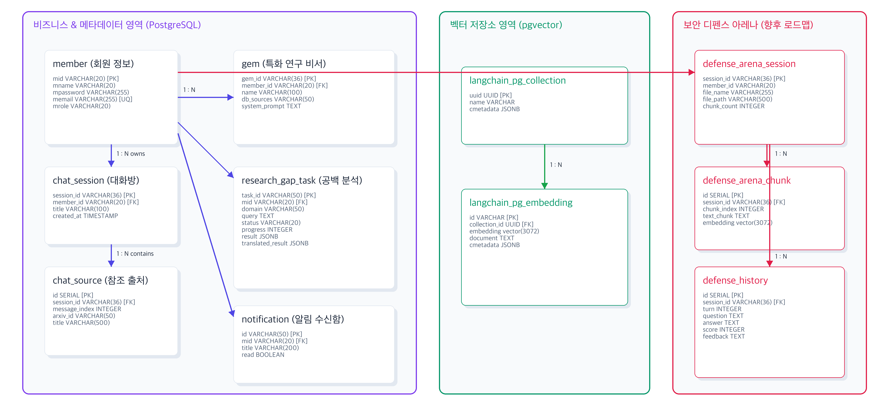

# 4. 데이터베이스 설계 및 대용량 데이터 관리

본 플랫폼은 고성능 학술 RAG 검색의 신뢰성을 보장하기 위해 관계형 메타데이터의 영속성과 고차원 벡터 임베딩 검색의 효율성을 결합한 **하이브리드 데이터베이스 아키텍처**를 채택했습니다. 

---

### 4-1. 데이터베이스 ERD 및 관계 구조

시스템의 핵심 관계형 테이블(회원, 채팅 세션, 인용 출처, 특화 비서 젬, 비동기 분석 작업)과 LangChain pgvector 표준 임베딩 스키마의 상호 참조 관계를 구조화한 물리 ERD 다이어그램입니다.



#### 핵심 테이블 맵핑 전략 및 물리적 인덱싱 최적화
1.  **LangChain PGVector 표준 규격 수용**: 
    *   3대 학술 분야의 임베딩 데이터는 `langchain_pg_collection` 및 `langchain_pg_embedding` 테이블로 이원화 관리합니다.
    *   각 도메인(cs, bio, astronomy) 및 사용자 정의 Gem 파일 컬렉션들은 `collection_id` 외래키를 통해 물리적으로 격리되어 RAG 수행 시 불필요한 스캔 범위를 최소화합니다.
2.  **HNSW (Hierarchical Navigable Small World) 인덱스 적용**:
    *   3072차원의 초고차원 벡터 검색 속도를 비약적으로 향상시키고 인덱스 탐색 성능을 보장하기 위해, 코사인 유사도 연산 기반 HNSW 인덱스를 생성했습니다.
    *   **물리 DDL 설정**:
        ```sql
        CREATE INDEX idx_langchain_pg_embedding_hnsw 
        ON langchain_pg_embedding USING hnsw (embedding vector_cosine_ops) 
        WITH (m = 16, ef_construction = 64);
        ```

---

### 4-2. 대용량 ArXiv 데이터셋 분석 (EDA)

본 플랫폼은 고가치 학술 도메인 지식을 정밀 수용하고자, 약 200만 편 이상의 학술 논문 메타데이터를 포함하는 Kaggle의 **ArXiv Dataset (`arxiv-metadata-oai-snapshot.json`)**을 분석 및 가공하여 RAG 인프라의 기초 지식으로 통합했습니다.

#### 1) 3대 타겟 도메인 카테고리 필터링 및 적재 현황
전체 데이터셋 중 플랫폼 비즈니스 목적에 부합하는 IT 신기술(CS), 천문과학(Astronomy), 백신 및 유전체(Bio) 분야에 대응하는 고유 학술 카테고리를 추출하여 **총 106,974건**의 대용량 논문 데이터를 최종 데이터베이스에 안착시켰습니다.

| 학술 도메인 구분 | 대상 DB 컬렉션명 | 최종 적재 건수 | 적재 카테고리 코드 체계 및 상세 범위 |
| :--- | :--- | :---: | :--- |
| **컴퓨터 과학 (CS)** | `cs_embeddings` | **17,825 건** | `cs.NE` (Neural and Evolutionary Computing) 전체 범위 |
| **천문학 (Astronomy)** | `astronomy_embeddings` | **35,083 건** | `astro-ph.EP` (Earth and Planetary Astrophysics) 전체 범위 |
| **생명공학 (Bio)** | `bio_embeddings` | **54,066 건** | `q-bio.GN` (Genomics) 및 주요 유전공학 서브 카테고리 일체 |
| **합계** | - | **106,974 건** | **3대 도메인 타겟 핵심 학술 문헌 전체 적재 완료** |

#### 2) RAG 데이터 전처리 및 텍스트 청킹 규격
*   **지식 구성**: RAG 파이프라인의 유사도 비교 정확도를 극대화하고 검색 텍스트 분절 시 발생하는 문맥 손실(Context Loss)을 원천 방어하기 위해, 논문의 **제목(Title)**과 **초록(Abstract)**을 아래 형태로 결합하여 단일 문서(Document)로 적재했습니다.
    ```text
    Title: [논문 제목]

    Abstract: [초록 본문]
    ```
*   **단일 벡터 청킹 정책**: 학술 정보의 엄밀함을 보존하기 위해 논문 초록은 인위적인 중도 분할을 거치지 않고, 각 논문의 초록 전체를 단일 임베딩 벡터로 일괄 업로드하여 1:1 대응 관리를 수행합니다.
*   **임베딩 벡터 스펙**: OpenAI의 최신 임베딩 모델인 `text-embedding-3-large`를 적용하여 3,072차원의 고밀도 벡터 데이터를 생성 및 pgvector 물리 레코드에 맵핑했습니다.
