# [4차 산출물] 06. ArXiv 데이터셋 EDA 및 PostgreSQL/pgvector 스키마 설계서 (Dataset EDA & DB Schema Design)

본 문서는 `bist-mini-2` 플랫폼의 대용량 RAG 및 사용자 정의 비서(Gem)의 기반이 되는 **Kaggle ArXiv 논문 메타데이터셋**의 탐색적 데이터 분석(EDA) 결과와 이를 영구 적재/제어하기 위해 최종 구현 완료된 PostgreSQL 17 및 pgvector 물리 데이터베이스 스키마 설계서입니다. 보안 디펜스 관련 구조는 향후 로드맵으로 분류되어 있습니다.

---

## 1. 🔍 Kaggle ArXiv 데이터셋 탐색적 데이터 분석 (Dataset EDA)

본 플랫폼은 고가치 학술 데이터를 실시간으로 조회하고 인용 출처로 변환하기 위해 약 200만 편 이상의 학술 논문 메타데이터를 포함하는 Kaggle의 **ArXiv Dataset (`arxiv-metadata-oai-snapshot.json`)**을 기반 데이터로 채택했습니다.

### 1.1 데이터셋 필드 명세 및 가공 전략
원본 JSON 라인 포맷 파일의 각 논문 데이터를 파싱하여 다음과 같이 관계형 데이터베이스 및 메타데이터 필드로 매핑 적재했습니다.

| 원본 필드명 | 데이터 타입 | 설명 | DB 매핑 필드 (cmetadata JSONB 내) |
| :--- | :---: | :--- | :--- |
| `id` | `str` | ArXiv 논문 고유 식별자 (예: `0704.0001`, `2401.12345`) | `arxiv_id` |
| `title` | `str` | 논문 제목 (텍스트 및 특수기호 포함) | `title` |
| `categories` | `str` | 공백 구분된 ArXiv 학술 카테고리 코드 (예: `cs.NE astro-ph.EP`) | `categories` |
| `abstract` | `str` | 논문의 초록 본문 텍스트 (RAG 청킹의 대상) | `document` (page_content) |

### 1.2 3대 타겟 도메인 카테고리 필터링 규칙
Kaggle ArXiv 전체 데이터셋에서 플랫폼이 지원하는 3대 타겟 영역에 해당하는 데이터를 정밀하게 분류하기 위해, `categories` 컬럼에 매핑된 ArXiv 고유 카테고리 식별자를 사용합니다. 각 학술 도메인의 고유 서브 카테고리 코드 체계와 실측 통계는 다음과 같으며, 서비스에서는 이 서브 카테고리 명칭(예: `cs.NE`, `q-bio.GN`, `astro-ph.EP` 등)을 API 및 데이터베이스 필터 파라미터로 직접 맵핑하여 사용합니다.

#### 📄 1. 컴퓨터 과학 도메인 (Computer Science - `cs.NE`)
*   **대표 카테고리**: `cs.NE` (Neural and Evolutionary Computing) 전체 적재 완료.
*   **실적 데이터 규모**: **17,825 건**

#### 🧬 2. 생명공학 도메인 (Quantitative Biology - `q-bio.*`)
*   **대상 카테고리**: `q-bio.GN` (Genomics) 및 주요 추가 서브 카테고리 (`q-bio.BM/MN/TO/CB/SC/OT`) 전체 적재 완료.
*   **실적 데이터 규모**: **54,066 건**

#### 🔬 3. 천문학 도메인 (Astrophysics - `astro-ph.EP`)
*   **대상 카테고리**: `astro-ph.EP` (Earth and Planetary Astrophysics) 전체 적재 완료.
*   **실적 데이터 규모**: **35,083 건**

### 1.3 RAG 전처리 및 텍스트 청킹 스키마
*   **텍스트 구성**: RAG 파이프라인의 성능과 컨텍스트 유지 비용 최적화를 위해, 각 논문의 제목(`title`)과 초록(`abstract`)을 다음과 같은 표준 형식으로 결합하여 `page_content`로 활용합니다.
    ```text
    Title: [논문 제목]

    Abstract: [초록 본문]
    ```
    별도의 인위적인 문장 분할(Chunking) 없이 각 논문의 초록(Abstract) 전체를 단일 임베딩 벡터로 일괄 업로드하여 관리합니다. 이는 `antigravity_rules.md`에 명시된 **RAG 데이터 가공 규격(논문 초록은 별도의 청킹 분할 없이 단일 임베딩 벡터로 일괄 관리)**을 완벽히 충족합니다.
*   **임베딩 벡터 생성**:
    *   OpenAI `text-embedding-3-large` API를 적용해 **3072차원 조밀 벡터(Dense Vector)**를 생성합니다.
    *   pgvector 저장소인 `langchain_pg_embedding` 테이블에 컬렉션 외래키, page_content(`document`), cmetadata(`arxiv_id`, `title`, `categories`, `update_date`), 그리고 3072차원 embedding 벡터를 벌크 적재 완료하였습니다.

### 💾 1.4 데이터베이스 최종 데이터 적재 현황 (Database Ingestion Status)

| 학술 도메인 | 대상 컬렉션명 | 최종 적재 건수 (완료) | 적재 카테고리 및 비고 |
| :--- | :--- | :---: | :--- |
| **컴퓨터 과학 (CS)** | `cs_embeddings` | **17,825 건** | `cs.NE` (Neural and Evolutionary Computing) 전체 적재 완료 |
| **천문학 (Astronomy)** | `astronomy_embeddings` | **35,083 건** | `astro-ph.EP` (Earth and Planetary Astrophysics) 전체 적재 완료 |
| **생명공학 (Bio)** | `bio_embeddings` | **54,066 건** | `q-bio.GN` 및 주요 추가 카테고리(`q-bio.BM/MN/TO/CB/SC/OT`) 적재 완료 |
| **합계** | - | **106,974 건** | **3대 도메인 핵심 카테고리 전체 적재 완료** |

---

## 🗄️ 2. 데이터베이스 논리적/물리적 설계 (Database ERD)

3대 학술 영역의 원본 테이블을 `langchain_postgres`의 규격 테이블 `langchain_pg_collection` 및 `langchain_pg_embedding`에 수용하고, 서비스 관련 비즈니스 데이터(회원 정보, 채팅 세션, 인용 출처, 맞춤형 젬, 알림 수신함, 비동기 분석 작업, 보안 디펜스 이력)를 구성했습니다.

### 2.1 관계형 스키마 ERD 및 테이블 연동 관계

```mermaid
erDiagram
    MEMBER {
        string mid PK "사용자 아이디 (String 20)"
        string mname "이름 (String 20)"
        string mpassword "비밀번호 해시 (String 255)"
        string memail "이메일 (Unique, String 255)"
        boolean menabled "활성 상태 (Boolean)"
        string mrole "권한 그룹 (String 20)"
    }

    LANGCHAIN_PG_COLLECTION {
        uuid uuid PK "컬렉션 고유 UUID"
        string name "컬렉션 이름 (cs_embeddings 등)"
        jsonb cmetadata "컬렉션 메타데이터"
    }

    LANGCHAIN_PG_EMBEDDING {
        string id PK "임베딩 고유 ID"
        uuid collection_id FK "컬렉션 UUID (References langchain_pg_collection)"
        vector embedding "3072차원 벡터 (vector(3072))"
        text document "참조 논문 제목 + 초록 본문"
        jsonb cmetadata "상세 메타데이터 (arxiv_id, title, categories, update_date)"
    }

    CHAT_SESSION {
        string session_id PK "세션 UUID (String 36)"
        string member_id "소유자 ID (String 20)"
        string title "대화방 제목 (String 100)"
        timestamp created_at "생성 일시"
    }

    CHAT_SOURCE {
        integer id PK "출처 고유 ID (Serial)"
        string session_id FK "세션 UUID (References chat_session)"
        integer message_index "메시지 인덱스"
        string arxiv_id "참조 ArXiv ID"
        string title "논문 제목"
        timestamp created_at "생성 일시"
    }

    GEM {
        string gem_id PK "젬 UUID (String 36)"
        string member_id "생성자 ID (String 20)"
        string name "젬 이름 (String 100)"
        string db_sources "RAG 필터 소스 (String 50, e.g. cs,bio)"
        text system_prompt "시스템 프롬프트 (Text)"
        timestamp created_at "생성 일시"
    }

    NOTIFICATION {
        string id PK "알림 UUID (String 50)"
        string mid FK "수신자 ID (References member)"
        string title "알림 제목 (String 200)"
        text message "알림 상세 본문 (Text)"
        string type "알림 종류 (String 20, info/success/warning/danger)"
        string task_id "비동기 작업 ID (String 50, Nullable)"
        boolean read "읽음 여부 (Boolean)"
        timestamp created_at "생성 일시"
    }

    RESEARCH_GAP_TASK {
        string task_id PK "작업 UUID (String 50)"
        string mid FK "사용자 ID (References member)"
        string domain "학술 영역 도메인 (String 50)"
        text query "검색 및 분석 질의어 (Text)"
        string status "작업 상태 (String 20, PENDING/RUNNING/COMPLETED/FAILED)"
        integer progress "진행률 (0~100)"
        jsonb result "분석 결과서 JSON"
        jsonb translated_result "번역된 결과서 JSON"
        text error_message "에러 메시지 (Text, Nullable)"
        timestamp created_at "생성 일시"
        timestamp updated_at "수정 일시"
    }

    DEFENSE_ARENA_SESSION {
        string session_id PK "세션 UUID (향후 로드맵 - 미구현)"
        string member_id "소유자 ID (String 20)"
        string file_name "파일명 (String 255)"
        string file_path "물리 파일 경로 (String 500)"
        integer chunk_count "청크 수 (Integer)"
        timestamp created_at "생성 일시"
        timestamp updated_at "수정 일시"
    }

    DEFENSE_ARENA_CHUNK {
        integer id PK "청크 ID (향후 로드맵 - 미구현)"
        string session_id FK "세션 UUID (References defense_arena_session)"
        integer chunk_index "청크 인덱스 (Integer)"
        text text_chunk "청크 본문 (Text)"
        vector embedding "3072차원 벡터 (vector(3072))"
    }

    DEFENSE_HISTORY {
        integer id PK "대화 ID (향후 로드맵 - 미구현)"
        string session_id FK "세션 UUID (References defense_arena_session)"
        integer turn "대화 턴 (Integer)"
        text question "심사위원 질문 (Text)"
        text answer "사용자 반론 (Text, Nullable)"
        integer score "점수 (Integer, Nullable)"
        text feedback "피드백 (Text, Nullable)"
        timestamp created_at "생성 일시"
    }

    MEMBER ||--o{ CHAT_SESSION : "owns"
    MEMBER ||--o{ GEM : "creates"
    MEMBER ||--o{ NOTIFICATION : "receives"
    MEMBER ||--o{ RESEARCH_GAP_TASK : "requests"
    MEMBER ||--o{ DEFENSE_ARENA_SESSION : "owns"
    
    CHAT_SESSION ||--o{ CHAT_SOURCE : "contains"
    LANGCHAIN_PG_COLLECTION ||--o{ LANGCHAIN_PG_EMBEDDING : "has"
    DEFENSE_ARENA_SESSION ||--o{ DEFENSE_ARENA_CHUNK : "contains"
    DEFENSE_ARENA_SESSION ||--o{ DEFENSE_HISTORY : "tracks"
```



---

## 💾 3. PostgreSQL 17 & pgvector 물리 DDL 스크립트 (schema.sql)

다음은 데이터베이스 인스턴스를 구축하기 위한 실제 구현 테이블 기준의 DDL입니다. 8번 디펜스 관련 구조는 향후 구축을 위한 참고 설계 규격입니다.

```sql
-- =========================================================================
-- 1. pgvector 확장 활성화 및 초기 설정
-- =========================================================================
CREATE EXTENSION IF NOT EXISTS vector;

-- =========================================================================
-- 2. 사용자 계정 및 권한 관리 테이블
-- =========================================================================
CREATE TABLE member (
    mid VARCHAR(20) PRIMARY KEY,
    mname VARCHAR(20) NOT NULL,
    mpassword VARCHAR(255) NOT NULL,
    memail VARCHAR(255) UNIQUE NOT NULL,
    menabled BOOLEAN DEFAULT TRUE NOT NULL,
    mrole VARCHAR(20) NOT NULL
);

-- =========================================================================
-- 3. LangChain PostgreSQL Vector Store 표준 테이블
-- =========================================================================
CREATE TABLE langchain_pg_collection (
    uuid UUID PRIMARY KEY,
    name VARCHAR NOT NULL,
    cmetadata JSONB
);

CREATE TABLE langchain_pg_embedding (
    id VARCHAR PRIMARY KEY,
    collection_id UUID REFERENCES langchain_pg_collection(uuid) ON DELETE CASCADE,
    embedding vector(3072) NOT NULL,
    document TEXT NOT NULL,
    cmetadata JSONB
);

-- HNSW 인덱스 생성 (코사인 유사도 연산 최적화)
CREATE INDEX idx_langchain_pg_embedding_hnsw 
ON langchain_pg_embedding USING hnsw (embedding vector_cosine_ops) 
WITH (m = 16, ef_construction = 64);

-- =========================================================================
-- 4. 채팅 세션 및 인용 출처 테이블
-- =========================================================================
CREATE TABLE chat_session (
    session_id VARCHAR(36) PRIMARY KEY,
    member_id VARCHAR(20) NOT NULL,
    title VARCHAR(100) NOT NULL,
    created_at TIMESTAMP DEFAULT CURRENT_TIMESTAMP NOT NULL
);

CREATE TABLE chat_source (
    id SERIAL PRIMARY KEY,
    session_id VARCHAR(36) NOT NULL REFERENCES chat_session(session_id) ON DELETE CASCADE,
    message_index INTEGER NOT NULL,
    arxiv_id VARCHAR(50) NOT NULL,
    title VARCHAR(500) NOT NULL,
    created_at TIMESTAMP DEFAULT CURRENT_TIMESTAMP NOT NULL
);

-- =========================================================================
-- 5. 맞춤형 AI 비서 젬(Gem) 테이블
-- =========================================================================
CREATE TABLE gem (
    gem_id VARCHAR(36) PRIMARY KEY,
    member_id VARCHAR(20) NOT NULL,
    name VARCHAR(100) NOT NULL,
    db_sources VARCHAR(50) NOT NULL, -- "cs", "bio", "astronomy" 또는 이들의 조합 (콤마 구분)
    system_prompt TEXT NOT NULL,
    created_at TIMESTAMP DEFAULT CURRENT_TIMESTAMP NOT NULL
);

-- =========================================================================
-- 6. 알림 테이블
-- =========================================================================
CREATE TABLE notification (
    id VARCHAR(50) PRIMARY KEY,
    mid VARCHAR(20) NOT NULL REFERENCES member(mid) ON DELETE CASCADE,
    title VARCHAR(200) NOT NULL,
    message TEXT NOT NULL,
    type VARCHAR(20) DEFAULT 'info' NOT NULL, -- info, success, warning, danger
    task_id VARCHAR(50),
    read BOOLEAN DEFAULT FALSE NOT NULL,
    created_at TIMESTAMP DEFAULT CURRENT_TIMESTAMP NOT NULL
);

-- =========================================================================
-- 7. 대규모 문헌 분석 비동기 배치 작업 테이블
-- =========================================================================
CREATE TABLE research_gap_task (
    task_id VARCHAR(50) PRIMARY KEY,
    mid VARCHAR(20) NOT NULL REFERENCES member(mid) ON DELETE CASCADE,
    domain VARCHAR(50) NOT NULL,
    query TEXT NOT NULL,
    status VARCHAR(20) DEFAULT 'PENDING' NOT NULL, -- PENDING, RUNNING, COMPLETED, FAILED
    progress INTEGER DEFAULT 0 NOT NULL,
    result JSONB,
    translated_result JSONB,
    error_message TEXT,
    created_at TIMESTAMP DEFAULT CURRENT_TIMESTAMP NOT NULL,
    updated_at TIMESTAMP DEFAULT CURRENT_TIMESTAMP NOT NULL
);

-- =========================================================================
-- 8. 보안 피어 리뷰 및 가설 디펜스 아레나 테이블 - [향후 개발 로드맵 (미구현)]
-- =========================================================================
CREATE TABLE defense_arena_session (
    session_id VARCHAR(36) PRIMARY KEY,
    member_id VARCHAR(20) NOT NULL,
    file_name VARCHAR(255) NOT NULL,
    file_path VARCHAR(500) NOT NULL,
    chunk_count INTEGER DEFAULT 0 NOT NULL,
    created_at TIMESTAMP DEFAULT CURRENT_TIMESTAMP NOT NULL,
    updated_at TIMESTAMP DEFAULT CURRENT_TIMESTAMP NOT NULL
);

CREATE TABLE defense_arena_chunk (
    id SERIAL PRIMARY KEY,
    session_id VARCHAR(36) NOT NULL REFERENCES defense_arena_session(session_id) ON DELETE CASCADE,
    chunk_index INTEGER NOT NULL,
    text_chunk TEXT NOT NULL,
    embedding vector(3072) NOT NULL
);

CREATE TABLE defense_history (
    id SERIAL PRIMARY KEY,
    session_id VARCHAR(36) NOT NULL REFERENCES defense_arena_session(session_id) ON DELETE CASCADE,
    turn INTEGER NOT NULL,
    question TEXT NOT NULL,
    answer TEXT,
    score INTEGER,
    feedback TEXT,
    created_at TIMESTAMP DEFAULT CURRENT_TIMESTAMP NOT NULL
);
```
