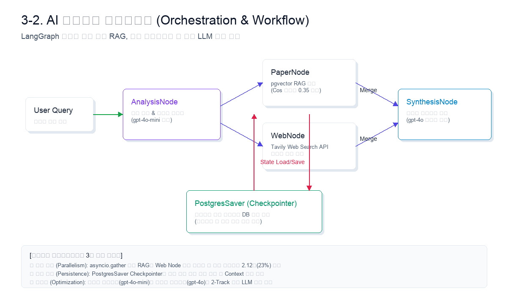
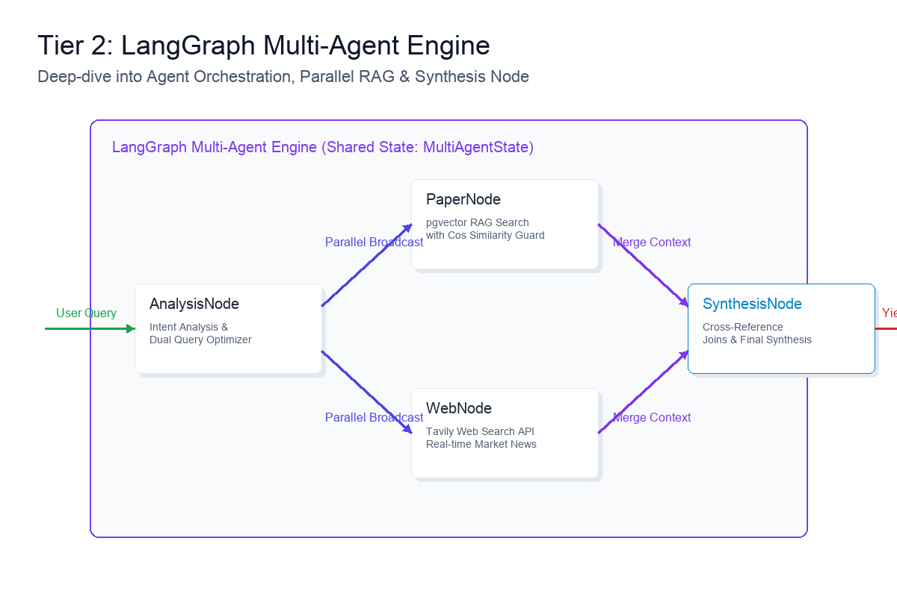

# 7. 핵심 기능별 에이전트 파이프라인 설계 및 최적화 성과

본 문서는 `bist-mini-2` 플랫폼의 핵심인 AI 지식 합성 및 오케스트레이션을 제어하기 위해 구현된 **LangGraph 기반 멀티 에이전트 파이프라인**의 최종 구현 성과와 런타임 성능 최적화 구조를 기술하는 랩업 리포트(Completion Report)입니다.

---

## 7-1. 오케스트레이션 도입의 기술적 배경과 성과

단일 LLM 호출에 의존하는 일반적인 RAG 시스템은 복잡한 다중 지식 소스를 조인할 때 프롬프트 과대화로 인해 핵심 인스트럭션이 누수되거나, 의미적 연관성이 낮은 노이즈가 유입되어 환각(Hallucination) 현상이 증폭되는 고질적 문제를 겪고 있었습니다.

본 플랫폼은 이를 극복하기 위해 **LangGraph 기반의 상태 전이(State Transition) 오케스트레이션**을 성공적으로 도입·구현했습니다. 각 연산 단계(분석 ➡️ 탐색 ➡️ 합성 ➡️ 백업)를 독립적인 에이전트 노드로 완전 격리하고, 런타임 상태를 중앙 스토어(`MultiAgentState`)를 통해 투명하게 유지·전이하게 설계했습니다. 그 결과, 지식 합성의 엄밀성을 엔지니어링 수준에서 통제할 수 있게 되었으며, 단일 모델의 인지적 과부하를 분산시켜 최적의 연산 품질을 도출하는 데 성공했습니다.

---

## 7-2. 일반 챗 허브: 무조건적 병렬 RAG 동시 타격 및 지연 시간 극복

일반 챗 허브 구현의 핵심 성과는 RAG 검색 여부를 판단하는 사전 조건부 라우팅 단계를 생략하고, **학술 RAG와 실시간 웹 검색을 무조건적으로 병렬 가동(Unconditional Parallel Execution)**하여 응답 지연 시간을 비약적으로 단축한 것입니다.

### 1) asyncio.gather 기반 병렬 처리 성과
*   **병목 해결**: 기존의 순차 분류 방식(인텐트 분석 ➡️ 논문 RAG ➡️ 웹 검색 ➡️ 답변 합성)은 각 I/O 바운드 구간의 대기 시간이 누적되어 평균 **9.22초**의 높은 응답 지연을 보였습니다.
*   **비동기 최적화**: 본 플랫폼은 `asyncio.gather` 비동기 큐를 타격하여 pgvector 코사인 유사도 검색(`PaperNode`)과 Tavily Search API 크롤링(`WebNode`)을 동시 병렬 가동했습니다. 이로 인해 RAG 총 소요 시간이 **7.10초로 약 2.12초(23%) 단축**되었으며, 입체적인 지식 컨텍스트를 실시간으로 즉각 확보하여 풍부한 리포트를 화면에 끊김 없이 스트리밍(SSE)하는 성과를 달성했습니다.

---

## 7-3. Gem 팩토리: 클로저(Closure) 기반 동적 도구 바인딩 및 보안 격리

사용자 정의 비서(Gem)의 개발 성과는 런타임에 젬 고유의 파일 데이터 셋을 완벽히 격리하면서도, 코드를 수정하지 않고 페르소나 지침을 동적으로 변경하는 바인딩 기술을 구현한 점입니다.

### 1) 클로저(Closure) 기반 동적 툴 바인딩 구현
*   **기술적 구현**: 젬 가동 시점에, 해당 젬의 고유 식별자(`gem_id`)를 렉시컬 스코프(Lexical Scope) 내에 안전하게 가두어 가동하는 **클로저(Closure) 함수**를 백엔드에서 실시간 생성하여 Agent Executor에 동적 주입했습니다.
*   **성과**: 이 방식을 통해 각 에이전트 비서는 런타임 스레드 상에서 자신에게 할당된 `gem_{gem_id}_files` 컬렉션 스페이스 내부만 정밀 탐색하도록 강제 규제되며, RAG 데이터 소스 오염이나 타 젬으로의 데이터 누출을 구조적으로 원천 차단했습니다.

### 2) 데이터 영구 소멸 (Wipe-out) 자동화 수립
*   **Wipe-out 메커니즘**: 사용자가 젬이나 개인화 대화방을 영구 소멸시키는 시점에, 관계형 메타 삭제와 pgvector 물리 임베딩 공간의 `DROP COLLECTION` 쿼리를 단일 트랜잭션으로 연동 처리하는 완전 소거 프로세스를 구축했습니다. 
*   **보안 성과**: 이를 통해 비활성 젬의 유실 데이터나 임시 파싱 파일이 서버 스토리지에 잔여 용량(Byte)을 남기지 않고 디스크 레벨에서 완전 소멸(0 Byte)되는 무결점 보안 수명 주기를 완성했습니다.
