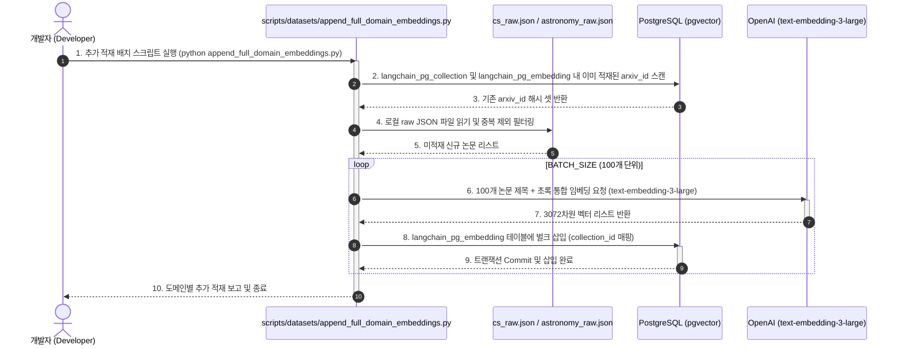
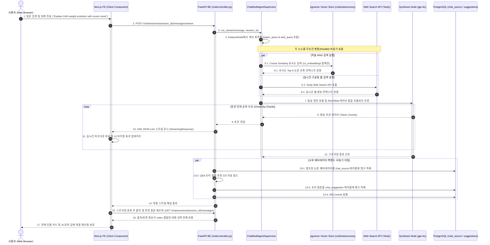
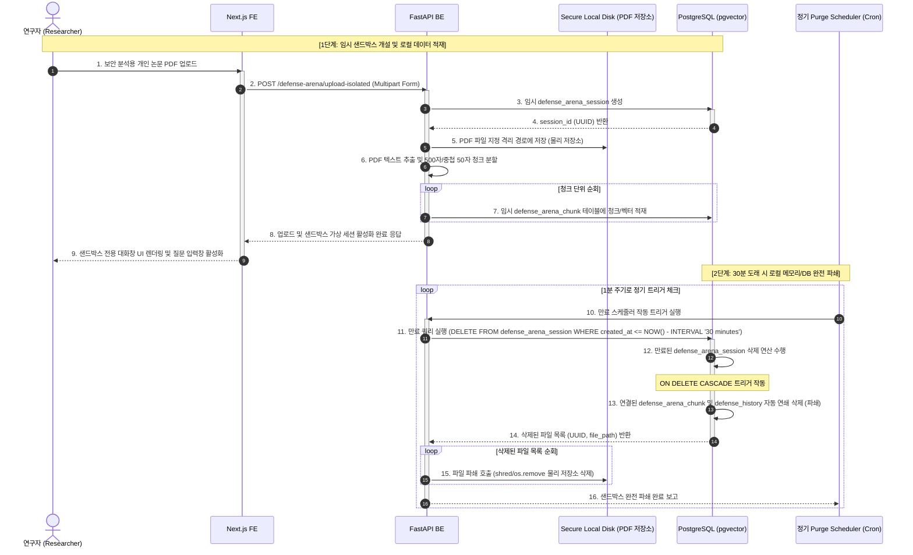
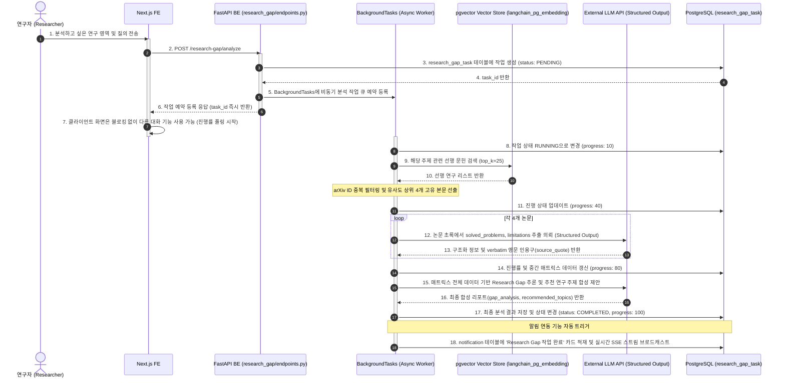

# [4차 산출물] 07. 시스템 종합 시퀀스 다이어그램 설계서 (System Sequence Diagrams)

본 문서는 `bist-mini-2` 플랫폼의 최종 완성 상태를 반영하여, 각 티어 및 컴포넌트 간의 시간 흐름에 따른 메시지 교환 및 기능 동작 흐름을 도식화한 **시스템 종합 시퀀스 다이어그램 설계서**입니다. 보안 관련 시퀀스는 향후 개발 목표로 별도 분류되어 있습니다.

---

## 1. 📂 오프라인 로컬 파일 기반 배치 임베딩 및 DB 적재 파이프라인
*ArXiv 전체 스냅샷 및 개별 raw JSON 파일에서 도메인별 미적재 데이터를 추출하여 `langchain_postgres` PGVector 벌크 인덱싱을 진행하는 흐름입니다.*

---

## 2. ⚡ 실시간 병렬 융합 RAG 에이전트 스트리밍 (SSE 스트리밍)
*사용자의 학술 질문에 대해 최적화 쿼리를 생성하고, pgvector HNSW RAG와 Tavily 실시간 검색 노드를 무조건 병렬로 동시 수행하여, 최종 합성 노드에서 교차 융합된 답변을 SSE로 스트리밍하는 흐름입니다.*

---

## 3. 🔒 보안 연구 샌드박스 가상 세션 수명 주기 및 파쇄 - [향후 구현 설계 (미구현)]
*사용자의 보안 민감 사설 논문 분석을 위한 임시 격리 샌드박스를 개설하고, 30분 초과 만료 시 DB의 외래키 ON DELETE CASCADE와 연계하여 완전 파쇄하는 보안 흐름입니다.*

---

## 📬 4. 대규모 비동기 문헌 분석 (Research Gap Analyzer)
*대규모 선행 연구에 대한 배치 분석 요청을 예약하면 백엔드 BackgroundTasks가 비동기로 가동되어 한계점을 일괄 취합하고 알림 인박스에 저장하는 흐름입니다.*

