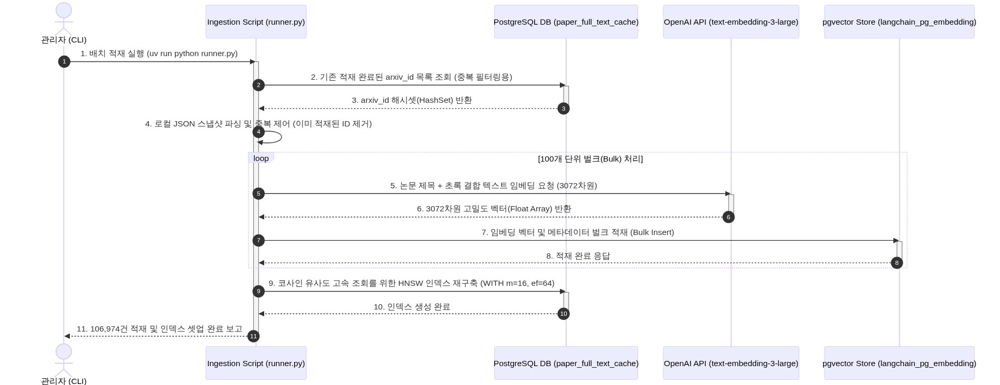
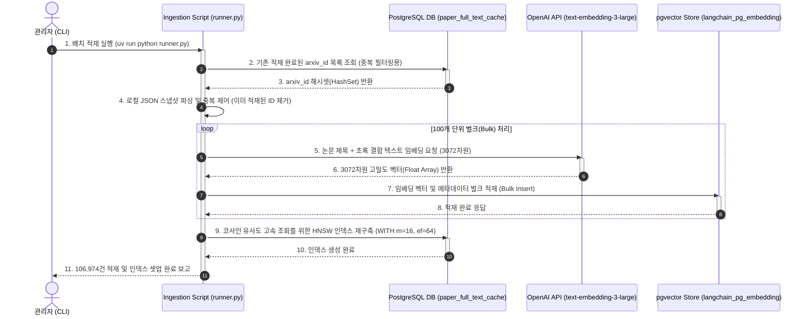
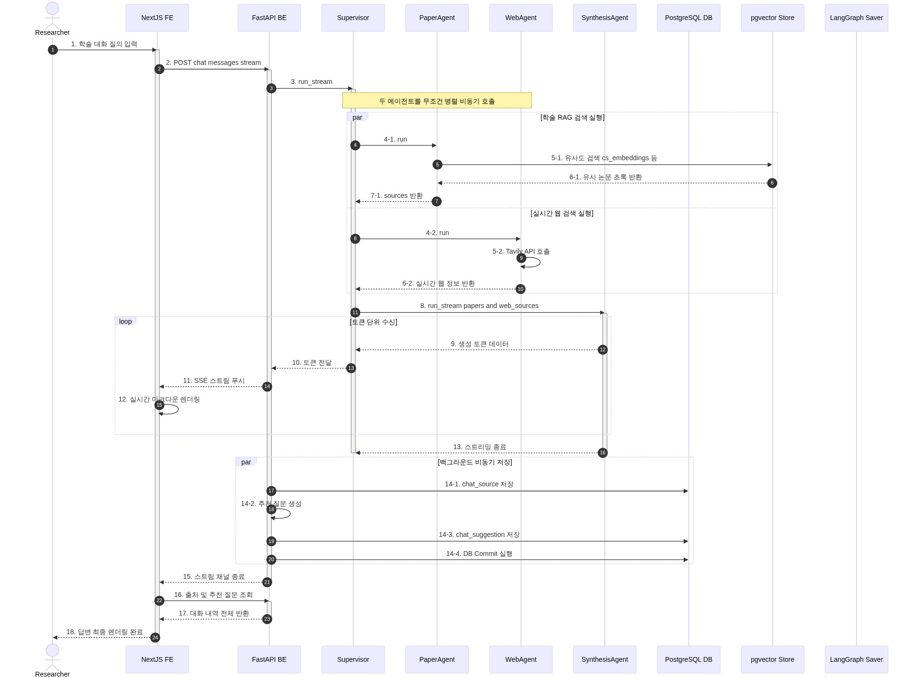
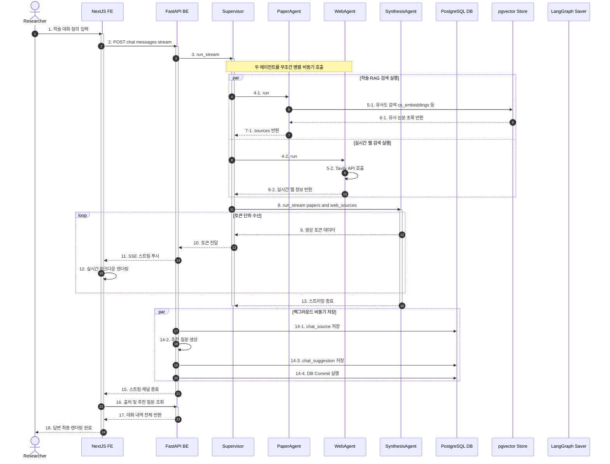
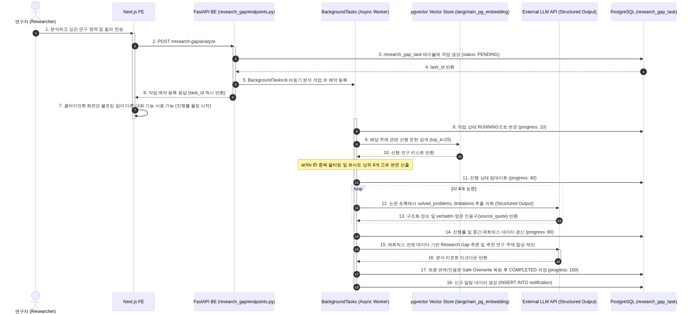
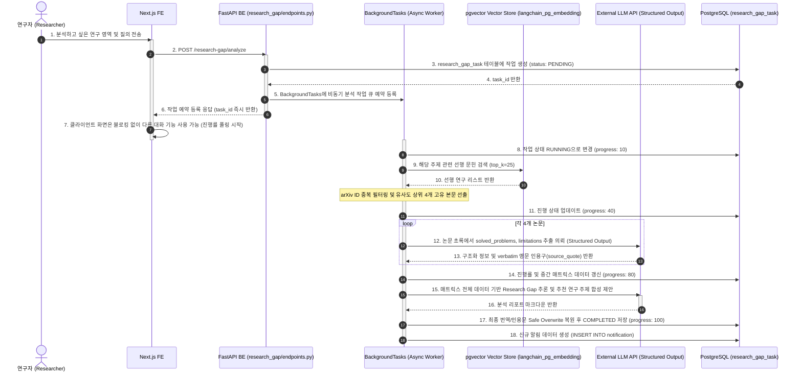
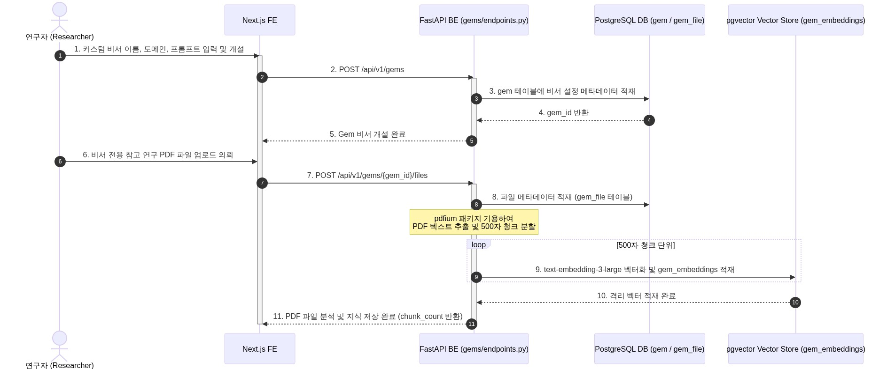
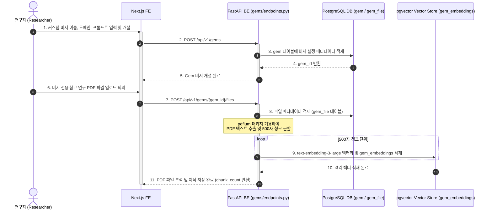

# [4차 산출물] 07-Detail. 시퀀스 다이어그램 상세 설명서 (Sequence Diagrams & Interaction Processes)

본 문서는 `bist-mini-2` 플랫폼의 핵심 비동기 데이터 처리 및 에이전트 오케스트레이션 제어권의 흐름을 보여주는 **시퀀스 다이어그램 상세 설명서**입니다. 시간 축에 따른 컴포넌트 간 비동기 메시지 교환 프로세스를 면밀히 규정합니다.

---

## 💾 1. 오프라인 로컬 데이터 배치 적재 파이프라인 (Offline Data Ingestion Pipeline)

*로컬 ArXiv JSON 학술 메타데이터 스냅샷을 pgvector 데이터베이스에 중복 없이 고속 적재하고 HNSW 인덱스를 구성하는 시퀀스입니다.*

> 📢 **[구글 독스 이미지 삽입 안내 - INGESTION]**
> *   구글 독스 메뉴의 `삽입 ➡️ 이미지 ➡️ 컴퓨터에서 업로드`를 통해 아래 이미지 파일을 본문에 넣어주세요.
> *   **삽입 파일**: `docs/deliverables/4th/images/07_system_sequence_diagrams_detail_ingestion.png`

### ⏱️ 컴포넌트 간 인터랙션 프로세스 설명

1.  **배치 스크립트 기동 및 중복 체크**:
    *   관리자가 CLI에서 `Ingestion` 태스크를 기동하면, 스크립트는 PostgreSQL에서 기존 적재 완료된 `arxiv_id` 목록을 조회하여 메모리에 해시셋(HashSet) 구조로 보관합니다.
2.  **로컬 데이터셋 중복 제어**:
    *   로컬 데이터셋을 순회하며 이미 해시셋에 존재하는 논문은 즉각 스킵하고, 신규 논문만 임베딩 작업 대상 큐에 적재하여 데이터 멱등성(Idempotency)을 유지합니다.
3.  **벌크 OpenAI 임베딩 및 pgvector 적재**:
    *   API 호출 횟수 제한(Rate Limit)을 피하고 성능을 극대화하기 위해 100건 단위로 묶어 `text-embedding-3-large` 모델을 통해 3072차원 임베딩 벡터를 일괄 확보합니다.
    *   확보된 벡터를 pgvector 테이블에 벌크로 단일 트랜잭션으로 적재합니다.
4.  **HNSW 인덱싱 재빌드**:
    *   적재 완료 시 pgvector의 코사인 유사도 검색 정확도와 응답 속도를 확보하기 위해 HNSW 인덱스 구축 DDL(`CREATE INDEX ... USING hnsw`)을 PostgreSQL에 수행하고 적재 작업을 마칩니다.

---

## 💬 2. 실시간 병렬 RAG 에이전트 스트리밍 (Parallel RAG & SSE Streaming Q&A)

*사용자 질문 입력 시 pgvector RAG와 Tavily 실시간 검색을 비동기 병렬 실행하여 Synthesis Agent에서 합성한 뒤 SSE 스트리밍으로 전송하는 시퀀스입니다.*

> 📢 **[구글 독스 이미지 삽입 안내 - RAG]**
> *   구글 독스 메뉴의 `삽입 ➡️ 이미지 ➡️ 컴퓨터에서 업로드`를 통해 아래 이미지 파일을 본문에 넣어주세요.
> *   **삽입 파일**: `docs/deliverables/4th/images/07_system_sequence_diagrams_detail_rag.png`

### ⏱️ 컴포넌트 간 인터랙션 프로세스 설명

1.  **사용자 대화 요청 및 API 진입**:
    *   연구자가 브라우저 UI에서 학술 질문을 입력하고 전송 버튼을 누르면, Next.js FE는 DTO를 빌드하여 `POST /api/v1/chat/sessions/{session_id}/messages/stream` API를 호출합니다.
2.  **쿼리 수신 및 작업 위임 (Query Dispatch)**:
    *   FastAPI의 `ChatService`는 `ChatMultiAgentSupervisor`를 비동기 호출합니다.
    *   슈퍼바이저 에이전트는 분기 판단 대기 시간을 거치지 않고, 전달받은 질문 쿼리를 `paper_agent`와 `web_agent`로 즉시 전달하여 백그라운드 병렬 처리를 개시합니다.
3.  **비동기 병렬 RAG 동시 타격 (I/O Bottleneck 해소)**:
    *   백엔드 서비스 레이어는 `asyncio.gather`를 가동하여 두 개의 I/O 바운드 검색 작업을 스레드 블로킹 없이 **병렬(Parallel)로 동시 실행**합니다.
        *   **RAG 경로**: `paper_agent`는 쿼리를 내부 지침에 따라 영어 학술어로 변환 후, pgvector DB에서 cosine distance 검색을 실행하여 임계치(0.35)를 통과한 도메인별 최신 논문 컨텍스트를 HNSW 인덱스를 타고 초고속으로 탐색 및 로드합니다.
        *   **WEB 경로**: `web_agent`는 Tavily Search API를 타격하여 실시간 웹 뉴스, 학술 블로그 및 포럼 등의 최신 외부 컨텍스트를 로드합니다.
4.  **합성 엔진 구동 및 토큰 단위 스트리밍 (SSE Response)**:
    *   수집 완료된 논문 RAG 컨텍스트와 웹 컨텍스트를 하나의 합성 프롬프트로 병합하여 `SynthesisAgent (gpt-4o)`에 인풋합니다.
    *   합성 엔진은 답변을 생성하기 시작하고, 백엔드는 생성되는 토큰 청크(Token Chunks)를 비동기 제너레이터로 수신하는 즉시 FastAPI `StreamingResponse` 채널을 통해 `text/event-stream` 포맷으로 클라이언트에 스트리밍 전송합니다.
    *   Next.js UI는 실시간 수신되는 SSE JSON 데이터를 즉각 마크다운으로 파싱하여 화면에 타이핑 효과로 점진적 렌더링을 갱신합니다.
5.  **백그라운드 사후 메타데이터 영구 적재**:
    *   스트리밍이 최종 종료(EOF)되면, 백엔드는 클라이언트 채널을 유지한 채 백그라운드 비동기 태스크를 가동합니다.
    *   대화 중 인용된 논문 식별 정보를 `chat_source` 테이블에 저장하고, 당해 대화 맥락과 관련된 꼬리 질문 3선 생성하여 `chat_suggestion` 테이블에 적재합니다.
6.  **컨텍스트 리바인딩 및 최종 화면 완성**:
    *   SSE 스트림이 종료되면 Next.js FE는 스트림 종료 플래그를 감지하고, 대화 이력 API(`GET /api/v1/chat/sessions/{session_id}/messages`)를 1회 자동 호출하여 백엔드 DB에 비동기 저장되었던 출처(Source Card) 정보와 추천 질문 카드를 대화 버블 하단에 완벽하게 바인딩하여 렌더링을 마칩니다.

---

## 📬 3. 비동기 백그라운드 배치 공백 분석 및 SSE 알림 발송 (Research Gap Analyzer & SSE Notification)

*대규모 선행 연구에 대한 배치 분석 요청을 예약하면 백엔드 BackgroundTasks가 비동기로 가동되어 한계점을 일괄 취합하고 알림 인박스에 저장하는 흐름입니다.*

> 📢 **[구글 독스 이미지 삽입 안내 - ANALYSIS]**
> *   구글 독스 메뉴의 `삽입 ➡️ 이미지 ➡️ 컴퓨터에서 업로드`를 통해 아래 이미지 파일을 본문에 넣어주세요.
> *   **삽입 파일**: `docs/deliverables/4th/images/07_system_sequence_diagrams_detail_analysis.png`

### ⏱️ 컴포넌트 간 인터랙션 프로세스 설명

1.  **비동기 분석 예약 및 즉시 반환**:
    *   사용자가 분석 요청을 보내면, 백엔드는 즉시 관계형 데이터베이스(`research_gap_task`)에 상태가 `PENDING`인 레코드를 신규 적재하고, 클라이언트에게 예약 접수 완료된 `task_id`를 즉각 반환합니다.
2.  **FastAPI BackgroundTasks 비동기 구동**:
    *   FastAPI의 비동기 백그라운드 태스크 엔진에 분석 핸들러를 오프로딩하여, 메인 API 스레드는 블로킹 없이 제어권을 반환합니다. Next.js 화면은 다른 대화방이나 젬 기능을 계속해서 이용할 수 있습니다.
3.  **문헌 중복 제거 및 Matrix 파싱**:
    *   백그라운드 스레드에서 pgvector DB로부터 해당 키워드의 논문 25개를 일괄 탐색합니다.
    *   `arxiv_id` 중복 논문을 필터링하여 가장 유사도가 높은 최상위 핵심 문헌 4대장만 최종 선출합니다 (진행률 40% 도달).
    *   4대 문헌에 대해 각각 `gpt-4o-mini` 모델의 `with_structured_output` API를 활용하여 해결된 과제(Solved Problems)와 한계점(Limitations)을 개별 추출합니다. 이때 인용구 팩트 손상 방지를 위해 서비스 레이어 캐시에 `source_quote` 원본 영문을 격리 보관합니다 (진행률 80% 도달).
4.  **공백 추론 합성 및 다국어 Safe Overwrite**:
    *   4대 논문의 모든 한계점 매트릭스 정보를 조인하여 종합적인 Research Gap 보고서를 합성하고, 영한 기계 번역 완료 후 보존해둔 원본 영문 인용구 데이터를 JSON 번역본 내의 대응되는 필드에 강제로 다시 복원(Safe Overwrite)시킵니다.
5.  **완료 알림 발송**:
    *   분석 완료 시 DB 상태를 `COMPLETED`로 변경하고 `progress`를 100으로 갱신합니다.
    *   `notification` 테이블에 수신 알림 내역을 INSERT 함과 동시에, 백엔드 SSE Broadcaster 스레드를 통해 실시간 이벤트 스트림(`GET /api/v1/notification/stream`에 접속해 있는 Next.js UI)으로 "공백 분석 완료" 토스트 메시지를 푸시 발송합니다.

---

## 🛡️ 4. 맞춤형 연구 비서 Gem 생성 및 RAG 물리 격리 (Custom Gem Creation & Physical Isolation)

*사용자 정의 페르소나 및 파일 업로드 시 젬 정보를 생성하고, 임시 PDF를 pgvector에 격리된 테이블 영역으로 격리 적재하는 시퀀스입니다.*

> 📢 **[구글 독스 이미지 삽입 안내 - GEM]**
> *   구글 독스 메뉴의 `삽입 ➡️ 이미지 ➡️ 컴퓨터에서 업로드`를 통해 아래 이미지 파일을 본문에 넣어주세요.
> *   **삽입 파일**: `docs/deliverables/4th/images/07_system_sequence_diagrams_detail_gem.png`

### ⏱️ 컴포넌트 간 인터랙션 프로세스 설명

1.  **커스텀 비서 개설**:
    *   연구자가 비서의 전용 이름, 참고할 학술 카테고리(bio, cs, astronomy), 그리고 비서가 지켜야 할 시스템 프롬프트(페르소나) 지침을 정하고 개설하면 백엔드는 `gem` 테이블에 메타 레코드를 적재하고 고유의 UUID `gem_id`를 발급합니다.
2.  **비서 지식 적재 및 컬렉션 분리**:
    *   연구자가 참고용 사설 PDF 파일을 업로드하면 백엔드는 `gem_file` 테이블에 메타데이터를 저장하고, `pdfium` 라이브러리로 디스크 영역에 안전하게 복사하여 텍스트를 로드한 뒤 500자 단위 청크로 파싱합니다.
    *   각 청크를 임베딩하여 pgvector의 독립된 전용 공간(`gem_embeddings` 내의 `gem_id` 결합 인덱스 영역)에만 격리하여 저장합니다. 이 데이터는 다른 젬 비서나 다른 대화방 RAG 쿼리 시 절대로 인출되지 않도록 데이터 액세스가 엄격하게 물리 격리됩니다.
