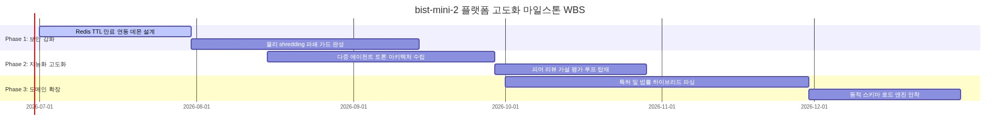
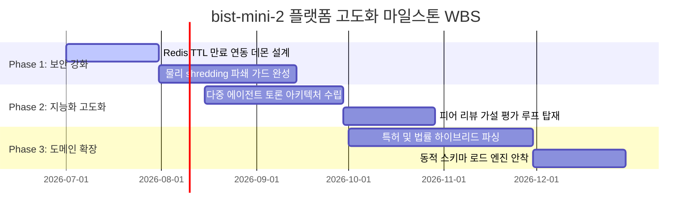
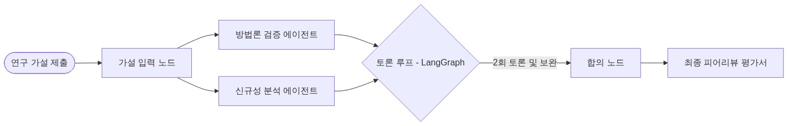
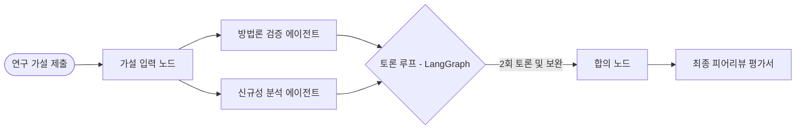

# [4차 산출물] 11. 한계 및 향후 발전 로드맵 (Limitations & Future Roadmap)

지속 가능한 플랫폼 성장을 위해 `bist-mini-2` 플랫폼은 성능 평가 및 기능 품질 보증 결과를 기반으로 기업 수준의 보안과 고도화된 지능화 영역을 더욱 확장할 계획입니다. 본 문서는 현재 시스템의 아키텍처적 한계를 객관적으로 정의하고, 이를 해소하기 위한 3대 핵심 고도화 로드맵의 기술적 세부 사양을 규정합니다.

---

## 1. 🔍 현재 시스템의 기술적 한계점 (Current Limitations)

### A. 세션 만료 및 물리 데이터 파쇄 관리 자동화 부재
*   **현황**: 맞춤형 연구 비서 Gem 및 보안 구역에 임시 업로드된 PDF 파일과 관련 pgvector 테이블 임베딩 데이터는 논리적 식별값(`gem_id`, `session_id`)에 의존해 격리되어 있습니다.
*   **한계**: 30분 이상 활동이 없거나 세션이 만료된 연구자의 기밀 문서 파일 시스템 잔재와 데이터베이스 잔여 행(Rows)에 대한 물리 소거(Shredding) 데몬이 부재하여, 스토리지 공간 누수 및 엔터프라이즈 레벨에서의 정보 유출 취약점을 안고 있습니다.

### B. 단방향 합성 답변의 환각 위험성 (Single Node Hallucination)
*   **현황**: RAG 탐색과 웹 실시간 정보 취합의 최종 합성 연산은 단일 `gpt-4o` Synthesis 노드에서 진행됩니다.
*   **한계**: 생성된 학술 요약 및 연구 공백 제안의 타당성을 자율적으로 교차 검증하는 메커니즘이 부족하여, LLM의 가설 설정 시 발생할 수 있는 잠재적 할루시네이션(Hallucination) 오류에 직접적으로 노출됩니다.

### C. 이종 산업 학술 도메인 지원의 한계성 (Domain Constraints)
*   **현황**: 생명공학(q-bio), 컴퓨터공학(cs.NE), 천문학(astro-ph.EP) 3대 학술 분야의 ArXiv 스냅샷 데이터베이스에 국한되어 작동합니다.
*   **한계**: 융합 연구의 핵심인 특허(Patent), 신소재 재료공학(Materials), 화학 약리학(Pharmacology) 등의 인접 전문 지식 레이어가 탑재되어 있지 않아 실제 R&D 비즈니스 활용도가 제한됩니다.

---

## 2. 🚀 3대 핵심 향후 발전 로드맵 (Future High-Level Roadmap)

> 📢 **[구글 독스 이미지 삽입 안내 - GANTT]**
> *   구글 독스 메뉴의 `삽입 ➡️ 이미지 ➡️ 컴퓨터에서 업로드`를 통해 아래 이미지 파일을 본문에 넣어주세요.
> *   **삽입 파일**: `docs/deliverables/4th/images/11_limitations_and_roadmap_gantt.png`

### A. 기업용 보안 샌드박스: 물리 파쇄(Shredding) 데몬 완성
사설 연구 기밀 논문이 영구 유실 없이 메모리 및 디스크 영역에서 흔적을 지우도록 수명 주기 데몬을 구체화합니다.

*   **무활동 라이프사이클 데몬 구축**:
    *   Redis 인메모리 세션 캐시의 TTL 만료 이벤트(Expired Event Pub/Sub)를 백엔드가 상시 리스닝하도록 설계합니다.
    *   30분 미활동 감지 즉시 삭제 트리거를 비동기 백그라운드 태스크로 호출합니다.
*   **물리 디렉토리 완전 소거 (Secure File Shredding)**:
    *   단순한 OS 경로 지우기(`os.remove`)가 아닌, 리눅스/MacOS 계열의 `shred` 커맨드를 가상화 샌드박스 내부에서 구동합니다.
    *   파일 데이터 세그먼트를 난수 및 0(Zero-fill)으로 3회 중복 덮어쓰기하여 로우 레벨 포렌식으로도 복구 불가능하게 원천 파괴합니다.
*   **pgvector Temp Database Cascade Purge**:
    *   PostgreSQL 테이블 관계상 `ON DELETE CASCADE`를 구성하여 임시 세션이 Drop되면 해당 세션에 기인한 `gem_embeddings` 및 `checkpoints` 대화 로그 행을 연쇄적으로 영구 파쇄 처리합니다.

### B. 지능화 고도화: LangGraph 기반 다중 에이전트 토론 엔진 (Multi-Agent Debate Loop)
RAG 합성 결과의 무결성을 검증하고 연구 가설의 학술 가치를 높이기 위해, 가상의 심사위원단 피어 리뷰(Peer Review) 시스템을 안착시킵니다.

*   **가상 심사위원 에이전트 역할 분리**:
    *   **방법론 검증자 (Methodology Validator Agent)**: 가설에서 제시한 수식 모델, 데이터 수집 파이프라인의 모순 및 실험 설정오류를 전문적으로 공격합니다.
    *   **신규성 분석자 (Novelty Reviewer Agent)**: HNSW 벡터 DB와 실시간 특허 RAG를 쿼리하여 제안 가설의 선행 연구 중복도 및 모방 가능성을 분석합니다.
*   **LangGraph 기반 순환형 토론 그래프(Debate Loop)**:
    *   하나의 완성 가설에 대해 두 에이전트가 최소 2회 이상의 피드백 패스(Feedback Pass)를 교환하는 상태 유지 그래프(Stateful Ring Graph) 아키텍처를 설계합니다.
    *   최종 합의 노드(Consensus Node)에서 이견을 조율하고 종합 평점(Score Matrix)과 보안 피드백 리포트를 자동 발행합니다.

> 📢 **[구글 독스 이미지 삽입 안내 - DEBATE]**
> *   구글 독스 메뉴의 `삽입 ➡️ 이미지 ➡️ 컴퓨터에서 업로드`를 통해 아래 이미지 파일을 본문에 넣어주세요.
> *   **삽입 파일**: `docs/deliverables/4th/images/11_limitations_and_roadmap_debate.png`

### C. 영역 전문가 고도화: 도메인 융합 확장 (R&D Domain Expansion)
법률, 특허, 신소재 등 다양한 산업 지식 베이스를 수집할 수 있도록 RAG 레이어를 다각화합니다.

*   **하이브리드 특허 매칭 시스템 (BM25 + HNSW)**:
    *   단어를 엄격히 매칭해야 하는 특허법 및 법령 조항의 특징에 맞추어 키워드 스파스(Sparse) 검색인 BM25와 시맨틱 덴스(Dense) 검색인 HNSW pgvector 컬렉션을 융합하는 **상호 순위 융합(RRF - Reciprocal Rank Fusion)** 검색 노드를 이식합니다.
*   **동적 스키마 로드 엔진 (Dynamic Schema Loader)**:
    *   새 도메인 컬렉션이 유입될 때 백엔드 서비스의 다운타임(Downtime)을 차단하도록 데이터 레이어에 Dynamic JSONB 모델 스펙을 탑재하여 무중단 RAG 데이터 스키마 구축을 현실화합니다.
