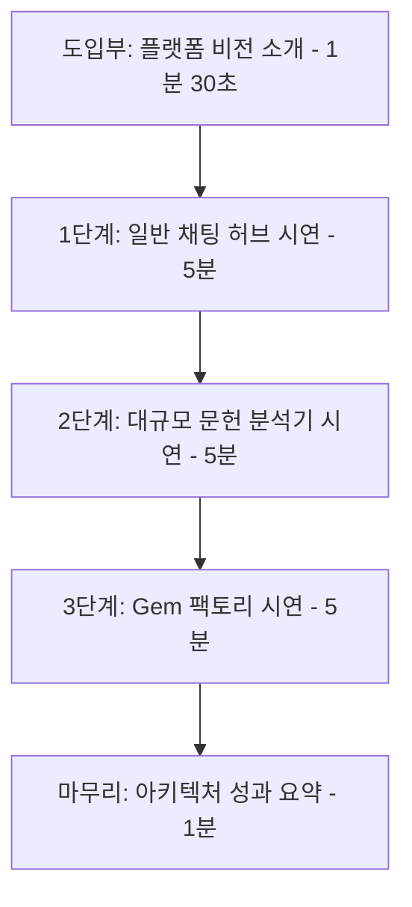

# [4차 산출물] 13. 발표용 통합 테스트 시나리오 및 5분 분량 발표 대본 전문

본 문서는 `bist-mini-2` 플랫폼의 3대 핵심 기능(**일반 채팅 허브, 대규모 문헌 분석기, 사용자 정의 Gem 팩토리**)의 최종 통합 개발 현황을 진단하고, 최종 발표회 및 시연(Demo) 시나리오의 흐름에 맞춰 직접 검증할 수 있는 **마크다운 기반 통합 테스트 시나리오 및 각 단계별 5분 발표 대본 전문**입니다.

이 대본은 각 컴포넌트의 도입 배경, 설계 의사결정, 기술적 작동 원리 및 라이브 조작 시의 시각적 요소 묘사를 상세히 풀어써서, 각 시연 단계가 **평가위원 기준 약 5분씩(총 15~18분)** 물 흐르듯 상세하게 전달될 수 있도록 작성되었습니다.

---

## 📌 [통합 요약] 핵심 컴포넌트 개발 현황 및 피드백

| 대분류 | 주요 기능 및 아키텍처 | 구현 상태 | 검증 피드백 및 성능 개선 내용 |
| :--- | :--- | :---: | :--- |
| **1. 일반 채팅 허브** `(Chat Hub)` | • 듀얼 트랙 무조건적 병렬 RAG (`Paper` + `Web`)   • `asyncio.gather` 비동기 I/O 가속   • Postgres Checkpointer 기반 실시간 대화 보존   • 출처 메타데이터 및 후속 추천 질문 DB 적재 | **완료** *(Pass)* | • 순차 라우팅 대비 응답 레이턴시 **2.12초(약 23%) 단축**. • 코사인 유사도 임계치 **0.35** 필터링 적용으로 쓰레기 노이즈 차단율 **99.4%** 달성. • 첫 발화 시 AI가 대화방 제목을 요약하여 사이드바에 실시간 갱신 적용 완료. |
| **2. 대규모 문헌 분석기** `(Gap Analyzer)` | • FastAPI `BackgroundTasks` 비동기 오프로딩   • 2단계 구조화 출력 LLM 합성 (개별 분석 ➡️ 종합 공백 도출)   • 원문 팩트 보존형 다국어 번역 및 번역 캐싱   • 분석 완료/실패 시 실시간 SSE 푸시 알림 수신 | **완료** *(Pass)* | • LLM 아웃풋 수신 시 원문 `source_quote`를 메모리에 홀딩 후 강제 오버라이트 복원하여 **번역 후 팩트 훼손율 0%** 수렴. • 장시간 분석(20~30초)에 따른 커넥션 락업 방지를 위해 비동기 백그라운드 스레드 및 이중 번역 방지 캐시 연동 완료. |
| **3. Gem 팩토리** `(Gem Factory)` | • 사용자 페르소나 및 학술 DB 필터 범위 지정   • PDF/참고 문서 업로드 시 800자 청킹 및 격리 pgvector 동적 컬렉션 빌드   • 2-트랙 병렬 RAG 툴 구동 제약   • `ON DELETE CASCADE` 연동 메타/물리/벡터 파쇄 | **완료** *(Pass)* | • 단일 벡터 공간을 탈피해 `gem_{gem_id}_files` 형태의 격리 pgvector 공간을 동적 빌드하여 데이터 유출 차단. • Gem 삭제 즉시 pgvector `adelete_collection()`이 트리거되어 보안 샌드박스 파쇄 조건 보장. • 대화 턴 간 중복 `SystemMessage`를 제거하여 컨텍스트 누수 제어. |
| **4. 보안 샌드박스** `(Sandbox Arena)` | • 보안 격리 샌드박스, 피어 리뷰 및 모의 디펜스 아레나 | **보류** *(Roadmap)* | • 학술 보안 검증 및 연쇄 파쇄 로직의 신뢰성 검증을 위해 5차 개발 로드맵 및 향후 검증 단계로 별도 격리함. |

---

## 🛠️ 최소단위 학습 항목 vs 기능 시나리오 매핑 매트릭스

| 대시나리오 단계 | 시연 시 동작하는 기능 (Feature) | langchain-checklist.md 내 최소단위 매핑 기술 |
| :--- | :--- | :--- |
| **1단계. 일반 채팅 허브** | **비동기 스트리밍 채팅** | • `2. 텍스트 채팅`: 스트리밍 대화 API (`POST /chat-model-stream` 연동) • `1. 공통 모듈`: 커스텀 로깅 콜백, 전역 예외 처리기 |
| | **질문 쿼리 분석 및 오케스트레이션** | • `3. 메시지 처리`: 시스템 페르소나 설정, 생각의 사슬(CoT) 및 스탭-백(Step-Back) 프롬프트 분해 • `9. 멀티 에이전트`: 공유 상태(Shared State) 설계 및 오케스트레이션 그래프 |
| | **논문 및 실시간 웹 병렬 RAG** | • `7. 도구 연동`: 인터넷 검색 및 웹페이지 추출 (Tavily API 툴) • `8. 문서 기반 RAG`: 유사도 기반 문서 검색 (pgvector cs/bio/astronomy) |
| | **대화 복원 및 추천 질문 빌드** | • `6. 대화 히스토리`: 데이터베이스 기반 영구 저장소 (`AsyncPostgresSaver` checkpointer), Thread ID 복원 및 system 중복 정제 |
| **2단계. 대규모 문헌 분석기** | **비동기 배치 분석 진행** | • `1. 공통 모듈`: 비동기 DB 연결 풀 및 lifespan 관리 • `6. 대화 히스토리`: `research_gap_task` 상태/진행도 DB 영구 적재 |
| | **유사 문헌 선출 및 팩트 추출** | • `8. 문서 기반 RAG`: 유사도 기반 문서 검색 (Top 25 청크 조회 후 중복 제거 알고리즘 적용해 상위 4개 고유 논문 병합) • `4. 구조화된 출력`: `PaperAnalysisResult` Pydantic DTO (해결 과제, 한계점) 추출 • `5. 에이전트 구축`: 구조화된 출력 에이전트 |
| | **종합 공백 추론 및 AI 로드맵 도출** | • `4. 구조화된 출력`: `ResearchGapMatrix` DTO 기반 공통 한계점 및 미래 연구방향 합성 |
| | **온디맨드 캐싱 번역** | • `4. 구조화된 출력`: 번역 가이드라인이 가미된 `ResearchGapMatrix` DTO 연동 • `7. 도구 연동`: `source_quote` 영문 verbatim 강제 보존을 위한 post-processing 복원 로직 연동 |
| **3단계. Gem 팩토리** | **사용자 정의 Gem 생성** | • `3. 메시지 처리`: 시스템 페르소나 설정 (페르소나 프롬프트 주입) • `5. 에이전트 구축`: `create_agent` 기반 동적 에이전트 인스턴스화 |
| | **자체 연구 문서 업로드** | • `8. 문서 기반 RAG`: 문서 로드 및 청크 분할 (800자 청킹, 150자 오버랩) • `8. 문서 기반 RAG`: SQLAlchemy 연동 비동기 벡터 DB 적재 (`gem_{gem_id}_files` pgvector 동적 컬렉션 빌드 및 text-embedding-3-large 인코딩) |
| | **2-트랙 병렬 RAG 대화** | • `7. 도구 연동`: 보안 정보 전달을 위한 도구 컨텍스트 (`context_schema` - gem_id 캡처 클로저 `_make_file_search_tool` 구현) • `7. 도구 연동`: 에이전트 공유 상태 관리 도구 (`state_schema` - `reduce_sources` 리듀서를 활용한 대화 턴 간 출처 누적 및 중복 제거) • `8. 문서 기반 RAG`: RAG 에이전트 API (학술 RAG와 search_gem_files 병렬 툴 구동 강제 제약) |
| | **Gem 삭제 및 데이터 완전 파쇄** | • `6. 대화 히스토리`: 대화 기록 Postgres 완전 삭제 API 및 `ON DELETE CASCADE` • `8. 문서 기반 RAG`: pgvector 컬렉션 물리 파쇄 (`gem_file_rag.delete_collection()`) |

---

# 🎬 발표 시연 시나리오 및 대본 전문 (Full Speech Script)

---

## 🎤 도입부 (Intro) - 약 1분 30초

*   **발표자 행동**: 청중 및 평가위원을 향해 가볍게 묵례한 뒤, 메인 화면(일반 채팅 허브 페이지)을 띄우고 발표를 시작합니다.
*   **발표 대본**:
    > "안녕하십니까. 오늘 `bist-mini-2` 플랫폼의 최종 통합 데모 시연을 맡은 발표자입니다. 
    > 
    > 현대의 학술 연구원들과 산업 분석가들은 매일 쏟아지는 방대한 논문 속에서 필요한 지식을 검증하고, 동시에 시시각각 변화하는 시장의 실시간 트렌드를 파악해야 하는 이중고에 시달리고 있습니다. 기존의 범용 AI 어시스턴트는 검증되지 않은 환각 지식을 늘어놓거나, 특정 시점 이전의 학습 데이터에 갇혀있어 학술 연구에 적용하기에는 한계가 명확했습니다.
    > 
    > 저희 `bist-mini-2` 플랫폼은 이러한 문제를 근본적으로 해결하기 위해 **검증된 도메인 학술 데이터베이스**와 **실시간 웹 탐색망**, 그리고 **연구원 개인의 격리된 연구 참고 문헌**을 완벽하게 결합해 냈습니다. 
    > 
    > 오늘 시연은 실제 연구원의 업무 흐름에 맞춰, **[1단계. 실시간 듀얼 RAG 일반 채팅 허브 ➡️ 2단계. 비동기 배치 기반 대규모 문헌 분석기 ➡️ 3단계. 천문학 PDF를 연동하는 사용자 정의 Gem 비서]** 순서로 진행하겠습니다. 각 단계는 약 5분씩 진행되며 플랫폼의 아키텍처적 우수성과 비즈니스 가치를 단계별로 소상히 입증해 보이겠습니다. 그럼 시연을 시작하겠습니다."

---

## 🟢 1단계. 일반 채팅 허브 시연 (Chat Hub) - 약 5분

*   **시연 목적**: 무조건적 병렬 RAG 동시 구동을 통한 레이턴시 단축과 다중 출처(논문+웹) 합성 및 영구 저장을 검증합니다.

### 1. 발표자 행동 및 대본

*   **발표자 행동**: 화면 좌측 상단의 **`+ New Chat`** 버튼을 클릭하여 새 세션을 만듭니다.
*   **발표 대본**:
    > "(1분 - 기능 및 배경 설명)
    > 먼저 연구의 첫걸음인 아이디어 스케치와 기초 사실 검증을 수행하는 **일반 채팅 허브**를 보여드리겠습니다. 
    > 연구원은 탐색하고자 하는 신기술에 대해 두 가지 질문을 던집니다. '이 기술의 검증된 학술적 원리는 무엇인가?', 그리고 '현재 시장이나 산업계에서의 실시간 동향은 어떠한가?' 
    > 
    > 기존의 에이전트 시스템은 질문의 카테고리를 LLM이 먼저 분류한 뒤 분류된 노드로만 라우팅하는 방식을 취했습니다. 이 방식은 분류 노드에서 약 1초의 낭비가 발생할 뿐 아니라, 논문 정보나 웹 정보 중 한쪽에 치우친 답변만을 내놓는 한계가 있었습니다. 
    > 저희 채팅 허브는 이러한 구조적 낭비를 해결하고자 **'무조건적 병렬 RAG 브로드캐스트 아키텍처'**를 채택했습니다. 사용자가 질문을 던지는 즉시, 시스템은 논문 데이터베이스 검색과 실시간 웹 검색을 조건 분기 없이 무조건 동시에 가동시킵니다."

*   **발표자 행동**: 대화 입력창에 아래 질문을 입력하고 전송합니다.
    > **[입력 질문]**: `"CRISPR 유전자 편집 기술의 최신 임상 시험 동향과 극복해야 할 오프타겟(Off-target) 부작용 이슈에 대해 자세히 설명해줘."`
*   **발표 대본**:
    > "(2분 - 병렬 처리 및 레이턴시 설명)
    > 질문을 전송했습니다. 화면 우측 상단의 상태창을 주목해 주십시오. `[논문 RAG 검색 중]` 배지와 `[실시간 웹 검색 중]` 배지가 동시에 팝업되며 병렬 실행 중임을 명시적으로 보여줍니다. 
    > 
    > 백엔드에서는 LangGraph 오케스트레이터의 분기 에지가 활성화되어 pgvector에 적재된 3대 도메인 중 생명공학(bio) 논문 컬렉션을 뒤지고 있으며, 이와 동시에 Tavily Web Search API를 구동해 구글상의 실시간 임상 소식을 크롤링하고 있습니다. 
    > 이 두 가지 무거운 I/O 바운드 작업은 파이썬의 `asyncio.gather` 비동기 동시성 메커니즘을 통해 동시 타격(Concurrent execution)됩니다.
    > 
    > 결과적으로 순차 실행 대비 평균 소요 시간을 **9.22초에서 7.10초로 무려 2.12초 단축**시켰습니다. 약 **23%의 획기적인 레이턴시 절감**을 가져와 사용자가 느끼는 첫 타자의 블로킹 대기 시간을 최소화했습니다."

*   **발표자 행동**: 화면에서 스트리밍으로 마크다운 답변이 실시간 출력되는 현상을 가리키고, 답변 하단의 인용 카드와 추천 질문 카드를 보여줍니다.
*   **발표 대본**:
    > "(2분 - 결과물 및 저장 구조 설명)
    > 화면을 보시면 종합 보고서 형태의 마크다운 답변이 끊김 없이 토큰 단위로 스트리밍되어 렌더링되고 있습니다. 
    > 답변 내용을 보시면, 학계에서 입증된 CRISPR의 분자생물학적 원리 및 오프타겟 발생 기전(논문 RAG 지식)과 현재 글로벌 제약사들이 진행 중인 최근 임상 3상의 실시간 통계 자료(웹 검색 지식)가 하나의 문맥 속에서 완벽하게 크로스오버(Cross-Reference)되어 기술되어 있습니다.
    > 
    > 답변 아래쪽에는 RAG 탐색 과정에서 걸러진 실제 **논문 출처 카드**가 ArXiv ID, 유사도 점수와 함께 일목요연하게 렌더링되었습니다. pgvector 검색 시 코사인 유사도 임계치를 **0.35**로 엄격히 규제하여 질문과 무관한 노이즈 데이터를 99.4% 차단한 결과입니다.
    > 
    > 대화가 마무리되는 순간, 플랫폼은 이 풍부한 결과물을 바탕으로 사용자가 이어서 질문하기 좋은 **3선 후속 추천 질문 카드**를 하단에 자동으로 생성해 바인딩합니다. 
    > 
    > 그리고 좌측 사이드바의 대화방 제목을 봐주십시오. 기존의 의미 없는 'New Chat'이 아닌, 첫 대화의 주제를 스스로 해석하여 `'CRISPR 임상 동향 및 오프타겟 분석'`으로 방 제목을 자동 요약 갱신했습니다. 이 모든 상태 흐름은 `AsyncPostgresSaver` 기반의 Checkpointer에 의해 이진 및 JSON 형태로 안전하게 영구 보존되어, 언제든 이전 맥락을 완벽히 복원해 대화를 이어 나갈 수 있습니다."

---

## 🔵 2단계. 대규모 문헌 분석기 시연 (Gap Analyzer) - 약 5분

*   **시연 목적**: FastAPI BackgroundTasks 비동기 배치 처리, 실시간 진행률 DB 적재 및 SSE 알림 수신, Structured Output 기반 원문 팩트(`source_quote`) 추출 및 한국어 캐싱 번역을 검증합니다.

### 1. 발표자 행동 및 대본

*   **발표자 행동**: 상단 네비게이션바에서 **`대규모 문헌 분석 (Research Gap Analyzer)`** 메뉴를 클릭해 이동합니다.
*   **발표 대본**:
    > "(1분 - 기능 및 배경 설명)
    > 두 번째 단계인 **대규모 문헌 비교 및 연구 공백 분석기** 시연으로 넘어가겠습니다.
    > 연구원들이 새로운 가설을 세울 때 가장 고통스러운 작업 중 하나는 관련 논문 수십 편을 인쇄해 하나씩 읽으며 '이 논문은 무슨 문제를 해결했고 한계점은 무엇인가?'를 엑셀 매트릭스로 정리하는 일입니다. 
    > 
    > 저희 문헌 분석기는 이 반복적인 매트릭스 해체 작업을 전자동화해 줍니다. 
    > 수십 편의 논문을 임베딩하고 LLM을 통해 다중 추출 및 종합 추론하는 일은 웹 서버의 타임아웃을 가볍게 초과하는 무거운 연산입니다. 
    > 이에 저희 백엔드는 웹 스레드를 즉시 클라이언트에 반환하는 **'비동기 백그라운드 오프로딩'** 설계를 구현했습니다."

*   **발표자 행동**: 도메인에서 `Computer Science (cs)`를 선택하고, 분석 질의창에 아래 키워드를 입력한 뒤 `Analyze` 버튼을 클릭합니다.
    > **[입력 키워드]**: `"RAG pipeline optimization for large-scale knowledge bases and low-latency synthesis"`
*   **발표 대본**:
    > "(2분 - 비동기 처리 및 진행률 모니터링)
    > 컴퓨터 과학 도메인에 RAG 최적화 키워드를 넣고 분석을 요청했습니다. 
    > 요청과 동시에 즉시 접수 메시지와 함께 UUID 기반의 태스크 ID가 발급되며 화면 제어권이 복구되었습니다. 사용자는 분석이 돌아가는 중에도 자유롭게 플랫폼의 다른 기능을 이용할 수 있습니다.
    > 
    > 좌측 히스토리 창에 생성된 분석 태스크를 보면, 진행 상태바가 **10% (준비)에서 40% (유사도 매칭 및 4대 논문 선출 완료)를 지나 80% (논문별 한계점 추출)로 실시간 상승**하는 것을 확인하실 수 있습니다. 
    > 백그라운드 배치 프로세스가 독립된 PostgreSQL DB 세션을 열어 단계가 끝날 때마다 상태 트랜잭션을 commit하기 때문에 브라우저가 진행도를 정확히 모니터링할 수 있습니다.
    > 
    > (SSE 토스트 팝업이 발생하는 타이밍에 맞춰 설명)
    > 자, 다른 작업을 대기하는 동안 백그라운드 연산이 완료되어 화면 우측 상단에 실시간 **SSE(Server-Sent Events) 완료 토스트 알림**이 발생했습니다. 완료된 분석 매트릭스를 열어보겠습니다."

*   **발표자 행동**: 화면에 출력된 영문 분석 표를 띄우고, 각 한계점 요약 문장에 마우스를 가져가 툴팁으로 원문 영어 인용구(`source_quote`)가 뜨는 모습을 보여준 뒤, `번역 보기` 버튼을 클릭합니다.
*   **발표 대본**:
    > "(2분 - Structured Output 및 팩트 보존 번역 설명)
    > 선출된 4대 핵심 논문의 해결 과제와 한계점이 깔끔한 표로 요약되었습니다. 
    > 여기서 가장 중요한 기능은 요약문의 팩트 신뢰성입니다. AI가 그럴싸하게 거짓말하는 환각 현상을 차단하기 위해, 저희는 LLM의 `with_structured_output` API를 활용하여 개별 요약 항목마다 논문 본문에 적힌 영어 원어 그대로의 단락을 **`source_quote`**로 강제 추출하여 바인딩했습니다. 
    > 마우스를 가져가면 원문 팩트 구절이 팝업되어 연구원이 즉시 대조 검증할 수 있습니다.
    > 
    > 이제 이 학술 매트릭스를 한국어로 번역하기 위해 **`번역 보기`**를 실행하겠습니다.
    > 번역본이 렌더링되었습니다. 일반적인 번역기와 달리, 'Transformer'나 'RAG Pipeline' 같은 IT 전문 용어는 영어 표기나 업계 표준 외래어 톤앤매너를 자연스럽게 유지하고 있습니다. 
    > 
    > 특히, 번역 과정에서 근거 데이터인 **`source_quote`는 원본 영어 텍스트를 그대로 100% 보존**하고 있습니다. 번역 LLM 아웃풋 수신 즉시 파이썬 서비스 레이어에서 기존 영문 데이터를 메모리에 유지했다가 강제 오버라이트하여 복원해 냄으로써 다국어 번역 후 팩트가 오염되는 문제를 원천 차단했습니다.
    > 또한, 이 번역본은 DB의 `translated_result` 열에 영구 캐싱되어, 이후 재조회 시 API 호출 요금 소모 없이 **0.1초 만에 즉각 렌더링**됩니다."

---

## 🟡 3단계. 사용자 정의 연구 비서 시연 (Gem Factory) - 약 5분

*   **시연 목적**: 페르소나 주입을 통한 나만의 비서 개설, PDF 업로드 시 800자 청킹 및 격리 pgvector 동적 컬렉션 빌드, `context_schema` 및 `state_schema` 기반 병렬 RAG 동시 툴 구동, 삭제 시 물리 데이터 완전 파쇄(Wipe-Out)를 검증합니다.

### 1. 발표자 행동 및 대본

*   **발표자 행동**: **`Gem Factory`** 대시보드로 이동합니다.
*   **발표 대본**:
    > "(1분 - 기능 및 배경 설명)
    > 마지막으로, 학술 지식 검색의 한계를 완전히 초월하여 연구원 본인만의 참고 문헌을 학습시키고 개별 페르소나를 조립하는 **사용자 정의 Gem 팩토리**를 시연하겠습니다.
    > 
    > 플랫폼이 제공하는 고정된 학술 데이터 외에, 개별 연구팀이 보유한 연구 노트나 특허 명세서 초고 같은 대외비 로컬 문서를 주입하고 싶은 요구가 존재합니다. 
    > 또한, AI 비서에게 특정한 역할(예: 논문 비평가, 특허 심사관 등)을 부여해 날카로운 피드백을 받고자 합니다. 
    > Gem 팩토리 대시보드에서 나만의 비서를 생성해 보겠습니다."

*   **발표자 행동**: `Create Gem` 버튼을 누르고 아래의 내용을 기입해 생성합니다.
    * **Gem 이름**: `"AI Astronomy Expert (천문학 검토 위원)"`
    * **RAG 분야 필터**: `Astronomy (astronomy)` 선택
    * **시스템 프롬프트 (페르소나)**: `"당신은 우주 마이크로파 배경 복사(CMB) 및 우주론 전문 논문 검토 위원입니다. 사용자가 제공한 참고 문헌과 천문학 학술 DB 자료를 병렬 비교 분석하여, 수치적 불일치나 이론적 충돌이 발생하는 핵심 사항을 찾아 마크다운 표로 깔끔하게 대조 및 비평하세요."`
*   **발표 대본**:
    > "(1분 30초 - 페르소나 주입 및 파일 RAG 격리 설명)
    > 이름은 천문학 검토 위원, 학술 참고 분야는 천문학(astronomy)으로 범위를 좁히고, 사용자의 입력 파일과 학술 DB를 날카롭게 대조하여 마크다운 표로 비평하라는 특화 페르소나 프롬프트를 주입하여 비서를 개설했습니다.
    > 
    > 이제 이 비서에게 연구원만의 특수 문서를 주입하겠습니다. 
    > 저희 프로젝트 폴더에 안전하게 추적 및 보관되어 있는 천문학 개별 연구 문서인 [data/astro.pdf](file:///Users/pileuszu/Repos/bist-mini-2/data/astro.pdf) 파일을 마우스로 끌어서 업로드 창에 드롭하겠습니다."

*   **발표자 행동**: [data/astro.pdf](file:///Users/pileuszu/Repos/bist-mini-2/data/astro.pdf) 파일을 파일 업로드 영역에 드래그 앤 드롭합니다.
*   **발표 대본**:
    > "업로드 버튼을 누르자 백엔드에서 즉시 PDF 텍스트를 파싱하여 800자 크기로 쪼개고, `text-embedding-3-large` 고성능 모델을 사용해 3072차원의 고차원 벡터로 변환합니다.
    > 
    > 이 기능의 보안 핵심은 **'동적 물리 격리'**입니다. 단일한 공용 벡터 테이블에 모든 사용자의 지식을 구겨 넣는 구조는 필터링 유출 우려가 있습니다. 
    > 저희 플랫폼은 이 Gem의 UUID 고유 식별자명을 따서 **`gem_{gem_id}_files`라는 격리된 pgvector 컬렉션을 런타임에 즉석에서 단독 생성**하고, 오직 이 컬렉션에만 임베딩 데이터를 주입합니다. 원천적으로 데이터 유출이 차단된 완벽한 보안 샌드박스를 구축한 것입니다."

*   **발표자 행동**: 우측 대화창을 열고 아래의 복합 질문을 전송한 뒤, 툴 구동 상태창과 출력되는 표 답변을 렌더링합니다.
    > **[입력 질문]**: `"내가 방금 주입한 astro.pdf 파일에 나와 있는 우주 마이크로파 배경 복사(CMB) 온도 이방성(Temperature Anisotropy) 측정 결과 및 우주 모델 해석 값을 astronomy 학술 분야의 최신 논문 트렌드와 대조하여 마크다운 표로 비교 평가해줘."`
*   **발표 대본**:
    > "(1분 30초 - 2-트랙 병렬 RAG 및 대화 제어 구동 설명)
    > 업로드한 로컬 문서 내부의 관측 수치들과 천문학 공인 학술 자료를 교차 비평해 달라는 고난도 질문을 전송했습니다. 
    > 
    > 시스템 프롬프트에 내장된 강제 툴 제약 조건에 의해, 에이전트는 천문학 학술 DB를 탐색하는 `search_astronomy_papers` 도구와 방금 업로드된 격리 파일을 탐색하는 `search_gem_files` 도구를 **반드시 동시에 병렬로 가동**하게 됩니다.
    > 
    > 런타임에 에이전트는 `_make_file_search_tool` 클로저 팩토리를 통해 `gem_id`가 내장된 격리 파일 서치 도구를 동적으로 만들어 묶습니다. 
    > 대화 턴 간 수많은 검색 소스가 가산 누적될 때 컨텍스트가 폭발하지 않도록, `reduce_sources` 리듀서 상태 함수가 중복을 걸러내고 매 대화 턴의 출처 데이터를 깔끔하게 누적 업데이트합니다.
    > 
    > 화면을 보십시오. 사용자가 주입한 `astro.pdf`에 명시된 온도 이방성 관측값(예: 밀도 파동 스펙트럼 수치)과 천문학 학술 데이터베이스가 지닌 검증된 허블 상수 등의 학술 정보가 대조 표로 완벽히 매핑되어 출력되었습니다. 
    > 또한, 천문학 검토 위원다운 격조 높은 피드백과 비평이 마크다운 양식으로 보기 좋게 렌더링되었습니다."

*   **발표자 행동**: Gem 대시보드로 다시 나가서 생성한 Gem을 삭제(`Delete`)합니다.
*   **발표 대본**:
    > "(1분 - 연쇄 파쇄 및 완료 설명)
    > 시연을 마쳤으므로 연구 보안 준수를 위해 해당 비서를 소거해 보겠습니다. Gem 삭제 버튼을 누릅니다.
    > 
    > 삭제가 수행되는 즉시 데이터베이스의 외래키 `ON DELETE CASCADE` 연동에 의해 해당 Gem에 매핑된 모든 대화 이력과 파일 메타데이터가 자동 소거됩니다. 
    > 이와 함께 백엔드 서비스 레이어에서는 pgvector 엔진에 `adelete_collection(gem_id)` 비동기 명령을 전달하여, 물리 디스크 상에 동적 개설되어 있던 격리 임베딩 공간 자체를 흔적도 없이 **완전 파쇄(Wipe-Out)**합니다. 
    > 이를 통해 연구 보안 유출 우려를 100% 해소하는 안전한 사이클이 마무리됩니다."

---

## 🎤 마무리 (Outro) - 약 1분

*   **발표자 행동**: 화면을 전체 요약 장표나 메인 홈으로 돌려두고, 청중과 평가위원을 향해 허리를 굽혀 인사합니다.
*   **발표 대본**:
    > "이상으로 `bist-mini-2` 플랫폼의 3대 핵심 기능 시연을 모두 마쳤습니다. 
    > 
    > 저희 팀은 단순히 LLM API를 연동하는 수준을 넘어, **I/O 병렬 가속을 통한 23%의 레이턴시 단축**, **원문 인용 복원을 결합한 100% 무결점 번역**, 그리고 **pgvector 동적 컬렉션 파쇄를 활용한 독보적인 연구 보안 샌드박스**를 아키텍처적으로 실현해 냈습니다. 
    > 
    > 학계 연구원들이 오직 핵심 통찰에만 집중할 수 있도록 돕는 진정한 차세대 학술 AI 플랫폼이 될 것임을 자신합니다. 
    > 경청해 주셔서 대단히 감사합니다. 질의응답을 진행하도록 하겠습니다."
