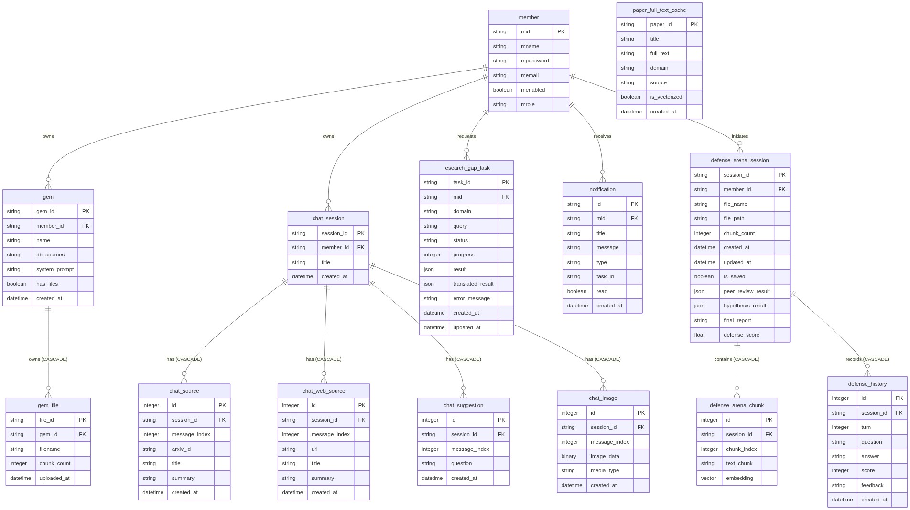
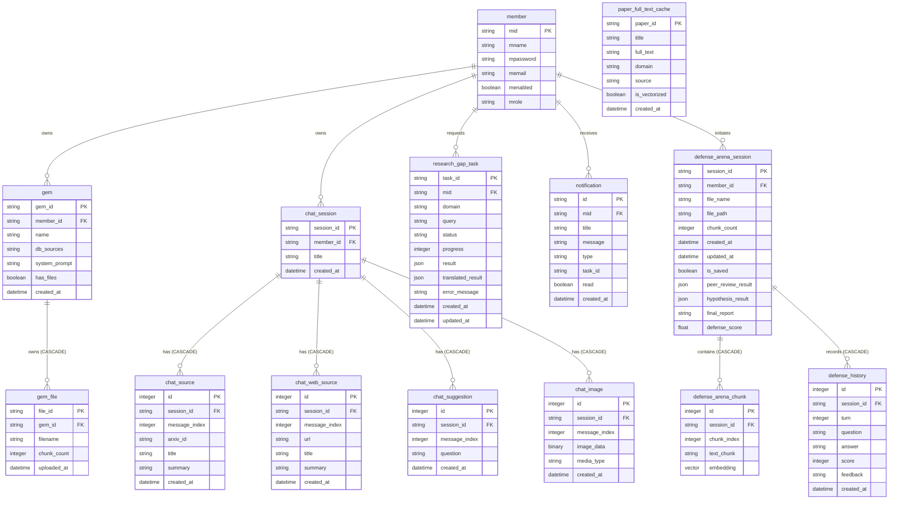

# [4차 산출물] 15. 데이터베이스 ERD 명세서 (Database Entity-Relationship Diagram)

본 문서는 `bist-mini-2` 플랫폼의 관계형 데이터베이스(PostgreSQL) 및 pgvector 테이블 구조에 존재하는 물리 스키마 필드들과 테이블 간 관계(Relationships)를 명시한 ERD 명세서입니다.

---

## 💾 데이터베이스 ERD (Entity-Relationship Diagram)

> 📢 **[구글 독스 이미지 삽입 안내 - ERD]**
> *   구글 독스 메뉴의 `삽입 ➡️ 이미지 ➡️ 컴퓨터에서 업로드`를 통해 아래 이미지 파일을 본문에 넣어주세요.
> *   **삽입 파일**: `docs/deliverables/4th/images/15_database_erd_architecture.png`

