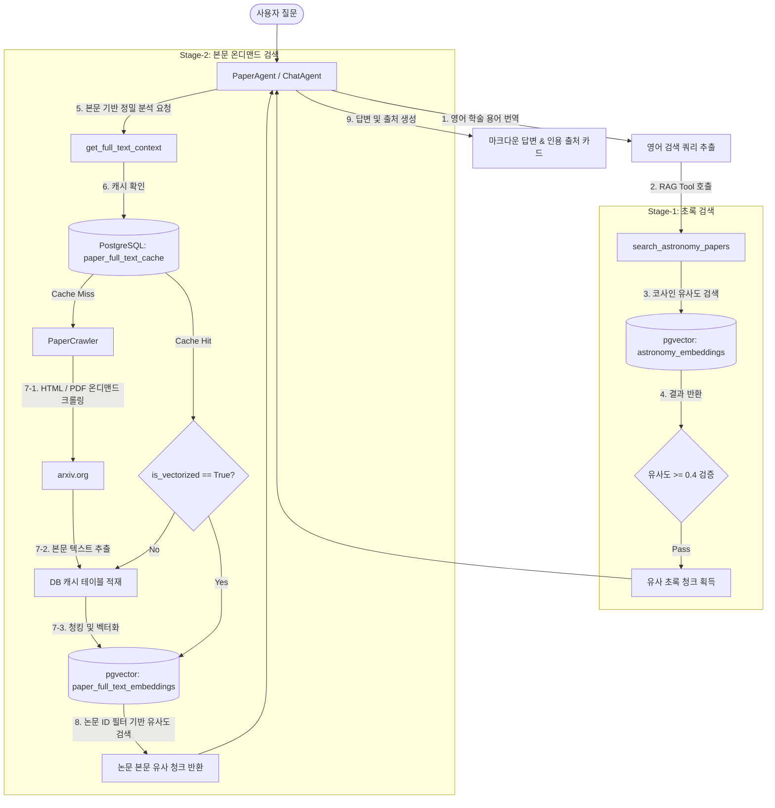
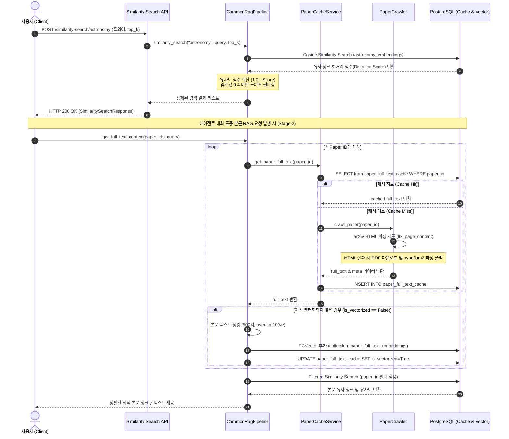

# [4차 산출물] astro-ph.EP 천문학 특화 RAG 파이프라인 아키텍처 및 구현 코드

본 문서는 `bist-mini-2` 플랫폼의 세 가지 학술 도메인 중 **천문학(astro-ph.EP: 지구 및 행성 천체물리학)** 연구 지원을 위한 RAG(Retrieval-Augmented Generation) 검색 파이프라인의 설계 구조와 전체 구현 코드를 정리한 4차 산출물입니다.

---

## 1. 아키텍처 및 RAG 검색 흐름 개요

천문학 RAG 검색 파이프라인은 대용량 논문 초록 데이터에 대한 고속 검색과 특정 논문의 상세 본문 분석을 동시에 지원하기 위해 **2단계 하이브리드 RAG 전략(2-Stage RAG)**을 채택하고 있습니다.

### 2단계 하이브리드 RAG 설계
* **Stage-1: 초록 데이터셋 유사도 검색 (Abstract Similarity Search)**
  * 사전에 수집 및 벡터화되어 저장된 천문학 논문 데이터베이스(`astronomy_embeddings` 컬렉션)를 대상으로 사용자의 자연어 질의어와 코사인 유사도가 높은 텍스트 청크를 고속 검색합니다.
  * 검색 결과의 코사인 유사도 점수($1.0 - \text{distance}$)를 측정하며, 노이즈 필터링을 위해 임계값(`SIMILARITY_THRESHOLD = 0.4`) 미만의 문서는 검색 결과에서 즉시 배제합니다.
* **Stage-2: 본문 온디맨드 RAG (On-Demand Full-Text RAG)**
  * 사용자가 대화 과정에서 특정 논문의 구체적 논리나 세부 수치(예: Mars 대기 성분, 행성 형성 모델 매개변수 등)를 질문할 때 가동됩니다.
  * 캐시 데이터베이스에 본문이 존재하지 않는 논문인 경우, arXiv HTML 또는 PDF를 온디맨드로 실시간 크롤링하여 텍스트를 파싱하고 데이터베이스(`paper_full_text_cache` 테이블)에 적재합니다.
  * 크롤링된 전체 본문을 500자(오버랩 100자) 단위로 잘개 쪼개어 pgvector의 `paper_full_text_embeddings` 컬렉션에 적재하고, 메타데이터 필터(`paper_id`)를 활용하여 해당 논문 내부에서 질문과 유관한 청크를 정밀 추출합니다.

---

## 2. RAG 아키텍처 시각화

### A. 시스템 아키텍처 및 데이터 흐름도
사용자의 질의가 유입되었을 때 RAG 파이프라인 내부에서 어떻게 검색과 온디맨드 크롤링이 일어나는지 보여주는 데이터 흐름도입니다.



### B. 동작 시퀀스 다이어그램
전체적인 API 호출 및 내부 서비스 간의 시간 순서에 따른 제어 흐름을 도식화한 시퀀스 다이어그램입니다.



---

## 3. 데이터베이스 및 RAG 데이터 규격 설정

### 데이터베이스 캐시 테이블 설계
온디맨드 방식으로 파싱한 논문의 본문(Full-Text)을 캐싱하여, 네트워크 비용과 API 비용을 최소화하도록 구성하였습니다.

* **테이블명**: `paper_full_text_cache`
* **주요 칼럼 구성**:
  * `paper_id` (PK): 논문 고유 ID (arXiv ID 등)
  * `title`: 논문 제목
  * `full_text`: 추출된 논문 본문 텍스트 전체
  * `domain`: 학술 도메인 구분 (`bio`, `cs`, `astronomy`)
  * `source`: 텍스트 수집 소스 (`arxiv`, `europepmc`)
  * `is_vectorized`: 본문 텍스트가 청킹되어 pgvector에 업로드되었는지 여부
  * `created_at`: 데이터 수집/적재 시각

### RAG 임베딩 및 인덱스 표준 스펙
* **임베딩 모델**: `openai:text-embedding-3-large`
* **임베딩 차원**: **3,072차원**
* **인덱스 설계**: 코사인 유사도 기반 고속 벡터 유사도 연산을 위해, pgvector 테이블의 각 컬렉션(`bio_embeddings`, `cs_embeddings`, `astronomy_embeddings`, `paper_full_text_embeddings`)에 **HNSW (Hierarchical Navigable Small World)** 인덱스를 구축합니다.
* **HNSW 인덱스 빌드 옵션**: `WITH (m = 16, ef_construction = 64)`

---

## 4. RAG 파이프라인 핵심 구현 코드 및 로직 상세 분석

### A. 핵심 RAG 엔진: `backend/api/common/rag_pipeline.py`
3개 도메인의 공통 RAG 임베딩 검색 파이프라인 및 LangChain 도구(Tools)를 통합 관리하는 파일입니다. 

* [rag_pipeline.py](file:///Users/pileuszu/Repos/bist-mini-2/backend/api/common/rag_pipeline.py)

```python
"""3개 도메인의 공통 RAG 임베딩 검색 파이프라인 및 LangChain 도구(Tools)를 관리하는 모듈입니다."""

import io
import logging
from typing import Any, Dict, List, Optional
from sqlalchemy.ext.asyncio import AsyncSession
from sqlalchemy import select
from api.common.entities import PaperFullTextCacheEntity
from api.common.paper_cache_service import paper_cache_service
import zipfile
import xml.etree.ElementTree as ET
import pypdfium2 as pdfium
from docx import Document as DocxDocument
from langchain.embeddings import init_embeddings
from langchain_postgres import PGVector
from langchain.tools import tool, ToolRuntime
from langchain_core.messages import ToolMessage
from langgraph.types import Command
from api.common.config import settings

logger = logging.getLogger(__name__)

EMBED_MODEL = "openai:text-embedding-3-large"
CONNECTION = settings.PGVECTOR_URL
CHUNK_SIZE = 800
CHUNK_OVERLAP = 150

DOMAIN_COLLECTIONS = {
    "bio": "bio_embeddings",
    "cs": "cs_embeddings",
    "astronomy": "astronomy_embeddings"
}


class CommonRagPipeline:
    """공통 RAG 파이프라인 서비스 클래스입니다.

    3개 학술 도메인(bio, cs, astronomy)의 논문 임베딩 검색 및
    유사도 계산 처리를 단일 langchain pgvector 구조로 추상화하여 수행합니다.
    """

    def __init__(self) -> None:
        self.logger = logging.getLogger(f"{__name__}.CommonRagPipeline")
        self._embeddings = None

    def get_embeddings(self):
        """임베딩 인스턴스를 지연 로딩으로 초기화 및 공유합니다."""
        if self._embeddings is None:
            self._embeddings = init_embeddings(model=EMBED_MODEL)
        return self._embeddings

    async def similarity_search(
        self,
        domain: str,
        query: str,
        k: int = 10
    ) -> List[Dict[str, Any]]:
        """지정된 도메인 컬렉션에서 질의어와 유사도가 높은 문서를 검색합니다."""
        if domain not in DOMAIN_COLLECTIONS:
            raise ValueError(f"지원하지 않는 도메인입니다: {domain}")

        collection_name = DOMAIN_COLLECTIONS[domain]
        self.logger.info(
            f"RAG Similarity Search: Domain='{domain}', Collection='{collection_name}', k={k}")

        vectorstore = PGVector(
            embeddings=self.get_embeddings(),
            collection_name=collection_name,
            connection=CONNECTION,
            async_mode=True,
        )

        results = await vectorstore.asimilarity_search_with_score(query, k=k)

        import math

        def safe_str(val: Any) -> str:
            if val is None:
                return ""
            if isinstance(val, float) and math.isnan(val):
                return ""
            return str(val)

        SIMILARITY_THRESHOLD = 0.4  # 이 값 미만(약한 매칭)은 관련 없음으로 보고 제외

        formatted_results = []
        for doc, score in results:
            meta = doc.metadata or {}
            arxiv_id = meta.get("arxiv_id") or meta.get("doc_id") or ""
            title = meta.get("title", "")

            # 코사인 유사도 계산 (1.0 - 거리 점수)
            similarity = round(1.0 - score, 4)

            # 임계값 미만은 제외
            if similarity < SIMILARITY_THRESHOLD:
                continue

            formatted_results.append({
                "doc_id": safe_str(arxiv_id),
                "title": safe_str(title),
                "text_chunk": safe_str(doc.page_content),
                "score": similarity
            })

        self.logger.info(f"임계값({SIMILARITY_THRESHOLD}) 통과: {len(formatted_results)}/{len(results)}건")
        return formatted_results

    def _chunk_text_custom(
        self,
        text: str,
        chunk_size: int = 500,
        overlap: int = 100
    ) -> List[str]:
        if not text.strip():
            return []

        chunks: List[str] = []
        start = 0
        while start < len(text):
            end = min(start + chunk_size, len(text))
            chunk = text[start:end].strip()
            if chunk:
                chunks.append(chunk)
            if end >= len(text):
                break
            start = end - overlap

        return chunks

    async def get_full_text_context(
        self,
        db: AsyncSession,
        paper_ids: List[str],
        query: str,
        domain: str,
        k: int = 5
    ) -> List[Dict[str, Any]]:
        """지정된 논문들의 본문(Full-text)을 온디맨드로 벡터화하여 RAG 유사도 검색을 수행합니다."""
        self.logger.info(f"Stage-2 Full-Text RAG: paper_ids={paper_ids}, query='{query}', domain='{domain}', k={k}")
        
        # 1. 미임베딩 논문 확인 및 온디맨드 벡터화
        for pid in paper_ids:
            clean_id = pid.strip()
            if not clean_id:
                continue

            try:
                full_text = await paper_cache_service.get_paper_full_text(db, clean_id, domain)
            except Exception as e:
                self.logger.error(f"논문 {clean_id} 본문 로드 실패: {e}")
                continue

            query_db = select(PaperFullTextCacheEntity).where(PaperFullTextCacheEntity.paper_id == clean_id)
            db_res = await db.execute(query_db)
            paper_entity = db_res.scalar_one_or_none()

            if paper_entity and not paper_entity.is_vectorized:
                self.logger.info(f"논문 {clean_id} 본문 벡터화 진행 중...")
                
                # 본문 청킹 (500자, 오버랩 100자)
                chunks = self._chunk_text_custom(full_text, chunk_size=500, overlap=100)
                
                if chunks:
                    vectorstore = PGVector(
                        embeddings=self.get_embeddings(),
                        collection_name="paper_full_text_embeddings",
                        connection=CONNECTION,
                        async_mode=True,
                    )
                    metadatas = [
                        {
                            "paper_id": clean_id,
                            "title": paper_entity.title or f"arXiv Paper {clean_id}",
                            "chunk_index": i
                        }
                        for i in range(len(chunks))
                    ]
                    await vectorstore.aadd_texts(chunks, metadatas=metadatas)

                paper_entity.is_vectorized = True
                db.add(paper_entity)
                await db.commit()
                self.logger.info(f"논문 {clean_id} 온디맨드 벡터화 완료 및 DB 플래그 반영.")

        # 2. pgvector에서 각 논문 ID 필터를 걸어 유사도 검색 수행
        all_chunks = []
        vectorstore = PGVector(
            embeddings=self.get_embeddings(),
            collection_name="paper_full_text_embeddings",
            connection=CONNECTION,
            async_mode=True,
        )

        for pid in paper_ids:
            clean_id = pid.strip()
            if not clean_id:
                continue

            try:
                results = await vectorstore.asimilarity_search_with_score(
                    query, k=k, filter={"paper_id": clean_id}
                )
                for doc, score in results:
                    all_chunks.append((doc, score))
            except Exception as e:
                self.logger.error(f"논문 {clean_id} 본문 RAG 검색 중 에러: {e}")

        # 3. 코사인 유사도(1.0 - distance) 기준으로 정렬하여 상위 k개 반환
        all_chunks.sort(key=lambda x: round(1.0 - x[1], 4), reverse=True)
        top_chunks = all_chunks[:k]

        formatted_results = []
        for doc, score in top_chunks:
            meta = doc.metadata or {}
            formatted_results.append({
                "paper_id": meta.get("paper_id", ""),
                "title": meta.get("title", ""),
                "text_chunk": doc.page_content,
                "score": round(1.0 - score, 4)
            })

        return formatted_results


# 싱글톤 인스턴스 생성
common_rag_pipeline = CommonRagPipeline()


@tool
async def search_astronomy_papers(
    query: str,
    runtime: ToolRuntime,
    k: int = 10
) -> Command:
    """지구 및 행성 천체물리학(astro-ph.EP) 논문 데이터베이스에서 관련 내용을 검색합니다.

    행성 대기, Mars 지질학, 행성 형성 등에 관한 질문에 대답하거나 참고 자료가 필요할 때 이 툴을 사용하세요.
    """
    results = await common_rag_pipeline.similarity_search("astronomy", query, k=k)

    if not results:
        msg = f"astro-ph.EP 논문에서 '{query}'와 관련된 내용을 찾을 수 없습니다."
        return Command(update={
            "messages": [ToolMessage(content=msg, tool_call_id=runtime.tool_call_id)],
        })

    output_lines = [f"검색 결과: '{query}' (astro-ph.EP 논문)\n", "=" * 80]
    sources = []
    for idx, r in enumerate(results, 1):
        arxiv_id = r["doc_id"]
        title = r["title"]
        score = r["score"]

        output_lines.append(f"\n[논문 {idx}] (유사도: {score:.4f})")
        output_lines.append(f"제목: {title}")
        output_lines.append(f"arXiv ID: {arxiv_id}")
        output_lines.append(f"\n내용:\n{r['text_chunk']}\n")
        output_lines.append("-" * 80)

        text_chunk = r.get("text_chunk") or ""
        snippet = " ".join(text_chunk.split())
        if len(snippet) > 160:
            snippet = snippet[:160].rstrip() + "…"
        sources.append({"arxiv_id": arxiv_id, "title": title, "summary": snippet})

    tool_text = "\n".join(output_lines)
    return Command(update={
        "messages": [ToolMessage(content=tool_text, tool_call_id=runtime.tool_call_id)],
        "sources": sources,
    })
```

#### 💡 핵심 로직 설명:
1. **`similarity_search` 함수 내부의 코사인 유사도 매핑**:
   * LangChain PGVector가 반환하는 `score` 값은 벡터 공간 상의 코사인 거리(Cosine Distance, $0 \sim 2$ 범위)입니다. 따라서 실제 두 텍스트의 벡터 방향 유사성을 백분율(또는 $0 \sim 1$)로 나타내기 위해 `1.0 - score` 계산을 수행하여 신뢰성 있는 코사인 유사도 점수로 변환합니다.
   * 무의미하거나 매우 모호하게 매칭되는 텍스트를 차단하기 위해 `SIMILARITY_THRESHOLD = 0.4`를 적용하여 걸러냅니다.
2. **`get_full_text_context` 함수의 온디맨드 분할 벡터화**:
   * 지정된 논문들의 ID(`paper_ids`)를 순회하며 DB 캐시 테이블(`paper_full_text_cache`)에서 본문 텍스트를 확보합니다.
   * 아직 벡터 데이터베이스에 적재되지 않은 논문(`is_vectorized == False`)을 감지하면 `_chunk_text_custom`을 호출해 500글자 크기로 잘게 청킹하여 메타데이터(`{"paper_id": clean_id}`)와 함께 `paper_full_text_embeddings` pgvector 컬렉션에 실시간 적재하고 플래그를 업데이트하여 중복 호출을 막습니다.
   * 적재 완료 후, 각 개별 논문에 대해 `filter={"paper_id": clean_id}` 조건절을 사용하여 질의와 가장 매칭률이 높은 본문 구절들만 부분 조회하여 최종 결합 및 정렬합니다.
3. **`search_astronomy_papers` 데코레이터와 Command 제어 흐름**:
   * LangChain의 `@tool` 데코레이터를 이용해 LangGraph 멀티 에이전트와 도구를 직접 바인딩합니다.
   * LangGraph 그래프 상태 내에서 인용 문헌이 흩어지거나 지워지지 않도록, 검색된 논문 정보 리스트(`sources`)를 `Command(update={...})`를 통해 전역 상태에 누적 업데이트하여 저장합니다.

---

### B. 캐시 데이터베이스 엔티티: `backend/api/common/entities.py`
논문 전체 본문을 임시 캐시하여 저장해두는 데이터 테이블 스키마입니다.

* [entities.py](file:///Users/pileuszu/Repos/bist-mini-2/backend/api/common/entities.py)

```python
from datetime import datetime
from sqlalchemy.orm import Mapped, mapped_column
from sqlalchemy import String, Text, DateTime, Boolean, func
from api.database.config.entity_base import Base


class PaperFullTextCacheEntity(Base):
    """논문 본문 텍스트 캐싱을 위한 데이터베이스 매핑 엔티티.

    온디맨드로 크롤링 및 파싱한 논문 본문 데이터를 영구 보관하여 재사용할 수 있도록 한다.
    """
    __tablename__ = "paper_full_text_cache"

    paper_id: Mapped[str] = mapped_column("paper_id", String(50), primary_key=True)
    title: Mapped[str | None] = mapped_column("title", String(255), nullable=True)
    full_text: Mapped[str] = mapped_column("full_text", Text, nullable=False)
    domain: Mapped[str] = mapped_column("domain", String(50), nullable=False)  # e.g., 'bio', 'cs', 'astronomy'
    source: Mapped[str] = mapped_column("source", String(50), nullable=False)  # e.g., 'arxiv', 'europepmc'
    is_vectorized: Mapped[bool] = mapped_column(
        "is_vectorized", Boolean, server_default="false", default=False, nullable=False
    )
    created_at: Mapped[datetime] = mapped_column(
        "created_at", DateTime, server_default=func.now(), nullable=False
    )
```

#### 💡 핵심 로직 설명:
1. **`is_vectorized` 속성**:
   * 외부 파싱기로 크롤링한 원시 텍스트(Full-Text)는 일단 캐시 디비에 그대로 저장(`is_vectorized = False`)됩니다.
   * 이후 사용자가 실제 대화 또는 정밀 갭 분석 도중 해당 논문을 RAG 소스로 요청하여 벡터 데이터베이스에 청크 단위로 쪼개어 입력하고 인덱싱하는 순간 이 값이 `True`로 변경됩니다. 이는 본문 RAG 구동 시 속도와 임베딩 API 비용을 통제하기 위한 상태 지시자 역할을 합니다.

---

### C. 캐시 조율 서비스: `backend/api/common/paper_cache_service.py`
데이터베이스 캐시 테이블을 조회하여 데이터를 반환하고, 캐시 미스 발생 시 크롤러를 구동하여 최종 저장 처리하는 제어기 파일입니다.

* [paper_cache_service.py](file:///Users/pileuszu/Repos/bist-mini-2/backend/api/common/paper_cache_service.py)

```python
import logging
from sqlalchemy.ext.asyncio import AsyncSession
from sqlalchemy import select

from api.common.entities import PaperFullTextCacheEntity
from api.common.paper_crawler import paper_crawler

logger = logging.getLogger(__name__)


class PaperCacheService:
    """논문 본문 데이터의 조회 및 크롤링 캐싱을 조율하는 서비스 클래스입니다."""

    async def get_paper_full_text(
        self, db: AsyncSession, paper_id: str, domain: str
    ) -> str:
        """논문 ID를 기반으로 캐시 테이블을 조회하며, 없을 경우 크롤링하여 저장 후 반환합니다."""
        clean_id = paper_id.strip()
        logger.info(f"논문 본문 요청: ID='{clean_id}', Domain='{domain}'")

        # 1. DB 캐시 조회 (Cache Hit 확인)
        query = select(PaperFullTextCacheEntity).where(PaperFullTextCacheEntity.paper_id == clean_id)
        result = await db.execute(query)
        cached_paper = result.scalar_one_or_none()

        if cached_paper:
            logger.info(f"캐시 히트(Cache Hit) 성공: ID='{clean_id}'")
            return cached_paper.full_text

        # 2. 캐시 미스(Cache Miss) 시 온디맨드 크롤링 수행
        logger.info(f"캐시 미스(Cache Miss): ID='{clean_id}' 크롤링을 수행합니다.")
        try:
            crawled = await paper_crawler.crawl_paper(clean_id)
        except Exception as e:
            logger.error(f"논문 ID '{clean_id}' 크롤링 중 예외 발생: {e}")
            raise RuntimeError(f"논문을 크롤링하지 못했습니다 (ID={clean_id}): {e}") from e

        full_text = crawled["full_text"]
        new_cache = PaperFullTextCacheEntity(
            paper_id=clean_id,
            title=crawled.get("title") or f"arXiv Paper {clean_id}",
            full_text=full_text,
            domain=domain,
            source=crawled["source"],
        )

        try:
            db.add(new_cache)
            await db.commit()
            logger.info(f"신규 논문 본문 적재 완료 및 캐싱 성공: ID='{clean_id}'")
        except Exception as e:
            await db.rollback()
            logger.warning(f"논문 본문 DB 적재 실패 (롤백 처리됨, 텍스트는 임시 반환): {e}")

        return full_text


# 싱글톤 인스턴스
paper_cache_service = PaperCacheService()
```

#### 💡 핵심 로직 설명:
1. **Cache-Aside 제어**:
   * 먼저 데이터베이스를 스캔하고 존재하는 경우(Cache Hit) 네트워크 호출 없이 바로 캐싱 텍스트를 리턴합니다.
   * 없으면(Cache Miss) `paper_crawler` 모듈을 격리 실행해 원격 수집(Crawling)을 진행하고, 반환 결과물을 기반으로 `PaperFullTextCacheEntity` 객체를 인스턴스화하여 삽입합니다.
2. **트랜잭션 안전 제어 (Rollback & Fallback)**:
   * DB 반영 과정에서 충돌이나 저장 장애 발생 시 트랜잭션을 안전하게 롤백(`await db.rollback()`)하지만, 현재 대화를 진행 중인 사용자의 세션이 예외로 인해 멈추지 않도록 하기 위해 크롤링 완료된 원본 문자열은 임시 반환하여 정상적인 RAG 기능을 이어나갈 수 있게 해줍니다.

---

### D. arXiv 파서 및 크롤러: `backend/api/common/paper_crawler.py`
arXiv의 HTML 및 PDF 버전을 타겟팅하여 네트워크 요청을 넣고 구조화된 텍스트를 추출하는 파일입니다. HTML 파싱이 우선시되며 실패 시 PDF에서 텍스트를 고속으로 긁어오도록 `pypdfium2`를 사용하고 있습니다.

* [paper_crawler.py](file:///Users/pileuszu/Repos/bist-mini-2/backend/api/common/paper_crawler.py)

```python
import io
import logging
import httpx
from bs4 import BeautifulSoup
import pypdfium2 as pdfium

logger = logging.getLogger(__name__)


class PaperCrawler:
    """학술 논문 본문 데이터를 온디맨드로 수집하는 크롤러 클래스입니다."""

    def __init__(self) -> None:
        self.headers = {
            "User-Agent": (
                "Mozilla/5.0 (Windows NT 10.0; Win64; x64) "
                "AppleWebKit/537.36 (KHTML, like Gecko) Chrome/120.0.0.0 Safari/537.36"
            )
        }

    async def crawl_paper(self, paper_id: str) -> dict:
        """논문 식별자(ID)를 기준으로 본문 데이터를 크롤링합니다."""
        clean_id = paper_id.strip()
        logger.info(f"논문 크롤링 시작: ID='{clean_id}'")

        if any(char.isdigit() for char in clean_id):
            return await self._crawl_arxiv(clean_id)

        raise ValueError(f"지원하지 않는 논문 ID 규격입니다: {paper_id}")

    async def _crawl_arxiv(self, arxiv_id: str) -> dict:
        """arXiv 논문 크롤링을 처리합니다 (HTML 파싱 선도, 실패 시 PDF 폴백)."""
        html_url = f"https://arxiv.org/html/{arxiv_id}"
        logger.info(f"arXiv HTML 크롤링 시도: {html_url}")

        async with httpx.AsyncClient(headers=self.headers, timeout=20.0, follow_redirects=True) as client:
            try:
                resp = await client.get(html_url)
                if resp.status_code == 200 and "ltx_page_content" in resp.text:
                    logger.info("arXiv HTML 추출 성공. 파싱을 진행합니다.")
                    result = self._parse_arxiv_html(resp.text)
                    if result.get("full_text"):
                        result["source"] = "arxiv"
                        return result
            except Exception as e:
                logger.warning(f"arXiv HTML 파싱 중 예외 발생 (PDF로 폴백 진행): {e}")

            # PDF 다운로드 및 pypdfium2 파싱 폴백
            pdf_url = f"https://arxiv.org/pdf/{arxiv_id}.pdf"
            logger.info(f"arXiv PDF 폴백 크롤링 시도: {pdf_url}")
            try:
                resp = await client.get(pdf_url)
                if resp.status_code == 200:
                    logger.info("arXiv PDF 다운로드 성공. pypdfium2를 통해 텍스트를 추출합니다.")
                    full_text = self._parse_pdf_bytes(resp.content)
                    title = f"arXiv Paper {arxiv_id}"
                    if full_text.strip():
                        lines = [line.strip() for line in full_text.split("\n") if line.strip()]
                        if lines:
                            title = lines[0][:150]
                        return {
                            "title": title,
                            "full_text": full_text,
                            "source": "arxiv",
                        }
            except Exception as e:
                logger.error(f"arXiv PDF 다운로드 및 파싱 실패: {e}")

        raise RuntimeError(f"arXiv 논문 {arxiv_id}의 본문 텍스트 추출에 실패했습니다.")

    def _parse_arxiv_html(self, html_content: str) -> dict:
        soup = BeautifulSoup(html_content, "html.parser")
        title_el = soup.find(class_="ltx_title_document") or soup.find("h1", class_="ltx_title")
        title = title_el.get_text().strip() if title_el else "Unknown Title"

        content_el = soup.find(class_="ltx_page_content") or soup.find("article")
        if not content_el:
            content_el = soup

        for el in content_el.find_all(class_=["ltx_page_header", "ltx_page_footer", "ltx_bibliography"]):
            el.decompose()

        paragraphs = []
        for element in content_el.find_all(["p", "h1", "h2", "h3", "h4", "h5", "h6", "li"]):
            text = element.get_text().strip()
            if text:
                paragraphs.append(text)

        full_text = "\n\n".join(paragraphs)
        return {
            "title": title,
            "full_text": full_text,
        }

    def _parse_pdf_bytes(self, pdf_bytes: bytes) -> str:
        pdf = pdfium.PdfDocument(io.BytesIO(pdf_bytes))
        pages = []
        for page in pdf:
            textpage = page.get_textpage()
            text = textpage.get_text_range() or ""
            if text.strip():
                pages.append(text)
        return "\n".join(pages)


# 싱글톤 인스턴스
paper_crawler = PaperCrawler()
```

#### 💡 핵심 로직 설명:
1. **이중 대체 경로 (HTML -> PDF Dual Flow)**:
   * arXiv 논문은 PDF 대비 HTML 형식이 기계 파싱 및 문장 구조 유지가 훨씬 수월합니다. 따라서 먼저 HTML 주소로 비동기 HTTP GET 요청을 보내고, 논문 구조가 올바르게 수집되면 파싱을 끝마칩니다.
   * 차단당하거나 HTML 미지원인 구형 arXiv 식별자인 경우 PDF 경로를 직접 요청하고 바이너리 스트림을 획득합니다.
2. **`pypdfium2` 바인딩을 이용한 고속 PDF 텍스트 추출**:
   * 기존 PyPDF나 pdfminer 계열에 비해 압도적인 속도를 보여주는 C++ 기반 PDFium 바인딩인 `pypdfium2`를 사용합니다. `io.BytesIO` 바이트 스트림을 인메모리로 인스턴스화하고 페이지를 고속 순회하면서 순수 텍스트 범위만 읽어와 개행 문자로 정합하여 온디맨드 텍스트 추출 속도를 극대화했습니다.

---

### E. HTTP REST API 엔드포인트: `backend/api/v1/similarity_search/endpoints.py`
천문학 RAG 유사도 검색을 지원하는 REST API 컨트롤러 파일입니다.

* [endpoints.py](file:///Users/pileuszu/Repos/bist-mini-2/backend/api/v1/similarity_search/endpoints.py)

```python
"""유사도 검색(Biotechnology, Computer Science, Astronomy) HTTP API 엔드포인트를 정의하는 모듈입니다."""

import logging
from fastapi import APIRouter, Depends, status
from api.common.auth import LoginCheckDep, verify_access_token
from api.database.config.dto_base import SuccessResponse
from api.common.rag_pipeline import common_rag_pipeline
from api.v1.similarity_search.models import (
    SimilaritySearchRequest,
    SimilaritySearchResponse,
    SimilaritySearchResultItem,
)

logger = logging.getLogger(__name__)
router = APIRouter(prefix="/similarity-search", tags=["논문 유사도 검색"], dependencies=[Depends(verify_access_token)])


@router.post(
    "/astronomy",
    response_model=SuccessResponse,
    status_code=status.HTTP_200_OK,
    summary="천문학(Astronomy) RAG 유사도 검색"
)
async def search_astronomy(
    payload: SimilaritySearchRequest,
    current_user: LoginCheckDep
) -> SuccessResponse:
    """천문학 논문 데이터베이스에서 유사한 텍스트 청크를 검색합니다."""
    logger.info(f"Astronomy similarity search requested by user: {current_user['sub']}, query: '{payload.query}'")
    results = await common_rag_pipeline.similarity_search(
        domain="astronomy",
        query=payload.query,
        k=payload.top_k
    )
    formatted_results = [
        SimilaritySearchResultItem(
            doc_id=r["doc_id"],
            title=r["title"],
            text_chunk=r["text_chunk"],
            score=r["score"]
        )
        for r in results
    ]
    response_data = SimilaritySearchResponse(results=formatted_results)
    return SuccessResponse(data=response_data)
```

#### 💡 핵심 로직 설명:
1. **의존성 기반 보안 검증 및 DTO 직렬화**:
   * `dependencies=[Depends(verify_access_token)]` 설정을 통해 유효한 JWT 토큰 소유자만 엔드포인트에 진입할 수 있도록 1차 차단합니다.
   * `SimilaritySearchRequest`로부터 검증된 쿼리와 반환 개수(`top_k`)를 추출해 공통 RAG 모듈로 비동기 인계하며, 응답 시 `SimilaritySearchResultItem` DTO 포맷으로 변환해 JSON 응답 스펙을 명확하게 구조화합니다.

---

### F. 멀티에이전트 논문 서치 바인딩: `backend/api/v1/chat/multi_agent/agents/paper_agent.py`
LangGraph 기반 멀티 에이전트 챗봇에서 천문학 RAG 검색 툴을 직접 바인딩하여 실행하는 에이전트의 구현 부문입니다.

* [paper_agent.py](file:///Users/pileuszu/Repos/bist-mini-2/backend/api/v1/chat/multi_agent/agents/paper_agent.py)

```python
import logging
from typing import Annotated, Any, AsyncGenerator, TypedDict, cast
from langchain.agents import create_agent
from langgraph.graph import add_messages
from api.common.rag_pipeline import search_astronomy_papers, search_bio_papers, search_cs_papers

class _PaperWorkerState(TypedDict):
    messages: Annotated[list, add_messages]
    sources: list[dict]
    web_sources: list[dict]

class PaperAgent:
    """논문 검색 작업 Agent.

    bio/astronomy/cs arXiv 논문 검색 도구로 학술 질문에 답하고, 검색된 출처를 누적한다.
    """

    def __init__(self, model: str = "openai:gpt-4o-mini"):
        self.logger = logging.getLogger(f"{__name__}.PaperAgent")
        system_prompt = """
            당신은 생명공학·유전체학(q-bio.GN), 천문학(astro-ph.EP), 컴퓨터과학(cs.NE) 논문을 다루는 연구 조력자입니다.

            - 중요: 검색 도구에 전달하는 query는 반드시 영어로 작성하세요.
                사용자가 한국어로 질문했더라도 핵심 개념을 영어 학술 용어로 번역해 검색합니다.
                예) "소행성체 형성" → "planetesimal formation"
                    "외계행성 대기" → "exoplanet atmosphere"
                    "행성 이주" → "planetary migration"

            작업 방식:
            - 질문 주제를 파악해서 알맞은 검색 도구를 사용합니다.
              · 천문학 → search_astronomy_papers
              
            - 검색된 논문 내용을 근거로, 질문에 대한 설명을 마크다운으로 풍부하게 작성합니다.
              핵심 용어는 **굵게** 강조하고, 길면 ## 소제목으로 나눠도 좋습니다.
            - 중요: 참고한 논문을 "관련 논문" 같은 별도 목록·섹션으로 나열하지는 마세요.
              논문 출처 카드는 화면에 따로 표시되므로, 당신은 설명에 집중합니다.
            - 인용 표시(중요): 검색 도구 결과의 각 논문은 [논문 1], [논문 2], [논문 3]처럼 번호가 매겨져 있습니다.
              근거가 된 논문 번호를 [1], [2] 형식으로 붙이되, 반드시 문장 중간이 아니라
              문단(또는 목록 항목)이 완전히 끝나는 맨 끝에 모아서 붙이세요.
            - 검색 결과에 없는 내용은 지어내지 말고, 못 찾으면 "관련 논문을 찾지 못했습니다"라고 적습니다.
            - 항상 사용자가 질문한 언어로 답합니다.
        """
        self.model = model
        self.system_prompt = system_prompt
        self.tools = [search_bio_papers, search_astronomy_papers, search_cs_papers]
        self.agent = create_agent(
            model=model,
            tools=self.tools,
            system_prompt=system_prompt,
            state_schema=cast(Any, _PaperWorkerState),
        )
```

#### 💡 핵심 로직 설명:
1. **에이전트 영어 번역 지침 제약**:
   * 천문학을 비롯한 대다수의 정밀 자연과학 RAG는 한글 검색 시 문맥 왜곡 및 불일치 발생 비율이 높습니다. 이를 통제하기 위해 시스템 프롬프트 수준에서 사용자 질문(예: "행성 이주")을 인식하고 학술적인 영어 키워드(예: "planetary migration")로 자동 번역하여 RAG 도구를 호출하도록 제약 조건을 설계했습니다.
2. **인용 규칙 및 에이전트 구조화 상태 보존**:
   * 인용 번호([1], [2])가 문장 군데군데 흩어져 가독성을 저해하는 현상을 예방하기 위해, 문단 맨 끝에 결합 인용을 한 번에 표시하도록 프롬프트 룰을 주입했습니다.
   * `_PaperWorkerState` 상태 스키마를 넘겨받는 LangChain Agent가 툴의 갱신 명령(`Command`)을 소화하면서, 누적된 논문 정보 리스트(`sources`)를 유실 없이 보관합니다.

---

## 5. 핵심 기술 구현 요약 및 성능 최적화 전략

1. **영어 질의어 쿼리 강제 지침 (Query Translation)**
   * 다국어 임베딩의 유사도 비교 정확성을 극대화하기 위해, 사용자가 한국어로 질의하더라도 에이전트 레벨(`PaperAgent`)에서 핵심 학술 용어를 영어(`planetesimal formation`, `exoplanet atmosphere` 등)로 자동 번역하여 PGVector 검색을 수행합니다.
2. **코사인 거리 보정 및 검색 신뢰도 필터**
   * pgvector의 기본 score는 코사인 거리(Cosine Distance)이므로 `1.0 - score`를 적용해 친숙한 백분율 형태의 유사도로 환산합니다.
   * 질의와 크게 상관없는 무작위 문서가 바인딩되는 일을 방지하기 위해 `SIMILARITY_THRESHOLD = 0.4` 필터를 거쳐 정제된 매칭 내용만 생성 콘텍스트로 채택합니다.
3. **효율적 온디맨드 벡터 라이징 및 파일 파싱 수명 주기**
   * 대량의 논문을 미리 임베딩 처리하는 비용 비효율을 해소하기 위해, 문헌 요약 및 RAG 대화 도중 필요한 논문만 즉석 크롤링(`PaperCrawler`)하고 vector 적재를 병행하는 방식을 적용했습니다.
   * `is_vectorized` 필드를 DB 캐시에 두어, 이미 벡터화가 이루어진 데이터에 대해서는 중복 파싱/임베딩 작업을 완벽하게 회피합니다.
