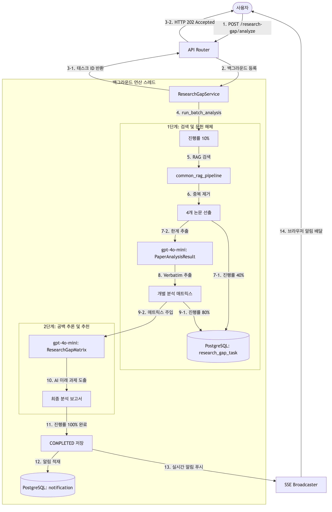
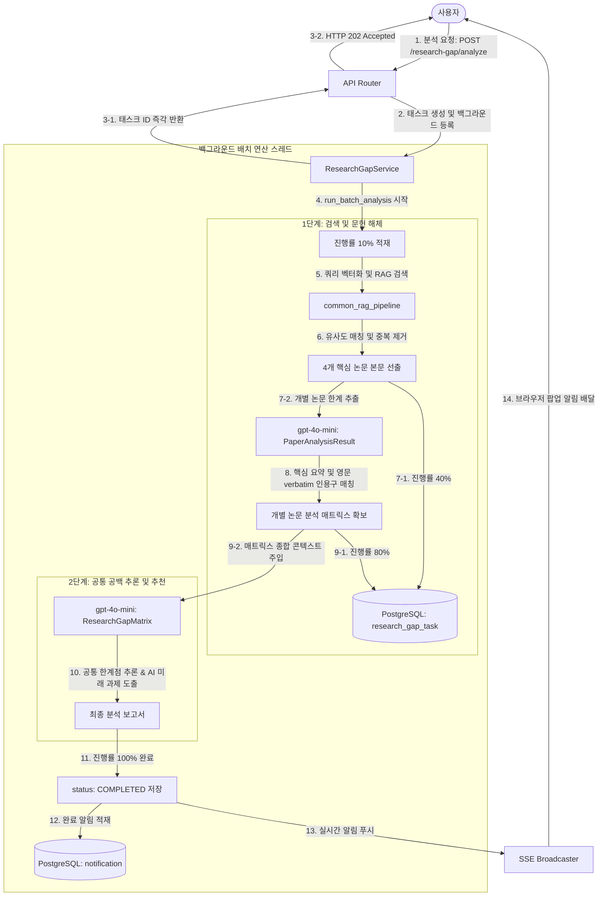
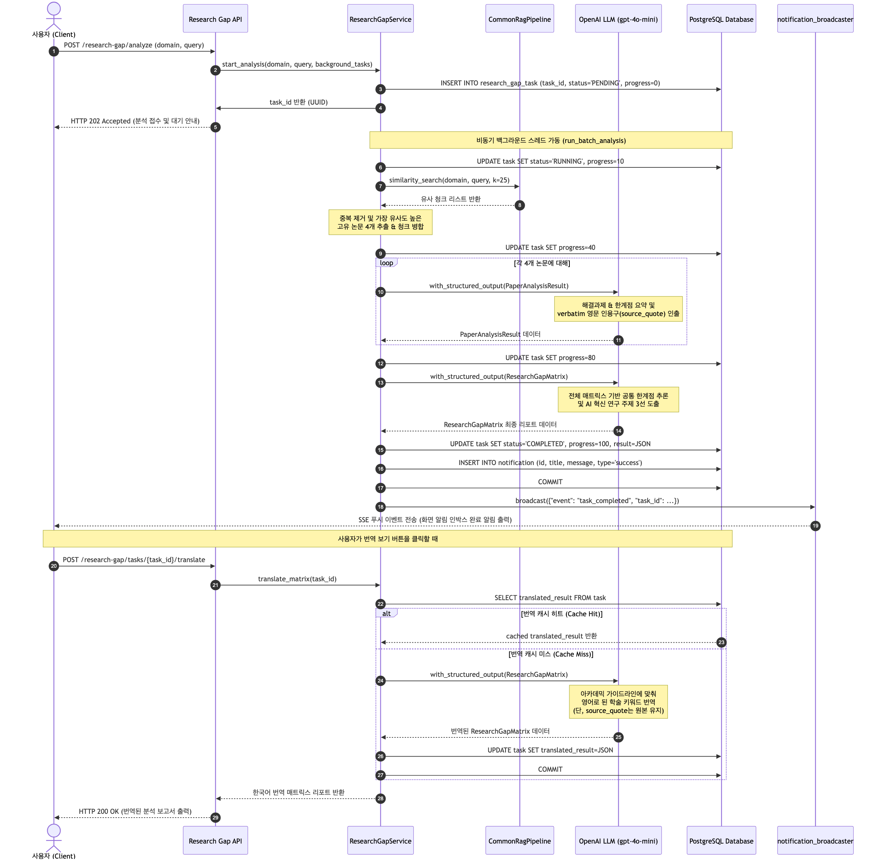
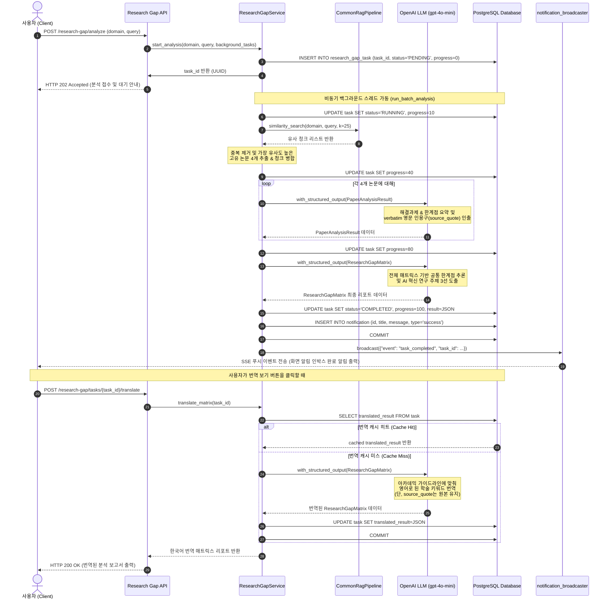

# [4차 산출물] 대규모 문헌 비교 및 연구 공백 분석기 (Research Gap Analyzer)

본 문서는 `bist-mini-2` 플랫폼의 핵심 기능 중 하나인 **대규모 문헌 비교 및 연구 공백 분석기 (Feature 2: 대규모 문헌 비교 분석기)**의 설계 구조와 전체 구현 코드를 정리한 4차 산출물입니다.

---

## 1. 아키텍처 및 배치 처리 흐름 개요

연구 공백 분석기(Research Gap Analyzer)는 특정 도메인(cs, bio, astronomy)의 기술이나 키워드에 대해 수십 편의 논문을 한 번에 종단 비교하여 **기존 학계 연구의 한계점(Limitations)을 추출하고, 미개척 영역인 연구 공백(Research Gap)을 식별하여 구체적인 미래 연구 로드맵을 AI가 추천**하는 배치 분석 솔루션입니다.

### 주요 기능 컴포넌트
1. **비동기 배치 분석 오프로딩 (Asynchronous Background Batch Processing)**
   * 다수의 논문을 임베딩하고 개별 문헌 분석과 종합 추론을 수행하는 작업은 HTTP 요청 시간 제한(Timeout)을 초과하는 대규모 연산입니다.
   * 따라서 사용자의 요청 유입 시 즉시 분석 세션 ID(`task_id`)를 발급하고 `PENDING` 상태를 응답한 뒤, FastAPI의 `BackgroundTasks` 스레드 풀로 작업을 백그라운드 오프로딩(Offloading)합니다.
2. **2단계 구조화 출력 분석 (2-Stage LLM Matrix Synthesis)**
   * **1단계 (개별 문헌 분석)**: pgvector 도메인 컬렉션에서 유사도 점수가 높은 상위 25개 청크를 우선 조회한 뒤, 중복을 배제하여 가장 연관성 높은 4개의 핵심 논문을 선별합니다. 각 논문의 Abstract/본문 텍스트를 LLM 구조화 출력(`PaperAnalysisResult`)에 집어넣어 해결 과제(`problems_solved`)와 한계점(`limitations`)을 2개씩 정밀 인출합니다.
   * **팩트 기반 인용 검증 (`source_quote` 강제)**: AI가 임의로 내용을 꾸며내는 환각을 배제하기 위해, 추출한 해결과제/한계점 항목마다 원본 논문 텍스트에 있는 영문 실제 문장/문단을 그대로 복사하여 `source_quote` 필드에 함께 바인딩 보존하도록 LLM 프롬프트와 DTO 제약을 적용했습니다.
   * **2단계 (공통 공백 추론 및 추천)**: 1단계의 분석 매트릭스를 종합 콘텍스트로 결합하여 LLM(`ResearchGapMatrix`)에 입력하고, 문헌 전반의 **공통 한계점(Common Limitations)**과 이를 돌파할 수 있는 3개의 혁신적인 **미래 연구 추천 방향(Suggested Directions)**을 최종 합성해냅니다.
3. **SSE 기반 실시간 완료 알림 (Push-based SSE Notifications)**
   * 백그라운드 태스크가 진행될 때 진행률(10%, 40%, 80%, 100%)을 독립 트랜잭션으로 DB에 영구 기록합니다.
   * 분석이 완료(`COMPLETED`)되거나 실패(`FAILED`)하면 관련 상세 알림 메타데이터를 저장하고, 사용자 브라우저에 **SSE (Server-Sent Events) 이벤트**를 통해 실시간 푸시 전송하여 화면 탑바/인박스 알림 UI에 즉각 완료 통보가 갱신되도록 구동합니다.
4. **온디맨드 아카데믹 다국어 번역 및 번역 캐싱 (On-Demand Translation & Caching)**
   * 최종 분석 매트릭스 결과는 학술 전문성을 보존하기 위해 기본적으로 영문으로 보존됩니다.
   * 사용자가 한국어 번역을 요청하면, 학술 용어(예: Transformer ➡️ 트랜스포머)를 자연스러운 문맥으로 번역하는 LLM 번역 파이프라인(`translate_matrix`)이 가동됩니다.
   * 번역된 결과물은 DB의 `translated_result` 열에 저장(Caching)하여 이후 재조회 시 API 요금을 소모하지 않고 즉시 반환하도록 최적화하였습니다.

---

## 2. Research Gap Analyzer 시각화

### A. 시스템 아키텍처 및 배치 처리 흐름도
사용자의 요청부터 비동기 스레드 실행, 그리고 RAG 검색 및 2단계 LLM 합성 연산이 일어나는 전체 구조도입니다.

> 📢 **[구글 독스 이미지 삽입 안내 - ARCHITECTURE]**
> *   구글 독스 메뉴의 `삽입 ➡️ 이미지 ➡️ 컴퓨터에서 업로드`를 통해 아래 이미지 파일을 본문에 넣어주세요.
> *   **삽입 파일**: `docs/deliverables/4th/research-gap-analyzer_architecture.png`





### B. 비동기 작업 및 실시간 알림 시퀀스 다이어그램
백그라운드 스레드 제어권 분리와 SSE 브로드캐스팅 시점을 보여주는 시간 순서별 시퀀스 다이어그램입니다.

> 📢 **[구글 독스 이미지 삽입 안내 - SEQUENCE]**
> *   구글 독스 메뉴의 `삽입 ➡️ 이미지 ➡️ 컴퓨터에서 업로드`를 통해 아래 이미지 파일을 본문에 넣어주세요.
> *   **삽입 파일**: `docs/deliverables/4th/research-gap-analyzer_sequence.png`





---

## 3. 데이터베이스 및 배치 상태 설계

### A. 배치 분석 태스크 테이블 스키마
* **테이블명**: `research_gap_task`
* **주요 칼럼 구성**:
  * `task_id` (PK, UUID String): 배치 분석 고유 작업 ID
  * `member_id` (String 20): 분석을 생성 및 요청한 회원 아이디
  * `domain` (String 50): 학술 도메인 (`cs`, `bio`, `astronomy`)
  * `query` (Text): 사용자가 분석을 의뢰한 검색 질의 키워드
  * `status` (String 50): 작업 현재 상태 (`PENDING`, `RUNNING`, `COMPLETED`, `FAILED`)
  * `progress` (Integer): 작업 중간 진행률 ($0 \sim 100\%$)
  * `result` (JSONB): 최종 완료된 영문 분석 매트릭스 JSON 데이터
  * `translated_result` (JSONB): 한국어로 번역된 최종 분석 매트릭스 캐시 JSON 데이터
  * `error_message` (Text): 작업 실패 시 상세 에러 원인 본문
  * `created_at` (DateTime) / `updated_at` (DateTime)

### B. 작업 진행 단계별 진행률 공식 정의
백그라운드 루프가 진행됨에 따라 DB 세션을 별도 열어 진행률을 실시간 업데이트합니다.
1. **`PENDING` (0%)**: 요청이 수신되어 DB에 행이 등록된 직후.
2. **`RUNNING` (10%)**: 백그라운드 태스크가 시작되어 검색 키워드 벡터 인코딩을 준비하는 단계.
3. **`RUNNING` (40%)**: PGVector RAG 탐색이 끝나고 상위 4개 고유 논문 본문을 취합해 개별 문헌 분석 준비 완료 시점.
4. **`RUNNING` (80%)**: 4개 논문 각각의 "해결 과제" 및 "한계점"과 이에 결합되는 영문 verbatim 인용구를 모두 추출한 시점.
5. **`COMPLETED` / `FAILED` (100%)**: 공통 공백 추론 및 AI 연구방향 합성 보고서 출력이 완전히 끝나 JSON 데이터를 커밋하거나 작업 예외가 포착되어 실패 처리된 최종 완료 시점.

---

## 4. Research Gap Analyzer 핵심 구현 코드 및 로직 상세 분석

### A. 분석 코어 및 번역 서비스: `backend/api/v1/research_gap/services.py`
RAG 논문 검색, 2단계 구조화 출력 LLM 호출, 트랜잭션 상태 커밋, SSE 브로드캐스팅, 그리고 전문 학술 다국어 번역을 총괄하는 비즈니스 컨트롤러 파일입니다.

* [services.py](file:///Users/pileuszu/Repos/bist-mini-2/backend/api/v1/research_gap/services.py)

```python
"""대규모 학술 문체 비교 및 연구 공백(Research Gap) 분석을 수행하는 서비스 모듈입니다."""

import asyncio
import json
import logging
from typing import Annotated, Optional, AsyncGenerator, Any
from fastapi import Depends
from sqlalchemy import select
from langchain_openai import ChatOpenAI
from langchain_core.prompts import ChatPromptTemplate

from api.common.config import settings
from api.database.config.dbsession import session_maker
from api.v1.research_gap.dao import ResearchGapDaoDep, ResearchGapDao
from api.v1.research_gap.embedding import embedding_helper
from api.v1.notification.notifier import notification_broadcaster
from api.v1.research_gap.models import PaperAnalysisResult, ResearchGapMatrix


class ResearchGapService:
    """대규모 문헌 비교 및 학계 연구 공백(Research Gap) 분석을 수행하는 서비스입니다."""

    def __init__(self, research_gap_dao: ResearchGapDaoDep) -> None:
        self.logger = logging.getLogger(f"{__name__}.ResearchGapService")
        self.research_gap_dao = research_gap_dao

    async def start_analysis(self, domain: str, query: str, background_tasks, mid: str) -> str:
        """분석 요청을 받아 유효성을 확인한 뒤 새 태스크를 생성하고 백그라운드 배치 연산을 예약합니다."""
        target_domain = domain.lower().strip()
        if target_domain not in ("cs", "bio", "astronomy"):
            from api.common.exceptions import BusinessException
            raise BusinessException(
                message="지원되지 않는 도메인입니다. cs, bio, astronomy 도메인만 분석을 지원합니다.",
                error_code="UNSUPPORTED_DOMAIN"
            )

        import uuid
        task_id = str(uuid.uuid4())
        await self.research_gap_dao.create_task(task_id, target_domain, query, mid)
        background_tasks.add_task(self.run_batch_analysis, task_id, target_domain, query, mid)
        
        return task_id

    async def run_batch_analysis(self, task_id: str, domain: str, query: str, mid: str) -> None:
        """백그라운드에서 실행되는 비동기 분석 배치 처리 코어 로직입니다."""
        self.logger.info(f"Background batch task {task_id} started (mid={mid}, domain={domain}, query={query})")

        # 1. RUNNING 상태로 업데이트 (10%)
        async with session_maker() as session:
            dao = ResearchGapDao(session)
            await dao.update_task_progress(task_id, "RUNNING", 10)
            await session.commit()

        try:
            query_vector = embedding_helper.encode(query)

            # 2. RAG 도구 연동 및 중복 논문 필터링 (30%)
            papers_list = []
            if domain in ("cs", "bio", "astronomy"):
                from api.common.rag_pipeline import common_rag_pipeline
                results = await common_rag_pipeline.similarity_search(domain, query, k=25)
                
                temp_papers: dict[str, dict[str, Any]] = {}
                for r in results:
                    arxiv_id = r["doc_id"]
                    if not arxiv_id:
                        continue
                    
                    title = r["title"]
                    content = r["text_chunk"]
                    similarity = r["score"]
                    
                    if arxiv_id not in temp_papers:
                        temp_papers[arxiv_id] = {
                            "arxiv_id": arxiv_id,
                            "title": title,
                            "similarity": similarity,
                            "chunks": [content]
                        }
                    else:
                        chunks = temp_papers[arxiv_id]["chunks"]
                        if isinstance(chunks, list) and content not in chunks:
                            chunks.append(content)
                
                # 중복 제거된 상위 4개 고유 문헌을 추출하고 청크 결합
                for arxiv_id, p_info in temp_papers.items():
                    if len(papers_list) >= 4:
                        break
                    joined_content = "\n\n".join(p_info["chunks"])
                    papers_list.append({
                        "arxiv_id": p_info["arxiv_id"],
                        "title": p_info["title"],
                        "similarity": p_info["similarity"],
                        "content": joined_content
                    })

            if not papers_list:
                raise ValueError("검색된 관련 논문 자료가 없습니다.")

            async with session_maker() as session:
                dao = ResearchGapDao(session)
                await dao.update_task_progress(task_id, "RUNNING", 40)
                await session.commit()

            # 3. LLM 개별 논문 분석 (60%)
            llm = ChatOpenAI(model="gpt-4o-mini", openai_api_key=settings.OPENAI_API_KEY, temperature=0)
            structured_llm = llm.with_structured_output(PaperAnalysisResult)

            analyzed_papers = []
            for paper in papers_list:
                paper_id = paper["arxiv_id"]
                title = paper["title"]
                content = paper["content"]
                similarity = paper["similarity"]

                prompt = ChatPromptTemplate.from_messages([
                    ("system", (
                        "You are an academic researcher analyzing a scientific paper abstract.\n"
                        "Extract the problems solved and the limitations discussed in the provided text.\n"
                        "You must extract at most 2 problems solved and at most 2 limitations per paper.\n\n"
                        "For each extracted item, you must also locate and extract the verbatim sentence or paragraph "
                        "that directly supports this claim, and place it in the 'source_quote' field of the item. "
                        "Do not paraphrase or rewrite the 'source_quote' in any way.\n\n"
                        "Response must be in English and structured in the requested format."
                    )),
                    ("user", "Title: {title}\nArXiv ID: {arxiv_id}\n\nContent:\n{content}")
                ])

                chain = prompt | structured_llm
                result_obj = await chain.ainvoke({
                    "title": title,
                    "arxiv_id": paper_id,
                    "content": content
                })

                if not isinstance(result_obj, PaperAnalysisResult):
                    raise TypeError(f"Expected PaperAnalysisResult, got {type(result_obj)}")

                result_obj.similarity = similarity
                analyzed_papers.append(result_obj)

            async with session_maker() as session:
                dao = ResearchGapDao(session)
                await dao.update_task_progress(task_id, "RUNNING", 80)
                await session.commit()

            # 4. 연구 공백 매트릭스 종합 및 추천 방향 합성 (95%)
            matrix_data = "\n\n".join([
                f"Paper: {p.title} (ID: {p.arxiv_id})\n"
                f"- Solved: {', '.join([item.summary for item in p.problems_solved])}\n"
                f"- Limitations: {', '.join([item.summary for item in p.limitations])}"
                for p in analyzed_papers
            ])

            synthesis_prompt = ChatPromptTemplate.from_messages([
                ("system", (
                    "You are a visionary research scientist overseeing the research gap matrix of a specific domain.\n"
                    "Review the analysis results of multiple papers, identify the common limitations, "
                    "and propose 3 highly innovative and concrete future research topics.\n"
                    "Respond in English. Structure the response strictly according to the format."
                )),
                ("user", "Research Gap Matrix:\n{matrix_data}\n\nTarget Domain: {domain}\nTarget Query: {query}")
            ])

            synthesis_llm = llm.with_structured_output(ResearchGapMatrix)
            final_report = await (synthesis_prompt | synthesis_llm).ainvoke({
                "matrix_data": matrix_data,
                "domain": domain,
                "query": query
            })

            for idx, paper_report in enumerate(final_report.papers):
                match = next((p for p in analyzed_papers if p.arxiv_id == paper_report.arxiv_id), None)
                if match:
                    paper_report.similarity = match.similarity

            dumped_report = final_report.model_dump()

            # 5. COMPLETED 상태 커밋 (100%)
            async with session_maker() as session:
                dao = ResearchGapDao(session)
                await dao.update_task_progress(task_id, "COMPLETED", 100, result=dumped_report)
                await session.commit()

            # 알림 테이블 기록 및 SSE 전송
            import uuid
            notif_id = str(uuid.uuid4())
            notif_title = "연구 공백 분석 완료"
            notif_msg = f"[{domain.upper()}] \"{query}\" 주제의 문헌 비교 분석이 완료되었습니다."
            
            async with session_maker() as session:
                from api.v1.notification.dao import NotificationDao
                notif_dao = NotificationDao(session)
                await notif_dao.create_notification(notif_id, mid, notif_title, notif_msg, "success", task_id)
                await session.commit()

            await notification_broadcaster.broadcast({
                "id": notif_id,
                "event": "task_completed",
                "task_id": task_id,
                "domain": domain,
                "query": query,
                "status": "COMPLETED",
                "progress": 100,
                "mid": mid,
                "title": notif_title,
                "message": notif_msg,
                "type": "success"
            })

        except Exception as e:
            self.logger.error(f"Error executing batch analysis task {task_id}: {e}", exc_info=True)
            async with session_maker() as session:
                dao = ResearchGapDao(session)
                await dao.update_task_progress(task_id, "FAILED", 100, error_message=str(e))
                await session.commit()

            import uuid
            notif_id = str(uuid.uuid4())
            notif_title = "연구 공백 분석 실패"
            notif_msg = f"[{domain.upper()}] \"{query}\" 분석 중 에러가 발생했습니다: {str(e)}"
            
            async with session_maker() as session:
                from api.v1.notification.dao import NotificationDao
                notif_dao = NotificationDao(session)
                await notif_dao.create_notification(notif_id, mid, notif_title, notif_msg, "danger", task_id)
                await session.commit()

            await notification_broadcaster.broadcast({
                "id": notif_id,
                "event": "task_failed",
                "task_id": task_id,
                "domain": domain,
                "query": query,
                "status": "FAILED",
                "progress": 100,
                "error_message": str(e),
                "mid": mid,
                "title": notif_title,
                "message": notif_msg,
                "type": "danger"
            })

    async def translate_matrix(self, task_id: str, mid: str) -> dict:
        """주어진 태스크 ID의 영문 분석 결과를 한국어로 번역하고 DB에 캐싱합니다."""
        task = await self.research_gap_dao.get_task(task_id, mid=mid)
        if not task:
            from api.common.exceptions import TaskNotFoundError
            raise TaskNotFoundError(message=f"요청하신 태스크 ID를 찾을 수 없습니다: {task_id}")
            
        if task.translated_result:
            self.logger.info(f"Returning cached translation for task: {task_id}")
            return task.translated_result

        if not task.result or task.status != "COMPLETED":
            from api.common.exceptions import BusinessException
            raise BusinessException(message="분석이 완료되지 않아 번역할 수 없습니다.", error_code="TRANSLATION_NOT_READY")

        matrix = ResearchGapMatrix.model_validate(task.result)
        
        domain_name_map = {"cs": "computer science", "bio": "biotechnology", "astronomy": "astronomy"}
        domain_eng = domain_name_map.get(task.domain.lower(), "academic research")
        
        llm = ChatOpenAI(model="gpt-4o-mini", openai_api_key=settings.OPENAI_API_KEY, temperature=0)
        
        prompt = ChatPromptTemplate.from_messages([
            ("system", (
                f"You are an expert academic translator specializing in {domain_eng}.\n"
                "Translate the given Research Gap Matrix into natural, professional, and clear Korean.\n\n"
                "Strictly follow these translation guidelines:\n"
                "1. DO NOT translate specific technical model names literally (e.g., 'Transformer' -> '트랜스포머').\n"
                "2. Keep common domain-specific acronyms in English (MLP, RAG, CRISPR, CMB).\n"
                "3. Use a formal, concise academic tone (e.g., '~을 해결함', '~ 최적화').\n"
                "4. DO NOT translate the 'source_quote' field of each paper. Keep the 'source_quote' in its original English verbatim.\n\n"
                "Response must be structured in the requested format."
            )),
            ("user", "{matrix_json}")
        ])
        
        structured_llm = llm.with_structured_output(ResearchGapMatrix)
        translated = await (prompt | structured_llm).ainvoke({
            "matrix_json": json.dumps(matrix.model_dump(), ensure_ascii=False)
        })
        
        translated_dict = translated.model_dump()
        
        # 팩트 교란 방지를 위한 원본 영문 인용구(source_quote) 복원 연산
        for idx, paper in enumerate(translated_dict.get("papers", [])):
            if idx < len(matrix.papers):
                orig_paper = matrix.papers[idx]
                paper["similarity"] = orig_paper.similarity
                
                for p_idx, item in enumerate(paper.get("problems_solved", [])):
                    if p_idx < len(orig_paper.problems_solved):
                        item["source_quote"] = orig_paper.problems_solved[p_idx].source_quote
                        
                for l_idx, item in enumerate(paper.get("limitations", [])):
                    if l_idx < len(orig_paper.limitations):
                        item["source_quote"] = orig_paper.limitations[l_idx].source_quote
        
        async with session_maker() as session:
            dao = ResearchGapDao(session)
            await dao.update_task_translation(task_id, translated_dict)
            await session.commit()
            
        return translated_dict
```

#### 💡 핵심 로직 설명:
1. **FastAPI BackgroundTasks와 쿼리 분리 실행**:
   * 대량의 RAG 및 다중 LLM 연산은 웹 서블릿 스레드를 오랜 기간 대기 상태로 유휴(idle)시킵니다. 이에 따라 요청 접수 즉시 `task_id`를 디비에 적재하여 리턴하고 코어 분석 함수(`run_batch_analysis`)를 백그라운드 태스크로 던집니다.
   * 배치 전용 루프는 독립된 세션 팩토리(`session_maker()`)를 통해 개별 `Session`을 열어 갱신할 때마다 `commit()`을 따로 처리하므로, 비정상 작업 다운 시에도 진행 상항 데이터가 유실 없이 저장소에 물리 반영됩니다.
2. **논문 중복 제거 및 Top 4 문헌 선출 알고리즘**:
   * 초록 RAG 검색 시 동일한 논문의 서로 다른 청크들이 중복되어 결과로 쏟아질 수 있습니다.
   * `temp_papers` 해시 맵 구조를 구현하여 arXiv ID(`arxiv_id`)를 고유 키로 두고, 중복된 논문은 하나의 엔트리 내 `chunks` 리스트로 병합합니다. 이후 고유 논문 유사도가 가장 높은 순서대로 4개를 선점하고 청크들을 개행(`\n\n`)으로 결합해 LLM 컨텍스트 밀도를 정합화시킵니다.
3. **`source_quote` verbatim(원문 그대로) 보존 지침**:
   * AI 요약본(`summary`)의 왜곡 및 환각을 팩트체크할 수 있도록, 추출 대상 구절에 매칭되는 본문 영어 실제 단락을 `source_quote` 필드에 토시 하나 바꾸지 않고 긁어와 담도록 LLM 규칙과 Pydantic 모델을 결합 설계했습니다.
4. **학술 전문 번역 및 영문 팩트 데이터 복원 기법**:
   * 영문 보고서를 한국어로 번역할 때, 도메인 전문 고유 명사의 훼손을 막기 위해 가이드라인 지침 프롬프트를 번역용 `structured_llm`에 인젝션합니다.
   * 특히, 번역 과정에서 `source_quote` 내에 영문으로 적혀 있던 실제 논문 인용 구절이 한국어로 멋대로 번역되어 원문 팩트의 고유성이 상실되는 것을 막기 위해, 번역 LLM 구동 완료 직후 원본 영문 `source_quote`를 순회 매핑하여 강제로 덮어씌워(overwrite) 복원해내는 방지 로직을 구현했습니다.

---

### B. 연구 공백 분석용 Pydantic DTO: `backend/api/v1/research_gap/models.py`
요청, 분석 결과 및 종합 매트릭스 리포트의 구조를 규정하고 있는 스키마 정의 파일입니다.

* [models.py](file:///Users/pileuszu/Repos/bist-mini-2/backend/api/v1/research_gap/models.py)

```python
from typing import Any, List, Optional
from pydantic import Field
from api.database.config.dto_base import BaseDTO


class AnalysisItem(BaseDTO):
    """핵심 요약 정보와 그에 매핑되는 논문 본문 원문(인용구)을 갖는 DTO 스키마입니다."""
    summary: str = Field(..., description="요약된 핵심 정보")
    source_quote: str = Field(..., description="요약의 근거가 된 논문 원문의 실제 인용 구절 (영문 원본)")


class PaperAnalysisResult(BaseDTO):
    """개별 논문 분석 결과를 나타내는 Pydantic Structured Output용 DTO 스키마입니다."""
    title: str = Field(..., description="논문 제목")
    arxiv_id: str = Field(..., description="ArXiv 논문 고유 ID")
    problems_solved: List[AnalysisItem] = Field(
        ...,
        max_length=2,
        description="논문에서 해결한 주요 문제 및 제안한 핵심 방법론 목록 (최대 2개)"
    )
    limitations: List[AnalysisItem] = Field(
        ...,
        max_length=2,
        description="논문에서 언급되었거나 식별된 한계점 및 향후 과제 목록 (최대 2개)"
    )
    similarity: Optional[float] = Field(None, description="유사도 스코어")


class ResearchGapMatrix(BaseDTO):
    """비동기 분석 태스크의 최종 매트릭스 및 연구 공백 리포트 정보가 담긴 DTO 스키마입니다."""
    papers: List[PaperAnalysisResult] = Field(..., description="수집/분석된 논문들의 핵심 정보 매트릭스")
    common_limitations: List[str] = Field(..., description="분석 대상 논문군 전반에 걸쳐 식별된 공통적인 한계점 목록")
    suggested_directions: List[str] = Field(..., description="식별된 한계점/연구 공백을 보완하는 구체적인 AI 추천 연구 로드맵 주제 및 방법론 목록")
```

#### 💡 핵심 로직 설명:
1. **`AnalysisItem`과 `PaperAnalysisResult` 모델 중첩 스펙**:
   * 각 논문별로 `problems_solved`와 `limitations`를 `List[AnalysisItem]` 타입으로 규정하여, 요약과 원문 복사본이 반드시 한 쌍(Tuple 구조)으로 매핑되도록 강제함으로써 데이터 구조의 원자성을 보장했습니다.
2. **`ResearchGapMatrix` 종합 리포트 스펙**:
   * 번역 및 최종 완성 데이터 처리에 사용되는 DTO 최상위 노드로, 논문 목록 배열(`papers`), 공통적 문제점 추출 배열(`common_limitations`), 그리고 AI 추천 해결 로드맵 방향성 배열(`suggested_directions`)을 명시적으로 정합하여 직렬화에 활용합니다.

---

## 5. 핵심 기술 구현 요약 및 성능/알림 최적화 전략

1. **FastAPI BackgroundTasks 기반 연산 격리**
   * 대규모 문헌 분석 파이프라인의 연산 시간 지연(약 20~30초)에 따른 블로킹 현상을 완벽히 격리하기 위해, FastAPI 백그라운드 태스크에 핵심 알고리즘 루프를 위임하여 API 서버의 다중 처리량을 안정적으로 확보하였습니다.
2. **중첩 트랜잭션을 통한 진행도(Progress) DB 커밋**
   * 배치 작업 도중 개별 트랜잭션을 짧게 끊어 PostgreSQL DB 세션의 `update_task_progress`를 호출하므로 사용자는 실시간으로 진행률($10\% \rightarrow 40\% \rightarrow 80\% \rightarrow 100\%$)을 모니터링할 수 있습니다.
3. **SSE(Server-Sent Events) 브로드캐스트 기반 푸시 연동**
   * 배치 분석 스레드가 최종 완료되면, 알림(Notification) DB 적재와 함께 인메모리 SSE 브로드캐스터인 `notification_broadcaster.broadcast`를 호출하여 클라이언트에 실시간 이벤트를 전송, 화면 새로고침 없이 완료 소식이 알림창에 팝업되도록 통합 구현했습니다.
4. **이중 번역 방지 캐시 (Translation Caching)**
   * 다소 긴 텍스트로 구성된 RAG 분석 보고서를 매번 LLM API를 사용하여 다국어 번역할 시 막대한 API 청구 요금과 연산 지연이 발생합니다.
   * 이를 해결하기 위해 DB 테이블 내 `translated_result` JSONB 컬렉션을 두어, 최초 1회 한국어 번역 성공 시 이 필드에 결과를 영구 캐싱하여 이후 조회에는 지연 없는 초고속 캐시 히트를 적용했습니다.
