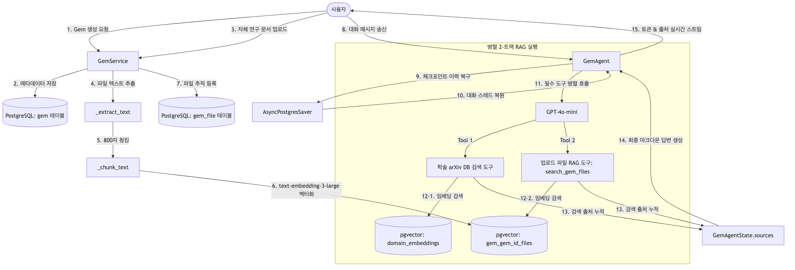
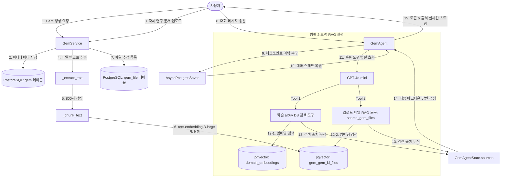
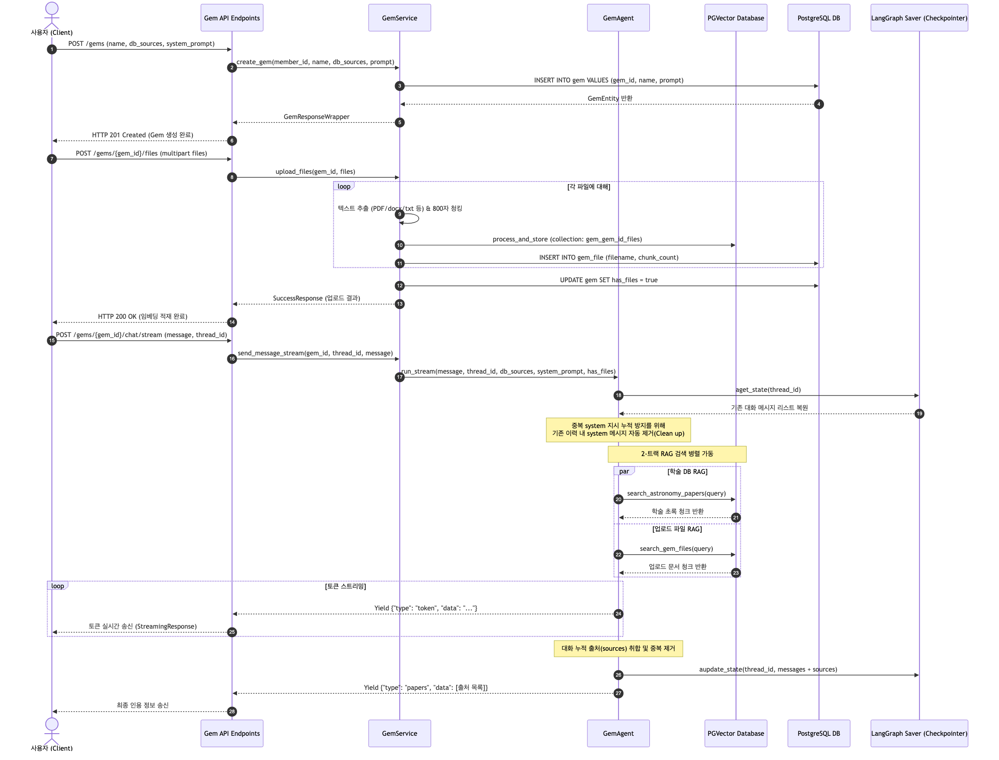
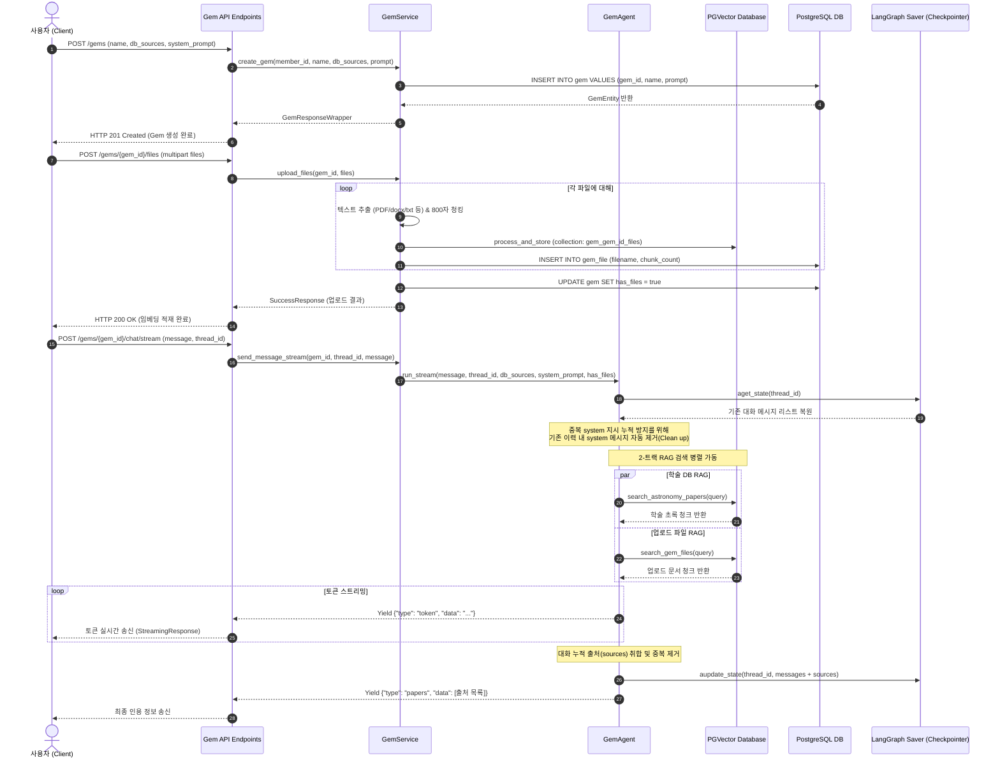

# [4차 산출물] 사용자 정의 연구 비서 (Gem Factory) 아키텍처 및 구현 코드

본 문서는 `bist-mini-2` 플랫폼의 핵심 기능 중 하나인 **연구 비서 Gem 팩토리 (Feature 3: 사용자 정의 연구 비서)**의 설계 구조와 전체 구현 코드를 정리한 4차 산출물입니다.

---

## 1. 아키텍처 및 데이터 흐름 개요

연구 비서 Gem 팩토리는 사용자가 본인의 연구 도메인 및 특정 목적(예: 논문 심사위원, 특허 분석가, 특정 연구 가이드라인 리뷰어 등)에 부합하는 **나만의 커스텀 AI 연구 비서(Gem)**를 직접 개설하고 학습용 문서를 주입할 수 있도록 설계되었습니다.

### 주요 기능 컴포넌트
1. **커스텀 페르소나 및 데이터 영역 바인딩 (Persona & Domain Scope Binding)**
   * 사용자는 Gem 생성 시 에이전트가 작동할 시스템 프롬프트(페르소나)와 RAG 검색 대상이 될 학술 도메인 데이터 소스(생명공학 `bio`, 컴퓨터 과학 `cs`, 천문학 `astronomy` 중 다중 선택 가능)를 지정합니다.
2. **동적 파일 RAG 시스템 (Dynamic User Document Upload & Vectorization)**
   * 사용자가 자신의 연구용 참고 문헌(PDF, DOCX, TXT 등)을 Gem에 업로드하면, 백엔드에서 텍스트를 추출하고 800자(오버랩 150자) 크기로 청킹합니다.
   * 추출된 청크는 해당 Gem에 격리된 고유 pgvector 컬렉션(`gem_{gem_id}_files`)에 실시간으로 임베딩 및 적재되며, 데이터베이스(`gem_file` 테이블)에 파일 메타데이터가 기록됩니다.
3. **2-트랙 병렬 RAG 에이전트 구동 (Parallel Two-Track RAG Agent)**
   * 사용자가 업로드한 문서가 존재할 경우, 에이전트 실행 시 학술 DB 검색 도구(예: `search_astronomy_papers`)와 사용자 업로드 문서 검색 도구(`search_gem_files`)가 동시에 탑재됩니다.
   * 에이전트는 사용자의 질문을 수신하면 시스템 프롬프트 내에 기재된 강력한 도구 강제 제약 조건에 따라 **두 검색 도구를 병렬로 실행**하여 상호 검증된 맥락을 획득합니다.
4. **체크포인터를 활용한 대화 히스토리 영구 적재 (State Persistence via Postgres Checkpointer)**
   * LangGraph의 `AsyncPostgresSaver`를 활용하여 개별 대화 스레드(`thread_id`)별로 전체 대화 노드 및 RAG를 통해 수집된 출처 리스트(`sources`)를 PostgreSQL 데이터베이스(`checkpoints` 등 관련 스토리지)에 영구적으로 보존 및 복원합니다.

---

## 2. Gem Factory 아키텍처 시각화

### A. 시스템 아키텍처 및 RAG 데이터 흐름도
사용자가 문서를 주입하고, 대화를 나눌 때 일어나는 전체적인 RAG 데이터 흐름 및 에이전트 오케스트레이션 구조를 나타낸 흐름도입니다.

> 📢 **[구글 독스 이미지 삽입 안내 - ARCHITECTURE]**
> *   구글 독스 메뉴의 `삽입 ➡️ 이미지 ➡️ 컴퓨터에서 업로드`를 통해 아래 이미지 파일을 본문에 넣어주세요.
> *   **삽입 파일**: `docs/deliverables/4th/research-gem-factory_architecture.png`





### B. 동작 시퀀스 다이어그램
새로운 Gem을 만들고, 파일을 학습시킨 뒤, 멀티턴 스트리밍 대화를 수행하는 시간 순서별 시퀀스 다이어그램입니다.

> 📢 **[구글 독스 이미지 삽입 안내 - SEQUENCE]**
> *   구글 독스 메뉴의 `삽입 ➡️ 이미지 ➡️ 컴퓨터에서 업로드`를 통해 아래 이미지 파일을 본문에 넣어주세요.
> *   **삽입 파일**: `docs/deliverables/4th/research-gem-factory_sequence.png`





---

## 3. 데이터베이스 테이블 및 pgvector 설계

### A. 데이터베이스 스키마
사용자 정의 연구 비서 기능은 메타데이터 관리를 위해 두 개의 테이블을 연동하여 사용합니다.

1. **`gem` (메타데이터 및 사용 범위)**
   * `gem_id` (PK, String 36): 에이전트 고유 식별 UUID
   * `member_id` (String 20): 소유한 사용자 계정 ID
   * `name` (String 100): 에이전트 명칭
   * `db_sources` (String 50): 참고 학술 분야 콤마 구분자 문자열 (예: `"bio,cs,astronomy"`)
   * `system_prompt` (Text): 사용자가 지시한 페르소나 및 룰셋 본문
   * `has_files` (Boolean): 사용자 개별 업로드 파일 주입 여부
   * `created_at` (DateTime): 생성 일시
2. **`gem_file` (사용자 업로드 파일 정보)**
   * `file_id` (PK, String 36): 파일 고유 UUID
   * `gem_id` (FK, ON DELETE CASCADE): 소속된 Gem ID
   * `filename` (String 255): 원본 파일명
   * `chunk_count` (Integer): 벡터 데이터베이스에 생성된 청크 수
   * `uploaded_at` (DateTime): 파일 주입 일시

### B. pgvector 동적 컬렉션
* 사용자가 개설한 Gem에 파일을 적재할 때, 데이터 격리 및 물리적 성능 확보를 위해 **단일 컬렉션에 전체 사용자의 데이터를 밀어 넣지 않고, 각 Gem ID 단위로 격리된 컬렉션을 동적으로 생성**합니다.
* **컬렉션 명명 규칙**: `gem_{gem_id}_files`
* **청킹 규격**: 800자 (오버랩 150자)
* **임베딩 모델**: `text-embedding-3-large` (3,072차원)
* **생명 주기**: 사용자가 해당 Gem을 삭제할 경우, RAG collection에 대해 `adelete_collection()`이 트리거되어 pgvector 임베딩 공간이 완전 파쇄(Wipe-Out)됩니다.

---

## 4. 연구 비서 Gem Factory 핵심 구현 코드 및 로직 상세 분석

### A. 데이터베이스 매핑 엔티티: `backend/api/v1/gems/entity.py`
Gem 및 업로드 파일 정보에 대한 데이터베이스 맵 테이블을 지정하고 있는 엔티티 파일입니다.

* [entity.py](file:///Users/pileuszu/Repos/bist-mini-2/backend/api/v1/gems/entity.py)

```python
from datetime import datetime
from sqlalchemy.orm import Mapped, mapped_column
from sqlalchemy import String, Text, DateTime, Boolean, ForeignKey, Integer, func
from api.database.config.entity_base import Base


class GemEntity(Base):
    """사용자 정의 연구 비서(Gem) 메타데이터 엔티티.

    name, db_sources(RAG 필터), system_prompt를 영구 저장한다.
    실제 대화 이력은 AsyncPostgresSaver가 thread_id(gem_id + session suffix)별로 별도 저장한다.
    has_files: 사용자가 업로드한 파일의 임베딩이 pgvector에 저장되어 있는지 여부.
    """
    __tablename__ = "gem"

    gem_id: Mapped[str] = mapped_column("gem_id", String(36), primary_key=True)
    member_id: Mapped[str] = mapped_column("member_id", String(20), nullable=False)
    name: Mapped[str] = mapped_column("name", String(100), nullable=False)
    db_sources: Mapped[str] = mapped_column("db_sources", String(50), nullable=False)  # e.g. "bio,cs,astronomy"
    system_prompt: Mapped[str] = mapped_column("system_prompt", Text, nullable=False)
    has_files: Mapped[bool] = mapped_column("has_files", Boolean, nullable=False, server_default="false")
    created_at: Mapped[datetime] = mapped_column("created_at", DateTime, server_default=func.now())


class GemFileEntity(Base):
    """Gem에 업로드된 파일의 메타데이터 엔티티.

    pgvector에 임베딩이 저장된 파일의 원본 이름, 청크 수 등을 추적한다.
    gem 삭제 시 CASCADE로 자동 삭제된다.
    """
    __tablename__ = "gem_file"

    file_id: Mapped[str] = mapped_column("file_id", String(36), primary_key=True)
    gem_id: Mapped[str] = mapped_column(
        "gem_id",
        String(36),
        ForeignKey("gem.gem_id", ondelete="CASCADE"),
        nullable=False,
    )
    filename: Mapped[str] = mapped_column("filename", String(255), nullable=False)
    chunk_count: Mapped[int] = mapped_column("chunk_count", Integer, nullable=False, default=0)
    uploaded_at: Mapped[datetime] = mapped_column("uploaded_at", DateTime, server_default=func.now())
```

#### 💡 핵심 로직 설명:
1. **`db_sources` 컬럼**:
   * "bio,cs,astronomy"처럼 사용자가 선택한 분야 키워드를 콤마(,) 구분 문자열로 저장합니다. 런타임에 에이전트를 구동할 때 `db_sources.split(",")` 하여 해당하는 RAG 도구들만 동적으로 불러와 바인딩하는 설정 필터입니다.
2. **`GemFileEntity` 외래키 `ON DELETE CASCADE`**:
   * Gem 메타데이터(`GemEntity`)와 파일 메타데이터(`GemFileEntity`)는 1:N 관계를 맺습니다. 데이터 무결성 보장을 위해 외래키 관계에 연쇄 삭제(`ondelete="CASCADE"`) 제약을 걸어두어 사용자가 특정 Gem을 삭제하면 관계된 DB 파일 메타 행들이 물리적으로 한 번에 자동 소거되도록 구성했습니다.

---

### B. 동적 RAG 및 에이전트 구동: `backend/api/v1/gems/gem_agent.py`
주입된 페르소나 및 파일 여부에 맞춰 RAG 툴 리스트를 조율하고, LangGraph를 통해 토큰 단위 스트리밍 및 체크포인트 대화 히스토리 저장을 지휘하는 핵심 파일입니다.

* [gem_agent.py](file:///Users/pileuszu/Repos/bist-mini-2/backend/api/v1/gems/gem_agent.py)

```python
import asyncio
import json
import logging
import operator
from typing import Annotated, Any, cast, AsyncGenerator

from fastapi import Depends
from langchain.agents import create_agent, AgentState
from langchain.tools import tool, ToolRuntime
from langchain_core.messages import ToolMessage, SystemMessage
from langgraph.checkpoint.postgres.aio import AsyncPostgresSaver
from langgraph.types import Command
from pydantic import BaseModel, Field

from api.common.rag_pipeline import (
    search_bio_papers,
    search_cs_papers,
    search_astronomy_papers,
)
from api.database.config.psycopg_pool import psycopg_pool as chat_psycopg_pool


def reduce_sources(left: list[dict] | None, right: list[dict] | None) -> list[dict]:
    """멀티턴 간 출처(sources) 누적을 제어하고 중복을 방지하는 리듀서입니다."""
    if not right:
        return left or []

    for item in right:
        if isinstance(item, dict) and item.get("action") == "clear":
            return [x for x in right if x.get("action") != "clear"]

    return (left or []) + right


class GemAgentState(AgentState):
    """Gem 에이전트의 대화 상태 및 검색된 출처 목록을 저장하는 상태 정의 딕셔너리입니다."""
    sources: Annotated[list[dict], reduce_sources]


logger = logging.getLogger(__name__)

_TOOL_MAP = {
    "bio": search_bio_papers,
    "cs": search_cs_papers,
    "astronomy": search_astronomy_papers,
}


def _make_file_search_tool(gem_id: str):
    """gem_id를 캡처한 동적 파일 검색 툴을 생성합니다."""
    from api.common.rag_pipeline import gem_file_rag

    @tool
    async def search_gem_files(query: str, runtime: ToolRuntime, k: int = 10) -> Command:
        """사용자가 이 Gem에 업로드한 파일 내용에서 관련 정보를 검색합니다.

        업로드 파일 기반 질문이거나 추가 맥락이 필요할 때 이 도구를 호출하세요.
        """
        results = await gem_file_rag.search(gem_id, query, k=k)

        if results is None or not results:
            msg = f"업로드된 파일에서 '{query}'와 관련된 내용을 찾지 못했습니다."
            return Command(update={
                "messages": [ToolMessage(content=msg, tool_call_id=runtime.tool_call_id)],
            })

        output_lines = [f"업로드 파일 검색 결과: '{query}'\n", "=" * 80]
        file_sources = []
        seen_files: set[str] = set()
        for idx, r in enumerate(results, 1):
            output_lines.append(f"\n[파일 {idx}] {r['filename']} (유사도: {r['score']:.4f})")
            output_lines.append(f"\n내용:\n{r['text_chunk']}\n")
            output_lines.append("-" * 80)
            if r["filename"] not in seen_files:
                seen_files.add(r["filename"])
                snippet = " ".join((r["text_chunk"] or "").split())
                if len(snippet) > 160:
                    snippet = snippet[:160].rstrip() + "…"
                file_sources.append({
                    "type": "file",
                    "arxiv_id": "",
                    "title": r["filename"],
                    "summary": snippet,
                    "score": round(r["score"], 4),
                })

        return Command(update={
            "messages": [ToolMessage(content="\n".join(output_lines), tool_call_id=runtime.tool_call_id)],
            "sources": file_sources,
        })

    return search_gem_files


class GemPaperRef(BaseModel):
    arxiv_id: str = Field(description="논문의 arXiv ID (예: 2504.10388)")
    title: str = Field(description="논문 제목")
    summary: str = Field(description="이 논문이 질문과 어떻게 관련되는지 한 문장 요약")


class GemAnswer(BaseModel):
    explanation: str = Field(
        description="질문에 대한 자연스러운 설명. 서술형 마크다운으로 작성한다."
    )
    papers: list[GemPaperRef] = Field(
        default_factory=list,
        description="답변 근거가 된 논문 목록"
    )


class GemAgent:
    """Gem 전용 에이전트.

    db_sources 목록에 해당하는 RAG 도구만 선택적으로 탑재하고,
    사용자가 지정한 system_prompt를 페르소나로 바인딩한다.
    대화 이력은 AsyncPostgresSaver가 thread_id별로 영구 저장한다.
    """

    def __init__(self, model: str = "openai:gpt-4o-mini"):
        self.logger = logging.getLogger(f"{__name__}.GemAgent")
        self.model = model
        self.checkpointer = None
        self._initialized = False
        self._init_lock = asyncio.Lock()

    async def _initialize(self) -> None:
        if self._initialized:
            return
        async with self._init_lock:
            if self._initialized:
                return
            if chat_psycopg_pool.closed:
                await chat_psycopg_pool.open()
            self.checkpointer = AsyncPostgresSaver(cast(Any, chat_psycopg_pool))

            async with chat_psycopg_pool.connection() as conn:
                cur = await conn.execute(
                    "SELECT 1 FROM pg_tables "
                    "WHERE schemaname='public' AND tablename='checkpoints'"
                )
                exists = await cur.fetchone()
                if not exists:
                    await conn.execute(
                        "DROP TABLE IF EXISTS checkpoint_migrations, checkpoint_blobs, checkpoint_writes CASCADE;"
                    )
            if not exists:
                assert self.checkpointer is not None
                await self.checkpointer.setup()

            self._initialized = True
            self.logger.info("GemAgent checkpointer 초기화 완료")

    def _build_system_prompt(
        self, db_sources: list[str], persona_prompt: str, has_files: bool = False, streaming: bool = False
    ) -> str:
        paper_tool_name = "search_bio_papers"
        if "cs" in db_sources:
            paper_tool_name = "search_cs_papers"
        elif "astronomy" in db_sources:
            paper_tool_name = "search_astronomy_papers"

        available_tools = f"  1. 논문 검색 도구 (`{paper_tool_name}`)"
        if has_files:
            available_tools += "\n  2. 파일 검색 도구 (`search_gem_files`)"

        if has_files:
            tool_constraint = f"""- 사용자의 모든 질문에 대해, 최종 답변을 작성하기 전에 반드시 아래 두 도구를 동시에 병렬로 호출해야 합니다:
{available_tools}
- 경고: 어떠한 경우에도 두 도구 중 하나를 건너뛰어서는 안 됩니다. 질문이 천문학/CS/생물학 또는 업로드된 파일과 완전히 무관해 보이더라도, 반드시 두 도구를 모두 호출(사용자 질문에서 키워드를 추출하여)하여 검색하고 검증해야 합니다.
- 기존 지식만으로 직접 답변하는 것은 엄격히 금지됩니다. 반드시 두 도구로부터 최신 맥락을 먼저 확보해야 합니다.
- 도구를 하나만 호출하는 것은 치명적인 오류입니다. 매 턴마다 두 검색 도구를 병렬로 실행해야 합니다."""
        else:
            tool_constraint = f"""- 사용자의 모든 질문에 대해, 최종 답변을 작성하기 전에 반드시 아래 도구를 호출해야 합니다:
{available_tools}
- 경고: 어떠한 경우에도 이 도구를 건너뛰어서는 안 됩니다. 질문이 천문학/CS/생물학 유관 분야와 완전히 무관해 보이더라도, 반드시 이 도구를 호출(사용자 질문에서 키워드를 추출하여)하여 검색하고 검증해야 합니다.
- 기존 지식만으로 직접 답변하는 것은 엄격히 금지됩니다. 반드시 이 도구로부터 최신 맥락을 먼저 확보해야 합니다."""

        if streaming:
            return f"""{persona_prompt}

[필수 도구 사용 제약 조건]
{tool_constraint}

- 중요: 검색 도구에 전달하는 query는 반드시 영어로 작성하세요.
  사용자가 한국어로 질문했더라도 핵심 개념을 영어 학술 용어로 번역해 검색합니다.
- 검색된 내용을 근거로 질문에 대한 답변을 마크다운으로 풍부하게 작성합니다.
  핵심 용어는 **굵게** 강조하고, 길면 ## 소제목으로 구조를 나눠도 좋습니다.
- 중요: 참고한 논문 목록을 본문에 나열하거나 별도 섹션을 만들지 마세요. 설명에만 집중합니다.
- 검색 결과에 없는 내용은 지어내지 말고 "관련 내용을 찾지 못했습니다"라고 적습니다.
- 답변은 항상 사용자가 질문한 언어로 작성합니다(한국어 질문이면 한국어로).
"""

        return f"""{persona_prompt}

[필수 도구 사용 제약 조건]
{tool_constraint}

- 중요: 검색 도구에 전달하는 query는 반드시 영어로 작성하세요.
  사용자가 한국어로 질문했더라도 핵심 개념을 영어 학술 용어로 번역해 검색합니다.
- 검색된 내용을 근거로, explanation에 질문에 대한 설명을 마크다운으로 풍부하게 작성합니다.
  핵심 용어는 **굵게** 강조하고, 내용이 길면 ## 소제목으로 구조를 나눠도 좋습니다.
- papers에는 답변의 근거가 된 논문 각각을 정리합니다.
  업로드 파일에서 얻은 내용의 경우 arxiv_id를 빈 문자열("")로, title을 파일명으로 설정합니다.
- 검색 결과에 없는 내용은 지어내지 말고, explanation에 "관련 내용을 찾지 못했습니다"라고 적습니다.
- 답변은 항상 사용자가 질문한 언어로 작성합니다.
"""

    def _build_agent(
        self,
        db_sources: list[str],
        system_prompt: str,
        gem_id: str | None = None,
        has_files: bool = False,
    ):
        tools = [_TOOL_MAP[src] for src in db_sources if src in _TOOL_MAP]
        if not tools:
            tools = [search_bio_papers]

        if has_files and gem_id:
            tools.append(_make_file_search_tool(gem_id))

        full_system_prompt = self._build_system_prompt(db_sources, system_prompt, has_files)

        return create_agent(
            model=self.model,
            tools=tools,
            system_prompt=full_system_prompt,
            checkpointer=self.checkpointer,
            state_schema=GemAgentState,
            response_format=GemAnswer,
        )

    def _build_stream_agent(
        self,
        db_sources: list[str],
        system_prompt: str,
        gem_id: str | None = None,
        has_files: bool = False,
    ):
        tools = [_TOOL_MAP[src] for src in db_sources if src in _TOOL_MAP]
        if not tools:
            tools = [search_bio_papers]

        if has_files and gem_id:
            tools.append(_make_file_search_tool(gem_id))

        full_system_prompt = self._build_system_prompt(db_sources, system_prompt, has_files, streaming=True)

        return create_agent(
            model=self.model,
            tools=tools,
            system_prompt=full_system_prompt,
            checkpointer=self.checkpointer,
            state_schema=GemAgentState,
        )

    async def run_stream(
        self,
        message: str,
        thread_id: str,
        db_sources: list[str],
        system_prompt: str,
        gem_id: str | None = None,
        has_files: bool = False,
    ) -> AsyncGenerator[dict, None]:
        """토큰 단위 스트리밍으로 메시지를 처리한다."""
        await self._initialize()
        agent = self._build_stream_agent(db_sources, system_prompt, gem_id=gem_id, has_files=has_files)

        _TOOL_STATUS = {
            "search_bio_papers": "paper_search",
            "search_cs_papers": "paper_search",
            "search_astronomy_papers": "paper_search",
            "search_gem_files": "file_search",
        }
        announced_tools: set[str] = set()
        config = {"configurable": {"thread_id": thread_id}}
        captured_sources: list[dict] = []

        # 기존 체크포인트에 저장된 메시지 중 SystemMessage들을 전부 청소 (지시문 중복 누적 방지)
        state = await agent.aget_state(config)
        existing_messages = state.values.get("messages", []) if state.values else []
        cleaned_messages = []
        for msg in existing_messages:
            msg_type = getattr(msg, "type", None) or getattr(msg, "role", None)
            if msg_type == "system" or isinstance(msg, SystemMessage):
                continue
            cleaned_messages.append(msg)
        if len(existing_messages) != len(cleaned_messages):
            await agent.aupdate_state(config, {"messages": cleaned_messages})

        async for stream_mode, chunk in agent.astream(
            {"messages": [{"role": "user", "content": message}], "sources": [{"action": "clear"}]},
            config,
            stream_mode=cast(Any, ["messages", "values"]),
        ):
            if stream_mode == "values":
                if isinstance(chunk, dict):
                    sv = chunk.get("sources")
                    if sv:
                        captured_sources = list(sv)
                continue

            token, metadata = chunk

            names: list[str] = []
            for tc in (getattr(token, "tool_call_chunks", None) or []):
                if tc.get("name"):
                    names.append(tc["name"])
            for tc in (getattr(token, "tool_calls", None) or []):
                if tc.get("name"):
                    names.append(tc["name"])
            for name in names:
                if name not in announced_tools:
                    announced_tools.add(name)
                    yield {"type": "status", "data": _TOOL_STATUS.get(name, "tool")}

            if isinstance(metadata, dict) and metadata.get("langgraph_node") == "tools":
                continue
            if getattr(token, "tool_calls", None):
                continue

            content = getattr(token, "content", "")
            if content:
                yield {"type": "token", "data": content}

        seen = set()
        unique = []
        for s in captured_sources:
            key = s.get("arxiv_id") or s.get("title", "")
            if key and key not in seen:
                seen.add(key)
                unique.append(s)
        if unique:
            yield {"type": "papers", "data": unique}

        state = await agent.aget_state(config)
        messages = state.values.get("messages", []) if state.values else []
        if messages:
            last_msg = messages[-1]
            if getattr(last_msg, "type", None) == "ai":
                last_msg.additional_kwargs["sources"] = unique
                await agent.aupdate_state(config, {"messages": [last_msg]})

    async def run(
        self,
        message: str,
        thread_id: str,
        db_sources: list[str],
        system_prompt: str,
        gem_id: str | None = None,
        has_files: bool = False,
    ) -> dict:
        """메시지를 처리하여 answer와 sources를 반환한다."""
        await self._initialize()
        agent = self._build_agent(db_sources, system_prompt, gem_id=gem_id, has_files=has_files)
        config = {"configurable": {"thread_id": thread_id}}

        state = await agent.aget_state(config)
        existing_messages = state.values.get("messages", []) if state.values else []
        cleaned_messages = []
        for msg in existing_messages:
            msg_type = getattr(msg, "type", None) or getattr(msg, "role", None)
            if msg_type == "system" or isinstance(msg, SystemMessage):
                continue
            cleaned_messages.append(msg)
        if len(existing_messages) != len(cleaned_messages):
            await agent.aupdate_state(config, {"messages": cleaned_messages})

        try:
            result = await agent.ainvoke(
                {
                    "messages": [{"role": "user", "content": message}],
                    "sources": [{"action": "clear"}],
                },
                config,
            )

            structured = result.get("structured_response")
            if structured:
                answer = structured.explanation
                papers = [p.model_dump() for p in structured.papers]
            else:
                raw_content = result["messages"][-1].content
                try:
                    parsed = json.loads(raw_content)
                    answer = parsed.get("explanation", raw_content)
                    papers = parsed.get("papers", [])
                except (json.JSONDecodeError, AttributeError):
                    answer = raw_content
                    papers = []

            seen = set()
            unique_sources = []
            for s in result.get("sources", []):
                key = s.get("arxiv_id") or s.get("doc_id", "")
                if key not in seen:
                    seen.add(key)
                    unique_sources.append(s)

            if result.get("messages"):
                last_msg = result["messages"][-1]
                if getattr(last_msg, "type", None) == "ai":
                    last_msg.additional_kwargs["sources"] = unique_sources
                    await agent.aupdate_state(
                        {"configurable": {"thread_id": thread_id}},
                        {"messages": [last_msg]}
                    )

            return {
                "answer": answer,
                "papers": papers,
                "sources": unique_sources,
            }
        except Exception as e:
            self.logger.error(f"Gem 대화 처리 실패 (thread_id={thread_id}): {e}")
            return {
                "answer": "일시적인 오류가 발생했습니다. 잠시 후 다시 시도해주세요.",
                "papers": [],
                "sources": [],
            }

    async def get_history(
        self,
        thread_id: str,
        db_sources: list[str],
        system_prompt: str,
        gem_id: str | None = None,
        has_files: bool = False,
    ) -> list[dict]:
        await self._initialize()
        agent = self._build_agent(db_sources, system_prompt, gem_id=gem_id, has_files=has_files)
        state = await agent.aget_state(
            {"configurable": {"thread_id": thread_id}}
        )
        messages = state.values.get("messages", []) if state.values else []

        history = []
        for msg in messages:
            msg_type = getattr(msg, "type", None)
            content = getattr(msg, "content", "")
            if msg_type == "human":
                history.append({"role": "user", "content": content})
            elif msg_type == "ai" and content:
                papers = []
                try:
                    parsed = json.loads(content)
                    if isinstance(parsed, dict):
                        if "explanation" in parsed:
                            content = parsed["explanation"]
                        if "papers" in parsed:
                            papers = parsed["papers"]
                except (json.JSONDecodeError, TypeError):
                    pass

                sources = msg.additional_kwargs.get("sources", [])
                final_papers = sources if sources else papers

                history.append({
                    "role": "assistant",
                    "content": content,
                    "papers": final_papers,
                    "statuses": ["paper_search"] if final_papers else []
                })
        return history

    async def clear_history(self, thread_id: str) -> None:
        await self._initialize()
        assert self.checkpointer is not None
        await self.checkpointer.adelete_thread(thread_id)
```

#### 💡 핵심 로직 설명:
1. **`reduce_sources` 리듀서와 중복 제거 정책**:
   * 대화 턴 간 RAG 소스들이 메모리에 계속 가산 적재될 때, LangGraph 상태 업데이트 규칙에 의해 리스트가 지속적으로 병합됩니다.
   * `action: "clear"` 플래그가 들어오는 시점(매 새로운 메시지 전송 루프)을 포착하여 기존 히스토리를 깔끔하게 초기화하고, 새로운 검색 데이터만 중복 없이 상태에 적재하도록 제어합니다.
2. **`_make_file_search_tool` 클로저 툴 생성 기법**:
   * 사용자가 업로드한 문서들의 벡터 컬렉션은 개별 Gem의 UUID를 기준으로 격리(`gem_{gem_id}_files`)됩니다.
   * RAG 도구 정의에 이를 반영하기 위해, 파이썬의 중첩 함수 기법인 클로저(Closure)를 활용하여 바깥쪽 함수에서 넘어온 `gem_id`를 런타임 스코프에 잠금 형태로 유지하는 동적 `@tool` 객체를 즉석 팩토리 형태로 구성합니다.
3. **`run_stream` 내 체크포인트 메시지 클리닝 (Clean Up)**:
   * LangGraph 대화 히스토리(`checkpoints` 테이블) 복원 시, 턴마다 생성되는 에이전트 인스턴스의 `system_prompt`가 지속적으로 대화 기록 중간중간 덧붙여지면 컨텍스트 토큰이 폭발하게 됩니다.
   * 이를 해결하기 위해 매 요청 스트림 진입 시 복원된 메시지 중 `SystemMessage`들을 물리적으로 필터링하여 일괄 청소한 뒤 `aupdate_state()`로 강제 동기화합니다.
   * 비동기 토큰 방출 시 `langgraph_node == "tools"`이거나 순수 LLM 툴 호출 정보는 브라우저 답변 창에 렌더링되지 않도록 스킵 필터링을 거치고 최종 확정된 `sources`만 추출하여 턴 완결 시 `additional_kwargs`에 바인딩 저장합니다.

---

### C. 비즈니스 서비스 오케스트레이터: `backend/api/v1/gems/services.py`
파일 적재, RAG DB 생성 및 소거, 그리고 실제 API로부터 도출된 메시지 제어 흐름에 대한 실무를 책임지는 서비스 컴포넌트입니다.

* [services.py](file:///Users/pileuszu/Repos/bist-mini-2/backend/api/v1/gems/services.py)

```python
"""사용자 정의 Gem 에이전트 생성, 수정 및 대화 처리를 담당하는 비즈니스 서비스 모듈입니다."""

import json
import logging
import uuid
from typing import Annotated, AsyncGenerator
from fastapi import Depends
from api.common.exceptions import BusinessException
from api.v1.gems.dao import GemDaoDep
from api.v1.gems.entity import GemEntity, GemFileEntity
from api.common.rag_pipeline import gem_file_rag
from api.v1.gems.gem_agent import GemAgentDep

VALID_SOURCES = {"bio", "cs", "astronomy"}


class GemService:
    """Gem 생성/조회/삭제 및 Gem 대화 처리 비즈니스 로직을 담당합니다."""

    def __init__(self, gem_dao: GemDaoDep, gem_agent: GemAgentDep) -> None:
        self.logger = logging.getLogger(f"{__name__}.GemService")
        self.gem_dao = gem_dao
        self.gem_agent = gem_agent

    async def create_gem(self, member_id: str, name: str, db_sources: list[str], system_prompt: str) -> GemEntity:
        """새 Gem을 생성하고 DB에 저장한다."""
        invalid = set(db_sources) - VALID_SOURCES
        if invalid:
            raise BusinessException(f"유효하지 않은 db_sources: {invalid}. 허용 값: {VALID_SOURCES}")

        gem_entity = GemEntity(
            gem_id=str(uuid.uuid4()),
            member_id=member_id,
            name=name,
            db_sources=",".join(db_sources),
            system_prompt=system_prompt,
        )
        return await self.gem_dao.insert(gem_entity)

    async def list_gems(self, member_id: str) -> list[GemEntity]:
        return await self.gem_dao.select_by_member(member_id)

    async def _get_owned_gem(self, member_id: str, gem_id: str) -> GemEntity:
        gem = await self.gem_dao.select_by_id(gem_id)
        if not gem:
            raise BusinessException(f"존재하지 않는 Gem: {gem_id}")
        if gem.member_id != member_id:
            raise BusinessException("해당 Gem에 대한 권한이 없습니다.")
        return gem

    async def update_gem(
        self,
        member_id: str,
        gem_id: str,
        name: str | None,
        db_sources: list[str] | None,
        system_prompt: str | None,
    ) -> GemEntity:
        gem = await self._get_owned_gem(member_id, gem_id)

        if db_sources is not None:
            invalid = set(db_sources) - VALID_SOURCES
            if invalid:
                raise BusinessException(f"유효하지 않은 db_sources: {invalid}. 허용 값: {VALID_SOURCES}")
            gem.db_sources = ",".join(db_sources)

        if name is not None:
            gem.name = name
        if system_prompt is not None:
            gem.system_prompt = system_prompt

        return await self.gem_dao.update(gem)

    async def delete_gem(self, member_id: str, gem_id: str) -> None:
        """Gem을 삭제한다(메타데이터 + 연결된 모든 대화 기록 + 파일 컬렉션 제거). 소유자만 가능."""
        await self._get_owned_gem(member_id, gem_id)
        await self.gem_dao.delete(gem_id)
        # 업로드 파일 pgvector 컬렉션도 함께 정리
        await gem_file_rag.delete_collection(gem_id)

    async def upload_files(
        self, member_id: str, gem_id: str, files: list[tuple[str, bytes]]
    ) -> dict:
        """업로드된 파일들을 텍스트 추출 → 청킹 → 임베딩 → pgvector 저장한다."""
        gem = await self._get_owned_gem(member_id, gem_id)

        total_chunks = 0
        processed_files: list[tuple[str, int]] = []

        for filename, file_bytes in files:
            chunks = await gem_file_rag.process_and_store(gem_id, filename, file_bytes)
            if chunks > 0:
                total_chunks += chunks
                processed_files.append((filename, chunks))

        if processed_files and not gem.has_files:
            gem.has_files = True
            await self.gem_dao.update(gem)
            await self.gem_dao.orm_session.flush()

        for filename, chunk_count in processed_files:
            try:
                async with self.gem_dao.orm_session.begin_nested():
                    await self.gem_dao.insert_file(gem_id=gem_id, filename=filename, chunk_count=chunk_count)
            except Exception as exc:
                self.logger.warning(f"gem_file 메타데이터 저장 실패 ({filename}): {exc}")

        return {"processed_files": len(processed_files), "total_chunks": total_chunks}

    async def list_files(self, member_id: str, gem_id: str) -> list[GemFileEntity]:
        await self._get_owned_gem(member_id, gem_id)
        return await self.gem_dao.select_files_by_gem_id(gem_id)

    async def send_message(self, member_id: str, gem_id: str, thread_id: str, message: str) -> dict:
        gem = await self._get_owned_gem(member_id, gem_id)
        db_sources = gem.db_sources.split(",")
        return await self.gem_agent.run(
            message, thread_id, db_sources, gem.system_prompt,
            gem_id=gem_id, has_files=gem.has_files,
        )

    async def send_message_stream(
        self, member_id: str, gem_id: str, thread_id: str, message: str
    ) -> AsyncGenerator[str, None]:
        gem = await self._get_owned_gem(member_id, gem_id)
        db_sources = gem.db_sources.split(",")
        async for event in self.gem_agent.run_stream(
            message, thread_id, db_sources, gem.system_prompt,
            gem_id=gem_id, has_files=gem.has_files,
        ):
            yield json.dumps(event, ensure_ascii=False) + "\n"

    async def get_messages(self, member_id: str, gem_id: str, thread_id: str) -> list[dict]:
        gem = await self._get_owned_gem(member_id, gem_id)
        db_sources = gem.db_sources.split(",")
        return await self.gem_agent.get_history(
            thread_id, db_sources, gem.system_prompt,
            gem_id=gem_id, has_files=gem.has_files,
        )
```

#### 💡 핵심 로직 설명:
1. **`upload_files` 내 중첩 세이브포인트 트랜잭션 구현**:
   * 여러 개의 문서 파일이 일괄 전송되었을 때, 특정 하나의 파일에서 파싱 불능이나 SQL 무결성 위반 등으로 인한 삽입 실패 에러가 나더라도, 이미 정상 임베딩 완료된 다른 파일들의 트랜잭션까지 다 통째로 롤백되는 비효율적인 상황이 벌어집니다.
   * 루프 내에 `async with self.gem_dao.orm_session.begin_nested()` 블록을 설정하여 데이터베이스 서브 세이브포인트(Savepoint) 트랜잭션을 격리 실행합니다. 이 구조로 인해 단일 파일 적재 에러에 대해서만 부분 복구(Rollback to Savepoint)를 시키고 메인 파일 삽입 트랜잭션 흐름은 무사히 최종 커밋 단계까지 진행됩니다.
2. **`delete_gem` 에서의 pgvector 컬렉션 자동 드롭**:
   * 단순히 SQL 테이블 상의 관계 행만 제거하면 pgvector 엔진 메모리 및 저장 서버에 업로드 파일에 상응하는 수백 개의 임베딩 청크 쓰레기 레코드가 잔존하여 리소스를 낭비합니다.
   * `gem_file_rag.delete_collection(gem_id)` 인터페이스를 호출해 pgvector 측 컬렉션을 완전히 드롭(`adelete_collection()`)함으로써 리소스를 확실하게 정리합니다.

---

### D. REST API 라우터 컨트롤러: `backend/api/v1/gems/endpoints.py`
커스텀 에이전트의 생성, 파일 업로드, 그리고 대화방 스트리밍 인터페이스를 클라이언트에 제공하는 엔드포인트 모듈입니다.

* [endpoints.py](file:///Users/pileuszu/Repos/bist-mini-2/backend/api/v1/gems/endpoints.py)

```python
import logging
from fastapi import APIRouter, Depends, UploadFile, File
from fastapi.responses import StreamingResponse
from api.common.auth import LoginCheckDep, verify_access_token
from api.database.config.dto_base import SuccessResponse
from api.v1.gems.models import (
    GemCreateRequest,
    GemUpdateRequest,
    GemResponse,
    GemResponseWrapper,
    GemListResponseWrapper,
    GemChatRequest,
    GemChatResponse,
    GemChatResponseWrapper,
    GemFileResponse,
    GemFileListResponseWrapper,
)
from api.v1.gems.services import GemServiceDep

logger = logging.getLogger(__name__)
router = APIRouter(prefix="/gems", tags=["연구 스페이스 (Gems)"], dependencies=[Depends(verify_access_token)])


def _to_gem_response(gem_entity) -> GemResponse:
    return GemResponse(
        gem_id=gem_entity.gem_id,
        name=gem_entity.name,
        db_sources=gem_entity.db_sources.split(","),
        system_prompt=gem_entity.system_prompt,
        has_files=bool(gem_entity.has_files),
        created_at=gem_entity.created_at,
    )


@router.post("", status_code=201, summary="커스텀 연구 에이전트(Gem) 생성 API")
async def create_gem(
    user: LoginCheckDep,
    request: GemCreateRequest,
    service: GemServiceDep,
) -> GemResponseWrapper:
    """사용자 커스텀 연구 제안 에이전트(Gem)를 생성합니다."""
    gem_entity = await service.create_gem(
        member_id=user["sub"],
        name=request.name,
        db_sources=request.db_sources,
        system_prompt=request.system_prompt,
    )
    return GemResponseWrapper(data=_to_gem_response(gem_entity))


@router.post("/{gem_id}/files", summary="Gem 파일 업로드 및 RAG 임베딩 API")
async def upload_gem_files(
    user: LoginCheckDep,
    gem_id: str,
    service: GemServiceDep,
    files: list[UploadFile] = File(...),
) -> SuccessResponse:
    """지정한 Gem에 파일을 업로드하고 텍스트를 추출·임베딩하여 RAG 검색 대상에 추가합니다."""
    file_data = [(f.filename or "unknown", await f.read()) for f in files]
    result = await service.upload_files(
        member_id=user["sub"],
        gem_id=gem_id,
        files=file_data,
    )
    return SuccessResponse(data=result)


@router.post("/{gem_id}/chat/stream", summary="커스텀 에이전트(Gem) 실시간 스트리밍 대화 API")
async def chat_with_gem_stream(
    user: LoginCheckDep,
    gem_id: str,
    request: GemChatRequest,
    service: GemServiceDep,
):
    """지정한 Gem과 대화하며 AI 답변을 토큰 단위로 실시간 스트리밍합니다."""
    return StreamingResponse(
        service.send_message_stream(user["sub"], gem_id, request.thread_id, request.message),
        media_type="text/plain; charset=utf-8",
    )
```

#### 💡 핵심 로직 설명:
1. **`UploadFile` 비동기 스트림 읽기**:
   * 업로드 파일 리스트 `list[UploadFile]`를 인자로 받아 루프를 돌면서 파일의 이름을 식별하고, `await f.read()` 호출을 통해 바이트 스트림을 인메모리로 완전 인출한 후 튜플 형태로 비즈니스 로직에 인계합니다.
2. **`StreamingResponse` 반환 제어**:
   * `/chat/stream` 엔드포인트에서는 동적 에이전트 스트림 서비스가 생성한 비동기 문자열 스트림 제너레이터를 전달받아 클라이언트에 실시간으로 청크 단위 텍스트 데이터를 내보내기 위해 `StreamingResponse`로 래핑하여 호출 즉시 브라우저로 응답 채널을 오픈합니다.

---

## 5. 핵심 기술 구현 요약 및 성능/보안 포인트

1. **클로저(Closure) 기반 동적 도구 생성**
   * 사용자 업로드 문서를 임베딩 매칭하는 `search_gem_files` 도구는 각 Gem마다 다른 컬렉션(`gem_{gem_id}_files`)을 가리켜야 합니다. 이를 정적 선언 대신 **클로저 팩토리 함수(`_make_file_search_tool`)**를 도입하여 생성 시점에 `gem_id`를 내부 변수로 캡처해 동작하게 구현했습니다.
2. **시스템 프롬프트 중복 누적 방지 (Checkpointer Clean Up)**
   * LangGraph에서 메시지를 대화 체크포인트에 누적할 때, 멀티턴 과정에서 `SystemMessage`들이 계속 쌓이거나 에이전트 재생성 시 이전 지침과 충돌할 위험이 있습니다.
   * `GemAgent` 내부적으로 대화 세션 복구 직후 기존 이력에서 모든 `SystemMessage`를 완벽히 청소하는 세척 필터링 코드를 적용해 컨텍스트 윈도우 폭발 현상을 사전에 완방하고 있습니다.
3. **병렬 RAG 강제 (Dual-RAG Constraint)**
   * LLM이 임의로 최신 사실 검색을 건너뛰는 것을 규제하기 위해 시스템 프롬프트 가이드에 **"반드시 학술 DB 툴과 업로드 문서 RAG 툴 두 가지를 병렬로 동시 호출하여 검증해야 함"**을 강제 지시로 묶어 RAG 충실도를 크게 끌어올렸습니다.
4. **철저한 완전 삭제 소거 정책 (Cascade Wipe-Out Policy)**
   * 사용자가 연구 비서(Gem)를 삭제할 경우 데이터베이스의 `ON DELETE CASCADE` 연쇄 작동을 통해 관련 파일 추적 메타데이터 행이 완전 삭제됩니다.
   * 이에 더해 백엔드 서비스 수준에서 해당 Gem에 할당된 pgvector 컬렉션에 대해 `adelete_collection()`을 추가 호출함으로써, PostgreSQL 물리 테이블에 남는 잉여 벡터 레코드와 캐시 파일을 한 번에 소거하여 하드웨어 자원을 최적으로 회수합니다.
