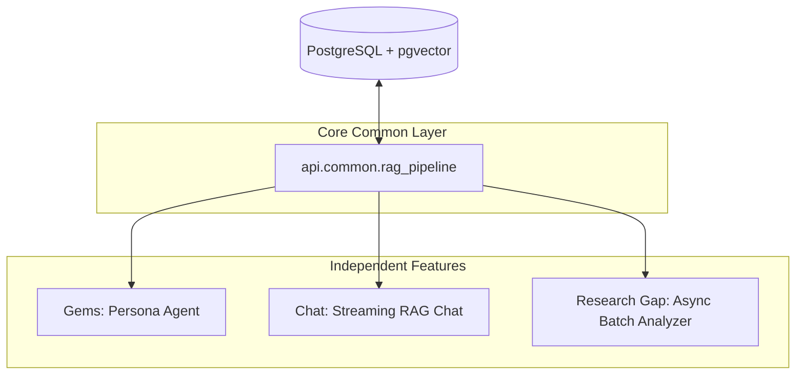
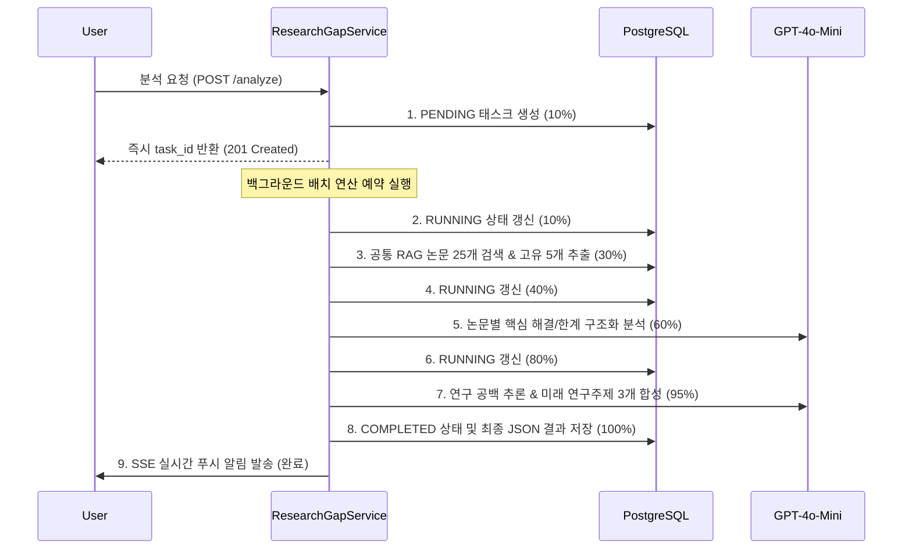

# 1차 중간점검: RAG 파이프라인 및 3대 독립 기능 코드 리뷰 리포트

본 문서는 프로젝트의 핵심 아키텍처인 **공통 RAG 파이프라인(Common RAG Pipeline)** 및 이를 활용하여 구축된 **3대 독립 비즈니스 기능(Gems, Chat, Research Gap)**의 백엔드 구현 구조와 핵심 코드를 1차 중간점검 목적으로 상세히 설명합니다.

---

## 🏗️ 전체 아키텍처 구성 개요

시스템은 PostgreSQL의 `pgvector` 확장을 기반으로 구축된 3072차원 벡터 스토어(`text-embedding-3-large`)와 HNSW 코사인 유사도 인덱스를 공통 데이터베이스로 사용합니다. 이 공통 벡터 저장소 위에서 핵심 LLM 에이전트와 백그라운드 분석 파이프라인이 유기적으로 맞물려 작동합니다.

---

## 1. ⚙️ 공통 RAG 검색 파이프라인 (Common RAG Pipeline)
* **소스 코드**: [rag_pipeline.py](file:///Users/pileuszu/Repos/bist-mini-2/backend/api/common/rag_pipeline.py)

### 📌 설계 목적
3개 학술 도메인(생명공학: `bio`, 컴퓨터과학: `cs`, 천문학: `astronomy`)의 논문 임베딩 검색 및 유사도 계산 처리를 단일 langchain pgvector 구조로 추상화하여 중복 코드를 제거하고, LLM 에이전트가 호출할 수 있는 공통 도구(Tools)를 제공합니다.

### 💻 핵심 구현 코드 설명

* **`CommonRagPipeline` 클래스**:
  * `init_embeddings(model="openai:text-embedding-3-large")` 인스턴스를 지연 로딩(Lazy Loading) 싱글톤 패턴으로 공유하여 불필요한 인스턴스 생성을 방지합니다.
  * `similarity_search` 메소드는 입력된 도메인에 매핑된 pgvector 컬렉션(`bio_embeddings`, `cs_embeddings`, `astronomy_embeddings`)을 조회하여 비동기로 유사 문서를 탐색합니다.
  * 계산된 거리(score) 값은 코사인 유사도 공식(`1.0 - score`)으로 계산하여 0과 1 사이의 신뢰성 높은 점수로 포맷팅하여 반환합니다.

* **LLM 에이전트 바인딩용 `@tool`**:
  * `search_bio_papers(query, runtime, k=3)`: 생명공학·유전체학 관련 질의어 검색 툴.
  * `search_cs_papers(query, runtime, k=3)`: 인공신경망, 진화 알고리즘 등 컴퓨터 과학 관련 검색 툴.
  * `search_astronomy_papers(query, runtime, k=3)`: 외계 행성 등 지구 및 행성 천체물리학 관련 검색 툴.
  * 도구들은 최종적으로 호출된 결과(논문 텍스트 본문과 메타데이터)를 구조화된 `Command`와 `ToolMessage` 객체에 담아 에이전트의 메모리 상태(State) 및 Sources에 자동으로 주입합니다.

---

## 2. 💎 Gems (지식 조각 및 맞춤형 에이전트 기능)
* **소스 코드**: 
  * [endpoints.py](file:///Users/pileuszu/Repos/bist-mini-2/backend/api/v1/gems/endpoints.py)
  * [gem_agent.py](file:///Users/pileuszu/Repos/bist-mini-2/backend/api/v1/gems/gem_agent.py)

### 📌 설계 목적
사용자가 직접 지정한 시스템 프롬프트(페르소나)와 선택적으로 장착한 학술 RAG 소스(`db_sources`)를 기반으로 나만의 AI 연구 비서를 생성하고 대화할 수 있는 커스텀 에이전트 기능입니다.

### 💻 핵심 구현 코드 설명

* **동적 에이전트 구성 (`_build_agent`)**:
  * 사용자가 선택한 `db_sources` (예: `['bio', 'cs']`)에 매핑된 공통 RAG 툴만 선별하여 에이전트 인스턴스에 탑재합니다.
  * 사용자의 커스텀 페르소나 프롬프트에 RAG 사용 제약 조건 및 언어 감지(Language Detection) 등의 필수 룰셋(Critical System Prompt)을 결합하여 에이전트를 빌드합니다.

* **영구적 대화 이력 관리**:
  * `AsyncPostgresSaver` 체크포인터를 사용하여 대화 상태를 PostgreSQL DB의 `checkpoints` 테이블에 스레드(`thread_id`)별로 영구 기록 및 복원합니다.
  * `psycopg_pool` 커넥션 풀을 다른 대화 에이전트들과 효율적으로 공유하도록 싱글톤 및 Lazy 방식으로 초기화합니다.

---

## 3. 💬 Chat (스트리밍 RAG 및 대화형 분석 기능)
* **소스 코드**:
  * [controller.py](file:///Users/pileuszu/Repos/bist-mini-2/backend/api/v1/chat/controller.py)
  * [chat_agent.py](file:///Users/pileuszu/Repos/bist-mini-2/backend/api/v1/chat/chat_agent.py)

### 📌 설계 목적
기존의 모든 대화 이력을 학습/기억한 채, 3대 학술 도메인 전체를 아울러 자유롭게 탐색 대화하며 답변을 제공하는 메인 연구 챗봇 서비스입니다. 특히 사용자 편의성을 극대화하기 위해 스트리밍(Streaming) 및 구조화된 답변(Structured Output)을 동시에 제공합니다.

### 💻 핵심 구현 코드 설명

* **구조화된 결과 출력 (`BioAnswer` 스키마)**:
  * Pydantic 스키마인 `BioAnswer`를 `create_agent`에 주입해 최종 답변을 `explanation`(설명 본문 마크다운)과 `papers`(답변 근거 논문의 `arxiv_id`, `title`, `summary` 리스트) 구조로 분리해 정밀 수집합니다.

* **스트리밍 서비스 구현 (`run_stream` 및 `send_message_stream`)**:
  * JSON 완성이 완료된 후 파싱되는 구조화 출력 기능은 스트리밍 방식과 충돌하므로, 스트리밍만을 위한 별도의 경량 에이전트(`_stream_agent`)를 내부적으로 다원화하여 운영합니다.
  * `astream(stream_mode="messages")`을 통해 실시간 생성되는 토큰 중, 도구 노드에서 발생하는 토큰이나 도구 호출 신호를 제외한 순수 **AI 답변 텍스트 본문(content)**만 필터링하여 프론트엔드로 `StreamingResponse` 스트림을 흘려보냅니다.
  * 스트리밍 진행 중 생성된 출처 정보는 임시로 세션 상태에 저장해 둔 뒤, 프론트엔드가 스트리밍 완료 후 사후 API(`GET /sessions/{id}/messages`)를 조회할 때 중복 제거된 깔끔한 상태의 출처(`sources`)를 동적으로 병합 전달합니다.

* **채팅방 제목 자동 생성 (`generate_title`)**:
  * 사용자가 보낸 첫 질문 내용을 기반으로 `gpt-4o-mini` 모델을 직접 호출하여 6~20자 내외의 직관적이고 군더더기 없는 한국어 채팅방 제목을 자동 생성 및 갱신합니다.

---

## 4. 🔍 Research Gap (연구 공백 분석 기능)
* **소스 코드**:
  * [endpoints.py](file:///Users/pileuszu/Repos/bist-mini-2/backend/api/v1/research_gap/endpoints.py)
  * [services.py](file:///Users/pileuszu/Repos/bist-mini-2/backend/api/v1/research_gap/services.py)

### 📌 설계 목적
사용자가 제시한 연구 기술이나 주제 키워드에 대해 관련 학계 논문들을 대규모로 검색하여, 각 논문들이 해결한 문제(Methodology)와 한계점(Limitations)을 추출한 뒤, 학계 연구 공백(Research Gap)을 자동으로 식별하고 혁신적인 3가지 신규 연구 방향을 제안하는 비동기 대규모 리서치 배치 파이프라인입니다.

### 💻 핵심 구현 코드 설명

* **7단계 비동기 백그라운드 배치 프로세스 (`run_batch_analysis`)**:
  시간이 다소 소요되는 대규모 처리를 위해 FastAPI의 `BackgroundTasks`를 도입하여 백그라운드 비동기 처리를 수행하고, 단계별 진행도(`progress`)를 데이터베이스에 주기적으로 영구 저장(Commit)합니다.

* **결과 다국어 번역 및 서버 영구 캐싱 (`translate_matrix`)**:
  * LLM을 사용해 영문으로 분석 완료된 고차원 매트릭스 정보를 한글로 번역합니다.
  * 번역으로 인해 소실될 수 있는 원본 논문과의 코사인 유사도 점수(`similarity`) 데이터를 매칭하여 사후 복원 주입합니다.
  * 번역된 데이터는 DB 테이블의 `translated_result` 컬럼에 캐싱되어, 동일 요청 발생 시 API 조회 비용 없이 즉각 반환(Cache Hit)되도록 설계되었습니다.

---

## 📈 1차 중간점검 종합 평가
* **도메인 격리성**: 각 도메인의 핵심 비즈니스 로직(Gems, Chat, Research Gap)이 각각의 폴더 내부에서 서비스(`services.py`), DTO(`models.py`), 엔티티(`entity.py`) 등으로 깔끔하게 분리되어 동시 개발 및 Git 병합 시 충돌을 차단하고 있습니다.
* **공통화 우수성**: RAG의 검색 부분은 `api/common/rag_pipeline.py`에 단일화되어 일관된 검색 점수 연산과 자원 관리를 보장합니다.
* **실시간성 및 UI 최적화**: 긴 작업은 SSE(Server-Sent Events) 알림과 백그라운드 처리를 결합하고, 채팅 대화는 전용 에이전트 구조화를 이용한 텍스트 스트리밍을 구현하여 뛰어난 UX 설계를 보여주고 있습니다.
