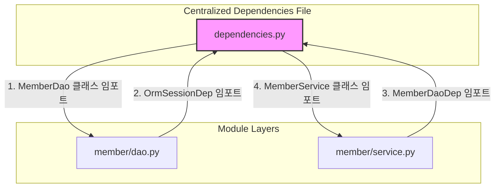

# FastAPI 의존성 주입(Dependency Injection) 및 별칭 정의 가이드

FastAPI 프로젝트에서 `Annotated[Class, Depends(Class)]` 형태의 의존성 주입(DI) 타입 별칭(Type Alias)을 정의할 때, **각 파일 내부에 정의하는 방식(Local)**과 **공통 파일에 모아서 정의하는 방식(Centralized)**의 장단점을 비교하고 올바른 설계 가이드라인을 제시합니다.


---


## **1. 비교 분석**

| 구분 | 각 파일 하단 정의 (Local) | 공통 파일 일괄 정의 (Centralized) |
| --- | --- | --- |
| **정의 위치** | 해당 DAO/Service 클래스 파일 하단 | `core/dependencies.py` 등의 단일 공통 파일 |
| **모듈 응집도** | **높음** (클래스 구현과 DI 정의가 한 곳에 모여 있음) | **낮음** (구현과 선언이 분산되어 있음) |
| **순환 참조 위험** | **거의 없음** | **매우 높음** (대규모 프로젝트에서 빈번히 발생) |
| **유지보수성** | 개별 컴포넌트 단위로 수정/이동이 편리함 | 전체 DI 목록을 한눈에 관리하기는 좋음 |


---


## **2. 순환 참조(Circular Import) 발생 원리**

공통 파일에 모든 의존성(DAO, Service 등)을 모으게 되면, 프로젝트가 커짐에 따라 다음과 같은 순환 참조 루프가 형성되어 애플리케이션 시작 자체가 불가능해질 위험이 큽니다.




* 위 흐름처럼 `dependencies.py`가 개별 구현체(`dao.py`, `service.py`)를 참조하고, 다시 구현체들이 의존성 별칭을 쓰기 위해 `dependencies.py`를 호출하는 순간 **순환 참조 고리**가 끊기지 않고 에러가 발생하게 됩니다.

### **② 실제 발생하는 순환 참조 코드 시나리오**

만약 모든 의존성 별칭(`xxxDep`)을 `dependencies.py` 한 파일에 모으고, 각 서비스나 DAO가 이를 가져다 쓴다면 다음과 같은 상황이 벌어집니다.


```python
# ----------------------------------------------------
# 1. dependencies.py (공통 의존성 관리 파일)
# ----------------------------------------------------
from typing import Annotated
from fastapi import Depends

# 클래스 정보를 알아야 Annotated를 선언하므로 모듈들을 임포트함
from api.database.member.dao import MemberDao
from api.database.member.service import MemberService

MemberDaoDep = Annotated[MemberDao, Depends(MemberDao)]
MemberServiceDep = Annotated[MemberService, Depends(MemberService)]
```


```python
# ----------------------------------------------------
# 2. api/database/member/service.py (서비스 파일)
# ----------------------------------------------------
import logging
# 의존성을 주입받기 위해 공통 파일에서 MemberDaoDep을 임포트함
from dependencies import MemberDaoDep

class MemberService:
    def __init__(self, member_dao: MemberDaoDep):
        self.logger = logging.getLogger(f"{__name__}.MemberService")
        self.member_dao = member_dao
```


### **🚨 에러 발생 메커니즘:**

1. 파이썬 인터프리터가 서버 구동을 위해 `dependencies.py`를 먼저 읽기 시작합니다.
1. `dependencies.py`가 실행되는 도중 `from api.database.member.service import MemberService` 문장을 만나 `service.py` 파일을 로드하러 넘어갑니다.
1. `service.py`는 코드를 읽기 위해 맨 위의 `from dependencies import MemberDaoDep`를 마주하게 됩니다.
1. 이때 `dependencies.py`는 **아직 로딩이 채 끝나지 않은 상태(Partially Initialized)**입니다. 따라서 `MemberDaoDep`를 읽어오지 못하고 결국 아래와 같은 에러를 뿜으며 서버가 다운됩니다.

> `ImportError: cannot import name 'MemberDaoDep' from partially initialized module 'dependencies'`

이러한 문제를 완벽하게 회피하려면 각 별칭(`xxxDep`)을 해당 클래스가 정의된 파일(예: `dao.py` 또는 `service.py`)의 맨 하단에 직접 두어야 합니다. 이렇게 하면 `service.py`가 `dao.py`만 일방적으로 참조하게 되어 순환 참조가 발생하지 않습니다.


---


## **3. 실무적인 아키텍처 권장 가이드라인**

컴포넌트의 성격에 따라 다음과 같이 이원화하여 관리하는 것이 가장 안전하고 효율적입니다.


### **① 개별 도메인 컴포넌트 (DAO, Service 등) ➔ 로컬 파일 하단 정의 (Local)**

* **적용 대상**: `MemberDaoDep`, `MemberServiceDep`, `BoardDaoDep` 등 특정 기능 모듈에 종속된 객체
* **가이드**: 해당 클래스 파일의 하단에 바로 정의합니다. 클래스를 작성한 파일에서 별칭을 관리하면 의존성 주입 코드가 캡슐화되어 모듈 이동/삭제 시에도 해당 파일 하나만 옮기면 되므로 유지보수에 매우 유리합니다.

```python
# api/database/member/dao.py 내부 하단
class MemberDao:
    ...

MemberDaoDep = Annotated[MemberDao, Depends(MemberDao)]
```


### **② 공통/횡단 관심사 컴포넌트 (DB 세션, 인증/인가 등) ➔ 공통 파일 정의 (Centralized)**

* **적용 대상**: `OrmSessionDep` (데이터베이스 세션), `CurrentUserDep` (로그인 회원 정보), `get_settings` (환경 설정 정보) 등 애플리케이션 전역에서 공통으로 재사용하는 횡단 관심사
* **가이드**: 프로젝트의 전역 설정 레이어(예: `api/database/config/dbsession.py` 또는 `core/security.py`)에 정의해 둡니다.

```python
# api/database/config/dbsession.py
from fastapi import Depends
from sqlalchemy.ext.asyncio import AsyncSession

async def get_orm_session() -> AsyncGenerator[AsyncSession, None]:
    ...

OrmSessionDep = Annotated[AsyncSession, Depends(get_orm_session)]
```


---


## **4. 요약**

* **특정 도메인의 DAO나 Service**의 의존성 별칭은 **현재처럼 각 파일 하단에 작성하는 것이 순환 참조를 방지하고 응집도를 높이는 올바른 방법**입니다.
* **DB 세션이나 로그인 권한 등 공통 유틸리티성 의존성**만 전역 공통 설정 파일(`dbsession.py`, `security.py` 등)로 빼서 관리하시는 것이 가장 모범적입니다.
