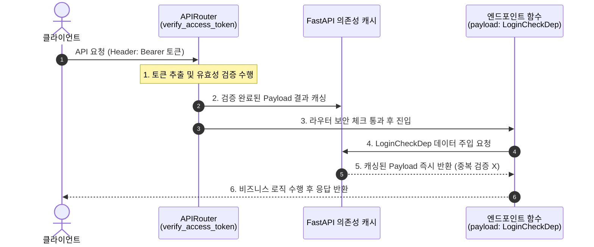

# FastAPI 전역 보안 검증 및 의존성 캐싱 가이드

FastAPI 프로젝트에서 인증(Authentication) 및 인가(Authorization)를 관리할 때, 라우터 수준의 전역 검증과 개별 API 수준의 사용자 데이터(토큰 페이로드) 주입을 연계하여 효율적으로 구성하는 패턴과 FastAPI의 의존성 캐싱(Dependency Caching) 메커니즘을 설명합니다.


---


## **1. 동작 개념 (의존성 캐싱)**

FastAPI는 하나의 HTTP 요청(Request)을 처리하는 생명주기(Lifecycle) 안에서 동일한 의존성 함수가 여러 번 호출되더라도, **가장 처음 실행된 결과 값을 캐싱(Caching)하여 재사용**합니다.

이 방식을 이용하면 다음과 같은 2단계 인증 체계를 중복 연산(토큰 복호화 및 유효성 검사 등) 없이 성능 상 이점을 챙기면서 구현할 수 있습니다.

1. **전역 수준 검증 (1단계)**: 라우터(`APIRouter`) 선언부에 토큰 검증 의존성을 추가하여, 라우터 내 모든 엔드포인트에 대해 로그인 유무를 일괄 강제합니다. (최초 1회 검증 및 결과 캐싱)
1. **개별 API 수준 주입 (2단계)**: 실제 컨트롤러 함수 내부에서 로그인 사용자 정보(ID, 권한 등)가 필요할 때만 매개변수로 토큰 페이로드(`LoginCheckDep`)를 주입받아 사용합니다. (이미 캐싱된 데이터 즉시 주입)

---


## **2. 흐름도 (Sequence Diagram)**

클라이언트의 요청이 들어왔을 때, FastAPI가 의존성 캐시를 거쳐 엔드포인트 함수로 제어권을 넘기는 상세 흐름입니다.





---


## **3. 코드 예시**


### **① 의존성 정의 (****`api/database/member/auth.py`****)**


```python
from typing import Annotated
from fastapi import Depends, HTTPException, status, Request

# 토큰 검증 및 페이로드 반환 함수
async def verify_access_token(request: Request) -> dict:
    # 토큰 추출 및 복호화/검증 수행...
    # 토큰이 없거나 만료된 경우 401 Unauthorized 에러 발생
    # 정상적인 경우 payload(dict) 반환
    return payload

# 의존성 주입용 타입 별칭
LoginCheckDep = Annotated[dict, Depends(verify_access_token)]
```


### **② 컨트롤러 적용 (****`api/database/board/controller.py`****)**


```python
from fastapi import APIRouter, Depends, Form
from api.database.member.auth import verify_access_token, LoginCheckDep
from api.database.board.model import BoardWriteRequest, BoardWriteResponse
from api.database.board.service import BoardServiceDep

# 1. 라우터 수준에서 전체 API에 로그인 여부 강제화 (의존성 실행 및 캐싱)
router = APIRouter(
    prefix="/database/board",
    tags=["board"],
    dependencies=[Depends(verify_access_token)]
)

# 예시 A: 로그인 체크만 수행하고 유저 정보는 필요 없는 API
@router.get("/list")
async def get_board_list(board_service: BoardServiceDep):
    # 인자에 payload가 없어도 라우터 수준 의존성 덕분에 자동 검증 및 접근 제어가 동작함
    total_rows = await board_service.get_total_rows()
    ...

# 예시 B: 검증된 로그인 회원 정보(payload)를 활용하는 API
@router.post("/create", response_model=BoardWriteResponse)
async def create(
    board_write_request: Annotated[BoardWriteRequest, Form()],
    payload: LoginCheckDep,  # 2. 캐싱된 토큰 페이로드 주입 (토큰 재검증 수행 X)
    board_service: BoardServiceDep) -> BoardWriteResponse:
    # 로그인 유저 ID를 안전하게 꺼내 작성자 지정
    bwriter = payload.get("sub")
    ...
```


---


## **4. 의존성 캐싱 사용 시 주의사항**

* **`use_cache=False`**** 옵션**: 기본적으로 FastAPI의 `Depends`는 `use_cache=True`로 설정되어 캐싱이 작동합니다. 만약 의존성 주입 시마다 강제로 새로 계산해야 하는 작업(예: 고유 난수 생성, 실시간 시스템 타임스탬프 등)이 있다면 `Depends(func, use_cache=False)` 형태로 명시해야 합니다.
* **타입 힌트 vs 실제 객체**: `APIRouter(dependencies=[...])` 리스트 내부에는 타입 별칭인 `LoginCheckDep`를 직접 넣을 수 없습니다. 라우터 선언부에는 `Depends(verify_access_token)`와 같은 **실제 주입 가능한 함수/Depends 객체**를 작성해야 합니다.

---


## **5. 도입 이점 요약**

1. **코드 응집도 및 DRY 원칙 실현**: 개별 API마다 예외 처리나 토큰 만료 에러 코드를 작성할 필요가 없어 비즈니스 로직에만 집중할 수 있습니다.
1. **성능 극대화**: 중복적인 JWT 디코딩 연산을 줄여 시스템 오버헤드를 낮춥니다.
1. **유연한 구성**: 로그인 필터링 범위가 바뀌더라도 컨트롤러 구현체의 수정 없이 라우터 선언부의 데코레이터만 조정하면 되므로 변경에 유연합니다.
