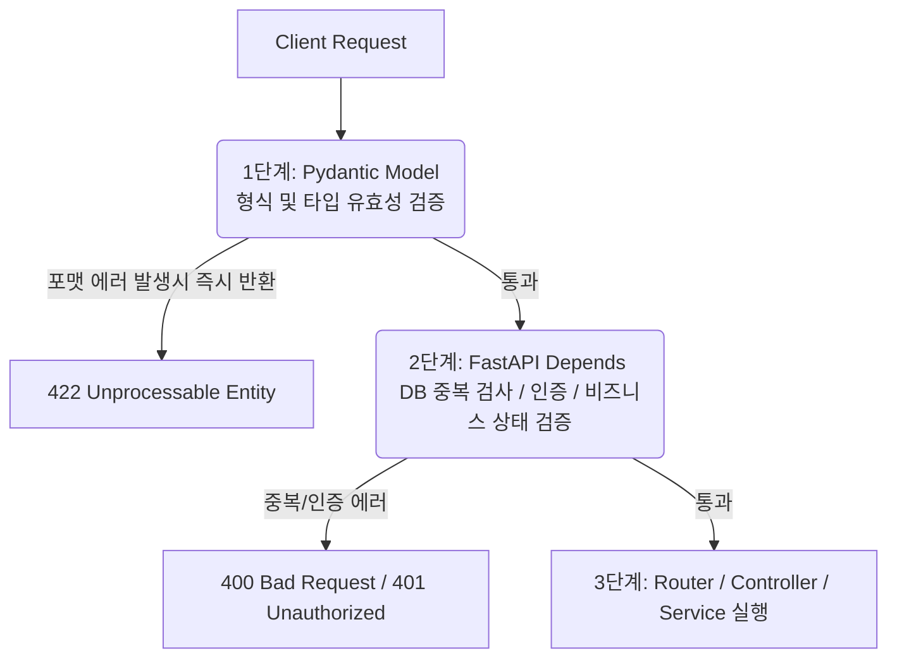

# Pydantic 모델 검증 vs FastAPI Dependency 검증

유효성 검증과 흐름 제어를 위해 Pydantic 모델(`BaseModel`)과 FastAPI 의존성 주입(`Depends`)을 혼용할 때, 역할 분담에 대한 명확한 가이드라인을 제시합니다.

### **① 핵심 역할 비교**

| 구분 | Pydantic 모델 (BaseModel) | FastAPI Dependency (Depends / Annotated) |
| --- | --- | --- |
| **주요 목적** | **형식 및 구조 검증 (Syntactic Validation)** | **비즈니스 상태 및 맥락 검증 (Semantic Validation)** |
| **검증 영역** | 데이터 타입, 필수 여부, 길이, 정규식(Regex) 매칭, 단일 필드 간의 일관성 등 | DB 세션 주입, 회원 중복 여부 확인, 로그인 토큰 인증, 권한 확인 등 |
| **상태성** | **Stateless (무상태)** - 외부 자원에 의존하지 않음 | **Stateful (유상태)** - DB 쿼리, 외부 API 호출, 전역 컨텍스트 접근 등 |
| **동작 제어** | 동기식(Sync) 데이터 파싱 및 파라미터 유효성 검사 | 비동기식(Async) 자원 제어 및 라우터 도달 전 가로채기(Interceptor) |

### **② 역할 분담의 필요성 (관심사 분리)**

Pydantic 모델 내부의 검증기(`@field_validator`, `@model_validator`)에서 DB 연결이나 외부 조회를 수행하는 것은 **안티패턴**입니다.

1. **테스트 및 결합도 문제:** DTO 역할을 하는 Pydantic 모델이 특정 DB 연결 객체에 강하게 결합되면, 모델에 대한 순수한 단위 테스트(Unit Test)를 작성하기가 매우 어려워집니다.
1. **비동기 비효율성:** Pydantic의 코어 레벨 검증 루틴은 기본적으로 동기식으로 동작합니다. DB I/O와 같은 비동기적인 처리는 FastAPI의 의존성 주입 계층이나 서비스 계층에서 다루는 것이 성능과 설계 면에서 적합합니다.

### **③ 유효성 검증 파이프라인 (Best Practice)**

* **1단계 (Pydantic):** "전달된 데이터의 형식이 올바른가?" (예: 이메일 포맷, 비밀번호 복잡도 규칙 등)
* **2단계 (Dependency):** "이 데이터가 현재 시스템의 비즈니스 규칙상 유효한가?" (예: 가입하려는 아이디가 DB에 중복되는지 여부 등)
