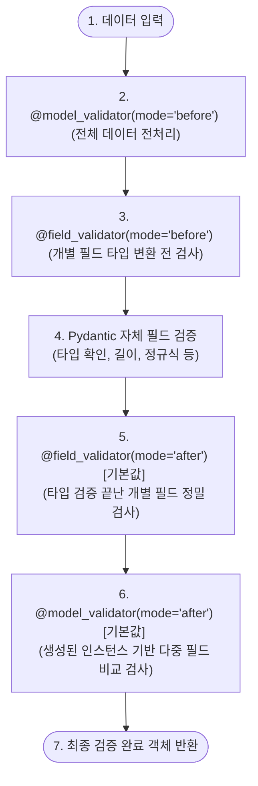

# Pydantic 유효성 검증 순서 및 validator 모드

Pydantic v2에서 데이터 검증은 정해진 파이프라인 순서에 따라 단계별로 엄격하게 실행됩니다. 특히 `@model_validator`와 `@field_validator`는 동작 모드(`mode="before"` / `mode="after"`)에 따라 동작 시점과 대상 데이터가 달라집니다.

### **① model_validator 모드 비교 (before vs after)**

| 비교 항목 | mode="before" | mode="after" (기본값) |
| --- | --- | --- |
| **실행 시점** | **필드 유효성 검증 전** (인스턴스 생성 전) | **필드 유효성 검증 완료 후** (인스턴스 생성 후) |
| **메서드 형태** | **클래스 메서드** (`@classmethod`) | **인스턴스 메서드** (클래스 내 일반 함수) |
| **입력 데이터** | **정제되지 않은 원본 데이터** (주로 `dict`) | **검증 완료된 모델 인스턴스** (`self`) |
| **반환 데이터** | 타입 검증으로 보낼 수정된 원본 데이터 (`dict`) | 최종 검증된 모델 인스턴스 (`Self`) |
| **주요 용도** | 입력 데이터 전처리, 키 이름 변경, 기본값 동적 할당 등 | 여러 필드 간의 상호 비교 검사 (Cross-field Validation) |

### **② 전체 유효성 검증 파이프라인 순서**

Pydantic v2의 모든 유효성 검사기는 아래의 단방향 시퀀스에 맞춰 순차적으로 처리됩니다.

1. **`@model_validator(mode="before")`****:** 전달받은 원본 데이터 자체를 가공 및 전처리하는 최상단 필터입니다.
1. **`@field_validator(mode="before")`****:** 특정 필드의 타입이 캐스팅/검증되기 전에 원본 필드 값을 수정합니다.
1. **Pydantic 자체 필드 검증:** 모델 필드 정의에 선언한 기본 형식(예: `EmailStr`, `min_length`, `pattern` 등)을 검증하고 필요한 타입 변환을 처리합니다.
1. **`@field_validator(mode="after")`**** (기본값):** 정상적으로 파싱된 특정 필드 값에 대해 추가 검증을 적용합니다.
1. **`@model_validator(mode="after")`**** (기본값):** 모든 필드 유효성 검사가 다 끝난 상태의 모델 인스턴스(`self`)를 가지고 여러 필드 간의 논리적 모순이 없는지 최종 검증합니다.
