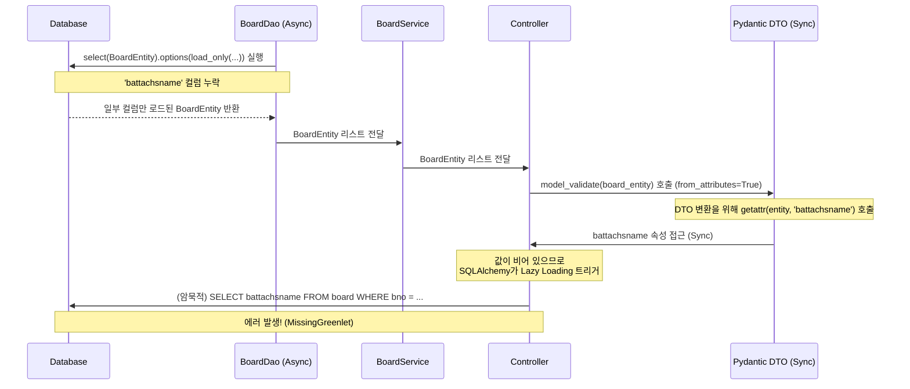

# SQLAlchemy AsyncSession 

이 문서는 FastAPI와 SQLAlchemy 비동기(Async) 세션을 연동하여 개발할 때 자주 겪는 **`MissingGreenlet`** 에러의 근본적인 원인을 설명하고, 이를 해결하고 방지하기 위한 구체적인 방법들을 제시합니다.


> [!WARNING] **핵심 요약**

비동기(Async) 세션 환경에서는 조회하지 않은 엔티티 속성에 접근할 때 발생하는 **암묵적 지연 로딩(Lazy Loading)**이 동기 컨텍스트(예: Pydantic DTO 변환 시점)에서 호출되면서 `MissingGreenlet` 에러가 발생합니다.


---


## **1. 에러 현상 (Symptom)**

FastAPI 요청 처리 도중 Pydantic DTO 직렬화(혹은 검증) 시점에 아래와 같은 예외가 발생하며 500 에러를 반환합니다.


```json
{
  "error_code": "A0005",
  "message": "기타 예외가 발생했음",
  "detail": "1 validation error for BoardListItemResponse\nbattachsname\n  Error extracting attribute: MissingGreenlet: greenlet_spawn has not been called; can't call await_only() here. Was IO attempted in an unexpected place? (Background on this error at: https://sqlalche.me/e/20/xd2s) [type=get_attribute_error, input_value=<api.database.board.entity.BoardEntity object at 0x...>, input_type=BoardEntity]"
}
```


---


## **2. 에러 발생 원인 (Root Cause)**


### **2.1 지연 로딩(Lazy Loading)과 비동기 루프의 충돌**

1. **제한적 조회 (****`load_only`****)**: 성능 최적화 등을 위해 `load_only`를 사용하여 특정 컬럼만 로드하고 일부 컬럼(`battachsname` 등)은 조회를 보류(deferred)했습니다.
1. **DTO 검증 시 속성 접근**: Pydantic이 응답 객체를 만들기 위해 엔티티의 모든 필드에 접근합니다.
1. **동기식 속성 접근과 비동기 I/O**: 로드되지 않은 속성에 접근하면 SQLAlchemy는 지연 로딩을 시도합니다. 그러나 비동기 드라이버(`asyncpg` 등) 환경에서 **속성 접근자(****`getattr`****) 호출은 동기식(Sync) 스택** 내에서 실행되므로 비동기 루프(`greenlet`)를 찾지 못해 에러가 발생합니다.

### **2.2 DTO에 기본값(****`None`****)이 정의되어 있음에도 에러가 나는 이유**

Pydantic DTO에 `battachsname: str | None = None`으로 기본값이 지정되어 있어도 에러가 나는 이유는 **검증 대상 데이터의 타입 차이** 때문입니다.

* **딕셔너리(****`dict`**** / ****`RowMapping`****) 검증 시 (정상 동작)**
  * Pydantic은 키 기반 조회(`"battachsname" in data`)를 수행합니다.
  * 데이터에 해당 키가 없으면 지연 로딩을 트리거하지 않고 바로 선언된 기본값(`None`)을 채워 넣습니다.
* **ORM 엔티티 객체(****`BoardEntity`****) 검증 시 (에러 발생)**
  * Pydantic은 `getattr(board_entity, "battachsname")`을 호출합니다.
  * 엔티티 객체에는 `battachsname`이라는 디스크립터(Mapped Column 속성 정의)가 실제로 존재하기 때문에 `AttributeError`로 끝나지 않습니다.
  * 속성을 읽기 위해 호출된 SQLAlchemy 디스크립터는 **"조회되지 않은 데이터를 채우기 위한 암묵적 지연 로딩"**을 시도하고, 동기식 컨텍스트 하에서 비동기 DB 작업이 개입되면서 `MissingGreenlet` 에러(`get_attribute_error`)를 던집니다.

```plain text
Pydantic DTO (Sync)ControllerBoardServiceBoardDao (Async)DatabasePydantic DTO (Sync)ControllerBoardServiceBoardDao (Async)Database'battachsname' 컬럼 누락DTO 변환을 위해 getattr(entity, 'battachsname') 호출값이 비어 있으므로SQLAlchemy가 Lazy Loading 트리거에러 발생! (MissingGreenlet)select(BoardEntity).options(load_only(...)) 실행일부 컬럼만 로드된 BoardEntity 반환BoardEntity 리스트 전달BoardEntity 리스트 전달model_validate(board_entity) 호출 (from_attributes=True)battachsname 속성 접근 (Sync)(암묵적) SELECT battachsname FROM board WHERE bno = ...
```





---


## **3. 해결 방법 1: 쿼리 옵션 수정 (Eager Loading 명시)**

DTO 매핑 및 응답에 참여하는 모든 엔티티 속성은 데이터베이스 조회 시점(`load_only` 또는 `select`)에 명시적으로 Eager Loading 해야 합니다.


### **[수정 전] 일부 컬럼 누락**


```python
# api/database/board/dao.py
result = await self.orm_session.execute(
    select(BoardEntity)
    .options(
        load_only(
            BoardEntity.bno,
            BoardEntity.btitle,
            BoardEntity.bwriter,
            BoardEntity.bdate,
            BoardEntity.bhitcount,
            BoardEntity.battachoname,
            # BoardEntity.battachsname 누락!
            BoardEntity.battachtype
        )
    )
)
```


### **[수정 후] DTO 응답 필드와 로딩 범위 일치화**


```python
# api/database/board/dao.py
result = await self.orm_session.execute(
    select(BoardEntity)
    .options(
        load_only(
            BoardEntity.bno,
            BoardEntity.btitle,
            BoardEntity.bwriter,
            BoardEntity.bdate,
            BoardEntity.bhitcount,
            BoardEntity.battachoname,
            BoardEntity.battachsname,  # 정상 포함
            BoardEntity.battachtype
        )
    )
)
```


---


## **4. 해결 방법 2: 프로젝션 직접 조회 (Projection Query) ****`[권장]`**

조회 전용 API의 경우 엔티티 전체를 메모리에 올리는 대신, 필요한 특정 컬럼만 명시하여 `select`하는 방식(Projection)을 사용하는 것이 가장 안전하고 효율적입니다.


> [!TIP] 프로젝션 조회를 통해 반환된 데이터는 ORM 상태 정보가 없는 순수 값 매핑이므로, 이후 가공 및 DTO 변환 시 지연 로딩 에러(`MissingGreenlet`)가 원천 차단됩니다.


### **4.1 DAO 레이어 변경**

조회하려는 컬럼들을 `select` 인자로 직접 나열하고, `result.mappings().all()`을 호출하여 키-값 형태의 `RowMapping` 리스트를 반환합니다.


```python
# api/database/board/dao.py
from sqlalchemy import select, RowMapping

async def select_by_page(self, pager: Pager) -> list[RowMapping]:
    stmt = (
        select(
            BoardEntity.bno,
            BoardEntity.btitle,
            BoardEntity.bwriter,
            BoardEntity.bdate,
            BoardEntity.bhitcount,
            BoardEntity.battachoname,
            # BoardEntity.battachsname,
            BoardEntity.battachtype
        )
        .order_by(BoardEntity.bno)
        .limit(pager.rows_per_page)
        .offset(pager.start_row_index)
    )

    result = await self.orm_session.execute(stmt)
    # result.mappings().all()을 호출해 딕셔너리 호환 형태의 결과 반환
    return list(result.mappings().all())
```


### **4.2 Controller 레이어 DTO 변환**

`BaseDTO`에 정의된 `from_attributes=True` 덕분에, ORM 엔티티 객체가 아닌 `RowMapping` 데이터에 대해서도 동일하게 `model_validate`가 동작합니다.


```python
# api/database/board/controller.py

list_board_data = await board_service.list(pager)

# RowMapping 리스트 -> BoardListItemResponse 리스트로 완벽 변환
list_board_list_item_response = [
    BoardListItemResponse.model_validate(row) for row in list_board_data
]
```


---


## **5. 예방 및 개발 베스트 프랙티스**

| 가이드라인 분류 | 상세 지침 및 구현 권장 사항 |
| --- | --- |
| **💡 프로젝션 우선 사용** | 데이터 생성/수정이 없는 단순 목록 조회 API에서는 엔티티 조회를 지양하고, 필요한 컬럼만 지정 조회하여 `mappings()`를 적극 활용하세요. |
| **🔍 명시적 로딩 일치** | 엔티티 객체 조회가 필수인 경우, DTO의 응답 스펙과 쿼리 옵션(`load_only`, `defer` 등)에서 다루는 속성 정의가 정확히 일치하는지 더블 체크하세요. |
| **🔗 관계 필드 로드 지정** | 관계(Relationship) 속성을 참조해야 할 경우 `lazy="selectin"` 설정을 엔티티에 기본 적용하거나, 쿼리 레벨에서 `selectinload()`를 명시하세요. |
| **📁 대용량 데이터 격리** | `battachdata`(BLOB)와 같은 대용량 바이너리 컬럼은 목록 조회 대상에서 완전히 제거하고, 별도의 전용 파일 다운로드 API를 작성하여 처리하세요. |

