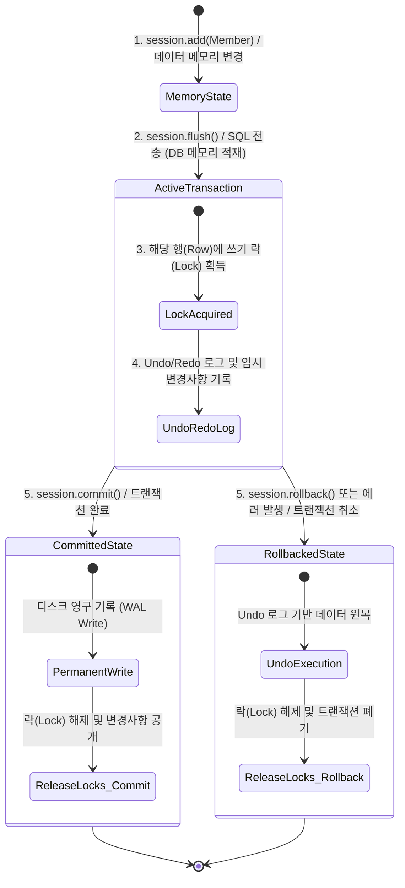

# SQLAlchemy Flush vs Commit 개념 가이드

SQLAlchemy를 비롯한 대부분의 ORM(Object-Relational Mapping) 프레임워크에서 세션(Session)의 변경 사항을 데이터베이스에 반영할 때 사용하는 두 핵심 메서드인 `flush()`와 `commit()`의 차이를 설명합니다.


---


## **1. 핵심 요약 비교**

| 구분 | `flush()` | `commit()` |
| --- | --- | --- |
| **역할** | 파이썬 메모리(세션)의 변경 사항을 **SQL(Insert/Update/Delete)로 변환해 DB에 전송** | 현재 트랜잭션의 모든 변경 사항을 **DB에 영구적으로 반영(저장)** |
| **DB 트랜잭션 상태** | 트랜잭션이 **열려 있는 상태**로 유지됨 (임시 상태) | 트랜잭션이 **종료(커밋)**되고 변경 사항이 고정됨 |
| **자동 실행 여부** | 쿼리 실행 시 `autoflush=True`에 의해 **자동 호출 가능** | 개발자가 코드 상에서 **명시적으로 호출**해야 함 |
| **기본 키(ID) 확인** | **가능** (DB에 SQL을 보냈으므로 Auto-increment ID 등 획득 가능) | **가능** |
| **다른 커넥션의 조회** | **불가능** (아직 커밋되지 않아 다른 세션에서는 안 보임) | **가능** (모든 DB 연결에서 변경 사항 확인 가능) |
| **롤백(Rollback) 여부** | **가능** (`session.rollback()`으로 원래대로 되돌림 가능) | **불가능** (이미 하드 디스크에 쓰여 트랜잭션이 닫힘) |


> [!IMPORTANT] **`commit()`****은 항상 내부적으로 ****`flush()`****를 먼저 자동 호출합니다.** 즉, 따로 `flush()`를 명시하지 않고 `commit()`만 호출해도 메모리의 데이터는 DB로 전송되고 영구 저장됩니다.


---


## **2. 세부 동작 설명**


### **① Flush (****`session.flush()`****)**

* **동작**: 세션 내부에 쌓여 있는 객체의 추가/수정/삭제 정보를 바탕으로 실제 SQL 쿼리(`INSERT`, `UPDATE`, `DELETE`)를 생성하여 DB 서버로 전송합니다.
* **영향**:
  * DB는 쿼리를 받아 메모리 버퍼 상에서 실행하지만, 아직 디스크에 쓰지는 않은 **트랜잭션 진행 중(In-Progress)** 상태가 됩니다.
  * 데이터베이스가 새로운 로우(Row)를 인식하므로, **자동 생성되는 Primary Key (예: Auto-Increment ID)가 파이썬 ORM 객체에 즉시 할당**됩니다.
  * 이 시점에서는 에러가 발생하거나 마음이 바뀌면 `session.rollback()`을 통해 트랜잭션을 이전 상태로 완벽히 되돌릴 수 있습니다.

### **② Commit (****`session.commit()`****)**

* **동작**: DB 서버에 `COMMIT` 명령을 보냅니다.
* **영향**:
  * 현재 트랜잭션 내에서 Flush되었던 모든 데이터 변경 사항이 디스크에 영구 기록(Persist)됩니다.
  * 트랜잭션이 정상 종료되며, 데이터의 격리 수준(Isolation Level)에 따라 다른 모든 DB 사용자 및 커넥션이 이 변경 사항을 읽을 수 있게 됩니다.
  * 한 번 커밋된 내용은 `rollback()`으로 취소할 수 없으며, 되돌리려면 별도의 역작업(Delete/Update) 쿼리를 다시 실행해야 합니다.

---


## **3. 코드 예시로 보는 차이**


```python
# Member 신규 등록 예시
new_member = Member(username="kosa")
session.add(new_member)

# 1. 추가만 한 상태 (메모리 상태)
print(new_member.id) # 출력: None (아직 DB와 통신하지 않음)

# 2. Flush 호출
await session.flush()
print(new_member.id) # 출력: 1 (DB에서 생성해 준 ID값을 가져옴)
# [참고] 이 시점에는 다른 DB 클라이언트 툴로 조회하면 "kosa" 멤버가 보이지 않습니다.

# 3. 마음이 바뀐 경우 롤백 가능
# await session.rollback() # 주석 해제 시 위에서 발행된 INSERT가 취소됨

# 4. Commit 호출
await session.commit()
# [참고] 이 시점 이후에는 다른 DB 클라이언트에서도 "kosa" 멤버가 정상 조회됩니다.
```


---


## **4. ****`autoflush=True`**** 설정의 의미**

[dbsession.py](file:///d:/Repo/kosa-fastapi/api/database/config/dbsession.py)에서 세션 생성기를 만들 때 설정한 `autoflush=True`는 다음과 같이 작동합니다.


```python
SessionMaker = async_sessionmaker(
    bind=engine,
    autoflush=True,  # 자동 flush 활성화
    autocommit=False
)
```

* **동작**: 세션에 새로운 객체를 추가(`add`)한 뒤, 명시적으로 `flush()`를 호출하지 않고 곧바로 `SELECT` 쿼리(예: `session.execute(select(...))`)를 실행할 때, SQLAlchemy가 **알아서 먼저 ****`flush()`****를 실행**해 줍니다.
* **이유**: 메모리에 있는 변경 사항(예: 신규 회원 추가)이 DB에 먼저 전달되어 있어야만, 이어지는 조회(SELECT) 쿼리에서 신규 회원까지 올바르게 포함하여 필터링 및 조회가 가능하기 때문입니다.

---


## **5. 데이터베이스 트랜잭션(Transaction) 관점에서의 라이프사이클**

데이터베이스 트랜잭션 관점에서 `flush()`와 `commit()`의 상태 변화를 다이어그램과 단계별 설명으로 비교할 수 있습니다.


### **① 트랜잭션 라이프사이클 다이어그램**





### **② 단계별 데이터베이스 내부 동작 상세**

1. **메모리 임시 상태 (Memory State)**
  * 파이썬 세션 객체 내부의 딕셔너리에만 새로운 데이터나 변경된 값이 적재됩니다.
  * 이 단계에서는 데이터베이스에 연결된 커넥션 세션이 아무런 연산도 수행하지 않으므로 트랜잭션 자체가 활성화되지 않거나 대기 상태입니다.
1. **트랜잭션 활성화 및 SQL 실행 (Active Transaction - ****`flush()`****)**
  * SQL 명령이 DB 서버로 날아가면서 본격적인 **물리 트랜잭션이 시작(Begin)**됩니다.
  * **쓰기 락(Write Lock) 획득**: 수정/삭제할 대상 행(Row) 혹은 신규 삽입될 공간에 대해 DB 락(Lock)을 획득합니다. 이로 인해 다른 트랜잭션은 해당 데이터를 함부로 수정하지 못하게 안전하게 잠깁니다.
  * **Undo/Redo 로그 기록**: 만약의 장애나 롤백을 대비하여 DB 서버 내부 디스크/메모리에 트랜잭션 복구 로그를 임시로 작성합니다.
  * **임시 반영**: 쿼리가 실행되어 해당 세션의 트랜잭션 내에서는 조회가 가능하나, 영구 저장소에 완전히 정착된 것은 아닙니다.
1. **최종 확정 또는 취소 (Commit vs Rollback)**
  * **Commit 실행 시**:
    * DB 엔진이 `COMMIT` 신호를 받아 디스크에 최종 로그(Write-Ahead Log)를 쏟아붓고 물리 페이지에 데이터를 밀어 넣습니다.
    * 트랜잭션 중에 획득했던 모든 **DB 락(Lock)을 완전히 해제(Release)**하고, 다른 모든 커넥션 세션에 변경 내용을 일제히 노출시킵니다.
  * **Rollback 실행 시**:
    * DB 엔진이 `ROLLBACK` 신호를 받고 Undo 로그를 실행하여 트랜잭션 시작 직전 상태로 데이터를 깨끗이 롤백합니다.
    * 트랜잭션 도중 잡고 있었던 모든 **DB 락(Lock)을 지체 없이 해제**하고 트랜잭션을 소멸시킵니다.
