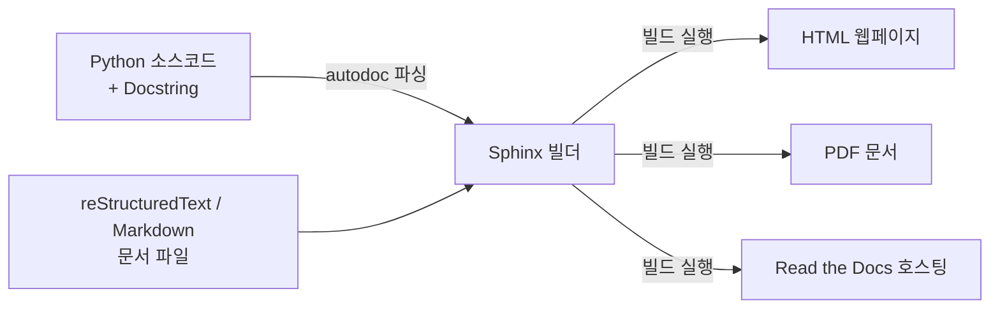

# Sphinx (파이썬 공식 문서 자동 생성 도구) 가이드

파이썬 생태계에서 사실상 표준(de facto standard)으로 사용되는 문서 생성 도구인 **Sphinx(스핑크스)**의 개념, 특징, 그리고 기본적인 사용법을 설명합니다.


---


## **1. Sphinx란?**

* **정의**: 소스 코드의 주석(Docstring)과 마크다운/reStructuredText 문서를 기반으로 정적 웹사이트(HTML), PDF, EPUB 등의 형식으로 아름다운 문서를 자동 생성해 주는 **문서화 빌드 도구**입니다.
* **주요 용도**:
  * 파이썬 공식 문서(docs.python.org)를 생성하는 데 직접 사용됩니다.
  * 오픈소스 라이브러리 및 사내 라이브러리의 개발자 API 레퍼런스 문서를 자동화할 때 주로 사용됩니다.
  * **Read the Docs** (readthedocs.org) 서비스와 연동되어 GitHub 저장소에 코드가 푸시될 때마다 실시간으로 문서를 빌드하고 무료 호스팅 서비스를 제공하는 데 활용됩니다.

---


## **2. Sphinx의 주요 특징**


### **① ****`autodoc`****을 통한 코드 내 Docstring 자동 추출**

개발자가 파이썬 소스 코드 내에 작성한 **Docstring**을 그대로 파싱하여 API 명세서를 자동으로 구축해 줍니다. 코드를 변경하고 Docstring을 수정하면 문서 빌드 한 번으로 전체 개발 문서를 최신 상태로 동기화할 수 있어 관리 오버헤드가 극적으로 줄어듭니다.


### **② 다양한 문서 포맷 지원**

하나의 소스 파일(Markdown 또는 reStructuredText)로부터 여러 출력 형식을 빌드할 수 있습니다.

* HTML (다양하고 아름다운 테마 지원, 검색 기능 기본 내장)
* PDF (인쇄 및 배포용)
* EPUB (전자책 리더용)
* man page (리눅스 터미널 매뉴얼용)

### **③ 강력한 크로스 레퍼런스(Cross-referencing) 및 검색 기능**

클래스, 함수, 모듈 간의 링크가 자동으로 생성되며, 빌드된 HTML 문서 내부에서 동작하는 강력한 자바스크립트 기반 로컬 검색 엔진을 기본 탑재하고 있어 별도의 서버 설정 없이 문서 내 키워드 검색이 가능합니다.


---


## **3. Sphinx 기본 동작 프로세스**





---


## **4. 시작하기 (Quick Start)**


### **① Sphinx 패키지 설치**

가상환경이 활성화된 상태에서 Sphinx를 설치합니다.


```bash
pip install sphinx
```


### **② 문서 디렉토리 초기화**

일반적으로 프로젝트 루트의 `docs/` 디렉토리 내에서 진행합니다. 아래 명령을 실행하면 대화형 프롬프트가 실행되어 기본 설정을 도와줍니다.


```bash
sphinx-quickstart
```

* 질문에 따라 프로젝트 이름, 저자, 버전 등을 입력하면 다음과 같은 기본 구조가 생성됩니다.
  * `conf.py`: Sphinx 설정 파일 (플러그인, 테마 등을 정의)
  * `index.rst` (또는 `index.md`): 메인 대문 페이지 역할을 하는 마크다운/RST 파일
  * `make.bat` / `Makefile`: 빌드 실행 스크립트

### **③ 자동 문서화 설정 (****`conf.py`**** 수정)**

코드 내 Docstring을 추출하려면 `conf.py` 파일의 확장 모듈(Extensions) 목록에 `sphinx.ext.autodoc`을 추가하고 파이썬 소스 코드 경로를 설정합니다.


```python
# conf.py 설정 예시
import os
import sys
sys.path.insert(0, os.path.abspath('../')) # 소스 코드 루트 디렉토리 추가

extensions = [
    'sphinx.ext.autodoc',       # Docstring 추출 플러그인
    'sphinx.ext.napoleon',      # Google 스타일 및 NumPy 스타일 Docstring 해석 플러그인
    'myst_parser'               # 마크다운 파일(.md) 지원 플러그인
]
```


### **④ 문서 빌드 실행**

설정이 끝나면 아래 명령어로 손쉽게 정적 HTML 문서를 빌드할 수 있습니다.


```bash
# Windows
.\make.bat html

# macOS / Linux
make html
```

빌드가 완료되면 `_build/html/index.html` 파일을 웹 브라우저로 열어 자동으로 생성된 완성형 문서를 확인할 수 있습니다.


---


## **5. 일반 서비스 프로젝트에서의 Sphinx 도입 검토**

오픈소스 라이브러리 패키지와 달리, 일반적인 백엔드 웹 서비스 프로젝트(FastAPI, Django 등)에서 Sphinx를 도입할지에 대해서는 다음의 기준을 참고하여 결정하는 것이 좋습니다.


### **① 도입 시 장점 (Pros)**

* **신규 개발자 온보딩 가속화**: 전체 내부 패키지 구조, 핵심 서비스 클래스 간의 관계, 공통 유틸리티의 쓰임새 등을 한눈에 파악할 수 있는 아키텍처 가이드 맵 역할을 합니다.
* **비즈니스 도메인 규칙의 동기화**: 코드 상의 Docstring 변경이 문서로 즉시 빌드되므로, 별도의 외부 위키(Wiki) 문서 도구에 복제하여 관리하는 오버헤드가 제거됩니다.
* **통합 문서 사이트 구축**: 직접 작성한 운영 문서, 환경 설정 가이드 등의 마크다운 파일들과 코드 API 레퍼런스를 한곳으로 묶어 사내용 기술 포털로 운영 가능합니다.

### **② 단점 및 대안 (Cons & Alternatives)**

* **FastAPI 자체 API 문서의 존재**: 클라이언트(프론트엔드) 협업용 HTTP API 문서는 이미 FastAPI가 제공하는 Swagger UI (`/docs`)와 ReDoc (`/redoc`)으로 충분히 해결되므로, Sphinx는 중복 투자일 수 있습니다.
* **IDE 지원 기능의 상향평준화**: 최근의 VS Code 및 PyCharm 등은 굳이 HTML 문서 사이트를 빌드하지 않아도 마우스 호버(Hover) 시에 Docstring을 완벽하게 서식화하여 띄워 주므로, 코딩 도중 참고하기에는 IDE 툴팁이 더 직관적입니다.
* **빌드 파이프라인 관리 비용**: 코드 수정 주기가 빠른 서비스 프로젝트의 특성상, 빌드 과정(CI/CD)에 문서 자동 갱신 프로세스를 추가하고 호스팅 서버를 관리해야 하는 추가 작업이 발생합니다.

### **③ 도입 의사결정 기준**

| 도입 추천 (Recommended) | 도입 비추천 (Not Recommended) |
| --- | --- |
| MSA 환경 등에서 **여러 서비스가 공통으로 참조하는 라이브러리성 사내 프로젝트**를 관리할 때 | 단일 팀이 개발하며 비즈니스 로직 수정 주기가 매우 빈번하고 유연하게 움직이는 단독 백엔드 프로젝트 |
| 도메인 비즈니스 계산식이나 비기능적 요구사항이 매우 복잡하여 **상세 주석의 엄격한 문서화가 강제**될 때 | REST API 스펙 명세가 거의 유일한 협업 문서이자 가장 주된 필요 스펙일 때 (FastAPI Swagger로 해결 가능) |
| 개발 및 운영 조직이 분리되어 있거나, **중장기 엔지니어링 온보딩 문서 구축이 필수적**일 때 | 문서 관리 및 빌드 파이프라인 관리 등을 책임질 인적 자원과 리소스가 부족할 때 |

