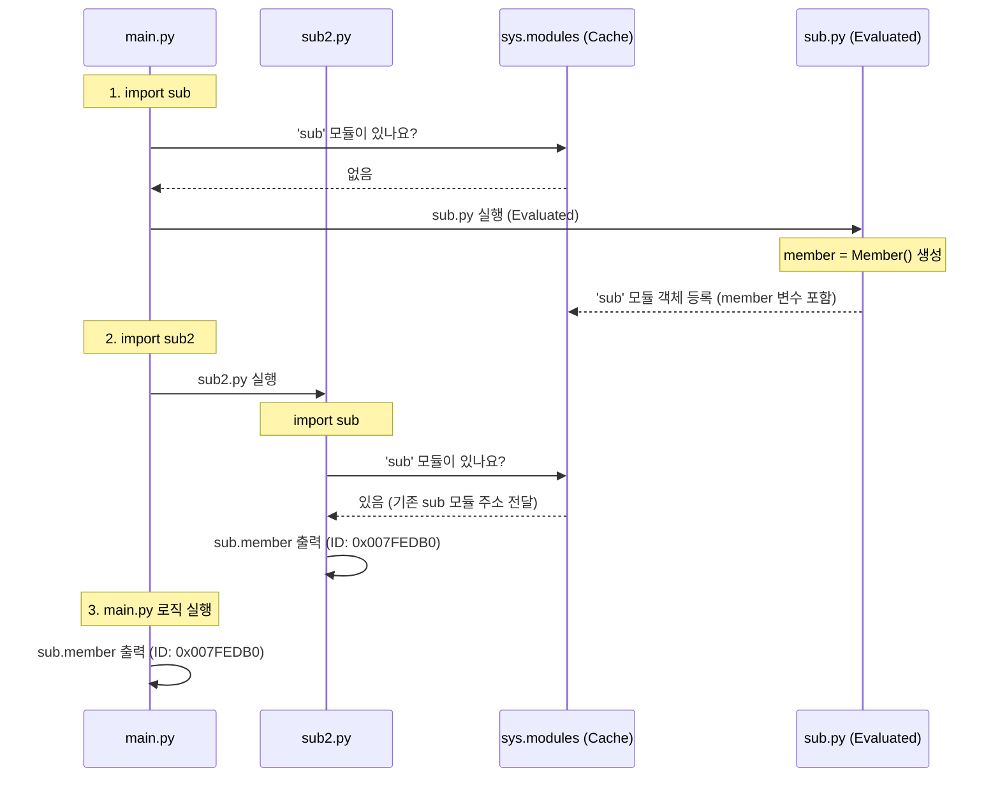

# 싱글톤 모듈 설명

[main.py](file:///d:/Repo/kosa-python/study/chap08/sec01_main/py/main.py)를 실행하면, [sub2.py](file:///d:/Repo/kosa-python/study/chap08/sec01_main/py/sub2.py)에서 호출한 `sub.member`와 [main.py](file:///d:/Repo/kosa-python/study/chap08/sec01_main/py/main.py)에서 호출한 `sub.member`가 출력하는 객체의 메모리 주소(ID)가 서로 동일한 것을 확인할 수 있습니다.


```plain text
# 실행 결과 예시
__name__: 변수값: sub
import로 실행했을 경우에만 실행
__name__: 변수값: sub2
<sub.Member object at 0x000001C1007FEDB0>  # sub2.py에서 출력한 id
__name__: 변수값: __main__
python 명령어로 실행했을 경우에만 실행
<sub.Member object at 0x000001C1007FEDB0>  # main.py에서 출력한 id (동일)
```

이와 같이 서로 다른 파일(모듈)에서 호출한 객체가 동일한 ID를 갖는 작동 원리는 **파이썬의 모듈 캐싱 매커니즘**과 관련이 있습니다.


---


## **🔍 작동 원리 상세 분석**


### **1. 파이썬의 모듈 임포트 캐싱 (****`sys.modules`****)**

파이썬에서 `import` 키워드를 사용하여 특정 모듈을 불러올 때, 시스템 내부적으로는 다음과 같은 과정을 거칩니다:

1. **캐시 확인**: 파이썬은 이미 로드된 모듈들을 보관하는 딕셔너리 형태의 시스템 캐시인 `sys.modules`를 먼저 조회합니다.
1. **최초 임포트**: 만약 캐시에 해당 모듈(`sub`)이 존재하지 않는다면, 파이썬은 모듈 파일([sub.py](file:///d:/Repo/kosa-python/study/chap08/sec01_main/py/sub.py))을 찾아 **처음부터 끝까지 한 번 실행(evaluated)**합니다. 실행된 결과로 만들어진 모듈 객체는 `sys.modules['sub']`에 등록됩니다.
1. **이후 임포트**: 다른 모듈이나 스크립트에서 다시 `import sub`를 실행하면, 파이썬은 모듈을 새로 로딩 및 실행하지 않고, **`sys.modules`****에 이미 저장된 모듈 객체의 참조(주소)를 그대로 반환**합니다.

---


### **2. 모듈 수준 싱글톤 (Module-level Singleton)**

[sub.py](file:///d:/Repo/kosa-python/study/chap08/sec01_main/py/sub.py) 파일의 코드를 보면 다음과 같이 전역 변수로 `member` 객체를 생성하고 있습니다.


```python
# study/chap08/sec01_main/py/sub.py
class Member:
    pass

# 모듈이 로드될 때 단 한 번만 실행되어 인스턴스가 생성됨
member = Member()
```

* `main.py`가 처음 시작되어 `import sub`를 만났을 때, `sub.py`가 최초로 실행되면서 `member = Member()` 코드에 의해 메모리에 단 **한 개의 ****`Member`**** 인스턴스**가 생성됩니다.
* 이어서 `import sub2`를 실행할 때, [sub2.py](file:///d:/Repo/kosa-python/study/chap08/sec01_main/py/sub2.py) 내부에서도 `import sub`를 수행합니다.
* 이때 파이썬은 새로 `sub.py`를 실행하지 않고 **기존에 로드된 `sub` 모듈 인스턴스(주소)**를 건네줍니다.
* 따라서, `sub2.py`에서 참조하는 `sub.member`와 `main.py`에서 참조하는 `sub.member`는 **메모리 상에서 동일한 단 하나의 객체**를 가리키게 됩니다.

---


## **🛠️ 모듈의 실행 흐름 요약**

아래 다이어그램은 `main.py`가 실행되면서 객체를 참조하는 흐름을 보여줍니다.





## **💡 결론 및 응용**

이와 같이 파이썬에서는 별도의 복잡한 싱글톤 클래스 패턴(`__new__` 메서드 오버라이딩 등)을 구현하지 않더라도, **모듈 단위의 전역 변수 선언만으로 자연스럽게 싱글톤 패턴이 완성**됩니다.

이를 **모듈 수준 싱글톤(Module-level Singleton)** 패턴이라 하며, 데이터베이스 연결 세션 관리, 공통 설정 객체 관리 등 전역에서 하나만 유지되어야 하는 자원을 다룰 때 파이썬에서 가장 추천되는 디자인 패턴입니다.


---


## **❓ 자주 묻는 질문 (Q&A)**


### **Q. ****`member1 = sub.member`****, ****`member2 = sub.member`****처럼 변수를 따로 나누어 대입하면 서로 다른 객체가 되나요?**

**아닙니다. 여전히 동일한 객체(싱글톤)를 가리킵니다.**

파이썬에서 변수 대입(`=`)은 객체를 **복사(Copy)**하여 새로 만드는 것이 아니라, 이미 존재하는 객체에 **이름표(참조/Reference)**를 하나 더 붙이는 작업입니다.


```python
member1 = sub.member  # sub.member 객체를 가리키는 이름표 member1 생성
member2 = sub.member  # 동일한 sub.member 객체를 가리키는 이름표 member2 생성

print(member1 is member2)  # True (메모리 주소가 동일함)
```

이와 같이 대입 연산만으로는 싱글톤이 깨지지 않고, 단일 객체 인스턴스에 대한 별칭(Alias)만 여러 개 늘어나는 상태가 유지됩니다.


---


### **Q. 그렇다면 싱글톤을 깨고 서로 "다른 객체"를 만들려면 어떻게 해야 하나요?**

클래스의 **생성자(Constructor)**를 직접 호출하여 새로운 인스턴스를 각각 생성해야 합니다.


```python
# sub.py 모듈 안의 Member 클래스 생성자를 직접 호출하여 인스턴스를 각각 새로 생성
member1 = sub.Member()
member2 = sub.Member()

print(member1 is member2)  # False (서로 다른 주소에 생성된 독립된 객체)
```

이렇게 모듈 전역에 미리 생성해 둔 변수(`sub.member`)를 사용하는 대신, 모듈 내부의 클래스 설계도(`sub.Member`)로부터 괄호 `()`를 붙여 생성자를 직접 호출하면 매번 새로운 독립된 객체가 만들어집니다.

