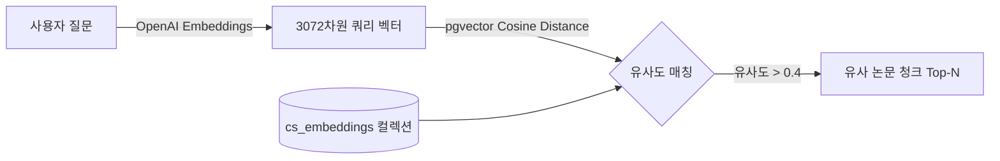

# 📖 [02] pgvector 기반 공통 RAG 파이프라인 실습

이 노트북은 **Paper Agent**의 핵심인 pgvector 기반 검색 엔진의 작동 원리를 배우고, OpenAI 임베딩 API와 PostgreSQL 벡터 유사도 연산을 단독으로 시뮬레이션하는 독립 실행형 튜토리얼입니다.

---

## 💡 3분 배경지식: pgvector 와 유사도 검색
1. **임베딩(Embedding)**: 
   - 텍스트를 고차원 공간의 수치 벡터로 변환하는 기술입니다. 본 플랫폼은 OpenAI의 `text-embedding-3-large` 모델을 사용하여 각 문장을 **3072차원 벡터**로 변환합니다. 차원이 클수록 미세한 의미적 맥락을 더 정밀하게 표현할 수 있습니다.
2. **코사인 유사도(Cosine Similarity)**:
   - 두 벡터의 각도(방향성)를 기준으로 유사도를 연산합니다. 값은 -1에서 1 사이이며, 1에 가까울수록 의미가 일치합니다. pgvector에서는 `1.0 - (Cosine Distance)` 수식으로 계산합니다.
3. **HNSW (Hierarchical Navigable Small World)**:
   - 벡터 개수가 많아질 때 실시간 검색 속도를 보장하기 위해 다층 그래프 구조로 인덱스를 빌드하는 고성능 근사 최근접 이웃(ANN) 탐색 알고리즘입니다.

---

## 📊 RAG 임베딩 검색 흐름도


### 1. 패키지 임포트 및 환경 검증

```python
import sys
import os

sys.path.append(os.path.abspath("../backend"))

from langchain.embeddings import init_embeddings
from langchain_postgres import PGVector
from langchain_core.documents import Document
from api.common.config import settings

print(f"OpenAI API 키 주입 여부: {bool(settings.OPENAI_API_KEY)}")
print(f"DB 연결 주소: {settings.PGVECTOR_URL}")
```

### 2. OpenAI 3072차원 임베딩 생성 실습

```python
# 1. 임베딩 모델 인스턴스 초기화 (text-embedding-3-large)
embeddings = init_embeddings(model="openai:text-embedding-3-large")

test_text = "빅데이터 분산 처리 및 실시간 RAG 아키텍처에 대한 연구"

# 2. 단일 텍스트 임베딩 생성
vector = embeddings.embed_query(test_text)

print(f"입력 텍스트: '{test_text}'")
print(f"생성된 벡터 차원수: {len(vector)}")
print(f"앞부분 5개 차원 샘플: {vector[:5]}")
```

### 3. 임시 pgvector 컬렉션 생성 및 샘플 데이터 적재 (자급자족 테스트)

```python
# 테스트를 위한 임시 컬렉션 정의
TEMP_COLLECTION_NAME = "notebook_temp_collection"

# 1. PGVector 저장소 초기화
vectorstore = PGVector(
    embeddings=embeddings,
    collection_name=TEMP_COLLECTION_NAME,
    connection=settings.PGVECTOR_URL,
    async_mode=True,
)

# 2. 테스트용 가상 학술 논문 초록 데이터 준비
docs = [
    Document(
        page_content="This paper presents a scalable Transformer model optimized for real-time natural language processing tasks in low-memory edge devices.",
        metadata={"arxiv_id": "2501.0001", "title": "Lightweight Edge Transformer"}
    ),
    Document(
        page_content="We propose a robust anomaly detection framework using graph neural networks for cybersecurity event analysis in distributed clouds.",
        metadata={"arxiv_id": "2501.0002", "title": "Graph Neural Networks for Security"}
    ),
    Document(
        page_content="A comprehensive survey on retrieval-augmented generation (RAG) pipelines, focusing on prompt engineering and hybrid search optimization.",
        metadata={"arxiv_id": "2501.0003", "title": "State of the Art in RAG Pipelines"}
    ),
    Document(
        page_content="Investigating planetary system formation and exoplanet atmospheric compositions using machine learning classification methods.",
        metadata={"arxiv_id": "2501.0004", "title": "Exoplanet Analysis with ML"}
    )
 ]

# 3. 비동기 적재 실행
print("임시 pgvector 컬렉션에 문서를 적재 중...")
await vectorstore.aadd_documents(docs)
print("적재 완료!")
```

### 4. 유사도 매칭 및 임계값 필터링 실습

```python
query = "Tell me about Retrieval-Augmented Generation or prompt engineering search."

print(f"검색 질문: '{query}'\n")

# 1. 코사인 유사도 거리 점수를 함께 반환하는 비동기 검색 실행
results = await vectorstore.asimilarity_search_with_score(query, k=3)

SIMILARITY_THRESHOLD = 0.4  # 프로젝트 표준 임계값

print("=== 유사도 검색 결과 ===")
for doc, score in results:
    # 코사인 유사도 점수 변환 (1.0 - 거리 점수)
    similarity = round(1.0 - score, 4)
    
    if similarity < SIMILARITY_THRESHOLD:
        print(f"[제외] '{doc.metadata['title']}' - 유사도: {similarity} (임계값 {SIMILARITY_THRESHOLD} 미만)")
        continue
        
    print(f"📌 제목: {doc.metadata['title']} (arxiv: {doc.metadata['arxiv_id']})")
    print(f"   유사도 점수: {similarity}")
    print(f"   본문 요약: {doc.page_content[:100]}...")
    print("-" * 50)
```

### 5. 실습 리소스 삭제 (Teardown)

```python
# 1. 임시 컬렉션 삭제 처리
print(f"임시로 생성한 '{TEMP_COLLECTION_NAME}' 컬렉션을 제거합니다.")
await vectorstore.adelete_collection()
print("데이터베이스 정리 완료!")
```

