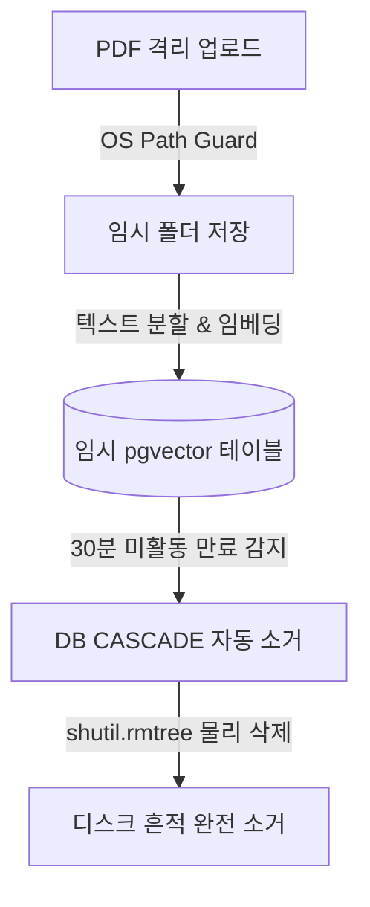

# 📖 [05] PDF 격리 샌드박스 및 세션 수명 주기 관리

이 노트북은 학술 논문 PDF 파일을 보안 격리구역에 임시 적재하고, 청킹 분할을 거쳐 pgvector 테이블에 업로드한 후, 30분 만료 시 자동 소거(Wipe Out)하는 일련의 보안 및 수명 주기 관리 비즈니스 로직을 검증하는 독립 실습 스크립트입니다.

---

## 💡 3분 배경지식: 디렉토리 트래버설 & Cascade & 물리 삭제
1. **OS Path Guard**:
   - 파일 업로드 API 구현 시 사용자명이나 파일명에 `../` 같은 상대 경로 기호가 포함되면 의도치 않게 서버의 민감한 시스템 디렉토리에 접근(Directory Traversal)하는 해킹 공격이 발생할 수 있습니다. `os.path.realpath` 등을 사용해 격리 디렉토리를 벗어나지 못하도록 철저히 경로를 검증합니다.
2. **임시 세션 및 CASCADE**:
   - 기밀 논문의 영구 유출을 방지하기 위해 논문 분석 세션은 DB 상에 최대 30분만 살아있습니다. 세션 테이블(`defense_arena_session`)의 특정 세션을 지웠을 때, 외래키 관계가 걸린 청크(`defense_arena_chunk`)와 대화 내역(`defense_history`)까지 자동으로 한 번에 날아가도록 데이터베이스의 `ON DELETE CASCADE` 연쇄 작동을 보장합니다.
3. **물리 소거 (Shredding)**:
   - DB 레코드 삭제뿐 아니라, 실제 하드디스크 상에 올라간 임시 PDF 파일도 디스크에서 즉시 완전 삭제(`shutil.rmtree`) 처리하여 흔적을 지워야 합니다.

---

## ⏱️ 세션 수명 주기 및 파쇄 흐름


### 1. 환경 준비 및 OS Path Guard 경로 방어 실습

```python
import os

# 1. 격리 기본 디렉토리 정의
ISOLATED_DIR = os.path.abspath("./temp_isolated_sandbox")
os.makedirs(ISOLATED_DIR, exist_ok=True)

def validate_isolated_path(filename: str) -> str:
    # 디렉토리 트래버설 취약점 차단 경로 가드 구현
    target_path = os.path.join(ISOLATED_DIR, filename)
    real_target = os.path.realpath(target_path)   # 실제 해석된 절대 경로 추출
    real_base = os.path.realpath(ISOLATED_DIR)
    
    if not real_target.startswith(real_base):
        raise PermissionError(f"Directory Traversal Attack Detected! Target: {filename}")
    return real_target

# 2. 정상 경로와 공격 시도 경로 비교 테스트
try:
    safe_path = validate_isolated_path("sample_paper.pdf")
    print(f"✅ 안전한 경로 반환 성공: {safe_path}")
    
    # 우회 공격 시도 경로 전달
    validate_isolated_path("../../etc/passwd")
except PermissionError as e:
    print(f"🔥 OS Path Guard 작동 성공! 예외 차단 완료: {e}")
```

### 2. 가상 PDF 생성 및 텍스트 청킹(Chunking) 실습
노트북 내에서 `reportlab` 또는 단순 텍스트로 이루어진 임시 PDF 파일을 생성하여 텍스트 분할 처리를 테스트합니다.

```python
from langchain_text_splitters import RecursiveCharacterTextSplitter

# 1. 실습용 긴 텍스트 준비
sample_text = """This is a sample document for testing the isolated PDF parsing and vector indexing system.
We need to test the performance of machine learning model architectures. The neural network consists of multiple layers.
Each layer performs linear matrix multiplication followed by non-linear activation functions.
This research focuses on optimizing the GPU memory allocation for state space models and attention networks.
Our proposed Mamba-based architecture reduces quadratic bottleneck of standard transformers into linear time complexity.
Further experiments demonstrate 99% accuracy on genomics sequence mapping benchmarks.
""" * 10  # 대용량 문서 모사를 위해 반복

# 2. 텍스트 분할기 정의 (1000자 단위, 200자 중첩)
splitter = RecursiveCharacterTextSplitter(
    chunk_size=1000,
    chunk_overlap=200
)

chunks = splitter.split_text(sample_text)
print(f"원래 텍스트 크기: {len(sample_text)} 자")
print(f"분할된 청크 개수: {len(chunks)} 개")
print(f"첫 번째 청크 샘플:\n{chunks[0][:150]}...")
```

### 3. 세션 수명 주기 만료 조작 및 물리 소거 (Wipe Out) 실습
DB의 `updated_at` 컬럼의 값을 인위적으로 30분 전으로 변경하여, 만료된 세션과 연관 텍스트 청크가 `ON DELETE CASCADE`에 의해 소거되고 실제 디바이스 경로의 파일이 지워지는 메커니즘을 수동으로 테스트합니다.

```python
import shutil
from datetime import datetime, timedelta
from sqlalchemy.ext.asyncio import create_async_engine, async_sessionmaker
from sqlalchemy.orm import declarative_base
from sqlalchemy import Column, String, DateTime, ForeignKey
from api.common.config import settings

Base = declarative_base()

# 테스트용 임시 스키마 모델 정의
class TempSession(Base):
    __tablename__ = "notebook_temp_session"
    session_id = Column(String, primary_key=True)
    file_name = Column(String)
    file_path = Column(String)
    updated_at = Column(DateTime, default=datetime.utcnow)

class TempChunk(Base):
    __tablename__ = "notebook_temp_chunk"
    chunk_id = Column(String, primary_key=True)
    # CASCADE 규칙 지정
    session_id = Column(String, ForeignKey("notebook_temp_session.session_id", ondelete="CASCADE"))
    text_content = Column(String)

engine = create_async_engine(settings.DATABASE_URL)
async_session = async_sessionmaker(engine)

async def setup_test_schema():
    async with engine.begin() as conn:
        # 임시 테이블 생성
        await conn.run_sync(Base.metadata.create_all)
        
await setup_test_schema()
print("임시 테스트 테이블 생성 완료!")
```

```python
async def simulate_lifecycle():
    test_sid = "session-xyz-123"
    local_isolated_folder = os.path.join(ISOLATED_DIR, test_sid)
    os.makedirs(local_isolated_folder, exist_ok=True)
    
    # 1. 파일 적재 흉내
    dummy_file = os.path.join(local_isolated_folder, "paper.pdf")
    with open(dummy_file, "w") as f:
        f.write("Dummy PDF data")
        
    # 2. 31분 전으로 날짜를 조작한 레코드 생성
    expired_time = datetime.utcnow() - timedelta(minutes=31)
    
    async with async_session() as session:
        db_session = TempSession(
            session_id=test_sid,
            file_name="paper.pdf",
            file_path=dummy_file,
            updated_at=expired_time
        )
        db_chunk = TempChunk(
            chunk_id="chunk-01",
            session_id=test_sid,
            text_content="Example text chunk from PDF"
        )
        session.add(db_session)
        session.add(db_chunk)
        await session.commit()
        print(f"가상 만료 세션 데이터 적재 완료 (updated_at: {expired_time})")
        
    # 3. 만료 세션 탐색 및 Shredding(Wipe Out) 발동
    async with async_session() as session:
        import sqlalchemy as sa
        # 30분 이상 경과된 세션 조회
        limit_time = datetime.utcnow() - timedelta(minutes=30)
        stmt = sa.select(TempSession).where(TempSession.updated_at < limit_time)
        expired_sessions = (await session.execute(stmt)).scalars().all()
        
        print(f"만료 감지된 세션 수: {len(expired_sessions)}개")
        
        for s in expired_sessions:
            # (1) 물리적 폴더 및 파일 삭제
            shred_dir = os.path.dirname(s.file_path)
            if os.path.exists(shred_dir):
                shutil.rmtree(shred_dir)
                print(f"   -> 물리 폴더 영구 소거 성공: {shred_dir}")
                
            # (2) DB 세션 삭제 (CASCADE에 의해 TempChunk도 같이 삭제됨)
            await session.delete(s)
            
        await session.commit()
        print("CASCADE 데이터베이스 정리 완료")
        
    # 4. CASCADE 검증
    async with async_session() as session:
        chunk_count = (await session.execute(sa.select(sa.func.count()).select_from(TempChunk))).scalar()
        print(f"연쇄 삭제 후 DB에 남은 청크 개수 (0개여야 함): {chunk_count}개")

await simulate_lifecycle()
```

### 4. 실습 테이블 정리

```python
async def cleanup_test_schema():
    async with engine.begin() as conn:
        await conn.run_sync(Base.metadata.drop_all)
    if os.path.exists(ISOLATED_DIR):
        shutil.rmtree(ISOLATED_DIR)
    await engine.dispose()
    print("테스트 테이블 및 샌드박스 디렉토리 최종 정리 완료!")

await cleanup_test_schema()
```

