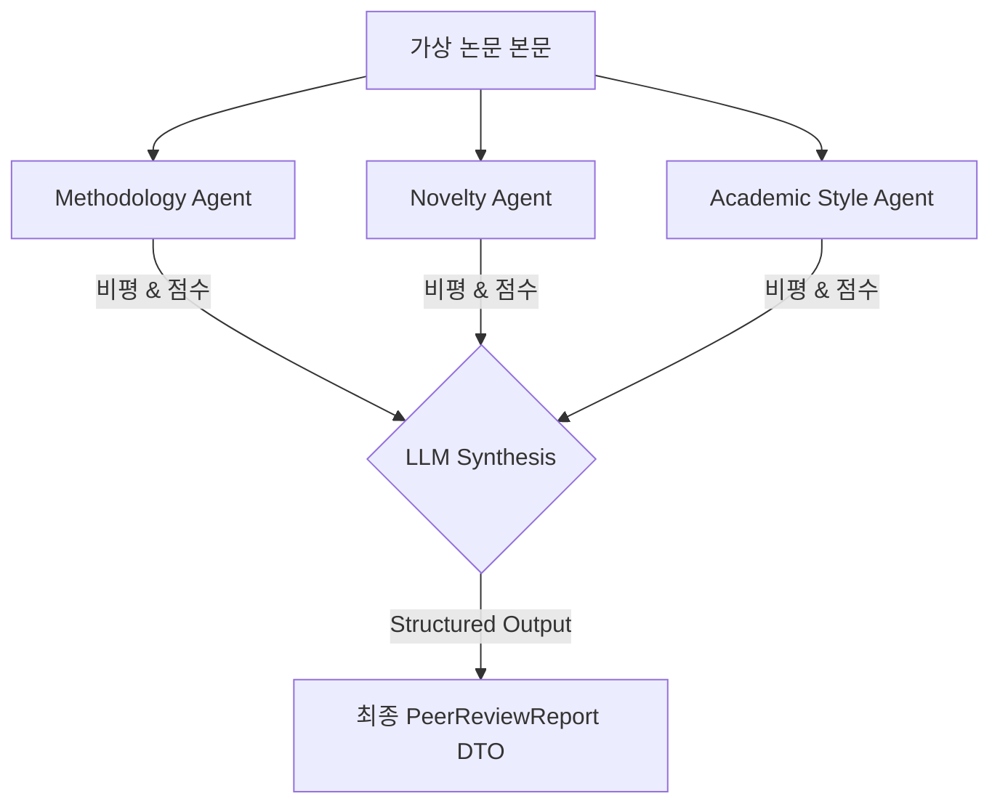

# 📖 [06] 다자간 에이전트 학술 피어리뷰 시뮬레이션

이 노트북은 **Paper Agent**의 대표적인 고급 기능인 **Multi-Agent 피어리뷰** 아키텍처를 학습하고, 전문 분야가 다른 3대 심사위원 에이전트를 모사해 비평 점수와 종합 리포트를 합성하는 독립형 실습 스크립트입니다.

---

## 💡 3분 배경지식: Multi-Agent Debate & Collaboration
1. **왜 Multi-Agent인가?**
   - 단일 프롬프트로 작동하는 하나의 LLM은 복합적인 요소를 한 번에 비평할 때 특정 시각(예: 단순 문체)에만 치우쳐 실험의 참신함이나 설계 결함을 간과할 우려가 큽니다.
   - 각기 다른 페르소나와 검증 지침을 부여받은 에이전트 3종이 논문을 각자 다른 각도에서 비평하도록 역할을 격리함으로써, 종합 보고서의 품질과 신뢰성을 인간 심사위원 수준으로 높일 수 있습니다.
2. **역할의 정의**:
   - **Methodology Agent**: 수식 검증, 실험 대조군, 통계 정합성 비평.
   - **Novelty Agent**: 선행 연구 대비 기여도 및 독창성 비평.
   - **Academic Style Agent**: 문법적 오류 및 구조 배치, 학술 스타일 지침 비평.

---

## 🤝 피어리뷰 토론 협업 관계도


### 1. 환경변수 준비 및 DTO 모델 선언

```python
import sys
import os

sys.path.append(os.path.abspath("../backend"))

from pydantic import BaseModel, Field
from langchain_openai import ChatOpenAI
from api.common.config import settings

# 1. 최종 종합 심사평 모델 정의
class PeerReviewReport(BaseModel):
    methodology_score: int = Field(description="방법론 에이전트 평가 점수 (0-100)")
    methodology_critique: str = Field(description="방법론 에이전트 세부 비평 내용")
    novelty_score: int = Field(description="독창성 에이전트 평가 점수 (0-100)")
    novelty_critique: str = Field(description="독창성 에이전트 세부 비평 내용")
    style_score: int = Field(description="스타일 에이전트 평가 점수 (0-100)")
    style_critique: str = Field(description="학술 문체 에이전트 세부 비평 내용")
    
    overall_score: int = Field(description="종합 최종 심사 점수 (0-100)")
    review_report: str = Field(description="종합 심사 총평 보고서 (한글 명사형 격식체 마크다운)")

print("PeerReviewReport DTO 가 안전하게 선언되었습니다.")
```

### 2. 가상 논문 본문 데이터 정의 (독립형 데이터 자급자족)
RAG나 PDF 업로드 없이도 즉시 심사 시뮬레이션을 가동할 수 있도록, 대상 논문의 기술 내용을 노트북 텍스트 상수로 주입합니다.

```python
mock_paper_content = """
Title: Hybrid Mamba-Transformer for DNA Sequence Alignment
Methodology:
We design a hybrid layer where Mamba blocks handle long sequences and Transformer layers analyze short-range motifs.
However, we omitted comparative benchmarks against pure Mamba architectures due to time constraints.
The model is evaluated only on 50 samples of human genome sequences.

Novelty:
Our hybrid concept is novel because it is the first architecture attempting to fuse state space blocks with self-attention directly inside the gene sequence encoding layers.
This yields O(N) complexity for long sequences while maintaining O(1) retrieval speeds.

Academic Style:
The manuscript contains several colloquial expressions like 'our model is super cool' and 'it runs like crazy'.
Also, the mathematical notations in Section 3 lack standard LaTeX formatting.
"""
print("가상 논문 텍스트 준비 완료.")
```

### 3. 3대 분야별 심사위원 에이전트 구동 및 개별 비평 생성
각 분야에 완전히 몰입한 시스템 프롬프트를 가진 LLM 인스턴스 3개를 순차적으로 구동하여 비평 피드백과 가상 점수를 생성합니다.

```python
llm = ChatOpenAI(model="gpt-4o-mini", temperature=0)

# 1. Methodology 에이전트 실행
method_prompt = f"""You are a Methodology Reviewer. Critique the experimental setup, sample size, and benchmarks in this paper:
{mock_paper_content}
Provide: 1) Score (0-100), 2) Critique text.
"""
method_critique = llm.invoke(method_prompt).content

# 2. Novelty 에이전트 실행
novel_prompt = f"""You are a Novelty Reviewer. Critique the originality, scientific contribution, and comparison with previous research:
{mock_paper_content}
Provide: 1) Score (0-100), 2) Critique text.
"""
novel_critique = llm.invoke(novel_prompt).content

# 3. Academic Style 에이전트 실행
style_prompt = f"""You are an Academic Style Reviewer. Critique the tone, language errors, and structure of the manuscript:
{mock_paper_content}
Provide: 1) Score (0-100), 2) Critique text.
"""
style_critique = llm.invoke(style_prompt).content

print("=== 3대 에이전트 비평 완료 ===")
print(f"[방법론 비평 요약]: {method_critique[:150]}...\n")
print(f"[독창성 비평 요약]: {novel_critique[:150]}...\n")
print(f"[스타일 비평 요약]: {style_critique[:150]}...")
```

### 4. 구조화된 최종 보고서 합성 (Review Report Synthesis)
3종의 비평 원문을 구조화 출력 API를 이용하여 규격에 맞는 하나의 `PeerReviewReport` 객체로 완벽히 조율해 합성합니다.

```python
structured_synthesis = llm.with_structured_output(PeerReviewReport)

synthesis_prompt = f"""Synthesize the following 3 peer reviews into a single structured report.
Generate methodology, novelty, style scores and critiques.
Also write a comprehensive overall review report in Korean (using formal academic noun-based endings).

Methodology Review:
{method_critique}

Novelty Review:
{novel_critique}

Style Review:
{style_critique}
"""

final_report = structured_synthesis.invoke(synthesis_prompt)
if not isinstance(final_report, PeerReviewReport):
    raise TypeError("Expected PeerReviewReport DTO")

print("=== 최종 합성 보고서 DTO 검증 완료 ===\n")
print(f"방법론 점수: {final_report.methodology_score} 점")
print(f"독창성 점수: {final_report.novelty_score} 점")
print(f"학술 스타일 점수: {final_report.style_score} 점")
print(f"최종 종합 점수: {final_report.overall_score} 점")
print("\n--- 종합 심사 총평 (한국어) ---")
print(final_report.review_report)
```

