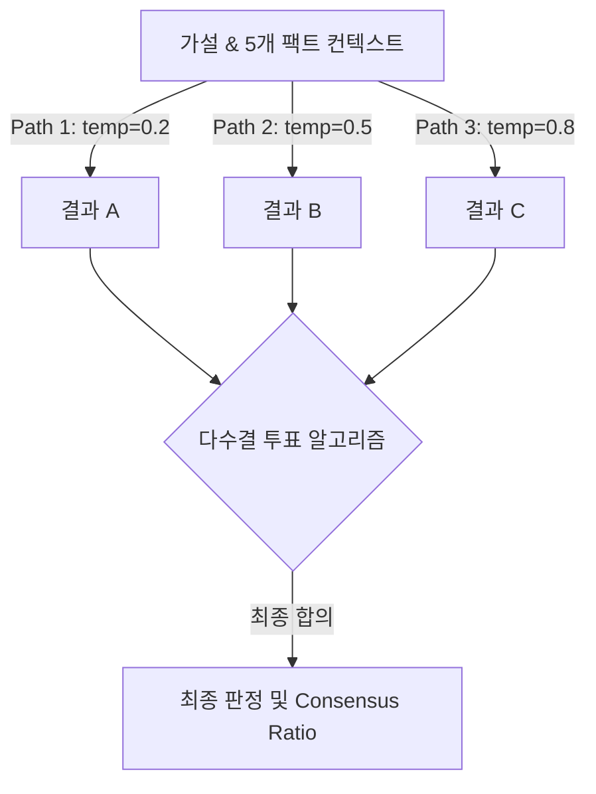

# 📖 [07] 자기 일관성(Self-Consistency) 기반 가설 투표 검증

이 노트북은 **Paper Agent**의 연구 가설 신뢰성 검증에 사용되는 **Self-Consistency(자기 일관성) 기반의 다수결 판정 알고리즘**을 심도 있게 분석하고 직접 실습하는 독립형 튜토리얼입니다.

---

## 💡 3분 배경지식: Self-Consistency & Majority Voting
1. **Self-Consistency (자기 일관성)**:
   - LLM은 생성 온도(Temperature)가 높을수록 매번 다른 답변을 생성(Hallucination 위험)할 수 있습니다. 
   - 특정 연구 가설을 단 한 번만 검증하게 하면 우연히 잘못된 팩트 매칭을 할 위험이 큽니다. 이에 따라 온도를 각각 다르게 부여하여 **독립된 3회의 추론 경로**를 생성한 후 결과를 비교 분석합니다.
2. **다수결 투표(Majority Voting)**:
   - 3회의 결과물 중 가장 많이 득표한 등급(SUPPORT / REFUTE / INSUFFICIENT_EVIDENCE)을 최종 결론으로 도출하여 오판의 가능성을 억제합니다.
3. **의견 합의율(Consensus Ratio)**:
   - 3표 중 몇 표가 일치했는지 비율(e.g., 3표 중 2표 일치 시 66.7%, 3표 중 3표 일치 시 100%)을 계산하여 의사결정의 신뢰도 지표로 표기합니다.

---

## 🗳️ Self-Consistency 가설 검증 흐름도


### 1. 환경변수 준비 및 DTO 모델 선언

```python
import sys
import os

sys.path.append(os.path.abspath("../backend"))

from pydantic import BaseModel, Field
from langchain_openai import ChatOpenAI
from api.common.config import settings

# 1. 가설 판정 DTO 스키마 선언
class HypothesisVerdict(BaseModel):
    verdict: str = Field(description="가설 판정 등급 ('SUPPORT', 'REFUTE', 'INSUFFICIENT_EVIDENCE' 중 하나)")
    rationale: str = Field(description="이 판정에 대한 구체적인 팩트 기반 근거 분석 설명")

print("HypothesisVerdict DTO 준비 완료.")
```

### 2. 가설 및 근거 팩트 컨텍스트 선언 (독립형 데이터 자급자족)
RAG 쿼리 없이 독립 실행이 가능하도록, 검증할 가설과 논문 내 팩트 추출 문장들을 직접 상수로 선언합니다.

```python
hypothesis = "Applying state space models (Mamba) to gene sequence encoding results in quadratic memory growth."

fact_contexts = [
    "[Fact 1] Mamba architecture maps sequences using selective state spaces which scales linearly, O(N), with sequence length.",
    "[Fact 2] Standard self-attention models suffer from quadratic memory scaling, O(N^2), due to pairwise attention matrix calculation.",
    "[Fact 3] Mamba blocks process sequences sequentially and avoid computing full N x N pairwise matrices.",
    "[Fact 4] Linear complexity is verified in genomics encoding datasets surpassing 100k length parameters."
]

print(f"검증 가설: '{hypothesis}'")
print(f"비교 팩트 개수: {len(fact_contexts)}개")
```

### 3. 온도 다변화 기반 3회 독립 추론 실행
서로 다른 세 종류의 온도를 설정한 추론 패스를 만들어 각각 DTO 결과를 획득합니다.

```python
temperatures = [0.2, 0.5, 0.8]
runs = []

context_text = "\n".join(fact_contexts)

for i, temp in enumerate(temperatures):
    # 온도를 다르게 기입한 LLM 인스턴스 개별 생성
    llm = ChatOpenAI(model="gpt-4o-mini", temperature=temp)
    structured_llm = llm.with_structured_output(HypothesisVerdict)
    
    prompt = f"""Verify the hypothesis based on the provided facts.
    Hypothesis: {hypothesis}
    Facts:
    {context_text}
    
    Decide: verdict is either 'SUPPORT' (facts support it), 'REFUTE' (facts contradict it), or 'INSUFFICIENT_EVIDENCE'.
    """
    result = structured_llm.invoke(prompt)
    if not isinstance(result, HypothesisVerdict):
        raise TypeError("Expected HypothesisVerdict DTO")
        
    runs.append(result)
    print(f"▶ [시행 {i+1} (Temp: {temp})] 판정: {result.verdict}")
    print(f"  - 근거: {result.rationale[:120]}...\n")
```

### 4. 다수결 투표 알고리즘 및 의견 합의율(Consensus Ratio) 연산
3표의 득표 결과를 연산하여 최종 다수결 결과와 합의 강도 점수를 추출합니다.

```python
from collections import Counter

# 1. 판정 리스트 추출
verdicts = [r.verdict for r in runs]

# 2. 투표 집계
vote_counts = Counter(verdicts)
majority_verdict, majority_votes = vote_counts.most_common(1)[0]

# 3. 합의율 연산
total_runs = len(runs)
consensus_ratio = round((majority_votes / total_runs) * 100, 1)

# 4. 최종 다수결 합의문 요약 조율
selected_rationale = ""
for r in runs:
    if r.verdict == majority_verdict:
        selected_rationale = r.rationale
        break

print("=== Self-Consistency 최종 결과 ===")
print(f"최종 투표 집계: {dict(vote_counts)}")
print(f"최종 다수결 결론 (Verdict): {majority_verdict}")
print(f"의견 합의율 (Consensus Ratio): {consensus_ratio} %")
print(f"대표 합의 판정 사유 (Rationale):\n{selected_rationale}")
```

