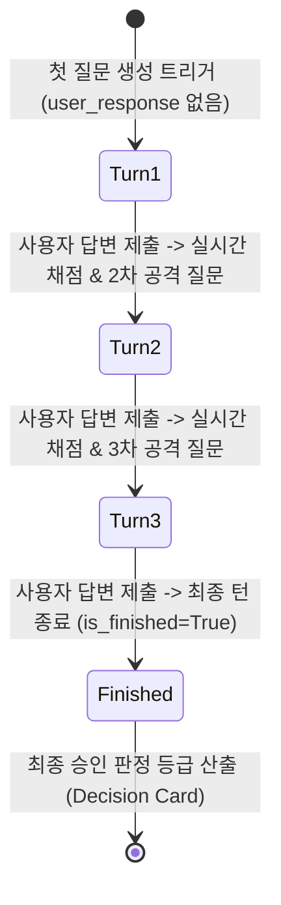

# 📖 [08] 턴제 모의 디펜스 아레나 실시간 평가

이 노트북은 **Paper Agent**의 디펜스 아레나에서 작동하는 **턴제 질답 오케스트레이션(Turn-based Dialog)** 및 Committee 에이전트의 실시간 채점 및 최종 성적표 발급 메커니즘을 분석하는 독립 실습 스크립트입니다.

---

## 💡 3분 배경지식: Turn-based Interaction & Dialog Evaluation
1. **턴제 진행 (Turn-based Interface)**:
   - 가상 심사위원 에이전트와 사용자는 턴을 교대로 주고받습니다. (Turn 1 $
ightarrow$ 2 $
ightarrow$ 3 $
ightarrow$ Finish).
2. **실시간 위원회(Committee) 채점**:
   - 사용자가 한 라운드의 답변을 제출할 때마다 Committee 에이전트가 방어 답변의 타당성을 분석하여 즉각 0~100점의 점수와 피드백을 제공합니다.
3. **최종 판정 성적표 (Decision Card)**:
   - 3턴의 대화가 모두 끝나면 에이전트는 누적된 점수 평균과 설득력을 기반으로 최종 심사 통과 등급(e.g., Accept, Minor Revision, Major Revision, Reject)을 판단하고 종합 평가 총평을 발급합니다.

---

## 🛡️ 디펜스 아레나 상태 기계 (State Machine) 흐름도


### 1. 환경변수 준비 및 DTO 모델 선언

```python
import sys
import os

sys.path.append(os.path.abspath("../backend"))

from pydantic import BaseModel, Field
from langchain_openai import ChatOpenAI
from api.common.config import settings

# 1. 실시간 턴별 질문/채점 응답 DTO
class DefenseTurnResponse(BaseModel):
    refutation_question: str = Field(description="사용자의 답변을 반박하거나 보완을 요구하는 심사위원의 다음 질문")
    score: int = Field(description="사용자가 방금 제출한 답변에 대한 논리력 평가 점수 (0-100)")
    feedback: str = Field(description="답변에 대한 심사위원단의 실시간 상세 비평 및 보완 팁 피드백")
    is_finished: bool = Field(description="전체 3턴이 모두 완료되었는지 여부")

# 2. 3턴 종료 후 최종 스코어카드 판정 DTO
class FinalDecision(BaseModel):
    final_grade: str = Field(description="최종 승인 등급 (ACCEPT, MINOR_REVISION, MAJOR_REVISION, REJECT 중 하나)")
    overall_summary: str = Field(description="디펜스 전체 질답에 대한 최종 종합 심사평 및 총평 요약")

print("디펜스 아레나 DTO 준비 완료.")
```

### 2. 인메모리 세션 대화 히스토리 조작 (독립형 데이터 자급자족)
DB의 `defense_history` 대화 이력 적재 프로세스를 생략하고, 노트북 상에서 메모리 리스트(`chat_history`)로 제어하여 RAG 및 DB 의존성을 격리합니다.

```python
# 가상의 논문 정보 지정
target_paper_context = """
Paper: Hybrid Mamba-Transformer for Genomics
Core claim: Linear scaling complexity with 99% accuracy on human genomics sequence mapping.
Known limitation: The paper has not benchmarked memory usage comparison with pure Transformers on ultra-long datasets.
"""

# 인메모리 대화 로그 초기화
chat_history = []
print("인메모리 대화 히스토리가 빈 리스트로 생성되었습니다.")
```

### 3. 디펜스 아레나 1턴 개시 (질문 유도)

```python
llm = ChatOpenAI(model="gpt-4o-mini", temperature=0.3)
structured_turn = llm.with_structured_output(DefenseTurnResponse)

# 1턴: 사용자의 답변이 없으므로 첫 공격 질문을 출제하도록 트리거
first_turn_prompt = f"""You are a sharp PhD defense committee. Output the first aggressive question based on the paper context.
Paper Context:
{target_paper_context}

Since the user hasn't submitted a response yet, set score=0, feedback='Defense Initiated', and is_finished=False.
"""

turn_1_res = structured_turn.invoke(first_turn_prompt)
if not isinstance(turn_1_res, DefenseTurnResponse):
    raise TypeError("Expected DefenseTurnResponse DTO")

# 히스토리에 기록
chat_history.append({"role": "committee", "content": turn_1_res.refutation_question})

print("=== 1턴 (질문 생성 완료) ===")
print(f"심사위원의 첫 압박 질문: \n'{turn_1_res.refutation_question}'\n")
```

### 4. 2턴 진행 (실시간 채점 & 2차 공격 질문)

```python
# 가상의 사용자가 보낸 디펜스 방어 답변
user_answer_1 = "To optimize memory, we implemented a custom CUDA kernel that handles selective scan state calculation without caching intermediate activation maps."

# 2턴 프롬프트: 기존 질문 히스토리와 사용자 답변을 엮어서 전달
second_turn_prompt = f"""You are a PhD defense committee. Evaluate the user's latest response against the paper context.
Paper Context:
{target_paper_context}

Previous Question: {chat_history[-1]['content']}
User Answer: {user_answer_1}

Evaluate user's answer (score 0-100, write feedback), and generate the next aggressive follow-up question. set is_finished=False.
"""

turn_2_res = structured_turn.invoke(second_turn_prompt)
if not isinstance(turn_2_res, DefenseTurnResponse):
    raise TypeError("Expected DefenseTurnResponse")

# 히스토리 누적
chat_history.append({"role": "user", "content": user_answer_1})
chat_history.append({"role": "committee", "content": turn_2_res.refutation_question})

print("=== 2턴 (답변 평가 및 2차 질문) ===")
print(f"이전 답변에 대한 실시간 점수: {turn_2_res.score} 점")
print(f"심사위원 피드백: {turn_2_res.feedback}")
print(f"다음 2차 공격 질문: \n'{turn_2_res.refutation_question}'\n")
```

### 5. 3턴 종료 및 최종 심사 판정 (Final Decision Card)
3번째 턴의 가상 답변을 제출하여 디펜스를 종결(`is_finished=True`)시키고 최종 의결 등급(ACCEPT/REJECT 등)을 발급받습니다.

```python
user_answer_2 = "Yes, we acknowledge that pure Transformer scaling was not benchmarked. However, our main contribution is the proof-of-concept for linear scalability, and we plan to add comprehensive memory scaling benchmarks in the camera-ready version."

# 마지막 평가 수행
final_turn_prompt = f"""You are the defense committee. This is the final round of evaluation.
Paper Context:
{target_paper_context}

Last Question: {chat_history[-1]['content']}
User Answer: {user_answer_2}

Generate score, feedback, and set refutation_question='' and is_finished=True.
"""

turn_3_res = structured_turn.invoke(final_turn_prompt)
if not isinstance(turn_3_res, DefenseTurnResponse):
    raise TypeError("Expected DefenseTurnResponse")

chat_history.append({"role": "user", "content": user_answer_2})

print("=== 3턴 최종 평가 완료 ===")
print(f"마지막 답변 점수: {turn_3_res.score} 점")
print(f"심사위원 피드백: {turn_3_res.feedback}")
print(f"디펜스 종료 플래그 (is_finished): {turn_3_res.is_finished}\n")

# ---------------- 최종 의결 카드 생성 ----------------
structured_decision = llm.with_structured_output(FinalDecision)

history_text = "\n".join([
    f"{h['role'].upper()}: {h['content']}" for h in chat_history
])

decision_prompt = f"""Based on the entire PhD defense transcript, make the final committee decision.
Decide the grade from ['ACCEPT', 'MINOR_REVISION', 'MAJOR_REVISION', 'REJECT'].
Write a detailed overall summary in Korean.

Defense Transcript:
{history_text}
"""

decision = structured_decision.invoke(decision_prompt)
if not isinstance(decision, FinalDecision):
    raise TypeError("Expected FinalDecision DTO")

print("=== 🎓 최종 심사 의결 결과지 (Decision Card) ===")
print(f"최종 결정 등급 (Grade): {decision.final_grade}")
print(f"종합 심사평 요약 (Summary):\n{decision.overall_summary}")
```

