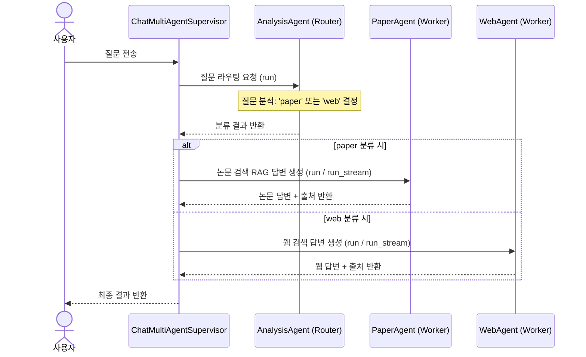

# 📖 [09] 슈퍼바이저 멀티 에이전트 대화 실습

이 노트북은 **Bist Mini 2**에 추가된 **슈퍼바이저 기반 멀티 에이전트(Supervisor & Workers)**의 설계 아키텍처와 작동 원리를 학습하고, 라우팅 노드(`analysis_node`)와 개별 작업 노드들(`paper_node`, `web_node`) 간의 상호작용 흐름을 직접 구현 및 테스트해 보는 독립 실습 가이드입니다.

---

## 💡 3분 배경지식: Supervisor & Workers 패턴
1. **슈퍼바이저 라우터 (Supervisor)**:
   - 사용자의 질문을 가장 먼저 분석하여 알맞은 전문가 에이전트에게 할당하는 라우터 역할을 수행합니다.
   - 본 프로젝트에서는 `analysis_agent`가 LLM의 구조화된 출력(Structured Output, `RouteResult`)을 활용해 `paper` 혹은 `web` 중 어느 경로로 질의를 처리할지 판단합니다.
2. **독립된 작업 에이전트 (Workers)**:
   - **Paper Agent**: `Bio`, `Astronomy`, `CS` 세 학술 도메인별 논문 데이터베이스 검색 도구를 지니고 학술적 질문에 풍부히 답변합니다.
   - **Web Agent**: 최신 기사, 주가, 날씨 등 실시간성이 중요한 실사·시사 영역에 대해 웹 검색 도구(`search_web`) 및 시간 확인 도구로 근거를 찾습니다.
3. **상태 그래프 (StateGraph) 분기 흐름**:
   - `START` → `analysis` 노드 → `route_fun` 분기 조건 → (`paper_node` 혹은 `web_node`) → `END` 순으로 상태가 흘러가며 최종 결과를 합성합니다.

---

## 🔄 슈퍼바이저 멀티 에이전트 흐름도


### 1. 모듈 추가 및 환경 초기화

```python
import sys
import os
import asyncio

# backend 디렉토리를 path에 추가
sys.path.append(os.path.abspath("../backend"))

from api.common.config import settings
from api.database.config.psycopg_pool import psycopg_pool

print(f"데이터베이스 주소: {settings.DATABASE_URL}")
print(f"OpenAI API 키 설정 여부: {bool(settings.OPENAI_API_KEY)}")
```

### 2. 가상 검색 및 웹 툴 Mocking (독립형 세팅)
실제 데이터베이스 및 외부 검색 API 연결 없이도 에이전트 동작을 독립적으로 시뮬레이션할 수 있도록 mock 도구들을 바인딩합니다.

```python
from langchain.tools import tool

@tool
def search_bio_papers(query: str) -> str:
    """Search biology and genome papers in the academic database."""
    print(f"[Tool Execute] search_bio_papers Called with query: '{query}'")
    return "[논문 1] Title: 'CRISPR Gene Editing Overview' (arxiv_id: 2503.9901) Abstract: Guide RNA designs."

@tool
def search_astronomy_papers(query: str) -> str:
    """Search astronomy and astrophysics papers in the academic database."""
    print(f"[Tool Execute] search_astronomy_papers Called with query: '{query}'")
    return "[논문 1] Title: 'Exoplanet Atmospheres' (arxiv_id: 2503.1111) Abstract: Analyzing bio-signatures."

@tool
def search_cs_papers(query: str) -> str:
    """Search computer science and neural network papers in the academic database."""
    print(f"[Tool Execute] search_cs_papers Called with query: '{query}'")
    return "[논문 1] Title: 'Attention is All You Need' (arxiv_id: 1706.03762) Abstract: The Transformer architecture."

@tool
def search_web(query: str) -> str:
    """Search the web for real-time, current information or general questions."""
    print(f"[Tool Execute] search_web Called with query: '{query}'")
    return "웹 검색 결과: '오늘 서울의 날씨는 맑음이며 기온은 24도입니다.'"

@tool
def get_current_datetime() -> str:
    """Get the current date and time."""
    print("[Tool Execute] get_current_datetime Called")
    return "현재 시각: 2026-06-29T10:15:00"

print("Mocking 툴이 준비되었습니다.")
```

### 3. 멀티 에이전트 컴포넌트 임포트 및 빌드
실제 백엔드 코드의 `ChatMultiAgentSupervisor`를 사용해 라우팅 그래프가 올바르게 조립되는지 검증합니다.

```python
from api.v1.chat.multi_agent.supervisor import ChatMultiAgentSupervisor

# 슈퍼바이저 인스턴스 생성
supervisor = ChatMultiAgentSupervisor()

# 그래프 흐름 시각화 검증
try:
    from IPython.display import Image, display
    display(Image(supervisor.get_graph_image()))
    print("그래프 컴파일 및 시각화에 성공했습니다.")
except Exception as e:
    print(f"시각화 라이브러리 미설치로 텍스트로 대체: {e}")
```

### 4. 멀티 에이전트 라우팅 동작 검증 (비스트리밍)
1. **학술 질문**: `paper` 경로로 라우팅되어 `search_bio_papers` 등의 도구를 호출해야 합니다.
2. **실시간 정보 질문**: `web` 경로로 라우팅되어 `search_web` 도구를 호출해야 합니다.

```python
# 1) 학술 연구 질문 테스트
print("=== 1. 학술 질문 테스트 ===")
res_paper = await supervisor.run("CRISPR 유전자 편집의 원리와 메커니즘을 설명해줘.")
print(f"답변:\n{res_paper['answer']}")
print(f"출처:\n{res_paper['sources']}\n")

# 2) 실시간 일반 시사 질문 테스트
print("=== 2. 실시간 날씨 질문 테스트 ===")
res_web = await supervisor.run("오늘 서울의 현재 날씨 어때?")
print(f"답변:\n{res_web['answer']}")
print(f"출처:\n{res_web['web_sources']}\n")
```

### 5. 멀티 에이전트 실시간 스트리밍(Token & Status) 처리 실습
멀티 에이전트 스트리밍 환경에서 각 에이전트가 어떤 상태로 진입하는지 이벤트(`type`이 `status` 또는 `token`, `route`인 경우) 데이터를 가로채 화면에 실시간 갱신합니다.

```python
async def run_multi_streaming_demo(query: str):
    print(f"\n질문: '{query}'")
    print("이벤트 스트리밍 시작:")
    
    # supervisor.run_stream을 통해 토큰과 에이전트 상태를 실시간 수신
    async for event in supervisor.run_stream(query, "demo-session-123"):
        evt_type = event.get("type")
        evt_data = event.get("data")
        
        if evt_type == "status":
            print(f"\n📢 [상태 변경] -> {evt_data} 진행 중...")
        elif evt_type == "token":
            print(evt_data, end="", flush=True)
        elif evt_type == "route":
            print(f"\n🎯 [최종 결정 경로] -> {evt_data}")

# 학술 질문 스트리밍
await run_multi_streaming_demo("Transformer 어텐션 원리에 대해 쉽게 설명해줘.")

# 실시간 시사 질문 스트리밍
await run_multi_streaming_demo("오늘 주식 시장과 서울 날씨 기사를 검색해서 알려줘.")
```

### 6. 리소스 정리
실습에 활용한 데이터베이스 psycopg connection pool을 닫고 정리합니다.

```python
if not psycopg_pool.closed:
    await psycopg_pool.close()
print("데이터베이스 풀이 정상적으로 종료되었습니다.")
```
